# Quick Start Guide

Get a complete OpenFrame environment running in under 5 minutes with this streamlined setup process. This guide provides the fastest path from installation to a working Kubernetes cluster with ArgoCD deployed.

## TL;DR - 5-Minute Setup

```bash
# 1. Download and install OpenFrame CLI
curl -L https://github.com/flamingo-stack/openframe-cli/releases/latest/download/openframe-cli-linux-amd64.tar.gz | tar xz
sudo mv openframe /usr/local/bin/

# 2. Create a complete environment (cluster + ArgoCD)
openframe bootstrap

# 3. Verify everything is running
kubectl get nodes
kubectl get pods -A

# 4. Access ArgoCD UI (optional)
kubectl port-forward svc/argocd-server -n argocd 8080:443
# Open https://localhost:8080 in browser
```

That's it! You now have a fully functional Kubernetes environment with GitOps capabilities.

## Step-by-Step Walkthrough

### Step 1: Install OpenFrame CLI

Choose your installation method:

#### Option A: Download Binary (Recommended)
```bash
# Linux x86_64
curl -L https://github.com/flamingo-stack/openframe-cli/releases/latest/download/openframe-cli-linux-amd64.tar.gz | tar xz
sudo mv openframe /usr/local/bin/

# macOS x86_64
curl -L https://github.com/flamingo-stack/openframe-cli/releases/latest/download/openframe-cli-darwin-amd64.tar.gz | tar xz
sudo mv openframe /usr/local/bin/

# macOS ARM64 (M1/M2)
curl -L https://github.com/flamingo-stack/openframe-cli/releases/latest/download/openframe-cli-darwin-arm64.tar.gz | tar xz
sudo mv openframe /usr/local/bin/
```

#### Option B: Build from Source
```bash
git clone https://github.com/flamingo-stack/openframe-cli.git
cd openframe-cli
go build -o openframe main.go
sudo mv openframe /usr/local/bin/
```

#### Verify Installation
```bash
# Check version and available commands
openframe --version
openframe --help

# Expected output:
# OpenFrame CLI version X.Y.Z
# Available commands: bootstrap, cluster, chart, dev
```

### Step 2: Bootstrap Your Environment

The bootstrap command creates a complete environment in one operation:

```bash
# Interactive mode (recommended for first-time users)
openframe bootstrap

# Non-interactive mode with defaults
openframe bootstrap --deployment-mode=oss-tenant --non-interactive

# Custom cluster name
openframe bootstrap my-dev-cluster
```

#### What Happens During Bootstrap

```mermaid
sequenceDiagram
    participant User
    participant CLI as OpenFrame CLI
    participant K3D
    participant K8s as Kubernetes
    participant ArgoCD
    
    User->>CLI: openframe bootstrap
    CLI->>CLI: Check prerequisites
    CLI->>K3D: Create cluster
    K3D->>K8s: Deploy cluster
    CLI->>ArgoCD: Install ArgoCD
    ArgoCD->>K8s: Deploy ArgoCD components
    CLI->>ArgoCD: Install app-of-apps
    ArgoCD->>K8s: Deploy applications
    CLI->>User: Environment ready! 🎉
```



#### Expected Output
```text
🚀 OpenFrame Bootstrap Starting...

✅ Prerequisites Check
  ✓ Docker: running
  ✓ kubectl: v1.28.2
  ✓ k3d: v5.6.0
  ✓ helm: v3.12.3

🏗️ Creating Cluster
  ✓ Cluster 'openframe-cluster' created
  ✓ Kubeconfig updated

📦 Installing ArgoCD
  ✓ ArgoCD namespace created
  ✓ ArgoCD installed successfully
  ✓ ArgoCD server ready

🔄 Deploying Applications
  ✓ App-of-apps pattern configured
  ✓ Applications syncing...
  ✓ All applications healthy

🎉 Bootstrap Complete!
```

### Step 3: Verify Your Environment

#### Check Cluster Status
```bash
# View cluster nodes
kubectl get nodes

# Expected output:
# NAME                          STATUS   ROLES                  AGE   VERSION
# k3d-openframe-cluster-server-0   Ready    control-plane,master   2m    v1.27.4+k3s1
```

#### Check Running Applications
```bash
# View all pods across namespaces
kubectl get pods -A

# Check ArgoCD specifically
kubectl get pods -n argocd

# Expected ArgoCD pods:
# argocd-application-controller
# argocd-server  
# argocd-repo-server
# argocd-redis
```

#### Verify ArgoCD Applications
```bash
# List ArgoCD applications
kubectl get applications -n argocd

# Check application sync status
kubectl describe application app-of-apps -n argocd
```

### Step 4: Access Services

#### ArgoCD Web UI
```bash
# Port-forward ArgoCD server
kubectl port-forward svc/argocd-server -n argocd 8080:443

# Get admin password
kubectl -n argocd get secret argocd-initial-admin-secret -o jsonpath="{.data.password}" | base64 -d
```

Open https://localhost:8080 in your browser:
- Username: `admin`
- Password: (from command above)

#### Kubernetes Dashboard (if installed)
```bash
# Port-forward dashboard
kubectl port-forward svc/kubernetes-dashboard -n kubernetes-dashboard 8443:443

# Open https://localhost:8443
```

## What You Have Now

After completing the quick start, you have:

| Component | Status | Purpose |
|-----------|--------|---------|
| **K3D Cluster** | ✅ Running | Local Kubernetes environment |
| **ArgoCD** | ✅ Deployed | GitOps deployment platform |
| **App-of-Apps** | ✅ Configured | Application management pattern |
| **Kubectl Context** | ✅ Set | CLI access to cluster |

## Quick Commands Reference

```bash
# Check cluster status
openframe cluster status

# List all clusters
openframe cluster list

# View cluster details
kubectl cluster-info

# Delete cluster (when done)
openframe cluster delete openframe-cluster
```

## Next Steps

Now that you have a working environment:

1. **[Explore Features](first-steps.md)** - Learn key workflows and operations
2. **Deploy Applications** - Add your own applications to ArgoCD
3. **Development Setup** - Configure dev tools for traffic interception
4. **Customize Environment** - Modify deployment modes and configurations

## Troubleshooting

### Bootstrap Fails

**Cluster creation fails**:
```bash
# Check Docker is running
docker info

# Manual cluster creation
openframe cluster create my-cluster
```

**ArgoCD installation fails**:
```bash
# Check cluster resources
kubectl get nodes
kubectl top node

# Manual chart installation
openframe chart install --deployment-mode=oss-tenant
```

### Services Not Accessible

**Port-forward fails**:
```bash
# Verify service exists
kubectl get svc -n argocd

# Check pod status
kubectl get pods -n argocd
kubectl logs -n argocd deployment/argocd-server
```

**ArgoCD login issues**:
```bash
# Reset admin password
kubectl -n argocd delete secret argocd-initial-admin-secret
kubectl -n argocd rollout restart deployment argocd-server
```

### Performance Issues

**Slow startup**:
```bash
# Check resource usage
kubectl top nodes
kubectl top pods -A

# Allocate more memory to K3D
k3d cluster delete openframe-cluster
K3D_FIX_MOUNTS=1 openframe cluster create --memory=4g
```

---

> **Success!** 🎉 You now have OpenFrame running! Continue to [First Steps](first-steps.md) to explore what you can do with your new environment.