# Quick Start Guide

Get up and running with OpenFrame CLI in under 5 minutes! This guide will take you from installation to a fully functional Kubernetes environment with OpenFrame applications deployed.

## TL;DR - 5-Minute Setup

```bash
# 1. Install OpenFrame CLI
go install github.com/flamingo-stack/openframe-cli@latest

# 2. Bootstrap complete environment (interactive)
openframe bootstrap

# 3. Verify installation
openframe cluster status
```

That's it! You now have a complete OpenFrame environment running locally.

## Step-by-Step Installation

### Step 1: Install OpenFrame CLI

Choose your preferred installation method:

#### Option A: Install with Go (Recommended)

```bash
# Install the latest version
go install github.com/flamingo-stack/openframe-cli@latest

# Verify installation
openframe --help
```

#### Option B: Download Pre-built Binary

```bash
# Download latest release (Linux/macOS)
curl -L -o openframe "https://github.com/flamingo-stack/openframe-cli/releases/latest/download/openframe-$(uname -s)-$(uname -m)"

# Make executable and move to PATH
chmod +x openframe
sudo mv openframe /usr/local/bin/

# Verify installation
openframe --version
```

#### Option C: Build from Source

```bash
# Clone repository
git clone https://github.com/flamingo-stack/openframe-cli.git
cd openframe-cli

# Build binary
go build -o openframe

# Move to PATH (optional)
sudo mv openframe /usr/local/bin/
```

### Step 2: Bootstrap Your Environment

The bootstrap command creates everything you need in one operation:

#### Interactive Mode (Recommended for First Time)

```bash
openframe bootstrap
```

This will:
1. 🔍 **Check prerequisites** (install missing tools)
2. ⚙️ **Prompt for configuration** (cluster name, deployment mode)
3. 🚀 **Create K3d cluster** (lightweight Kubernetes)
4. 📦 **Install ArgoCD** (GitOps platform)  
5. 🔄 **Deploy applications** (OpenFrame services)

**Example Interactive Session:**
```
🎯 OpenFrame CLI Bootstrap

✅ Prerequisites check passed
📝 Choose deployment mode:
   → oss-tenant (recommended for development)
   → saas-tenant (enterprise features)  
   → saas-shared (multi-tenant)

🏷️  Enter cluster name [openframe]: my-dev-cluster

🚀 Creating cluster 'my-dev-cluster'...
✅ Cluster created successfully

📦 Installing ArgoCD...
✅ ArgoCD installed and configured

🔄 Deploying OpenFrame applications...
✅ Applications synced and ready

🎉 Bootstrap complete! 
   Dashboard: https://localhost:8080
   ArgoCD: https://localhost:8443
```

#### Non-Interactive Mode (CI/CD Friendly)

```bash
# Specify all options upfront
openframe bootstrap my-cluster \
  --deployment-mode=oss-tenant \
  --non-interactive \
  --verbose
```

### Step 3: Verify Your Installation

Check that everything is running correctly:

```bash
# View cluster status
openframe cluster status

# List running services
openframe cluster list

# Check ArgoCD applications
kubectl get applications -n argocd
```

**Expected Output:**
```
✅ Cluster: my-dev-cluster
✅ Status: Running
✅ Nodes: 1 (ready)
✅ ArgoCD: Healthy
✅ Applications: 3 synced

Services available:
🌐 OpenFrame Dashboard: http://localhost:8080
🔧 ArgoCD UI: http://localhost:8443  
📊 Kubernetes Dashboard: http://localhost:8081
```

## Hello World Example

Let's deploy a simple application to verify everything works:

### 1. Create a Simple Deployment

```bash
# Create a test namespace
kubectl create namespace hello-world

# Deploy nginx
kubectl create deployment nginx --image=nginx:latest -n hello-world

# Expose the service
kubectl expose deployment nginx --port=80 --target-port=80 --type=NodePort -n hello-world
```

### 2. Access Your Application

```bash
# Get the service port
kubectl get service nginx -n hello-world

# Access via port-forward
kubectl port-forward service/nginx 3000:80 -n hello-world
```

Open [http://localhost:3000](http://localhost:3000) in your browser. You should see the nginx welcome page!

## What You Now Have

Your environment includes:

```mermaid
flowchart LR
    subgraph Local["🖥️ Local Environment"]
        K3d["⚙️ K3d Cluster"] 
        ArgoCD["🔄 ArgoCD"]
        Apps["📱 OpenFrame Apps"]
    end
    
    subgraph Access["🌐 Access Points"]
        Dashboard["📊 Dashboard<br/>:8080"]
        ArgoCDUI["🔧 ArgoCD UI<br/>:8443"]  
        API["🔌 Kubernetes API<br/>:6443"]
    end
    
    CLI["💻 OpenFrame CLI"] --> K3d
    K3d --> ArgoCD
    ArgoCD --> Apps
    
    Apps --> Dashboard
    ArgoCD --> ArgoCDUI
    K3d --> API
    
    style Local fill:#e3f2fd
    style Access fill:#f3e5f5
```



### Services and Ports

| Service | URL | Purpose |
|---------|-----|---------|
| **OpenFrame Dashboard** | http://localhost:8080 | Main application interface |
| **ArgoCD UI** | http://localhost:8443 | GitOps deployment management |
| **Kubernetes API** | https://localhost:6443 | Cluster API access |

### Useful Commands

```bash
# Cluster operations
openframe cluster status              # Check cluster health
openframe cluster list               # List all clusters  
openframe cluster delete my-cluster  # Clean up

# Development workflow
openframe dev --help                 # See development tools
openframe chart install --help       # Chart management options

# Kubernetes access
kubectl get pods --all-namespaces    # See all running pods
kubectl get services --all-namespaces # See all services
```

## Expected Results

After completing the quick start, you should have:

- ✅ **OpenFrame CLI installed** and working
- ✅ **K3d cluster running** with 1 node
- ✅ **ArgoCD deployed** and syncing applications  
- ✅ **OpenFrame applications** available via web interface
- ✅ **kubectl configured** to access your cluster

## Troubleshooting Quick Issues

### Installation Problems

```bash
# If go install fails
go env GOPATH  # Ensure GOPATH is set
export PATH=$PATH:$(go env GOPATH)/bin

# If binary not found
which openframe  # Check if in PATH
echo $PATH       # Verify PATH includes go/bin
```

### Bootstrap Failures

```bash
# Check Docker is running
docker ps

# Check port conflicts  
netstat -tuln | grep -E "(6443|8080|8443)"

# Clean up failed bootstrap
openframe cluster delete <cluster-name>
docker system prune
```

### Access Issues

```bash
# Check cluster status
kubectl cluster-info

# Verify services are running
kubectl get pods -n argocd
kubectl get pods -n openframe

# Check firewall/port forwarding
curl -I http://localhost:8080
```

## Next Steps

Now that you have a working environment:

1. **Explore the Dashboard** - Visit http://localhost:8080 to see your OpenFrame applications
2. **Learn Key Workflows** - Check out [First Steps Guide](./first-steps.md) for essential tasks
3. **Development Setup** - See [Development Environment Setup](../development/setup/environment.md) for advanced development tools
4. **Deploy Your First App** - Follow the development guides to deploy your own applications

## Clean Up

When you're done experimenting:

```bash
# Delete the cluster
openframe cluster delete my-dev-cluster

# Clean up Docker resources
docker system prune
```

> **💡 Pro Tip**: Keep your first environment around for learning! You can create multiple clusters with different names: `openframe bootstrap staging`, `openframe bootstrap production`, etc.

Congratulations! 🎉 You've successfully set up OpenFrame CLI and have a complete Kubernetes environment running. Ready to dive deeper? Head to the [First Steps Guide](./first-steps.md) to learn essential workflows.