# Quick Start Guide

Get OpenFrame CLI up and running in under 5 minutes! This guide will take you from installation to a working Kubernetes environment with GitOps.

## TL;DR - 5-Minute Setup

```bash
# 1. Install OpenFrame CLI (example - adjust for your system)
curl -L https://github.com/flamingo-stack/openframe-cli/releases/latest/download/openframe-linux-amd64 -o openframe
chmod +x openframe
sudo mv openframe /usr/local/bin/

# 2. Bootstrap complete environment
openframe bootstrap

# 3. Verify everything is working
openframe cluster status
kubectl get nodes
```

## Step-by-Step Installation

### Step 1: Download OpenFrame CLI

Choose your operating system:

<details>
<summary>📱 macOS (Intel/Apple Silicon)</summary>

```bash
# Intel Macs
curl -L https://github.com/flamingo-stack/openframe-cli/releases/latest/download/openframe-darwin-amd64 -o openframe

# Apple Silicon Macs  
curl -L https://github.com/flamingo-stack/openframe-cli/releases/latest/download/openframe-darwin-arm64 -o openframe

# Make executable and install
chmod +x openframe
sudo mv openframe /usr/local/bin/
```
</details>

<details>
<summary>🐧 Linux (x64/ARM)</summary>

```bash
# x64 Linux
curl -L https://github.com/flamingo-stack/openframe-cli/releases/latest/download/openframe-linux-amd64 -o openframe

# ARM64 Linux
curl -L https://github.com/flamingo-stack/openframe-cli/releases/latest/download/openframe-linux-arm64 -o openframe

# Make executable and install
chmod +x openframe
sudo mv openframe /usr/local/bin/
```
</details>

<details>
<summary>🪟 Windows (WSL2)</summary>

```bash
# Inside WSL2 terminal
curl -L https://github.com/flamingo-stack/openframe-cli/releases/latest/download/openframe-linux-amd64 -o openframe
chmod +x openframe
sudo mv openframe /usr/local/bin/
```
</details>

### Step 2: Verify Installation

```bash
# Check OpenFrame CLI is installed
openframe --version
# Expected: OpenFrame CLI version information

# Verify prerequisites (Docker, K3d, etc.)
openframe cluster list
# Expected: Empty list or existing clusters
```

### Step 3: Bootstrap Your Environment

The `bootstrap` command creates a complete Kubernetes environment with ArgoCD GitOps:

```bash
# Interactive mode (recommended for first time)
openframe bootstrap
```

**What happens during bootstrap:**

```mermaid
sequenceDiagram
    participant User
    participant CLI as OpenFrame CLI
    participant K3d
    participant ArgoCD
    participant Apps
    
    User->>CLI: openframe bootstrap
    CLI->>User: Show deployment options
    User->>CLI: Select mode (e.g., oss-tenant)
    CLI->>K3d: Create K3d cluster
    K3d-->>CLI: Cluster ready
    CLI->>ArgoCD: Install ArgoCD
    ArgoCD-->>CLI: ArgoCD ready
    CLI->>Apps: Deploy app-of-apps
    Apps-->>CLI: Applications synced
    CLI-->>User: ✅ Environment ready!
```



**Interactive prompts you'll see:**

1. **Cluster name** (default: `openframe`)
2. **Deployment mode** choice:
   - `oss-tenant`: Single-tenant open-source (recommended for learning)
   - `saas-tenant`: Multi-tenant SaaS configuration  
   - `saas-shared`: Shared SaaS resources

**Expected output:**
```
🚀 OpenFrame CLI

? Choose deployment mode: oss-tenant
? Cluster name: openframe
Creating K3d cluster 'openframe'...
✅ Cluster created successfully
Installing ArgoCD...
✅ ArgoCD installed and accessible
Deploying application charts...
✅ Applications synchronized
🎉 Bootstrap complete! Your environment is ready.

Access ArgoCD: https://localhost:8080
Default credentials: admin/admin
```

## Verify Your Installation

### Check Cluster Status

```bash
# View cluster information
openframe cluster status

# Expected output:
# Cluster: openframe
# Status: Running  
# Nodes: 1/1 Ready
# ArgoCD: Running on https://localhost:8080
```

### Check Kubernetes Access

```bash
# List cluster nodes
kubectl get nodes

# Expected output:
# NAME                      STATUS   ROLES                  AGE   VERSION
# k3d-openframe-server-0    Ready    control-plane,master   2m    v1.25.3+k3s1

# List running pods
kubectl get pods -A

# Expected: Various system pods (coredns, traefik, argocd, etc.)
```

### Access ArgoCD Dashboard

```bash
# ArgoCD should be available at:
open https://localhost:8080  # macOS
# or visit https://localhost:8080 in your browser

# Default credentials:
# Username: admin
# Password: admin
```

## Basic "Hello World" Example

Deploy your first application to verify everything works:

```bash
# Create a simple deployment
kubectl create deployment hello-world --image=nginx:alpine

# Expose the deployment  
kubectl expose deployment hello-world --port=80 --type=NodePort

# Get the service URL
kubectl get service hello-world

# Port-forward to access locally
kubectl port-forward service/hello-world 3000:80 &

# Test the application
curl http://localhost:3000
# Expected: nginx welcome page HTML

# Clean up
kubectl delete deployment hello-world
kubectl delete service hello-world
```

## Expected Results

After completing the quick start, you should have:

✅ **OpenFrame CLI installed** and responding to commands  
✅ **K3d cluster running** with `kubectl` access  
✅ **ArgoCD deployed** and accessible via web UI  
✅ **GitOps applications** synchronized and healthy  
✅ **Sample workload** deployed and accessible  

## Next Steps After Quick Start

Now that OpenFrame CLI is working, explore these workflows:

### Immediate Next Steps
1. **[First Steps Guide](./first-steps.md)** - Learn the essential workflows
2. **Explore ArgoCD** - Browse the GitOps dashboard at https://localhost:8080
3. **Deploy an application** - Try the hello-world example above

### Explore Development Workflows
```bash
# Local development with Telepresence
openframe dev intercept my-service

# Live reload with Skaffold  
openframe dev skaffold my-app

# Manage multiple clusters
openframe cluster create staging
openframe cluster list
```

### Learn Advanced Features
- **[Development Setup](../development/setup/local-development.md)** - Configure your IDE and workflows
- **[Architecture Overview](../development/architecture/overview.md)** - Understand how components work together
- **[Testing Guide](../development/testing/overview.md)** - Run and write tests

## Troubleshooting Quick Start Issues

### Bootstrap Fails

```bash
# Check prerequisites
docker ps
k3d version

# Retry with verbose logging
openframe bootstrap --verbose

# Clean up and retry
openframe cluster delete openframe
openframe bootstrap
```

### ArgoCD Not Accessible

```bash
# Check ArgoCD pods
kubectl get pods -n argocd

# Restart port-forward
kubectl port-forward -n argocd svc/argocd-server 8080:80
```

### kubectl Connection Issues

```bash
# Verify kubeconfig
kubectl config current-context
# Expected: k3d-openframe

# Update kubeconfig
k3d kubeconfig merge openframe --kubeconfig-switch-context
```

## Getting Help

- **Commands**: Run `openframe --help` or `openframe [command] --help`
- **Logs**: Use `--verbose` flag for detailed output
- **Community**: Report issues on GitHub for troubleshooting help

---

🎉 **Congratulations!** You now have a fully functional Kubernetes development environment with GitOps. Time to build something amazing!