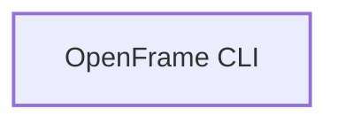

# Ecosystem: OpenFrame CLI

> Generated from the repository graph by the Flamingo documentation pipeline. Do not edit by hand: it is rebuilt from the manifests and sources on every merge.

## Role

OpenFrame CLI is a **service** (go).

## Published artifacts

| Ecosystem | Artifact | Version |
|---|---|---|
| go | `github.com/flamingo-stack/openframe-cli` | n/a |

## Upstream dependencies

None recorded.

## Downstream consumers

None recorded.

## Graph

## Index state

- Snapshot: `cdf742dbf1d7` on `main`, indexed 2026-09-18T00:57:58.033+00:00
- Coverage: full (every other managed repository has a fresh graph, so a symbol with no consumer here has no consumer in the org)
