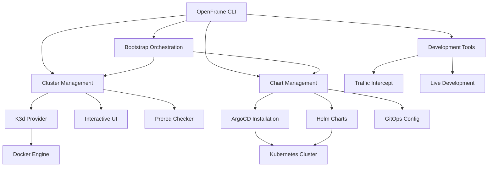
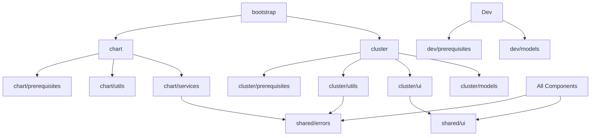
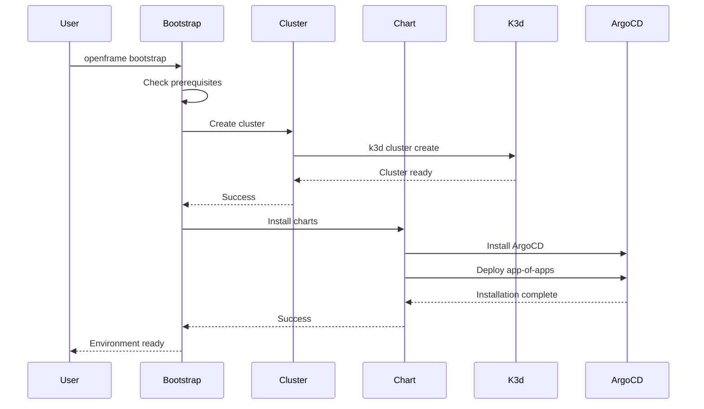
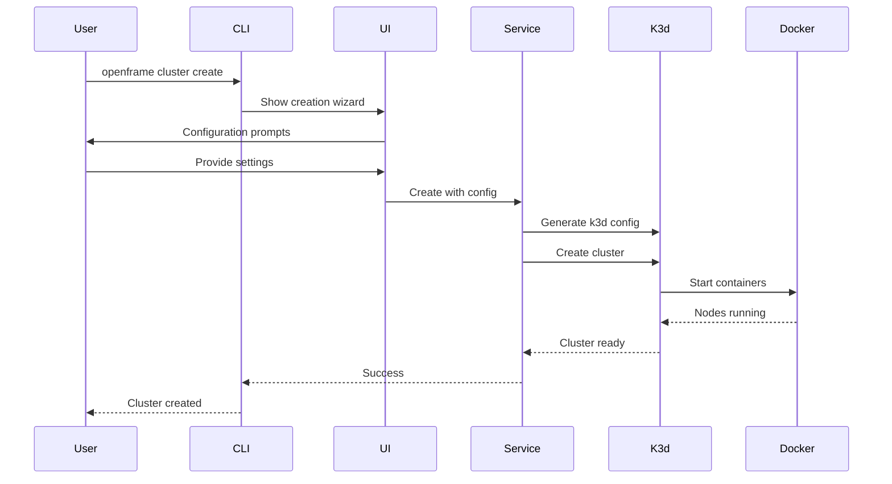

# openframe-cli Module Documentation

# OpenFrame CLI Architecture Documentation

OpenFrame CLI is a modern command-line tool for managing OpenFrame Kubernetes clusters and development workflows, providing interactive cluster creation, chart management, and developer-friendly tools for local development with K3d clusters.

## Overview

The OpenFrame CLI is built as a Go application using the Cobra framework, designed to simplify Kubernetes cluster management and OpenFrame deployment workflows. It provides a comprehensive suite of commands for creating K3d clusters, installing ArgoCD and OpenFrame charts, and supporting development workflows with Telepresence and Skaffold integration.

## Architecture

### High-Level System Design

## Core Components

| Component | Package | Responsibility |
|-----------|---------|----------------|
| **Cluster Management** | `cmd/cluster/*`, `internal/cluster/*` | K3d cluster lifecycle (create, delete, list, status, cleanup) |
| **Chart Management** | `cmd/chart/*`, `internal/chart/*` | ArgoCD and OpenFrame chart installation |
| **Bootstrap Orchestration** | `cmd/bootstrap/*`, `internal/bootstrap/*` | End-to-end setup combining cluster + chart operations |
| **Development Tools** | `cmd/dev/*`, `internal/dev/*` | Telepresence intercepts and Skaffold workflows |
| **Interactive UI** | `internal/cluster/ui/*`, `internal/shared/ui/*` | User prompts, wizards, and visual feedback |
| **Prerequisites** | `internal/*/prerequisites/*` | Tool detection and installation (Docker, K3d, Helm, etc.) |
| **Error Handling** | `internal/shared/errors/*` | Centralized error formatting and user feedback |
| **Models** | `internal/*/models/*` | Data structures, validation, and flag management |

## Component Relationships

### Module Dependency Graph

## Data Flow

### Bootstrap Command Flow

### Cluster Creation Flow

## Key Files

| File | Purpose |
|------|---------|
| `main.go` | CLI entry point and root command setup |
| `cmd/bootstrap/bootstrap.go` | End-to-end bootstrap orchestration |
| `cmd/cluster/create.go` | Interactive cluster creation with wizard |
| `cmd/chart/install.go` | ArgoCD and chart installation logic |
| `internal/cluster/utils/command_service.go` | Core cluster operations service |
| `internal/cluster/ui/configuration.go` | Interactive configuration wizard |
| `internal/chart/services/installation.go` | Chart installation workflow |
| `internal/shared/ui/logo.go` | Consistent branding and UI elements |
| `internal/shared/errors/handler.go` | Centralized error handling |

## Dependencies

The project leverages several key Go libraries and external tools:

| Dependency | Usage | Integration Point |
|------------|-------|-------------------|
| **Cobra** | CLI framework and command structure | All `cmd/*` packages for command definitions |
| **Docker** | Container runtime for K3d clusters | `cluster/prerequisites` for detection and validation |
| **K3d** | Kubernetes cluster creation | `cluster/services` for cluster lifecycle management |
| **Helm** | Chart installation and management | `chart/services` for ArgoCD and OpenFrame deployments |
| **Telepresence** | Development traffic interception | `dev/prerequisites` and service intercept workflows |
| **Skaffold** | Live development and deployment | `dev/prerequisites` for development workflows |
| **kubectl** | Kubernetes cluster interaction | All services for cluster communication |

## CLI Commands

### Cluster Management Commands

| Command | Description | Example |
|---------|-------------|---------|
| `cluster create [name]` | Create new K3d cluster with interactive wizard | `openframe cluster create my-dev` |
| `cluster delete [name]` | Delete cluster and clean up resources | `openframe cluster delete my-dev` |
| `cluster list` | List all managed clusters | `openframe cluster list` |
| `cluster status [name]` | Show detailed cluster information | `openframe cluster status` |
| `cluster cleanup [name]` | Clean up unused Docker resources | `openframe cluster cleanup` |

### Chart Management Commands

| Command | Description | Example |
|---------|-------------|---------|
| `chart install [cluster]` | Install ArgoCD and OpenFrame charts | `openframe chart install` |

### Development Commands

| Command | Description | Example |
|---------|-------------|---------|
| `dev intercept [service]` | Intercept service traffic with Telepresence | `openframe dev intercept api` |
| `dev skaffold [cluster]` | Run Skaffold development workflow | `openframe dev skaffold` |

### Bootstrap Commands

| Command | Description | Example |
|---------|-------------|---------|
| `bootstrap [cluster]` | Complete end-to-end setup (cluster + charts) | `openframe bootstrap --deployment-mode=oss-tenant` |

### Global Flags

- `--verbose, -v`: Show detailed logging and operation progress
- `--deployment-mode`: Specify deployment type (oss-tenant, saas-tenant, saas-shared)
- `--non-interactive`: Skip prompts for CI/CD environments
- `--force`: Skip confirmations for destructive operations
- `--dry-run`: Show configuration without executing actions
