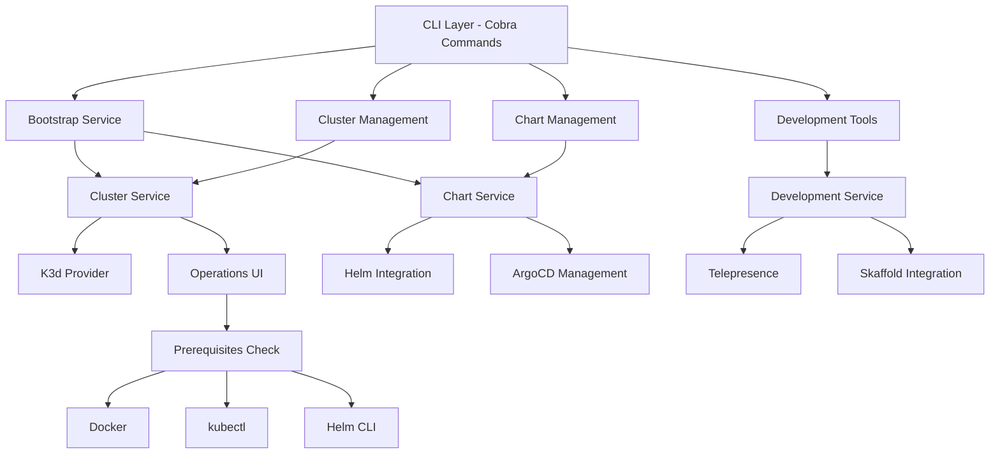
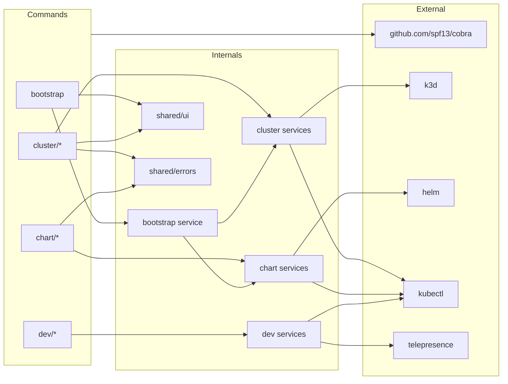
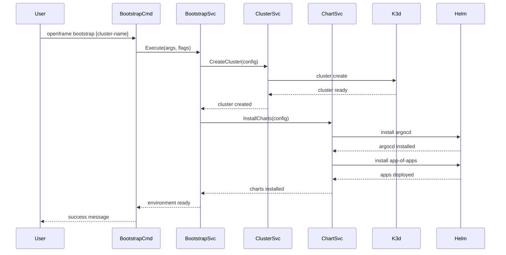

# openframe-cli Module Documentation

# OpenFrame CLI Architecture Documentation

OpenFrame CLI is a comprehensive command-line tool for managing Kubernetes clusters and deploying the OpenFrame platform. It provides streamlined workflows for cluster creation, chart installation, development tools, and complete environment bootstrapping with support for multiple deployment modes.

## Architecture

The CLI follows a layered architecture with clear separation between command handlers, business logic, and infrastructure concerns. It uses the Cobra framework for command structure and supports multiple cluster providers with extensible service abstractions.

### High-Level Architecture

## Core Components

| Component | Location | Responsibility |
|-----------|----------|---------------|
| **Bootstrap** | `cmd/bootstrap/` | Orchestrates complete OpenFrame setup (cluster + charts) |
| **Cluster Management** | `cmd/cluster/` | K8s cluster lifecycle (create, delete, list, status, cleanup) |
| **Chart Management** | `cmd/chart/` | Helm chart installation and ArgoCD deployment |
| **Development Tools** | `cmd/dev/` | Local development workflows (intercept, skaffold) |
| **Shared UI** | `internal/shared/ui/` | Common user interface components and logo display |
| **Error Handling** | `internal/shared/errors/` | Centralized error processing and display |
| **Prerequisites** | `internal/*/prerequisites/` | Tool dependency validation per component |
| **Models** | `internal/*/models/` | Data structures and validation logic |
| **Services** | `internal/*/services/` | Business logic and external tool integration |

## Component Relationships

### Module Dependencies

## Data Flow

### Bootstrap Command Flow

## Key Files

| File | Purpose |
|------|---------|
| `cmd/bootstrap/bootstrap.go` | Main bootstrap command entry point with complete environment setup |
| `cmd/cluster/cluster.go` | Cluster command group with subcommand registration and global flags |
| `cmd/cluster/create.go` | Cluster creation with interactive configuration and validation |
| `cmd/cluster/delete.go` | Safe cluster deletion with confirmation and cleanup |
| `cmd/chart/install.go` | ArgoCD and application chart installation with multiple deployment modes |
| `cmd/dev/dev.go` | Development tools command group with Telepresence and Skaffold integration |

## Dependencies

The CLI integrates with several external tools and libraries:

### External Tool Dependencies
- **K3d**: Lightweight Kubernetes cluster creation and management
- **Helm**: Chart installation and templating for ArgoCD and applications  
- **kubectl**: Kubernetes cluster interaction and resource management
- **Telepresence**: Traffic interception for local development workflows
- **Docker**: Container runtime for cluster nodes and image management

### Go Library Dependencies
- **cobra**: CLI framework providing command structure, flag parsing, and help generation
- **Various internal packages**: Business logic services, UI components, and shared utilities located in `internal/` directories

## CLI Commands

| Command | Usage | Description |
|---------|-------|-------------|
| `bootstrap` | `openframe bootstrap [cluster-name]` | Complete environment setup (cluster + charts) |
| `cluster create` | `openframe cluster create [name]` | Create K8s cluster with interactive config |
| `cluster delete` | `openframe cluster delete [name]` | Delete cluster with confirmation |
| `cluster list` | `openframe cluster list` | Show all managed clusters |
| `cluster status` | `openframe cluster status [name]` | Detailed cluster information |
| `cluster cleanup` | `openframe cluster cleanup [name]` | Remove unused cluster resources |
| `chart install` | `openframe chart install [cluster-name]` | Install ArgoCD and app-of-apps |
| `dev intercept` | `openframe dev intercept [service-name]` | Traffic interception for local development |
| `dev skaffold` | `openframe dev skaffold [cluster-name]` | Live development with Skaffold |

### Common Flags
- `--deployment-mode`: Specify deployment type (oss-tenant, saas-tenant, saas-shared)
- `--non-interactive`: Skip prompts for CI/CD usage
- `--verbose, -v`: Detailed logging output
- `--force`: Skip confirmations for destructive operations
- `--dry-run`: Preview operations without execution
