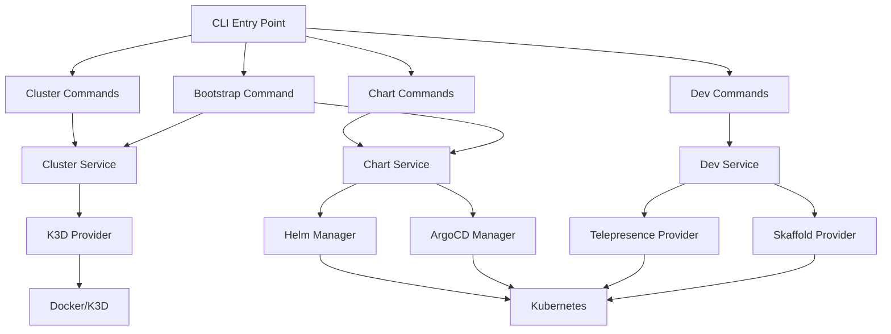
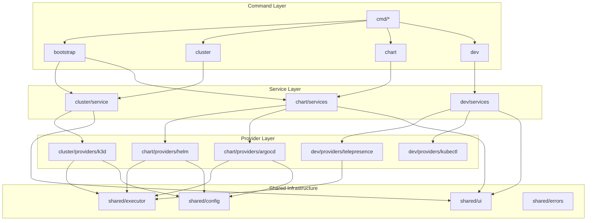
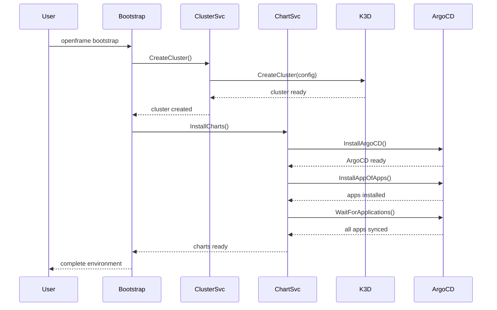

# openframe-cli Module Documentation

# OpenFrame CLI Architecture Documentation

## Overview

OpenFrame CLI is a modern command-line tool for managing OpenFrame Kubernetes clusters and development workflows. It provides interactive cluster creation, Helm chart management with ArgoCD integration, and developer tools for traffic interception and service scaffolding. The CLI replaces shell scripts with a modern, wizard-style interactive terminal interface for Kubernetes platform bootstrapping.

## Architecture

The CLI follows a clean architecture pattern with clear separation of concerns across domain-driven layers. It uses the Cobra command framework with dependency injection for testing and modular command organization.

### High-Level System Architecture


## Core Components

| Component | Package | Responsibilities |
|-----------|---------|------------------|
| **CLI Framework** | `cmd/*` | Command definitions, argument parsing, flag handling |
| **Cluster Management** | `internal/cluster` | K3D cluster lifecycle (create, delete, list, status, cleanup) |
| **Chart Management** | `internal/chart` | ArgoCD and Helm chart installation, app-of-apps pattern |
| **Development Tools** | `internal/dev` | Telepresence intercepts, Skaffold scaffolding workflows |
| **Bootstrap Orchestration** | `internal/bootstrap` | Combines cluster + chart operations for complete setup |
| **Shared Infrastructure** | `internal/shared` | Command execution, UI components, error handling, configuration |
| **Prerequisites** | `*/prerequisites` | Tool installation and validation (Docker, k3d, kubectl, helm, etc.) |

## Component Relationships

### Module Dependencies


## Data Flow

### Bootstrap Command Flow


## Key Files

| File | Purpose |
|------|---------|
| `main.go` | CLI entry point and version handling |
| `cmd/root.go` | Root command structure and global configuration |
| `cmd/bootstrap/bootstrap.go` | Combined cluster+chart workflow orchestration |
| `internal/cluster/service.go` | Core cluster management business logic |
| `internal/chart/services/chart_service.go` | Chart installation orchestration with ArgoCD |
| `internal/dev/services/intercept/service.go` | Telepresence traffic interception workflows |
| `internal/shared/executor/executor.go` | Command execution abstraction with mock support |
| `internal/cluster/providers/k3d/manager.go` | K3D-specific cluster operations |
| `internal/chart/providers/argocd/wait.go` | ArgoCD application synchronization monitoring |

## Dependencies

The project uses several external libraries to provide its functionality:

- **Cobra** (`github.com/spf13/cobra`): CLI framework providing command structure, argument parsing, and help generation
- **pterm** (`github.com/pterm/pterm`): Terminal UI library for progress indicators, tables, interactive prompts, and styled output
- **promptui** (`github.com/manifoldco/promptui`): Interactive CLI prompts for user input and selection menus
- **YAML** (`gopkg.in/yaml.v3`): YAML parsing for Helm values files and Kubernetes manifests
- **testify** (`github.com/stretchr/testify`): Testing assertions and mocking framework
- **golang.org/x/term**: Terminal interface detection and raw input handling for cross-platform compatibility

The CLI integrates with external tools through command execution:
- **k3d**: Lightweight Kubernetes distribution management
- **kubectl**: Kubernetes cluster interaction
- **helm**: Kubernetes package management
- **telepresence**: Service mesh traffic interception
- **skaffold**: Kubernetes development workflows

## CLI Commands

### Cluster Management
```bash
# Create a new K3D cluster
openframe cluster create [NAME]
openframe cluster create --nodes 3 --type k3d --skip-wizard

# List all clusters
openframe cluster list

# Show cluster status
openframe cluster status [NAME]

# Delete a cluster
openframe cluster delete [NAME] --force

# Clean up cluster resources
openframe cluster cleanup [NAME]
```

### Chart Installation
```bash
# Install ArgoCD and app-of-apps
openframe chart install [CLUSTER]
openframe chart install --deployment-mode=oss-tenant --non-interactive

# Bootstrap complete environment (cluster + charts)
openframe bootstrap [NAME]
openframe bootstrap --deployment-mode=saas-shared --verbose
```

### Development Tools
```bash
# Intercept service traffic to local development
openframe dev intercept [SERVICE] --port 8080 --namespace default

# Run Skaffold development workflow
openframe dev skaffold [CLUSTER] --skip-bootstrap
```

### Global Options
```bash
# Common flags available on all commands
--verbose, -v    # Enable detailed output
--dry-run        # Show what would be done without executing
--non-interactive # Skip all prompts for CI/CD usage
```
