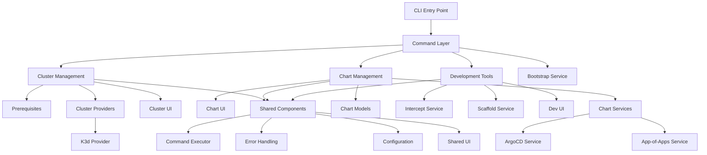
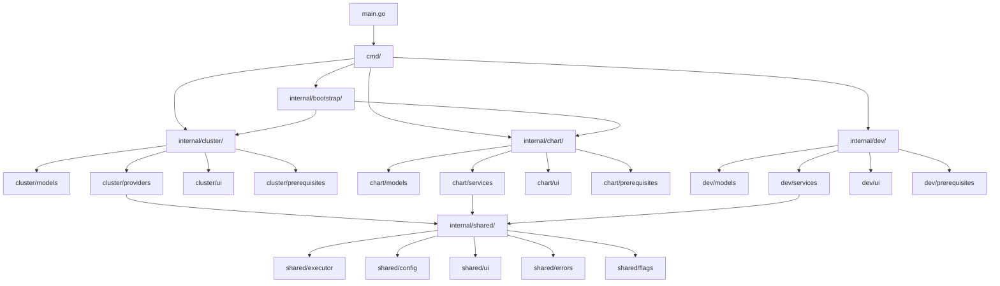
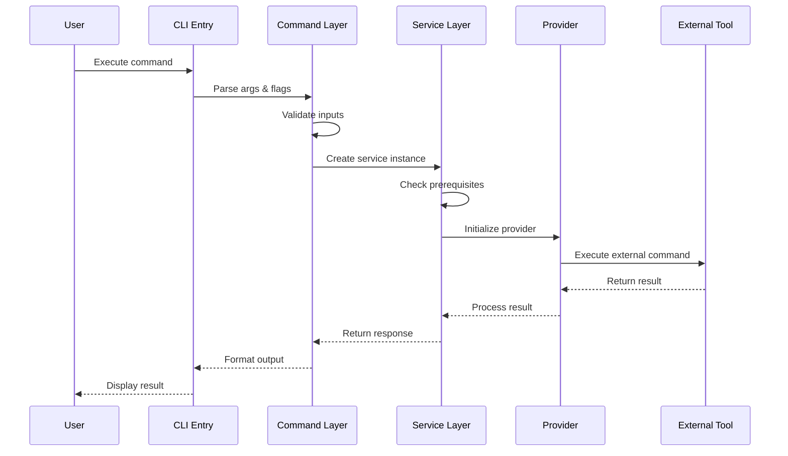
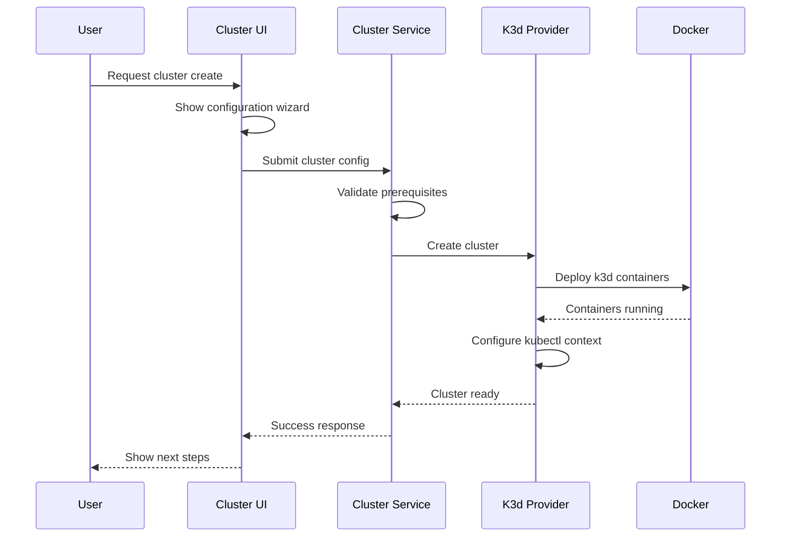

# openframe-cli Module Documentation

# OpenFrame CLI Architecture Documentation

## Overview

OpenFrame CLI is a modern command-line tool for managing OpenFrame Kubernetes clusters and development workflows. It provides interactive wizards for cluster creation, chart installation, and development tools like Telepresence intercepts and Skaffold deployment workflows.

## Architecture

### System Architecture Overview



## Core Components

| Component | Package | Responsibilities |
|-----------|---------|------------------|
| **Command Layer** | `cmd/` | Command definitions, flag parsing, argument validation |
| **Cluster Management** | `internal/cluster/` | K3d cluster lifecycle, status monitoring, operations |
| **Chart Management** | `internal/chart/` | ArgoCD installation, Helm chart deployment, app-of-apps pattern |
| **Development Tools** | `internal/dev/` | Telepresence intercepts, Skaffold workflows |
| **Bootstrap Service** | `internal/bootstrap/` | Combined cluster creation + chart installation |
| **Shared Components** | `internal/shared/` | Common utilities, UI components, error handling |
| **Prerequisites** | `*/prerequisites/` | Tool installation and validation |
| **Providers** | `*/providers/` | External tool integrations (k3d, kubectl, helm) |

## Component Relationships

### Module Dependency Flow



## Data Flow

### Command Execution Flow



### Cluster Creation Workflow



## Key Files

| File | Purpose |
|------|---------|
| `main.go` | CLI entry point and version handling |
| `cmd/root.go` | Root command definition and global configuration |
| `cmd/cluster/cluster.go` | Cluster command group with subcommands |
| `cmd/chart/chart.go` | Chart management commands |
| `cmd/dev/dev.go` | Development workflow commands |
| `internal/cluster/service.go` | Core cluster business logic |
| `internal/chart/services/chart_service.go` | Chart installation orchestration |
| `internal/dev/services/intercept/service.go` | Telepresence intercept management |
| `internal/shared/executor/executor.go` | Command execution abstraction |
| `internal/shared/ui/logo.go` | CLI branding and user experience |

## Dependencies

The project integrates with several external tools and libraries:

### External Tools (via Command Execution)
- **Docker**: Container runtime for k3d clusters
- **k3d**: Lightweight Kubernetes distribution
- **kubectl**: Kubernetes command-line tool
- **Helm**: Kubernetes package manager
- **ArgoCD**: GitOps continuous deployment
- **Telepresence**: Local development with remote clusters
- **Skaffold**: Development workflow automation

### Go Libraries
- **Cobra**: CLI framework for commands and flags
- **pterm**: Terminal UI components and styling
- **promptui**: Interactive prompts and selection
- **YAML**: Configuration file parsing
- **testify**: Testing assertions and mocking

### Provider Pattern
Each external tool is wrapped in a provider interface:
- `k3d.Manager`: Cluster lifecycle operations
- `kubectl.Provider`: Kubernetes resource management  
- `helm.HelmManager`: Chart installation and management
- `telepresence.Provider`: Traffic interception setup

## CLI Commands

### Main Command Groups

| Command | Description | Examples |
|---------|-------------|----------|
| `cluster` | Manage Kubernetes clusters | `create`, `delete`, `list`, `status`, `cleanup` |
| `chart` | Install and manage Helm charts | `install` |
| `dev` | Development workflow tools | `intercept`, `skaffold` |
| `bootstrap` | Combined cluster + chart setup | `bootstrap [cluster-name]` |

### Key Commands

#### Cluster Management
```bash
# Interactive cluster creation
openframe cluster create

# Create with specific configuration  
openframe cluster create my-cluster --nodes 3 --type k3d

# List all clusters
openframe cluster list

# Check cluster status
openframe cluster status my-cluster

# Delete cluster
openframe cluster delete my-cluster
```

#### Chart Installation
```bash
# Install ArgoCD and app-of-apps
openframe chart install

# Install on specific cluster with deployment mode
openframe chart install my-cluster --deployment-mode=oss-tenant
```

#### Development Tools  
```bash
# Intercept service traffic locally
openframe dev intercept my-service --port 8080

# Run Skaffold development workflow
openframe dev skaffold my-cluster
```

#### Bootstrap Workflow
```bash
# Complete setup: cluster + charts
openframe bootstrap

# Non-interactive mode
openframe bootstrap my-cluster --deployment-mode=oss-tenant --non-interactive
```

### Global Flags
- `--verbose, -v`: Enable detailed output
- `--dry-run`: Show what would be done without executing
- `--force, -f`: Skip confirmation prompts
- `--silent`: Minimize output except errors
