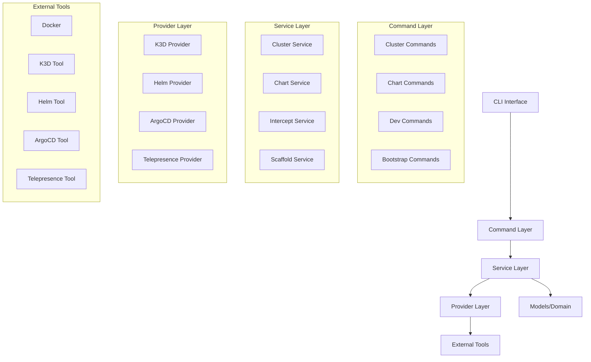
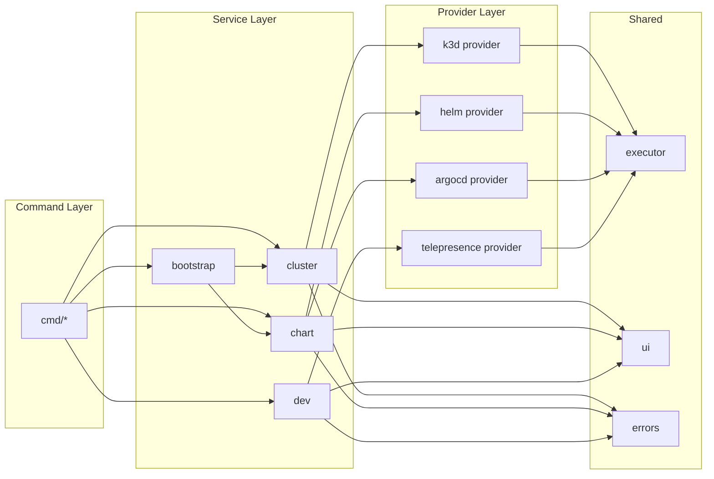
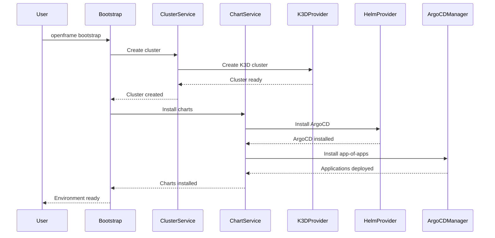
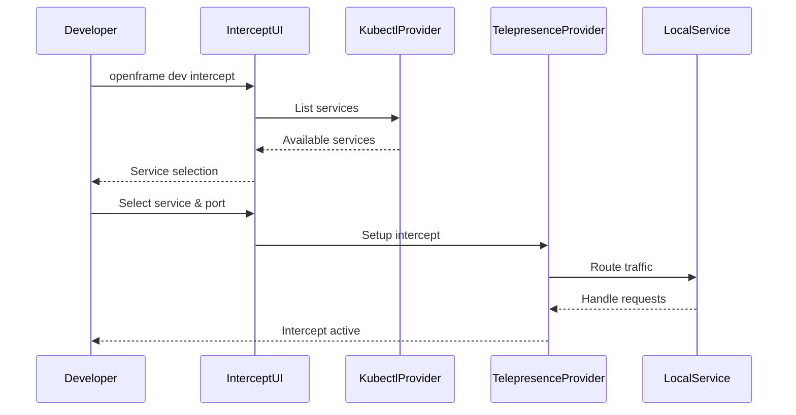

# openframe-cli Module Documentation

# OpenFrame CLI Architecture Documentation

## Overview

OpenFrame CLI is a modern, interactive command-line tool for managing OpenFrame Kubernetes clusters and development workflows. It provides seamless cluster lifecycle management with K3D, chart installation via ArgoCD, and developer-friendly tools for service intercepts and scaffolding.

## Architecture

The CLI follows a modular, layered architecture with clear separation of concerns between UI, business logic, and external integrations.

### System Architecture



## Core Components

| Component | Package | Responsibility |
|-----------|---------|----------------|
| **CLI Commands** | `cmd/*` | Command-line interface, argument parsing, flag management |
| **Cluster Management** | `internal/cluster` | K8s cluster lifecycle (create, delete, status, cleanup) |
| **Chart Installation** | `internal/chart` | Helm chart deployment, ArgoCD configuration |
| **Development Tools** | `internal/dev` | Telepresence intercepts, Skaffold workflows |
| **Bootstrap Service** | `internal/bootstrap` | Complete environment setup orchestration |
| **K3D Provider** | `internal/cluster/providers/k3d` | K3D cluster management implementation |
| **Helm Provider** | `internal/chart/providers/helm` | Helm chart operations |
| **ArgoCD Provider** | `internal/chart/providers/argocd` | ArgoCD application management |
| **Telepresence Provider** | `internal/dev/providers/telepresence` | Service traffic interception |
| **UI Components** | `internal/*/ui` | Interactive prompts, progress indicators, displays |
| **Shared Infrastructure** | `internal/shared` | Common utilities, error handling, command execution |

## Component Relationships

### Module Dependencies



## Data Flow

### Bootstrap Workflow



### Development Intercept Workflow



## Key Files

| File | Purpose |
|------|---------|
| `main.go` | Application entry point, CLI initialization |
| `cmd/root.go` | Root command definition, global configuration |
| `internal/bootstrap/service.go` | Complete environment setup orchestration |
| `internal/cluster/service.go` | Core cluster management business logic |
| `internal/cluster/providers/k3d/manager.go` | K3D cluster operations implementation |
| `internal/chart/services/chart_service.go` | Chart installation workflow coordination |
| `internal/chart/providers/helm/manager.go` | Helm chart operations |
| `internal/chart/providers/argocd/applications.go` | ArgoCD application lifecycle management |
| `internal/dev/services/intercept/service.go` | Telepresence intercept management |
| `internal/shared/executor/executor.go` | Command execution abstraction |
| `internal/shared/ui/prompts.go` | Interactive UI components |

## Dependencies

The project integrates with several external tools and libraries:

### External Tool Dependencies
- **Docker**: Container runtime for K3D clusters
- **K3D**: Lightweight Kubernetes distribution for local development
- **Helm**: Kubernetes package manager for chart deployment
- **kubectl**: Kubernetes command-line tool for cluster interaction
- **Telepresence**: Service mesh for development traffic interception
- **Skaffold**: Continuous development workflow tool

### Go Library Dependencies
- **Cobra**: CLI framework for command structure and argument parsing
- **pterm**: Terminal UI library for interactive prompts and styling
- **promptui**: Interactive prompt library for user input
- **yaml.v3**: YAML parsing for configuration files

### Integration Pattern
The CLI uses a provider pattern to abstract external tool interactions:
1. **Command Executor**: Abstracts system command execution for testability
2. **Provider Interfaces**: Define contracts for external tool integration
3. **Mock Implementations**: Enable comprehensive testing without external dependencies
4. **Error Handling**: Consistent error management across all integrations

## CLI Commands

### Core Commands

| Command | Description | Example |
|---------|-------------|---------|
| `cluster create` | Create new K3D cluster with interactive configuration | `openframe cluster create my-dev-cluster` |
| `cluster list` | List all managed clusters with status | `openframe cluster list` |
| `cluster status` | Show detailed cluster information | `openframe cluster status my-cluster` |
| `cluster delete` | Remove cluster and cleanup resources | `openframe cluster delete my-cluster` |
| `cluster cleanup` | Clean unused cluster resources | `openframe cluster cleanup my-cluster` |
| `chart install` | Install ArgoCD and OpenFrame applications | `openframe chart install my-cluster` |
| `bootstrap` | Complete setup (cluster + charts) | `openframe bootstrap` |
| `dev intercept` | Route service traffic to local development | `openframe dev intercept my-service --port 8080` |
| `dev scaffold` | Run Skaffold development workflow | `openframe dev scaffold my-cluster` |

### Command Flags

| Flag | Description | Applicable Commands |
|------|-------------|-------------------|
| `--verbose, -v` | Enable detailed output | All commands |
| `--dry-run` | Show what would be done | cluster create, chart install |
| `--force, -f` | Skip confirmation prompts | cluster delete, cleanup |
| `--non-interactive` | Skip all prompts, use defaults | bootstrap, chart install |
| `--deployment-mode` | Specify deployment type | bootstrap, chart install |
| `--skip-wizard` | Use defaults without interactive setup | cluster create |

### Usage Examples

```bash
# Complete OpenFrame setup
openframe bootstrap

# Create cluster with custom configuration
openframe cluster create my-cluster --nodes 5 --type k3d

# Install charts with specific deployment mode
openframe chart install --deployment-mode=oss-tenant

# Set up development intercept
openframe dev intercept api-service --port 8080 --namespace production

# Run with verbose output
openframe cluster status my-cluster --verbose
```
