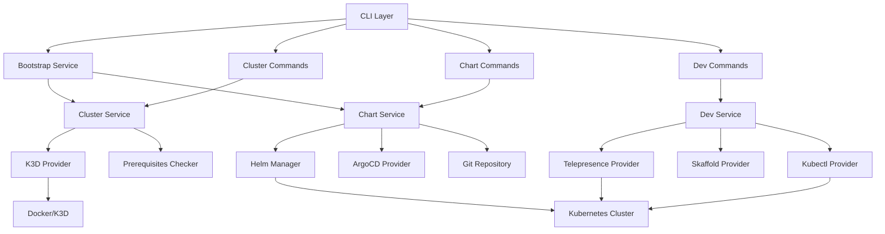
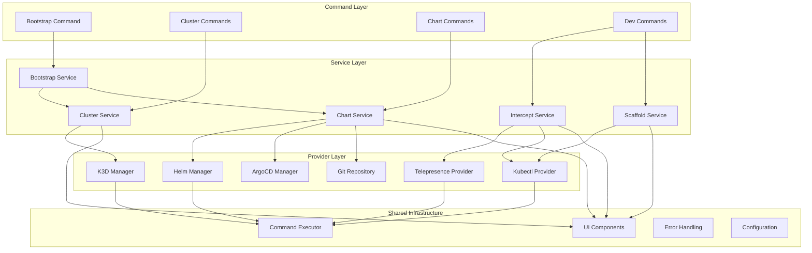
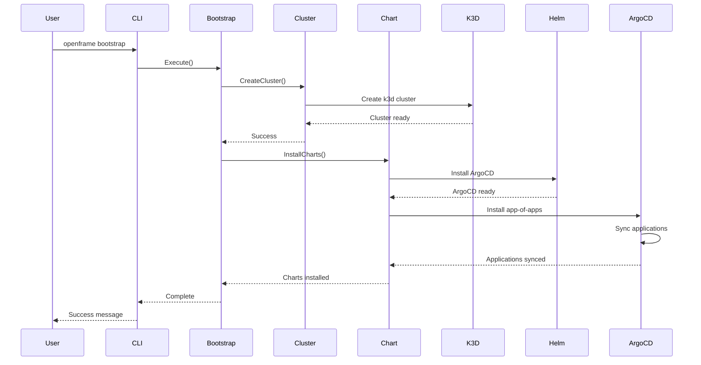
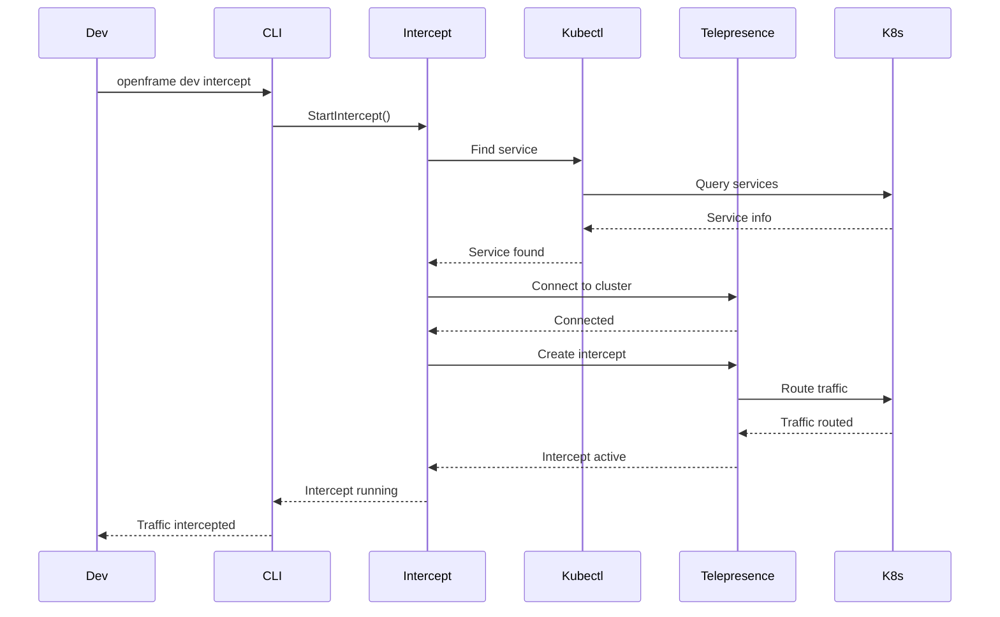

# openframe-cli Module Documentation

# OpenFrame CLI Architecture Documentation

## Overview

OpenFrame CLI is a modern, interactive command-line tool for managing Kubernetes clusters and development workflows specifically designed for the OpenFrame platform. It provides cluster lifecycle management (create, delete, list, status), chart installation with ArgoCD, and development tools for service intercepts and scaffolding, replacing traditional shell scripts with a polished Go-based CLI.

## Architecture

### High-Level System Design



## Core Components

| Component | Package | Responsibility |
|-----------|---------|---------------|
| **CLI Commands** | `cmd/` | Cobra command definitions and argument parsing |
| **Bootstrap Service** | `internal/bootstrap/` | Orchestrates cluster creation + chart installation |
| **Cluster Management** | `internal/cluster/` | K3D cluster lifecycle operations |
| **Chart Installation** | `internal/chart/` | ArgoCD and Helm chart management |
| **Development Tools** | `internal/dev/` | Telepresence intercepts and Skaffold workflows |
| **Shared Infrastructure** | `internal/shared/` | Common utilities, UI, errors, and execution |
| **Prerequisites** | `*/prerequisites/` | Tool installation and validation |
| **Providers** | `*/providers/` | External tool integrations (K3D, Helm, Git) |

## Component Relationships



## Data Flow

### Cluster Creation and Chart Installation Sequence



### Development Intercept Flow



## Key Files

| File | Purpose |
|------|---------|
| `main.go` | Application entry point and version handling |
| `cmd/root.go` | Root command definition and CLI structure |
| `cmd/bootstrap/bootstrap.go` | Bootstrap command for complete setup |
| `internal/cluster/service.go` | Core cluster management business logic |
| `internal/chart/services/chart_service.go` | Chart installation orchestration |
| `internal/dev/services/intercept/service.go` | Telepresence intercept management |
| `internal/shared/executor/executor.go` | Command execution abstraction |
| `internal/shared/ui/logo.go` | CLI branding and visual presentation |
| `internal/cluster/providers/k3d/manager.go` | K3D cluster provider implementation |
| `internal/chart/providers/helm/manager.go` | Helm chart operations |

## Dependencies

The project integrates with several external tools and libraries:

### External Tool Dependencies
- **Docker**: Container runtime for K3D clusters
- **K3D**: Lightweight Kubernetes distribution for local development
- **kubectl**: Kubernetes command-line tool for cluster interaction
- **Helm**: Package manager for Kubernetes applications
- **Telepresence**: Service intercept and local development
- **Skaffold**: Continuous development for Kubernetes applications
- **jq**: JSON processing for parsing command outputs

### Go Library Dependencies
- **Cobra**: CLI framework for command structure and parsing
- **pterm**: Terminal styling and interactive prompts
- **promptui**: Enhanced user input and selection interfaces
- **testify**: Testing utilities and assertions
- **yaml.v3**: YAML parsing for configuration files

### Integration Patterns
The CLI uses a provider pattern to abstract external tool interactions, making it testable and maintainable. Each provider implements specific interfaces for their domain (cluster management, chart operations, development tools).

## CLI Commands

### Core Commands

| Command | Description | Example |
|---------|-------------|---------|
| `openframe bootstrap` | Complete cluster setup (create + charts) | `openframe bootstrap my-cluster` |
| `openframe cluster create` | Create a new K3D cluster | `openframe cluster create dev-cluster` |
| `openframe cluster list` | List all managed clusters | `openframe cluster list` |
| `openframe cluster status` | Show cluster details | `openframe cluster status my-cluster` |
| `openframe cluster delete` | Remove a cluster | `openframe cluster delete my-cluster` |
| `openframe chart install` | Install ArgoCD and applications | `openframe chart install my-cluster` |
| `openframe dev intercept` | Intercept service traffic | `openframe dev intercept my-service --port 8080` |
| `openframe dev skaffold` | Run development workflow | `openframe dev skaffold my-cluster` |

### Bootstrap Workflow

```bash
# Complete setup with interactive configuration
openframe bootstrap

# Non-interactive with specific deployment mode
openframe bootstrap --deployment-mode=oss-tenant --non-interactive

# Verbose mode with custom cluster name
openframe bootstrap my-dev-cluster --verbose
```

### Development Workflow

```bash
# Start traffic intercept for a service
openframe dev intercept api-service --port 8080 --namespace production

# Run Skaffold development environment
openframe dev skaffold --skip-bootstrap

# List available clusters for development
openframe cluster list --quiet
```
