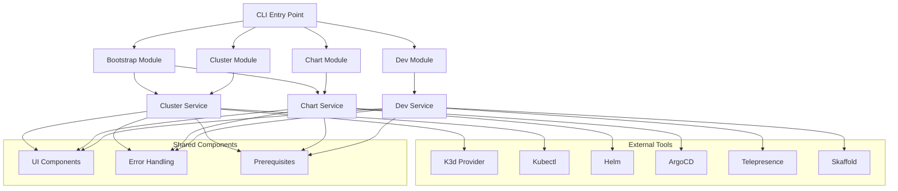
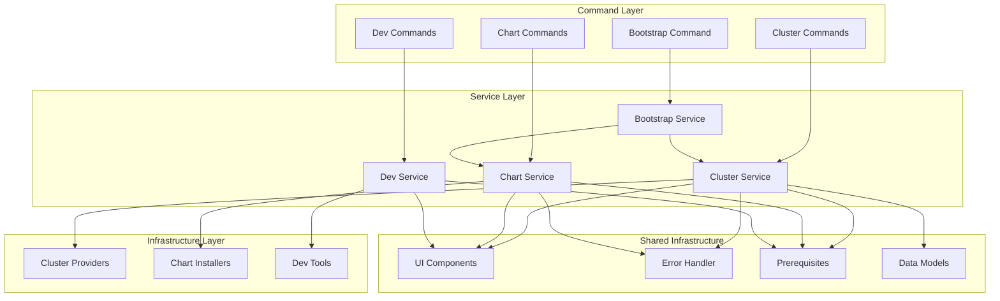
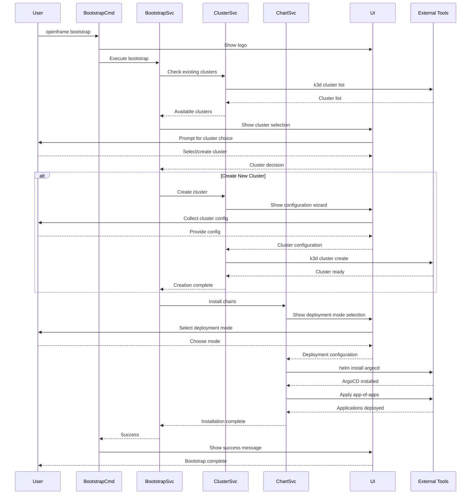

# openframe-cli Module Documentation

# OpenFrame CLI Architecture Documentation

## Overview

OpenFrame CLI is a comprehensive command-line interface for managing Kubernetes clusters and OpenFrame environments. It provides streamlined cluster lifecycle management, ArgoCD chart installation, development workflows with traffic interception, and a complete bootstrap experience for getting started with OpenFrame deployments.

## Architecture

The CLI follows a layered architecture with clear separation between command definitions, business logic, and system interactions. The design emphasizes modularity, reusability, and user experience through interactive interfaces and comprehensive error handling.

### High-Level Architecture

## Core Components

| Component | Package | Responsibilities |
|-----------|---------|------------------|
| **Bootstrap** | `cmd/bootstrap` | Orchestrates complete OpenFrame setup (cluster + charts) |
| **Cluster Management** | `cmd/cluster` | K8s cluster lifecycle (create, delete, list, status, cleanup) |
| **Chart Management** | `cmd/chart` | ArgoCD and Helm chart installation/management |
| **Development Tools** | `cmd/dev` | Local development workflows (intercept, skaffold) |
| **Cluster Service** | `internal/cluster` | Business logic for cluster operations |
| **Chart Service** | `internal/chart` | Business logic for chart operations |
| **Dev Service** | `internal/dev` | Business logic for development workflows |
| **UI Components** | `internal/shared/ui` | Interactive prompts and visual feedback |
| **Error Handling** | `internal/shared/errors` | Centralized error processing and display |
| **Prerequisites** | Various `/prerequisites` | Tool validation and installation checks |

## Component Relationships

## Data Flow

The following sequence diagram illustrates the typical flow for the bootstrap command, which represents the most complex workflow in the system:

### Bootstrap Command Flow

## Key Files

| File | Purpose |
|------|---------|
| `cmd/bootstrap/bootstrap.go` | Main bootstrap command orchestrating cluster creation and chart installation |
| `cmd/cluster/cluster.go` | Root cluster command with subcommand registration and shared flags |
| `cmd/cluster/create.go` | Cluster creation command with interactive configuration support |
| `cmd/chart/install.go` | ArgoCD and chart installation with deployment mode selection |
| `cmd/dev/dev.go` | Development tools command group for local workflows |
| `internal/cluster/utils/utils.go` | Global flag management and command service initialization |
| `internal/cluster/models/*.go` | Data models for cluster configuration and validation |
| `internal/cluster/ui/*.go` | Interactive UI components for cluster operations |
| `internal/shared/ui/*.go` | Shared UI components including logo display |
| `internal/shared/errors/*.go` | Centralized error handling and user-friendly error messages |

## Dependencies

The CLI leverages several key external libraries and tools:

| Dependency | Purpose | Integration |
|------------|---------|-------------|
| **Cobra CLI** | Command structure and flag parsing | Used throughout `cmd/` packages for command definition |
| **K3d** | Local Kubernetes cluster management | Integrated via `internal/cluster` for cluster operations |
| **Helm** | Kubernetes package management | Used in `internal/chart` for ArgoCD installation |
| **Kubectl** | Kubernetes cluster interaction | Used across services for cluster communication |
| **ArgoCD** | GitOps continuous delivery | Installed and configured via chart services |
| **Telepresence** | Traffic interception for development | Integrated in `internal/dev` for local development |
| **Skaffold** | Continuous development workflow | Used in dev module for live reloading |

The CLI abstracts these dependencies behind service interfaces, allowing for easier testing and potential provider swapping in the future.

## CLI Commands

| Command | Description | Key Features |
|---------|-------------|--------------|
| `openframe bootstrap` | Complete OpenFrame setup | Combines cluster creation + chart installation |
| `openframe cluster create` | Create Kubernetes cluster | Interactive configuration, multiple providers |
| `openframe cluster delete` | Remove cluster | Confirmation prompts, resource cleanup |
| `openframe cluster list` | Show all clusters | Formatted table output, status information |
| `openframe cluster status` | Detailed cluster info | Health checks, resource usage |
| `openframe cluster cleanup` | Clean unused resources | Docker image cleanup, disk space recovery |
| `openframe chart install` | Install ArgoCD charts | Deployment mode selection, app-of-apps |
| `openframe dev intercept` | Traffic interception | Local development, service replacement |
| `openframe dev skaffold` | Development deployment | Live reloading, development workflows |

### Common Flag Patterns

- `--verbose, -v`: Detailed logging across all commands
- `--non-interactive`: CI/CD mode, skip prompts
- `--force`: Skip confirmations for destructive operations
- `--deployment-mode`: Pre-select deployment configuration
- `--dry-run`: Preview operations without execution

The CLI emphasizes user experience through interactive modes by default, with comprehensive non-interactive options for automation and CI/CD integration.
