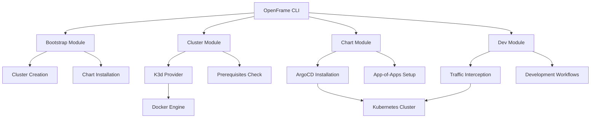
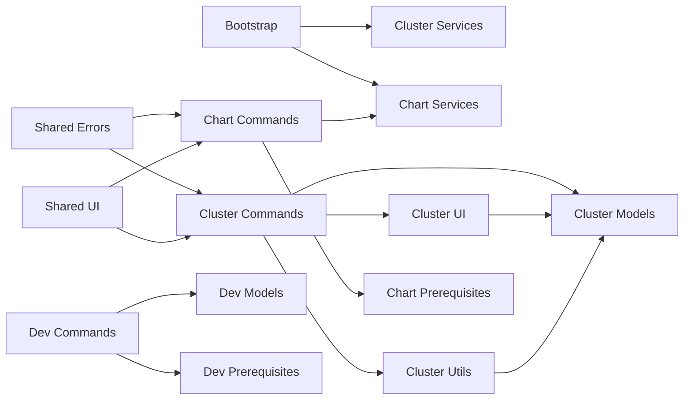
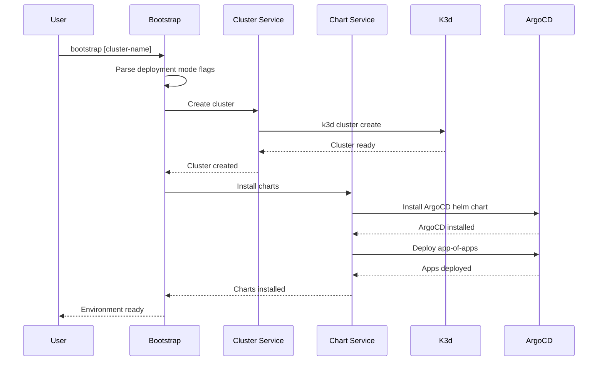
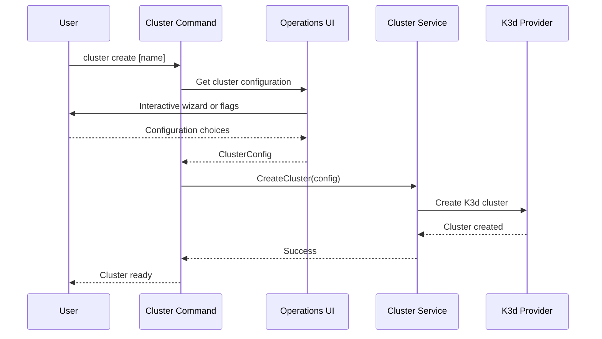

# openframe-cli Module Documentation

# OpenFrame CLI Architecture Documentation

## Overview

OpenFrame CLI is a Kubernetes cluster management tool that provides comprehensive lifecycle management for local development clusters. It offers streamlined workflows for creating K3d clusters, installing ArgoCD charts, and managing development environments with traffic interception capabilities through a unified command-line interface.

## Architecture

### High-Level System Design



## Core Components

| Component | Package | Responsibility |
|-----------|---------|----------------|
| **Bootstrap** | `cmd/bootstrap` | Orchestrates complete OpenFrame environment setup |
| **Cluster Management** | `cmd/cluster` | K3d cluster lifecycle operations (create, delete, list, status, cleanup) |
| **Chart Management** | `cmd/chart` | ArgoCD and app-of-apps installation and configuration |
| **Development Tools** | `cmd/dev` | Traffic interception and development workflow management |
| **UI Layer** | `internal/*/ui` | Interactive prompts, configuration wizards, and operation feedback |
| **Service Layer** | `internal/*/services` | Business logic and orchestration between providers |
| **Models** | `internal/*/models` | Data structures, validation, and flag definitions |
| **Prerequisites** | `internal/*/prerequisites` | Dependency validation and installation |

## Component Relationships

### Module Dependencies



## Data Flow

### Bootstrap Command Execution Flow



### Cluster Operation Flow



## Key Files

| File | Purpose |
|------|---------|
| `cmd/bootstrap/bootstrap.go` | Main bootstrap command orchestrating complete environment setup |
| `cmd/cluster/cluster.go` | Cluster command root with subcommand registration and global flags |
| `cmd/cluster/create.go` | Cluster creation with interactive configuration and validation |
| `cmd/chart/chart.go` | Chart management root command with ArgoCD installation capabilities |
| `cmd/chart/install.go` | ArgoCD and app-of-apps installation with configuration management |
| `cmd/dev/dev.go` | Development tools root for traffic interception and workflows |

## Dependencies

The OpenFrame CLI integrates with several external tools and libraries:

### Core Dependencies
- **Cobra CLI Framework**: Command structure, flag parsing, and subcommand organization
- **Kubernetes Client Libraries**: Cluster communication and resource management
- **Helm SDK**: Chart installation and configuration management
- **K3d**: Local Kubernetes cluster provisioning and management

### Development Tools
- **Telepresence**: Traffic interception for local development workflows
- **Skaffold**: Continuous development and deployment automation
- **ArgoCD**: GitOps-based application deployment and synchronization

### Infrastructure
- **Docker**: Container runtime for K3d cluster nodes
- **GitHub Integration**: Repository cloning and branch management for app-of-apps

## CLI Commands

### Bootstrap Commands
```bash
# Complete environment setup
openframe bootstrap                                    # Interactive mode
openframe bootstrap my-cluster                        # Custom cluster name
openframe bootstrap --deployment-mode=oss-tenant     # Skip deployment selection
openframe bootstrap --non-interactive --verbose      # CI/CD mode
```

### Cluster Management Commands
```bash
# Cluster lifecycle
openframe cluster create                    # Interactive cluster creation
openframe cluster create my-cluster        # Create with custom name
openframe cluster delete my-cluster        # Delete specific cluster
openframe cluster list                     # List all clusters
openframe cluster status my-cluster        # Show cluster details
openframe cluster cleanup my-cluster       # Clean unused resources
```

### Chart Management Commands
```bash
# ArgoCD and app-of-apps installation
openframe chart install                              # Interactive installation
openframe chart install my-cluster                  # Install on specific cluster
openframe chart install --deployment-mode=saas-tenant  # Pre-configured mode
openframe chart install --github-branch develop     # Custom branch
```

### Development Commands
```bash
# Development workflows (planned)
openframe dev intercept my-service         # Traffic interception
openframe dev skaffold my-cluster          # Development deployment
```

### Global Flags
- `--verbose, -v`: Enable detailed logging and operation progress
- `--deployment-mode`: Specify deployment type (oss-tenant, saas-tenant, saas-shared)
- `--non-interactive`: Skip all prompts for CI/CD environments
- `--force`: Skip confirmation prompts for destructive operations
- `--dry-run`: Preview operations without execution
