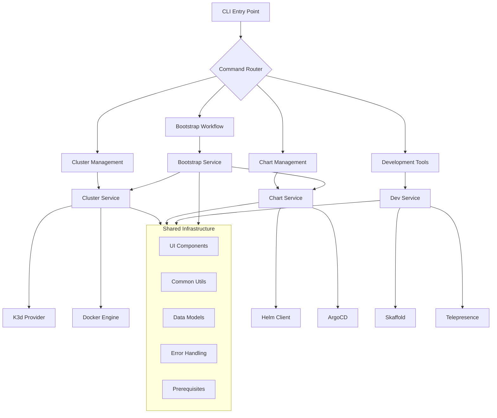
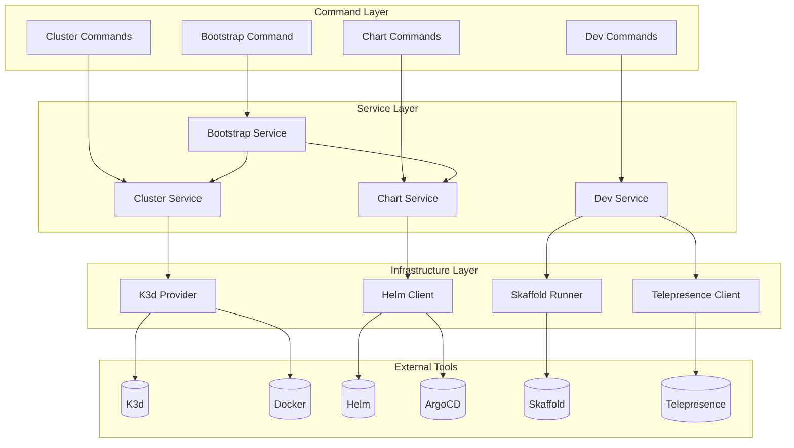
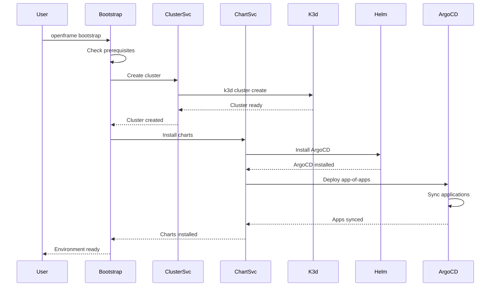

# openframe-cli Module Documentation

# OpenFrame CLI Architecture Documentation

## Overview

OpenFrame CLI is a comprehensive command-line tool written in Go that provides Kubernetes cluster management and development workflow automation for OpenFrame deployments. It simplifies the creation, management, and bootstrapping of local K3d clusters while offering integrated development tools for service deployment and traffic interception.

## Architecture

The CLI follows a layered architecture with clear separation between command handling, business logic, and infrastructure concerns. The system is organized around domain-specific modules (cluster, chart, dev, bootstrap) that share common utilities and UI components.

### High-Level System Architecture

## Core Components

| Component | Location | Responsibility |
|-----------|----------|----------------|
| **Cluster Management** | `cmd/cluster/`, `internal/cluster/` | K3d cluster lifecycle, status monitoring, resource cleanup |
| **Chart Management** | `cmd/chart/`, `internal/chart/` | Helm chart installation, ArgoCD deployment, GitOps workflows |
| **Development Tools** | `cmd/dev/`, `internal/dev/` | Skaffold integration, Telepresence traffic interception |
| **Bootstrap Service** | `cmd/bootstrap/`, `internal/bootstrap/` | End-to-end environment setup combining cluster + charts |
| **Shared UI** | `internal/shared/ui/` | Consistent CLI interface, logos, interactive prompts |
| **Error Handling** | `internal/shared/errors/` | Centralized error management and user-friendly messaging |
| **Prerequisites** | `internal/*/prerequisites/` | Tool validation and installation (Docker, K3d, Helm, etc.) |

## Component Relationships

### Module Dependencies and Data Flow

## Data Flow

The following sequence shows the typical bootstrap workflow that demonstrates how the major components interact:

### Bootstrap Workflow Sequence

## Key Files

| File | Purpose |
|------|---------|
| `cmd/bootstrap/bootstrap.go` | Main bootstrap command that orchestrates full environment setup |
| `cmd/cluster/cluster.go` | Cluster command group with subcommands for lifecycle management |
| `cmd/cluster/create.go` | Interactive cluster creation with configuration wizard |
| `cmd/chart/install.go` | Helm chart and ArgoCD installation logic |
| `cmd/dev/dev.go` | Development tools command group for local workflows |
| `internal/cluster/services/` | Core cluster management business logic |
| `internal/chart/services/` | Chart installation and GitOps management |
| `internal/shared/ui/` | Reusable CLI interface components |
| `internal/shared/errors/` | Centralized error handling and formatting |

## Dependencies

The OpenFrame CLI integrates with several external tools and systems:

### External Tool Dependencies
- **K3d**: Lightweight Kubernetes distribution for local development clusters
- **Docker**: Container runtime required by K3d for cluster nodes
- **Helm**: Package manager for Kubernetes chart installations
- **ArgoCD**: GitOps continuous delivery tool for application management
- **Skaffold**: Development workflow tool for building and deploying services
- **Telepresence**: Traffic interception tool for local service development

### Go Library Dependencies
- **Cobra**: Command-line interface framework providing subcommand structure
- **Viper**: Configuration management for settings and environment variables
- **Kubernetes Client-Go**: Native Kubernetes API client for cluster operations
- **Helm SDK**: Programmatic Helm chart installation and management

### Integration Patterns
The CLI acts as an orchestration layer, wrapping these tools with:
- Prerequisites validation and automatic installation guidance
- Unified configuration and flag management across tools
- Error handling and user-friendly output formatting
- Interactive workflows for complex multi-step operations

## CLI Commands

| Command | Description | Usage |
|---------|-------------|-------|
| `cluster create` | Create new K3d cluster with interactive configuration | `openframe cluster create [name] [--nodes N]` |
| `cluster delete` | Delete cluster and cleanup resources | `openframe cluster delete [name] [--force]` |
| `cluster list` | Show all managed clusters with status | `openframe cluster list [--verbose]` |
| `cluster status` | Display detailed cluster information | `openframe cluster status [name] [--detailed]` |
| `cluster cleanup` | Remove unused images and resources | `openframe cluster cleanup [name]` |
| `chart install` | Install ArgoCD and app-of-apps charts | `openframe chart install [--deployment-mode MODE]` |
| `bootstrap` | Complete environment setup (cluster + charts) | `openframe bootstrap [--deployment-mode MODE]` |
| `dev scaffold` | Run Skaffold for service development | `openframe dev scaffold [service]` |
| `dev intercept` | Intercept service traffic with Telepresence | `openframe dev intercept [service] [--port N]` |

### Command Patterns
- **Interactive Mode**: Default behavior with guided wizards and prompts
- **Non-Interactive Mode**: CI/CD friendly with `--non-interactive` and pre-configured flags
- **Verbose Output**: Detailed logging with `--verbose` for debugging and monitoring
- **Dry Run**: Preview operations with `--dry-run` before execution
