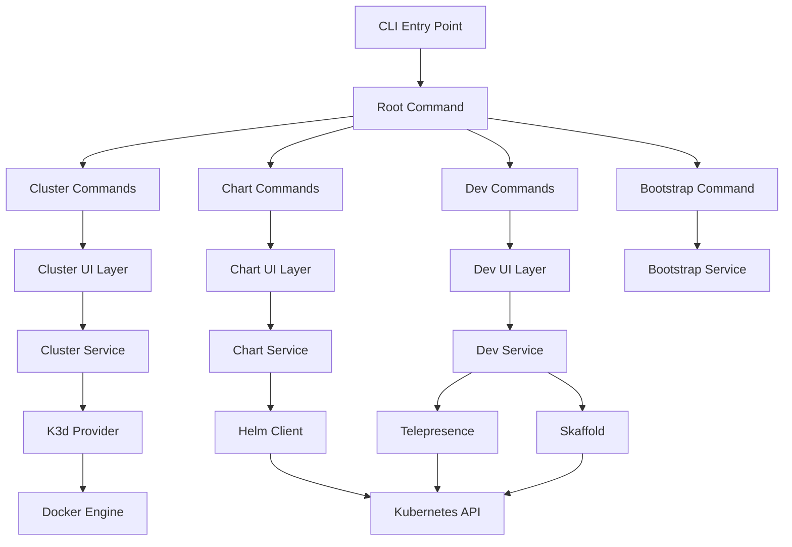
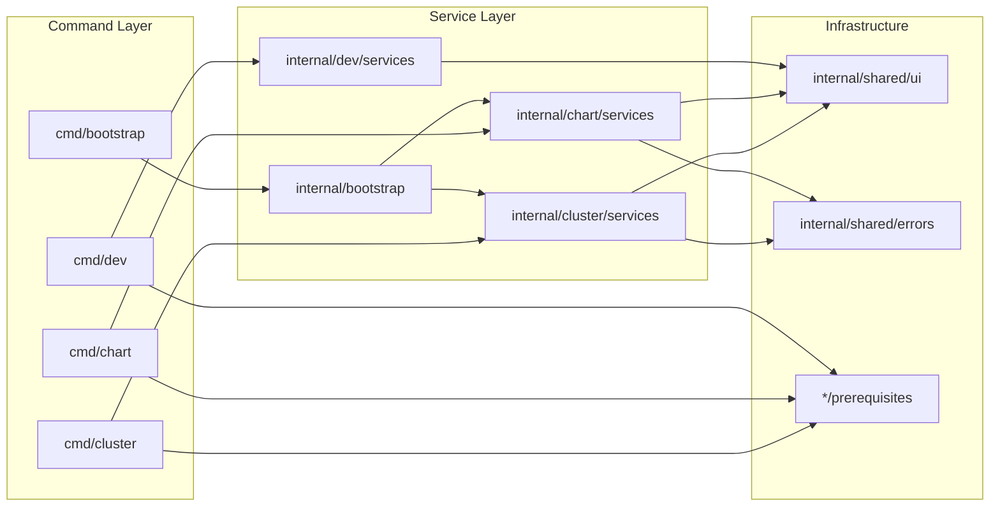
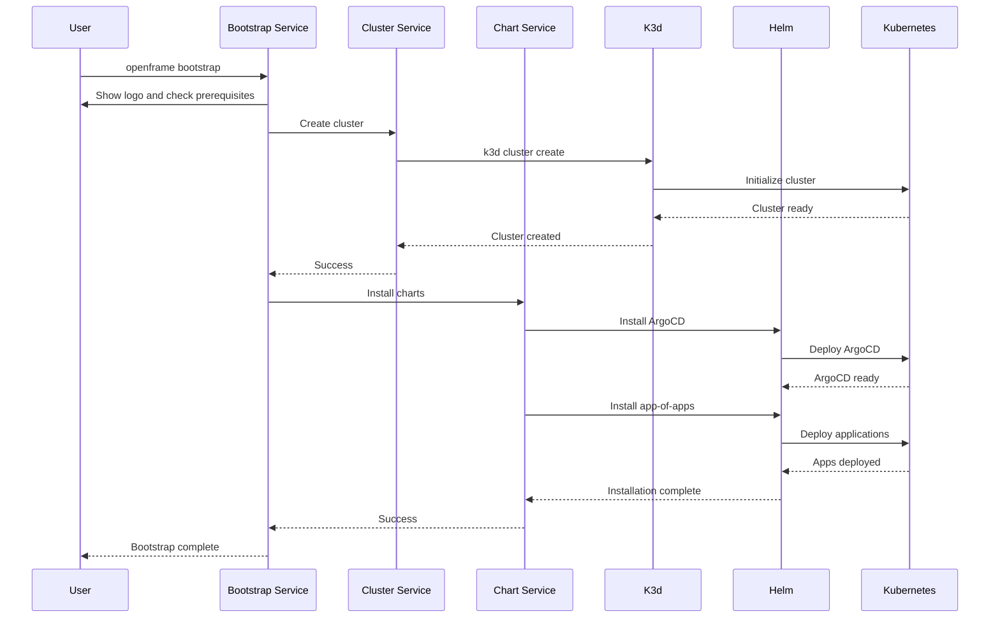

# openframe-cli Module Documentation

# OpenFrame CLI - Architecture Documentation

OpenFrame CLI is a modern command-line tool for managing OpenFrame Kubernetes clusters and development workflows. It provides an interactive interface for creating K3d clusters, installing ArgoCD and OpenFrame charts, and managing development tools like Telepresence and Skaffold.

## Architecture

The CLI follows a layered architecture with clear separation between command handling, business logic, and external system interactions. The system is built around the Cobra CLI framework with modular command groups for cluster management, chart operations, development tools, and bootstrapping workflows.

### High-Level Architecture Diagram



## Core Components

| Component | Package Path | Responsibilities |
|-----------|--------------|------------------|
| **Command Layer** | `cmd/` | CLI command definitions, argument parsing, flag handling |
| **Cluster Management** | `internal/cluster/` | K3d cluster lifecycle, status monitoring, resource cleanup |
| **Chart Management** | `internal/chart/` | Helm chart installation, ArgoCD deployment, app-of-apps setup |
| **Development Tools** | `internal/dev/` | Telepresence integration, Skaffold workflows |
| **Bootstrap Service** | `internal/bootstrap/` | End-to-end cluster setup orchestration |
| **Shared Infrastructure** | `internal/shared/` | Common UI components, error handling, utilities |
| **Prerequisites** | `*/prerequisites/` | Tool validation and installation checking |

## Component Relationships

### Module Dependency Diagram



## Data Flow

### Bootstrap Command Execution Flow



## Key Files

| File Path | Purpose |
|-----------|---------|
| `cmd/bootstrap/bootstrap.go` | Main bootstrap command that orchestrates cluster creation and chart installation |
| `cmd/cluster/cluster.go` | Cluster command group with subcommands for lifecycle management |
| `cmd/chart/install.go` | Chart installation command with ArgoCD and app-of-apps setup |
| `internal/cluster/services/` | Core cluster management business logic |
| `internal/chart/services/` | Helm chart installation and ArgoCD management |
| `internal/shared/ui/` | Common UI components for consistent CLI experience |
| `internal/cluster/models/` | Data structures and validation for cluster operations |
| `internal/chart/utils/types/` | Type definitions for chart installation requests |

## Dependencies

The CLI integrates with several external tools and systems through well-defined interfaces:

- **K3d**: Lightweight Kubernetes distribution for local development clusters
- **Helm**: Package manager for Kubernetes applications and chart installation
- **Docker**: Container runtime required by K3d for cluster nodes
- **Kubectl**: Kubernetes command-line tool for cluster interaction
- **ArgoCD**: GitOps continuous delivery tool for OpenFrame applications
- **Telepresence**: Development tool for local service traffic interception
- **Skaffold**: Build and deployment tool for development workflows

The system includes prerequisite checkers in each command group to validate tool availability and guide users through installation requirements.

## CLI Commands

| Command Group | Commands | Description |
|---------------|----------|-------------|
| **cluster** | `create`, `delete`, `list`, `status`, `cleanup` | Full cluster lifecycle management |
| **chart** | `install` | Helm chart and ArgoCD installation |
| **dev** | `intercept`, `skaffold` | Development workflow tools |
| **bootstrap** | N/A | End-to-end cluster setup with charts |

### Key Command Examples

```bash
# Complete OpenFrame setup
openframe bootstrap --deployment-mode=oss-tenant

# Cluster management
openframe cluster create my-dev-cluster
openframe cluster status my-dev-cluster

# Chart installation
openframe chart install --deployment-mode=saas-shared

# Development workflows
openframe dev intercept my-service
openframe dev skaffold my-cluster
```

Each command group includes interactive modes for guided workflows and non-interactive modes for CI/CD automation, with comprehensive flag validation and error handling throughout the system.
