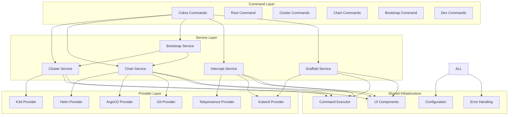
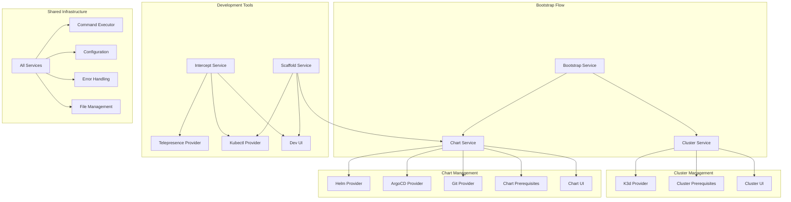
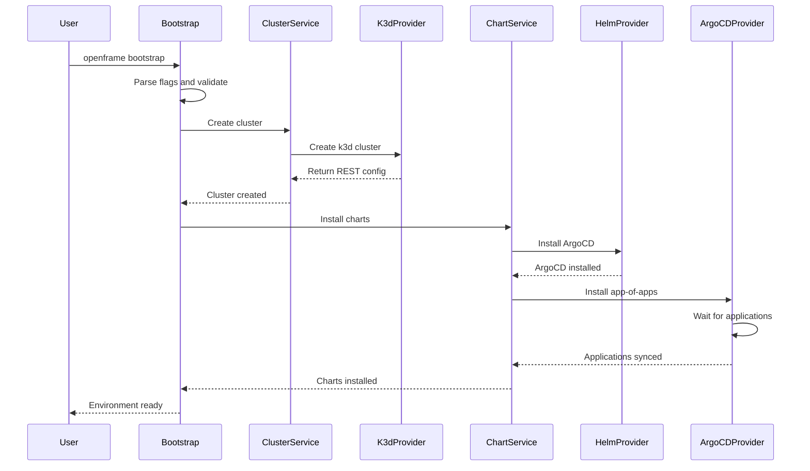
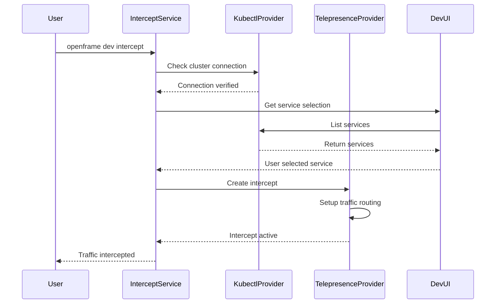

# openframe-cli Module Documentation

# OpenFrame CLI - Architecture Documentation

## Overview

OpenFrame CLI is a modern, interactive command-line tool for managing OpenFrame Kubernetes clusters and development workflows. It provides seamless cluster lifecycle management, chart installation with ArgoCD, and developer-friendly tools for service intercepts and scaffolding using a clean architecture with domain-driven design principles.

## Architecture

The OpenFrame CLI follows a layered hexagonal architecture with clear separation of concerns between commands, business logic, providers, and infrastructure.

### High-Level Architecture Diagram



## Core Components

| Component | Package | Responsibility |
|-----------|---------|----------------|
| **Command Layer** | `cmd/` | Cobra command definitions, flag parsing, CLI interface |
| **Cluster Service** | `internal/cluster/` | Kubernetes cluster lifecycle management |
| **Chart Service** | `internal/chart/` | Helm chart and ArgoCD installation management |
| **Bootstrap Service** | `internal/bootstrap/` | Complete environment setup orchestration |
| **Dev Services** | `internal/dev/` | Development tools (intercept, scaffold) |
| **K3d Provider** | `internal/cluster/providers/k3d/` | k3d cluster operations |
| **Helm Provider** | `internal/chart/providers/helm/` | Helm chart operations |
| **ArgoCD Provider** | `internal/chart/providers/argocd/` | ArgoCD installation and management |
| **Git Provider** | `internal/chart/providers/git/` | Git repository cloning and management |
| **Telepresence Provider** | `internal/dev/providers/telepresence/` | Service intercept operations |
| **Command Executor** | `internal/shared/executor/` | External command execution abstraction |
| **UI Components** | `internal/shared/ui/` | Terminal UI, prompts, and display utilities |
| **Configuration** | `internal/shared/config/` | System configuration and credentials |
| **Error Handling** | `internal/shared/errors/` | Centralized error handling and user-friendly messages |

## Component Relationships

### Service Dependencies Diagram



## Data Flow

### Bootstrap Command Flow



### Intercept Command Flow



## Key Files

| File | Purpose |
|------|---------|
| `main.go` | Entry point, CLI initialization |
| `cmd/root.go` | Root command definition and version info |
| `cmd/cluster/cluster.go` | Cluster command group definition |
| `cmd/chart/install.go` | Chart installation command |
| `cmd/bootstrap/bootstrap.go` | Bootstrap command implementation |
| `cmd/dev/intercept.go` | Service intercept command |
| `internal/cluster/service.go` | Main cluster business logic |
| `internal/chart/services/chart_service.go` | Chart installation orchestration |
| `internal/bootstrap/service.go` | Bootstrap workflow coordination |
| `internal/dev/services/intercept/service.go` | Telepresence intercept management |
| `internal/cluster/providers/k3d/manager.go` | k3d cluster provider implementation |
| `internal/chart/providers/helm/manager.go` | Helm operations provider |
| `internal/chart/providers/argocd/applications.go` | ArgoCD application management |
| `internal/shared/executor/executor.go` | Command execution abstraction |
| `internal/shared/ui/prompts.go` | Interactive user prompts |
| `internal/shared/config/system.go` | System configuration management |

## Dependencies

The OpenFrame CLI leverages several key external dependencies:

### Core CLI Framework
- **Cobra** (`github.com/spf13/cobra`) - Command-line interface framework providing command structure, flag parsing, and help generation
- **PTerm** (`github.com/pterm/pterm`) - Terminal styling and interactive components for spinners, progress bars, and colored output

### Kubernetes Integration
- **Client-go** (`k8s.io/client-go`) - Official Kubernetes Go client for cluster communication and resource management
- **API Extensions** (`k8s.io/apiextensions-apiserver`) - Custom Resource Definition (CRD) management for ArgoCD
- **ArgoCD Client** (`github.com/argoproj/argo-cd/v2`) - Native ArgoCD API client for application management

### User Interface
- **PromptUI** (`github.com/manifoldco/promptui`) - Interactive terminal prompts for user input and selection
- **Go Term** (`golang.org/x/term`) - Terminal detection and raw input handling for cross-platform compatibility

### Configuration & Data
- **YAML** (`gopkg.in/yaml.v3`) - YAML parsing for Helm values and configuration files
- **TestIFy** (`github.com/stretchr/testify`) - Testing framework for unit and integration tests

### Usage Integration
The CLI integrates these dependencies through:
- **Command Executor** - Abstracts external tool execution (kubectl, helm, k3d, telepresence)
- **REST Config** - Provides native Kubernetes API access bypassing kubectl where possible
- **Interactive UI** - Combines PTerm and PromptUI for rich terminal experiences
- **Configuration Management** - Uses YAML parsing for helm-values.yaml and other config files

## CLI Commands

### Cluster Management

```bash
# Create a new cluster with interactive wizard
openframe cluster create

# Create cluster with specific configuration
openframe cluster create my-cluster --nodes 4 --type k3d

# List all managed clusters
openframe cluster list

# Show detailed cluster status
openframe cluster status my-cluster

# Delete a cluster
openframe cluster delete my-cluster

# Clean up cluster resources
openframe cluster cleanup my-cluster
```

### Chart Installation

```bash
# Install ArgoCD and app-of-apps interactively
openframe chart install

# Install with specific deployment mode
openframe chart install --deployment-mode=oss-tenant

# Non-interactive installation for CI/CD
openframe chart install --deployment-mode=saas-shared --non-interactive
```

### Bootstrap Environment

```bash
# Complete environment setup (cluster + charts)
openframe bootstrap

# Bootstrap with custom cluster name
openframe bootstrap my-environment

# Bootstrap with specific deployment mode
openframe bootstrap --deployment-mode=oss-tenant
```

### Development Tools

```bash
# Intercept service traffic to local development
openframe dev intercept my-service --port 8080

# Interactive service selection
openframe dev intercept

# Run Skaffold development workflow
openframe dev skaffold
```

### Global Flags

All commands support these global flags:

- `--verbose, -v` - Enable detailed output and debugging information
- `--dry-run` - Show what would be done without executing
- `--help` - Display command help and usage examples
