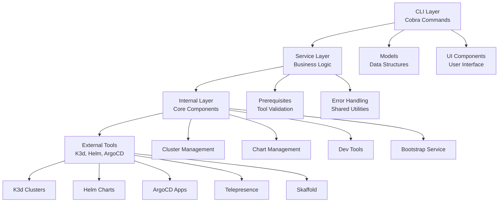
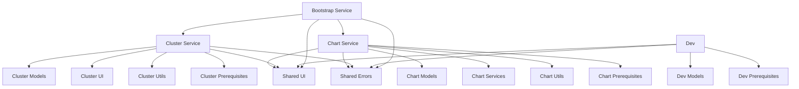
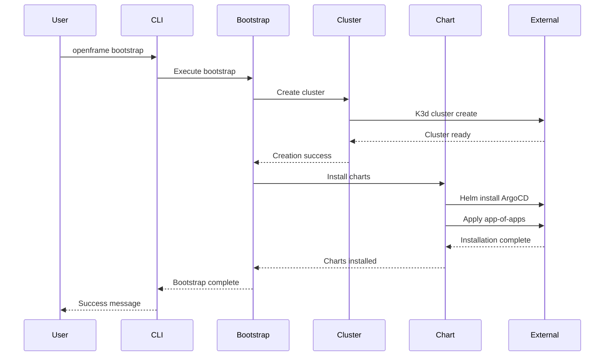
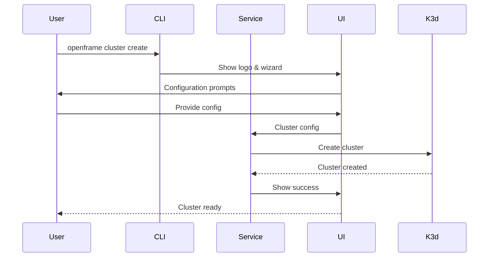

# openframe-cli Module Documentation

# OpenFrame CLI Architecture Documentation

OpenFrame CLI is a modern command-line tool for managing OpenFrame Kubernetes clusters and development workflows. It provides cluster lifecycle management, chart installation with ArgoCD, and development tools for local workflows using Telepresence and Skaffold.

## Architecture

The OpenFrame CLI follows a layered architecture with clear separation between command handling, business logic, and infrastructure concerns. The system is built with modular components that can be independently tested and maintained.

### System Architecture


## Core Components

| Component | Package | Responsibilities |
|-----------|---------|-----------------|
| **Cluster Management** | `internal/cluster` | K3d cluster lifecycle, validation, operations |
| **Chart Management** | `internal/chart` | Helm chart installation, ArgoCD deployment |
| **Development Tools** | `internal/dev` | Telepresence intercepts, Skaffold workflows |
| **Bootstrap Service** | `internal/bootstrap` | End-to-end environment setup orchestration |
| **Shared UI** | `internal/shared/ui` | Common UI components, logo display |
| **Error Handling** | `internal/shared/errors` | Centralized error management |
| **Command Layer** | `cmd/` | Cobra command definitions and flag handling |

## Component Relationships

### Internal Dependencies


## Data Flow

### Bootstrap Workflow


### Cluster Operations Flow


## Key Files

| File | Purpose |
|------|---------|
| `cmd/bootstrap/bootstrap.go` | Bootstrap command entry point with orchestration |
| `cmd/cluster/cluster.go` | Main cluster command with subcommands |
| `cmd/chart/chart.go` | Chart management command structure |
| `cmd/dev/dev.go` | Development tools command group |
| `internal/bootstrap/` | End-to-end environment setup service |
| `internal/cluster/services/` | Core cluster management business logic |
| `internal/chart/services/` | Chart installation and ArgoCD management |
| `internal/shared/ui/` | Reusable UI components and logo display |
| `internal/shared/errors/` | Centralized error handling utilities |

## Dependencies

The OpenFrame CLI integrates with several external tools and libraries:

### External Tool Dependencies
- **K3d**: Lightweight Kubernetes distribution for local development
- **Helm**: Kubernetes package manager for chart installation
- **ArgoCD**: GitOps continuous delivery tool for application management
- **Telepresence**: Local development tool for service intercepts
- **Skaffold**: Development workflow automation for Kubernetes

### Go Library Dependencies
- **Cobra**: Command-line interface framework for CLI structure
- **Survey**: Interactive prompts and user input handling
- **Logrus**: Structured logging throughout the application
- **YAML**: Configuration file parsing and generation

## CLI Commands

### Cluster Management Commands
```bash
openframe cluster create [name]     # Create new K3d cluster
openframe cluster list              # List all clusters  
openframe cluster status [name]     # Show cluster status
openframe cluster delete [name]     # Delete cluster
openframe cluster cleanup [name]    # Clean up resources
```

### Chart Management Commands
```bash
openframe chart install [cluster]   # Install ArgoCD and charts
```

### Development Commands
```bash
openframe dev intercept [service]   # Intercept service traffic
openframe dev scaffold [cluster]    # Run Skaffold workflows
```

### Bootstrap Commands
```bash
openframe bootstrap [cluster]       # Complete environment setup
openframe bootstrap --deployment-mode=oss-tenant  # Skip mode selection
openframe bootstrap --non-interactive --verbose   # CI/CD mode
```

### Global Flags
- `--verbose, -v`: Enable detailed logging
- `--force`: Skip confirmation prompts
- `--dry-run`: Show what would be done without executing
- `--non-interactive`: Skip all interactive prompts
