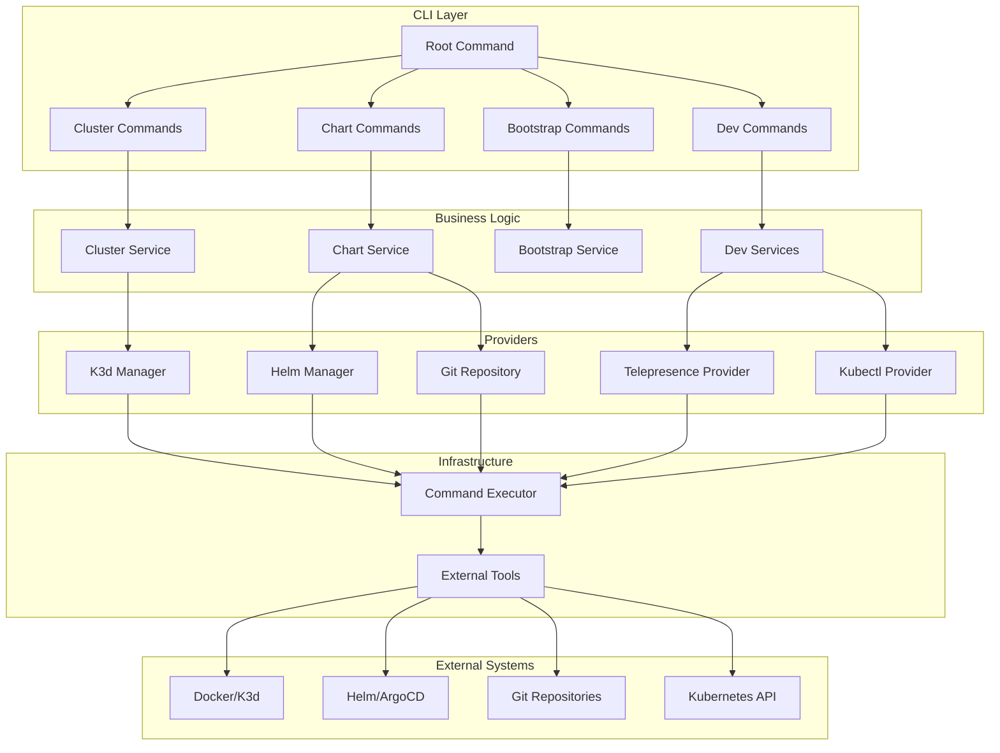
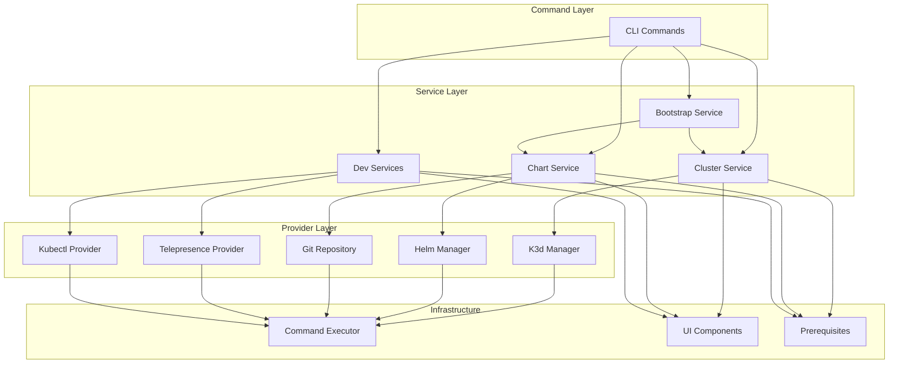
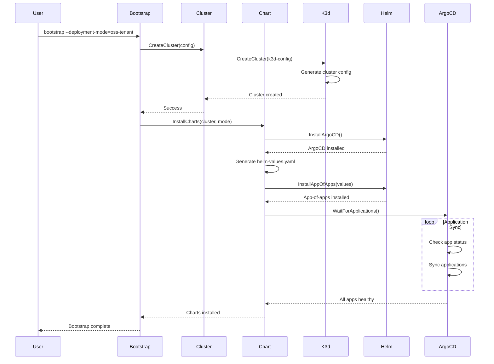

# openframe-cli Module Documentation

# OpenFrame CLI Architecture Documentation

## Overview

OpenFrame CLI is a modern Kubernetes platform bootstrapping tool that replaces shell scripts with an interactive terminal UI for managing OpenFrame Kubernetes deployments. It provides cluster management, Helm chart installation with ArgoCD, and developer workflow tools using Telepresence and Skaffold.

## Architecture

The CLI follows a layered architecture pattern with clear separation between commands, business logic, providers, and infrastructure concerns.

### High-Level Architecture Diagram

## Core Components

| Component | Package | Responsibility |
|-----------|---------|----------------|
| **Command Layer** | `cmd/*` | CLI command definitions, argument parsing, flag management |
| **Cluster Service** | `internal/cluster` | Cluster lifecycle management (create, delete, status, cleanup) |
| **Chart Service** | `internal/chart` | Helm chart installation, ArgoCD management, repository handling |
| **Bootstrap Service** | `internal/bootstrap` | Orchestrates cluster creation + chart installation |
| **Dev Services** | `internal/dev` | Development workflows (Telepresence intercepts, Skaffold) |
| **K3d Manager** | `internal/cluster/providers/k3d` | K3d cluster operations and configuration |
| **Helm Manager** | `internal/chart/providers/helm` | Helm chart lifecycle and ArgoCD installation |
| **Command Executor** | `internal/shared/executor` | Abstraction for external command execution |
| **UI Components** | `internal/shared/ui` | Interactive prompts, tables, progress indicators |
| **Prerequisites** | `internal/*/prerequisites` | Tool validation and auto-installation |

## Component Relationships

### Service Dependencies Diagram

## Data Flow

### Bootstrap Workflow Sequence

## Key Files

| File | Purpose |
|------|---------|
| `main.go` | Application entry point, CLI execution |
| `cmd/root.go` | Root command definition, global flags, version info |
| `internal/cluster/service.go` | Core cluster management business logic |
| `internal/chart/services/chart_service.go` | Chart installation orchestration |
| `internal/bootstrap/service.go` | Bootstrap workflow coordination |
| `internal/cluster/providers/k3d/manager.go` | K3d cluster operations implementation |
| `internal/chart/providers/helm/manager.go` | Helm chart management implementation |
| `internal/shared/executor/executor.go` | Command execution abstraction |
| `internal/shared/ui/logo.go` | CLI branding and visual presentation |
| `internal/cluster/models/cluster.go` | Core domain models and types |

## Dependencies

The project leverages several key external libraries:

- **Cobra**: CLI framework for command structure and argument parsing
- **pterm**: Terminal UI components for interactive prompts and styled output  
- **promptui**: User input prompts and selections
- **Viper**: Configuration management (inherited from Cobra)
- **testify**: Testing assertions and mocking framework
- **golang.org/x/term**: Terminal control for interactive features

The architecture minimizes external dependencies by using interfaces and dependency injection, making the codebase testable and maintainable.

## CLI Commands

| Command | Description | Example |
|---------|-------------|---------|
| `cluster create` | Create a new K3d cluster | `openframe cluster create my-cluster` |
| `cluster list` | List all managed clusters | `openframe cluster list` |
| `cluster status` | Show cluster details and health | `openframe cluster status my-cluster` |
| `cluster delete` | Remove a cluster and resources | `openframe cluster delete my-cluster` |
| `cluster cleanup` | Clean up unused resources | `openframe cluster cleanup my-cluster` |
| `chart install` | Install ArgoCD and app-of-apps | `openframe chart install my-cluster` |
| `bootstrap` | Full environment setup | `openframe bootstrap --deployment-mode=oss-tenant` |
| `dev intercept` | Telepresence traffic interception | `openframe dev intercept my-service --port 8080` |
| `dev skaffold` | Development with live reloading | `openframe dev skaffold my-cluster` |

The CLI supports both interactive wizard-style flows for new users and flag-based operation for automation and power users. All commands include comprehensive help text and validation.
