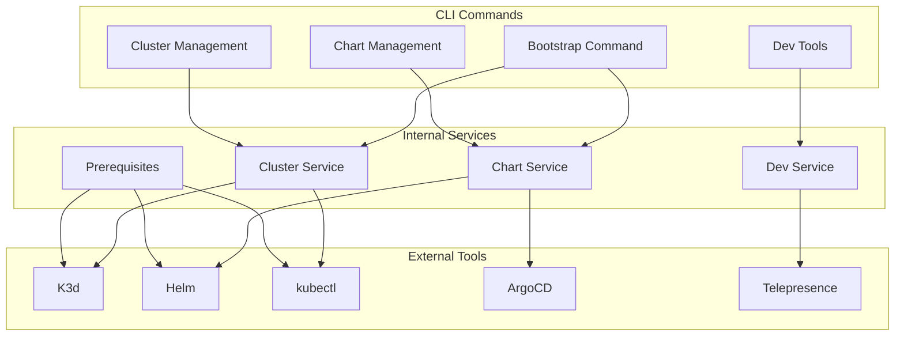
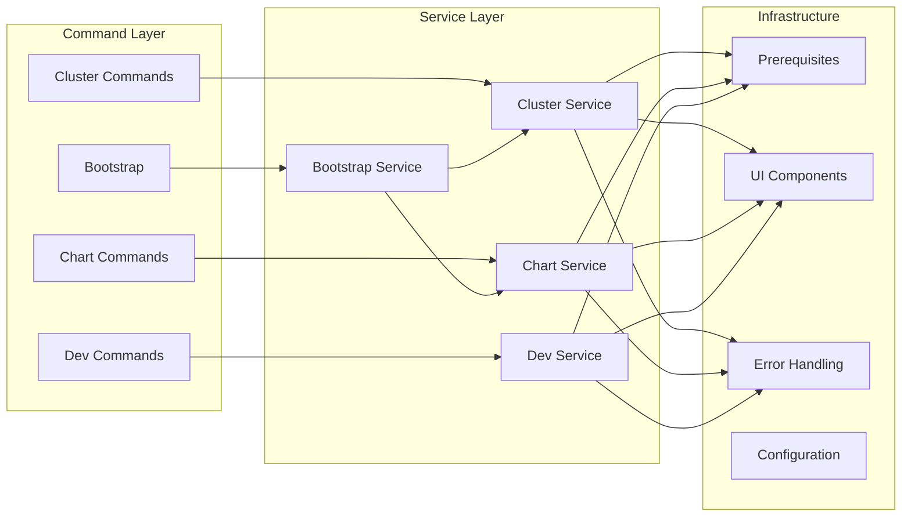
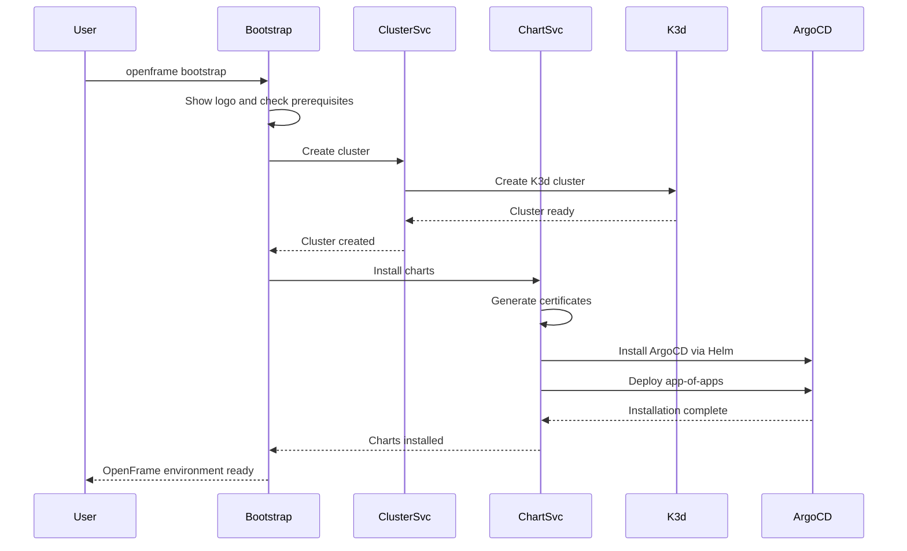

# openframe-cli Module Documentation

# OpenFrame CLI Architecture

OpenFrame CLI is a comprehensive command-line interface for bootstrapping and managing Kubernetes clusters with ArgoCD integration. It provides streamlined workflows for creating local development environments and deploying the complete OpenFrame platform stack.

[](https://www.youtube.com/watch?v=awc-yAnkhIo)

## Architecture Overview

### High-Level System Design



## Core Components

| Component | Package | Responsibility |
|-----------|---------|----------------|
| **Bootstrap** | `cmd/bootstrap` | Orchestrates complete OpenFrame setup (cluster creation + chart installation) |
| **Cluster Management** | `cmd/cluster` | K3d cluster lifecycle (create, delete, list, status, cleanup) |
| **Chart Management** | `cmd/chart` | Helm chart installation and ArgoCD deployment |
| **Dev Tools** | `cmd/dev` | Development workflows with Telepresence and Skaffold |
| **Prerequisites** | `internal/*/prerequisites` | Tool validation and installation checks |
| **UI Components** | `internal/*/ui` | Interactive prompts, configuration wizards, and status displays |
| **Service Layer** | `internal/*/services` | Business logic and external tool orchestration |

### Component Relationships



## Data Flow

### Bootstrap Command Sequence



## Key Files

| File | Purpose |
|------|---------|
| `cmd/bootstrap/bootstrap.go` | Main bootstrap command orchestrating complete setup |
| `cmd/cluster/cluster.go` | Cluster management command group with subcommands |
| `cmd/cluster/create.go` | Interactive cluster creation with configuration wizard |
| `cmd/cluster/delete.go` | Cluster deletion with resource cleanup |
| `cmd/chart/chart.go` | Chart management command group |
| `cmd/chart/install.go` | ArgoCD and app-of-apps installation |
| `cmd/dev/dev.go` | Development tools command group |

## Dependencies

The CLI integrates with several external tools and internal packages:

### External Tool Dependencies
- **K3d**: Lightweight Kubernetes distribution for local clusters
- **Helm**: Kubernetes package manager for chart installations
- **kubectl**: Kubernetes command-line tool for cluster interaction
- **ArgoCD**: GitOps continuous delivery tool
- **Telepresence**: Local development with remote cluster integration

### Internal Package Structure
- **Prerequisites**: Validates and installs required external tools
- **UI Components**: Provides interactive command-line interfaces
- **Service Layer**: Encapsulates business logic and tool orchestration
- **Error Handling**: Centralized error management and user-friendly messages
- **Configuration**: Manages cluster and deployment configurations

## CLI Commands

### Bootstrap Command
```bash
# Interactive bootstrap with defaults
openframe bootstrap

# Bootstrap with custom cluster name
openframe bootstrap my-cluster

# Non-interactive with pre-selected deployment mode
openframe bootstrap --deployment-mode=oss-tenant

# Full CI/CD mode
openframe bootstrap --deployment-mode=saas-shared --non-interactive

# Verbose output with detailed ArgoCD sync progress
openframe bootstrap --verbose
```

### Cluster Management
```bash
# Create cluster with interactive wizard
openframe cluster create

# Create cluster with custom name
openframe cluster create my-cluster

# Quick creation with defaults (skip wizard)
openframe cluster create --skip-wizard

# List all clusters
openframe cluster list

# Show cluster status
openframe cluster status my-cluster

# Delete cluster
openframe cluster delete my-cluster

# Cleanup cluster resources
openframe cluster cleanup my-cluster
```

### Chart Management
```bash
# Install ArgoCD and app-of-apps
openframe chart install

# Install on specific cluster
openframe chart install my-cluster

# Non-interactive installation
openframe chart install --deployment-mode=oss-tenant --non-interactive

# Use development branch
openframe chart install --github-branch develop
```

### Development Tools
```bash
# Intercept service traffic
openframe dev intercept my-service

# Skaffold development workflow
openframe dev skaffold my-cluster
```

### Global Flags
All commands support these global flags:
- `--verbose, -v`: Enable detailed logging
- `--dry-run`: Show what would be done without executing
- `--force`: Skip confirmation prompts
- `--non-interactive`: Use defaults without prompts
