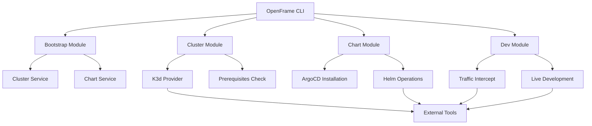
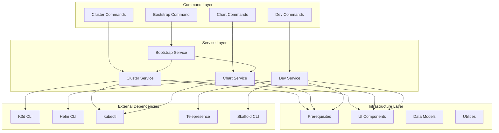
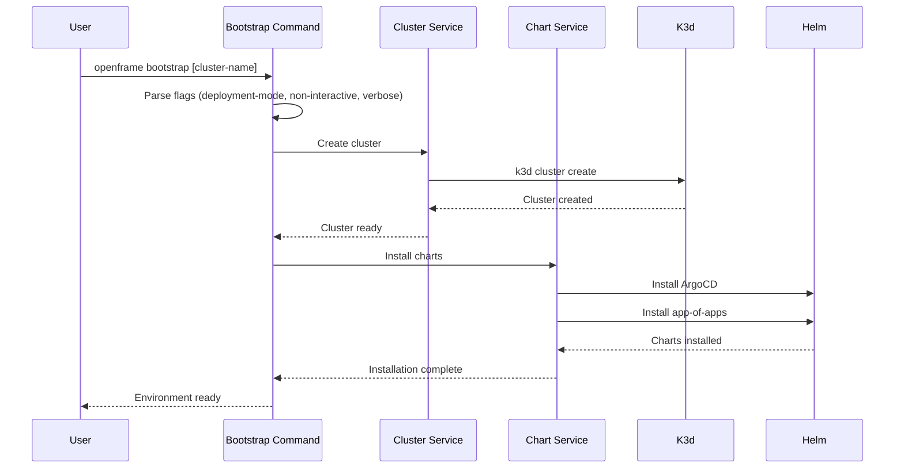
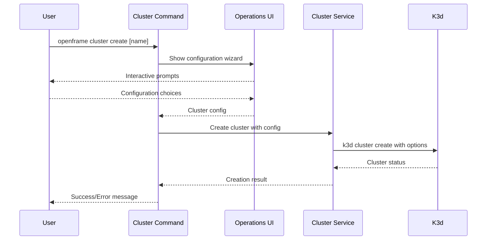

# openframe-cli Module Documentation

# OpenFrame CLI Architecture Documentation

OpenFrame CLI is a comprehensive command-line interface for managing Kubernetes clusters and deploying OpenFrame environments. It provides streamlined workflows for cluster lifecycle management, ArgoCD chart installation, development tools, and complete environment bootstrapping.

## Architecture

The CLI follows a modular architecture with clear separation between command interfaces, business logic, and external integrations. Each major command group (cluster, chart, dev, bootstrap) has its own module with dedicated services, UI components, and configuration models.

### High-Level Architecture

## Core Components

| Component | Package | Responsibility |
|-----------|---------|---------------|
| **Bootstrap** | `cmd/bootstrap` | Orchestrates complete OpenFrame environment setup |
| **Cluster Management** | `cmd/cluster` | Kubernetes cluster lifecycle (create, delete, status, cleanup) |
| **Chart Management** | `cmd/chart` | ArgoCD and OpenFrame chart installation |
| **Development Tools** | `cmd/dev` | Local development workflows with intercept and skaffold |
| **Cluster Services** | `internal/cluster` | Business logic for cluster operations |
| **Chart Services** | `internal/chart` | Helm chart installation and configuration |
| **Prerequisites** | `internal/*/prerequisites` | Dependency validation and installation |
| **UI Components** | `internal/*/ui` | User interface and interactive prompts |
| **Shared Utilities** | `internal/shared` | Common error handling and UI components |

## Component Relationships

## Data Flow

### Bootstrap Command Flow

### Cluster Management Flow

## Key Files

| File | Purpose |
|------|---------|
| `cmd/bootstrap/bootstrap.go` | Entry point for complete environment setup |
| `cmd/cluster/cluster.go` | Main cluster management command structure |
| `cmd/cluster/create.go` | Cluster creation with interactive configuration |
| `cmd/chart/install.go` | ArgoCD and OpenFrame chart installation |
| `cmd/dev/dev.go` | Development tools command structure |
| `internal/cluster/services/` | Core cluster management business logic |
| `internal/chart/services/` | Chart installation and configuration logic |
| `internal/bootstrap/` | Bootstrap orchestration service |
| `internal/shared/ui/` | Reusable UI components and logo display |
| `internal/shared/errors/` | Centralized error handling utilities |

## Dependencies

Based on the modular structure, this project likely depends on:

- **Cobra CLI Framework**: Command structure and flag management
- **Kubernetes Client Libraries**: Cluster interaction and resource management  
- **Helm Libraries**: Chart installation and repository management
- **External CLI Tools**: K3d, kubectl, Telepresence, Skaffold integration
- **Terminal UI Libraries**: Interactive prompts and progress indicators
- **YAML Processing**: Configuration file management
- **Git Libraries**: Repository cloning and branch management for app-of-apps

The architecture emphasizes loose coupling between command interfaces and implementation details, allowing for easy testing and maintenance of individual components.

## CLI Commands

| Command | Description | Examples |
|---------|-------------|----------|
| `openframe bootstrap [cluster-name]` | Complete environment setup (cluster + charts) | Interactive mode, CI/CD mode with flags |
| `openframe cluster create [name]` | Create new Kubernetes cluster | Interactive wizard or direct creation |
| `openframe cluster delete [name]` | Delete cluster and cleanup resources | With confirmation or `--force` |
| `openframe cluster list` | Show all managed clusters | Table format with status |
| `openframe cluster status [name]` | Detailed cluster information | Health, nodes, applications |
| `openframe cluster cleanup [name]` | Remove unused cluster resources | Free disk space, cleanup images |
| `openframe chart install [cluster-name]` | Install ArgoCD and app-of-apps | Deployment mode selection |
| `openframe dev intercept [service-name]` | Traffic interception for development | Telepresence integration |
| `openframe dev skaffold [cluster-name]` | Live development with hot reload | Skaffold workflow automation |

Each command supports both interactive and non-interactive modes, with comprehensive flag options for CI/CD automation and detailed logging with the `--verbose` flag.
