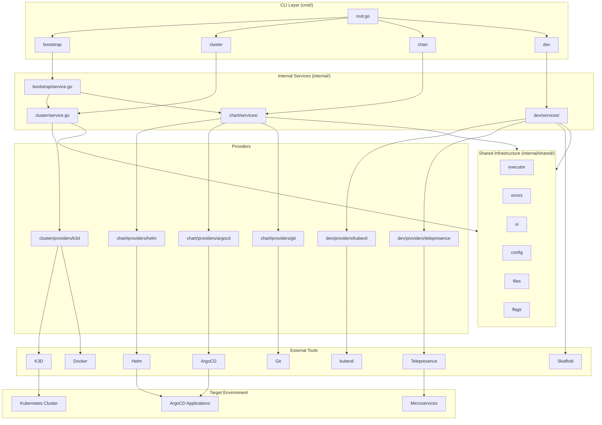
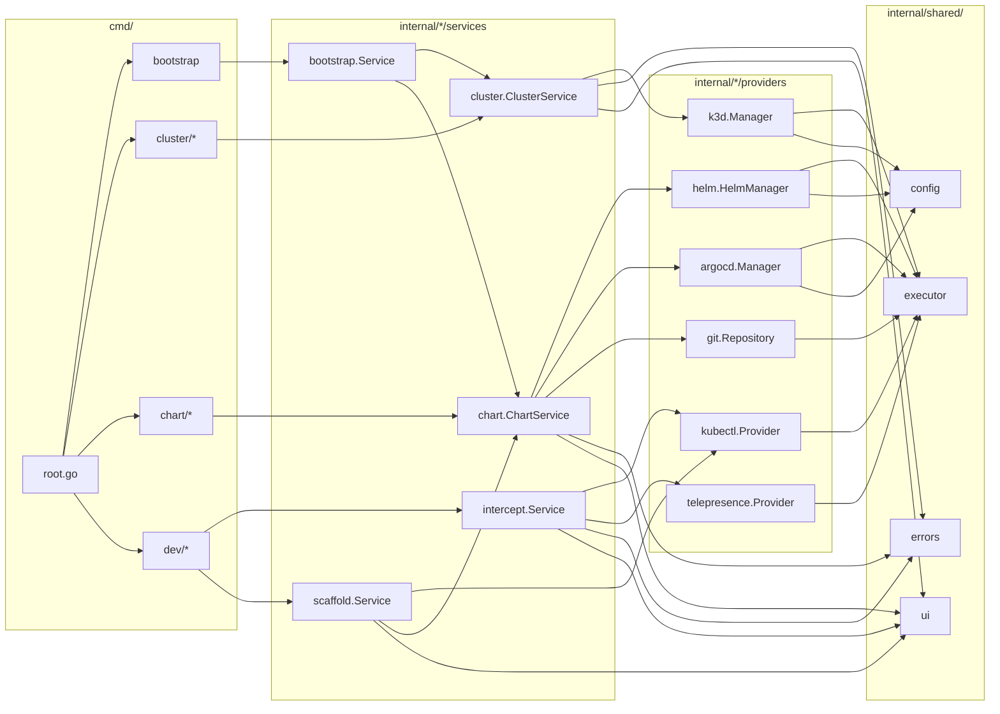
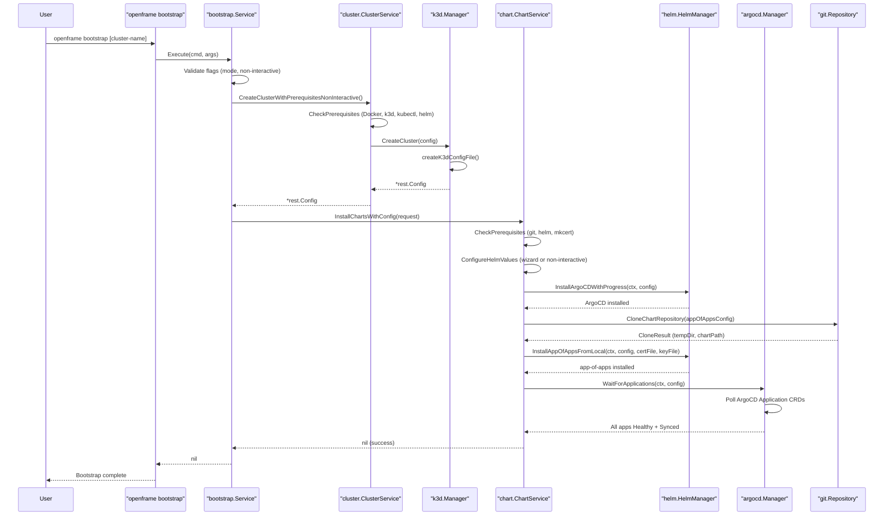
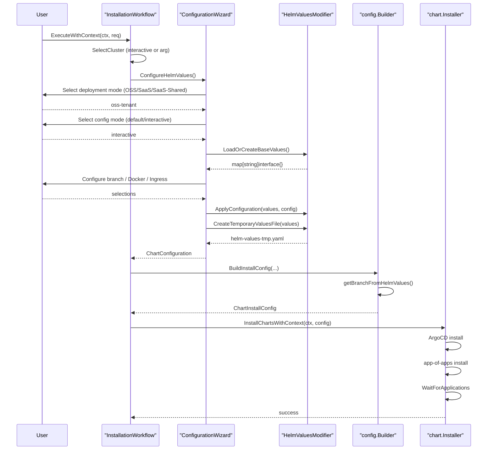

# openframe-cli Module Documentation

# OpenFrame CLI — Architecture Documentation

[](https://www.youtube.com/watch?v=bINdW0CQbvY)

---

## Overview

OpenFrame CLI is a modern, interactive command-line tool written in Go that bootstraps and manages OpenFrame Kubernetes environments. It orchestrates the full lifecycle of local K3D clusters, installs ArgoCD with app-of-apps GitOps patterns, and provides developer-focused tools for service intercepts (via Telepresence) and Skaffold-based hot-reload workflows. The CLI is the primary entry point for both interactive human operators and fully automated CI/CD pipelines.

---

## Architecture

### High-Level Architecture Diagram


```mermaid
graph TB
    subgraph CLI["CLI Layer (cmd/)"]
        Root["root.go"]
        BootstrapCmd["bootstrap"]
        ClusterCmd["cluster"]
        ChartCmd["chart"]
        DevCmd["dev"]
    end

    subgraph Internal["Internal Services (internal/)"]
        BootstrapSvc["bootstrap/service.go"]
        ClusterSvc["cluster/service.go"]
        ChartSvc["chart/services/"]
        DevSvc["dev/services/"]
    end

    subgraph Providers["Providers"]
        K3dProvider["cluster/providers/k3d"]
        HelmProvider["chart/providers/helm"]
        ArgoCDProvider["chart/providers/argocd"]
        GitProvider["chart/providers/git"]
        KubectlProvider["dev/providers/kubectl"]
        TelepresenceProvider["dev/providers/telepresence"]
    end

    subgraph External["External Tools"]
        K3D["K3D"]
        Helm["Helm"]
        ArgoCD["ArgoCD"]
        Git["Git"]
        Telepresence["Telepresence"]
        Skaffold["Skaffold"]
        Docker["Docker"]
        Kubectl["kubectl"]
    end

    subgraph Shared["Shared Infrastructure (internal/shared/)"]
        Executor["executor"]
        Errors["errors"]
        UI["ui"]
        Config["config"]
        Files["files"]
        Flags["flags"]
    end

    subgraph Target["Target Environment"]
        K8s["Kubernetes Cluster"]
        Apps["ArgoCD Applications"]
        Services["Microservices"]
    end

    Root --> BootstrapCmd
    Root --> ClusterCmd
    Root --> ChartCmd
    Root --> DevCmd

    BootstrapCmd --> BootstrapSvc
    ClusterCmd --> ClusterSvc
    ChartCmd --> ChartSvc
    DevCmd --> DevSvc

    BootstrapSvc --> ClusterSvc
    BootstrapSvc --> ChartSvc

    ClusterSvc --> K3dProvider
    ChartSvc --> HelmProvider
    ChartSvc --> ArgoCDProvider
    ChartSvc --> GitProvider
    DevSvc --> KubectlProvider
    DevSvc --> TelepresenceProvider

    K3dProvider --> K3D
    HelmProvider --> Helm
    ArgoCDProvider --> ArgoCD
    GitProvider --> Git
    TelepresenceProvider --> Telepresence
    DevSvc --> Skaffold
    K3dProvider --> Docker
    KubectlProvider --> Kubectl

    K3D --> K8s
    Helm --> Apps
    ArgoCD --> Apps
    Telepresence --> Services

    ClusterSvc --> Shared
    ChartSvc --> Shared
    DevSvc --> Shared
```

---

## Core Components

| Package | Path | Responsibility |
|---|---|---|
| **Root Command** | `cmd/root.go` | Entry point; wires all subcommands, version info, global flags |
| **Bootstrap Command** | `cmd/bootstrap/` | Orchestrates cluster creation + chart installation in one command |
| **Cluster Command** | `cmd/cluster/` | Subcommands: create, delete, list, status, cleanup |
| **Chart Command** | `cmd/chart/` | Subcommands: install (ArgoCD + app-of-apps) |
| **Dev Command** | `cmd/dev/` | Subcommands: intercept, skaffold |
| **Bootstrap Service** | `internal/bootstrap/service.go` | Sequentially calls cluster create then chart install; handles Windows WSL init |
| **Cluster Service** | `internal/cluster/service.go` | Business logic for cluster lifecycle; wraps K3D manager |
| **K3D Manager** | `internal/cluster/providers/k3d/manager.go` | Low-level K3D operations via CLI; produces `rest.Config` |
| **Chart Service** | `internal/chart/services/chart_service.go` | Orchestrates ArgoCD + app-of-apps installation workflow |
| **Helm Manager** | `internal/chart/providers/helm/manager.go` | Helm operations using native Go clients + kubectl fallback |
| **ArgoCD Manager** | `internal/chart/providers/argocd/applications.go` | Watches ArgoCD application health/sync via native K8s clients |
| **Git Repository** | `internal/chart/providers/git/repository.go` | Shallow-clones app-of-apps chart repo to temp dir |
| **Intercept Service** | `internal/dev/services/intercept/service.go` | Manages Telepresence intercept lifecycle |
| **Scaffold Service** | `internal/dev/services/scaffold/service.go` | Runs Skaffold dev workflow with cluster bootstrap |
| **Configuration Wizard** | `internal/chart/ui/configuration/wizard.go` | Interactive Helm values configuration (deployment mode, ingress, Docker, SaaS) |
| **Shared Executor** | `internal/shared/executor/executor.go` | Command execution abstraction (real + mock); handles WSL on Windows |
| **Shared Errors** | `internal/shared/errors/errors.go` | Structured error types, retry policies, user-friendly error display |
| **Shared UI** | `internal/shared/ui/` | Prompts, tables, logo, progress tracking via pterm/promptui |
| **Shared Config** | `internal/shared/config/` | TLS config helpers, credentials prompter, system initialization |
| **Prerequisites (cluster)** | `internal/cluster/prerequisites/` | Checks/installs Docker, kubectl, k3d, helm |
| **Prerequisites (chart)** | `internal/chart/prerequisites/` | Checks/installs git, helm, mkcert, memory |
| **Prerequisites (dev)** | `internal/dev/prerequisites/` | Checks/installs Telepresence, jq, Skaffold |
| **Cluster Models** | `internal/cluster/models/` | `ClusterConfig`, `ClusterInfo`, flag types, domain errors |
| **Chart Models** | `internal/chart/models/` | `AppOfAppsConfig`, `ChartInfo`, chart types |
| **Flag Container** | `internal/cluster/types.go` | Holds all flag structs; dependency injection point for testing |
| **Test Utilities** | `tests/testutil/` | Mock executors, flag factories, assertion helpers |

---

## Component Relationships

### Dependency Graph


```mermaid
graph LR
    subgraph Commands["cmd/"]
        RC["root.go"]
        BC["bootstrap"]
        CC["cluster/*"]
        CHC["chart/*"]
        DC["dev/*"]
    end

    subgraph Services["internal/*/services"]
        BS["bootstrap.Service"]
        CS["cluster.ClusterService"]
        CHS["chart.ChartService"]
        IS["intercept.Service"]
        SS["scaffold.Service"]
    end

    subgraph Providers["internal/*/providers"]
        K3DP["k3d.Manager"]
        HP["helm.HelmManager"]
        AP["argocd.Manager"]
        GP["git.Repository"]
        KP["kubectl.Provider"]
        TP["telepresence.Provider"]
    end

    subgraph SharedInfra["internal/shared/"]
        EX["executor"]
        ERR["errors"]
        UIL["ui"]
        CFG["config"]
    end

    RC --> BC
    RC --> CC
    RC --> CHC
    RC --> DC

    BC --> BS
    CC --> CS
    CHC --> CHS
    DC --> IS
    DC --> SS

    BS --> CS
    BS --> CHS

    CS --> K3DP
    CHS --> HP
    CHS --> AP
    CHS --> GP
    IS --> KP
    IS --> TP
    SS --> KP
    SS --> CHS

    K3DP --> EX
    HP --> EX
    AP --> EX
    GP --> EX
    KP --> EX
    TP --> EX

    CS --> ERR
    CHS --> ERR
    IS --> ERR

    CS --> UIL
    CHS --> UIL
    IS --> UIL
    SS --> UIL

    HP --> CFG
    AP --> CFG
    K3DP --> CFG
```

---

## Data Flow

### Bootstrap Command Sequence


```mermaid
sequenceDiagram
    participant User
    participant CLI as "openframe bootstrap"
    participant Bootstrap as "bootstrap.Service"
    participant ClusterSvc as "cluster.ClusterService"
    participant K3dMgr as "k3d.Manager"
    participant ChartSvc as "chart.ChartService"
    participant HelmMgr as "helm.HelmManager"
    participant ArgoCDMgr as "argocd.Manager"
    participant GitRepo as "git.Repository"

    User->>CLI: openframe bootstrap [cluster-name]
    CLI->>Bootstrap: Execute(cmd, args)
    Bootstrap->>Bootstrap: Validate flags (mode, non-interactive)

    Bootstrap->>ClusterSvc: CreateClusterWithPrerequisitesNonInteractive()
    ClusterSvc->>ClusterSvc: CheckPrerequisites (Docker, k3d, kubectl, helm)
    ClusterSvc->>K3dMgr: CreateCluster(config)
    K3dMgr->>K3dMgr: createK3dConfigFile()
    K3dMgr-->>ClusterSvc: *rest.Config
    ClusterSvc-->>Bootstrap: *rest.Config

    Bootstrap->>ChartSvc: InstallChartsWithConfig(request)
    ChartSvc->>ChartSvc: CheckPrerequisites (git, helm, mkcert)
    ChartSvc->>ChartSvc: ConfigureHelmValues (wizard or non-interactive)

    ChartSvc->>HelmMgr: InstallArgoCDWithProgress(ctx, config)
    HelmMgr-->>ChartSvc: ArgoCD installed

    ChartSvc->>GitRepo: CloneChartRepository(appOfAppsConfig)
    GitRepo-->>ChartSvc: CloneResult (tempDir, chartPath)

    ChartSvc->>HelmMgr: InstallAppOfAppsFromLocal(ctx, config, certFile, keyFile)
    HelmMgr-->>ChartSvc: app-of-apps installed

    ChartSvc->>ArgoCDMgr: WaitForApplications(ctx, config)
    ArgoCDMgr->>ArgoCDMgr: Poll ArgoCD Application CRDs
    ArgoCDMgr-->>ChartSvc: All apps Healthy + Synced

    ChartSvc-->>Bootstrap: nil (success)
    Bootstrap-->>CLI: nil
    CLI-->>User: Bootstrap complete
```

### Chart Install Interactive Configuration Flow


```mermaid
sequenceDiagram
    participant User
    participant Workflow as "InstallationWorkflow"
    participant Wizard as "ConfigurationWizard"
    participant Modifier as "HelmValuesModifier"
    participant Builder as "config.Builder"
    participant Installer as "chart.Installer"

    User->>Workflow: ExecuteWithContext(ctx, req)
    Workflow->>Workflow: SelectCluster (interactive or arg)
    Workflow->>Wizard: ConfigureHelmValues()
    Wizard->>User: Select deployment mode (OSS/SaaS/SaaS-Shared)
    User-->>Wizard: oss-tenant
    Wizard->>User: Select config mode (default/interactive)
    User-->>Wizard: interactive
    Wizard->>Modifier: LoadOrCreateBaseValues()
    Modifier-->>Wizard: map[string]interface{}
    Wizard->>User: Configure branch / Docker / Ingress
    User-->>Wizard: selections
    Wizard->>Modifier: ApplyConfiguration(values, config)
    Wizard->>Modifier: CreateTemporaryValuesFile(values)
    Modifier-->>Wizard: helm-values-tmp.yaml
    Wizard-->>Workflow: ChartConfiguration

    Workflow->>Builder: BuildInstallConfig(...)
    Builder->>Builder: getBranchFromHelmValues()
    Builder-->>Workflow: ChartInstallConfig

    Workflow->>Installer: InstallChartsWithContext(ctx, config)
    Installer->>Installer: ArgoCD install
    Installer->>Installer: app-of-apps install
    Installer->>Installer: WaitForApplications
    Installer-->>Workflow: success
```

---

## Key Files

| File | Purpose |
|---|---|
| `main.go` | Binary entry point; delegates to `cmd.Execute()` |
| `cmd/root.go` | Builds root Cobra command; registers all subcommands and global flags |
| `cmd/bootstrap/bootstrap.go` | `openframe bootstrap` — flags, args, delegates to service |
| `cmd/cluster/create.go` | `openframe cluster create` — wizard or skip-wizard mode |
| `cmd/chart/install.go` | `openframe chart install` — flag extraction, delegates to `InstallChartsWithConfig` |
| `cmd/dev/intercept.go` | `openframe dev intercept` — interactive cluster/service selection then Telepresence |
| `cmd/dev/scaffold.go` | `openframe dev skaffold` — Skaffold dev workflow with optional bootstrap |
| `internal/bootstrap/service.go` | Core bootstrap orchestration (cluster → charts); Windows WSL handling |
| `internal/cluster/service.go` | `ClusterService`: create, delete, list, status, cleanup business logic |
| `internal/cluster/providers/k3d/manager.go` | K3D cluster operations; returns `*rest.Config`; platform-specific paths |
| `internal/cluster/models/cluster.go` | `ClusterConfig`, `ClusterInfo`, `ClusterType` domain types |
| `internal/cluster/models/flags.go` | All flag structs; `ValidateClusterName`; flag registration helpers |
| `internal/cluster/utils/cmd_helpers.go` | Global flag container, service factory, command wrapper, test injection |
| `internal/chart/services/chart_service.go` | `ChartService`: workflow orchestration, cluster selection, deferred Helm init |
| `internal/chart/services/installer.go` | `Installer`: ArgoCD then app-of-apps then wait for sync |
| `internal/chart/services/appofapps.go` | `AppOfApps`: git clone → local Helm install |
| `internal/chart/services/argocd.go` | `ArgoCD`: Helm install + `WaitForApplications` delegation |
| `internal/chart/providers/argocd/applications.go` | Native K8s client-based ArgoCD app health monitoring |
| `internal/chart/providers/argocd/wait.go` | Application readiness polling with spinner, signal handling, repo-server recovery |
| `internal/chart/providers/helm/manager.go` | Helm CLI execution with native Go K8s clients for verification |
| `internal/chart/providers/git/repository.go` | Shallow git clone to temp dir with cleanup |
| `internal/chart/ui/configuration/wizard.go` | Helm values configuration wizard (deployment mode → sections) |
| `internal/chart/ui/configuration/modes.go` | Interactive deployment mode and configuration mode selection |
| `internal/chart/utils/config/builder.go` | `ChartInstallConfig` construction; reads branch from helm-values.yaml |
| `internal/chart/utils/config/paths.go` | Path resolution for certs, manifests, helm values |
| `internal/chart/utils/types/interfaces.go` | All service interfaces + `InstallationRequest` type |
| `internal/dev/services/intercept/service.go` | Telepresence intercept lifecycle management |
| `internal/dev/services/scaffold/service.go` | Skaffold dev workflow: discover config → bootstrap → run skaffold dev |
| `internal/dev/providers/kubectl/provider.go` | kubectl-based namespace/service discovery |
| `internal/dev/ui/intercept.go` | Interactive service/port/namespace selection for intercepts |
| `internal/shared/executor/executor.go` | `CommandExecutor` interface, real implementation, WSL helpers |
| `internal/shared/executor/mock.go` | `MockCommandExecutor` for unit tests |
| `internal/shared/errors/errors.go` | Structured error types; `ErrorHandler` with user-friendly display |
| `internal/shared/errors/retry_policy.go` | Exponential/linear backoff retry policies |
| `internal/shared/config/transport.go` | `ApplyInsecureTLSConfig` for k3d local cluster TLS bypass |
| `internal/shared/ui/logo.go` | OpenFrame ASCII logo rendering; terminal detection |
| `internal/shared/ui/prompts.go` | `SelectFromList`, `ConfirmAction`, `GetInput` interactive prompts |
| `internal/shared/ui/messages/templates.go` | Standardized message templates with pterm |
| `tests/testutil/setup.go` | `CreateStandardTestFlags` with mock executor; `CreateIntegrationTestFlags` |
| `tests/integration/common/cli_runner.go` | Builds CLI binary and executes it for integration testing |

---

## Dependencies

The project uses the following key library dependencies and how they are consumed:

| Library | Usage in OpenFrame CLI |
|---|---|
| **[spf13/cobra](https://github.com/spf13/cobra)** | All CLI command structure, flag parsing, subcommand routing, `SilenceErrors`/`SilenceUsage` |
| **[pterm/pterm](https://github.com/pterm/pterm)** | Spinners, progress bars, tables, boxes, colored output, interactive confirms throughout all UI layers |
| **[manifoldco/promptui](https://github.com/manifoldco/promptui)** | `Select` menus and `Prompt` text inputs in wizards and cluster UI |
| **[k8s.io/client-go](https://pkg.go.dev/k8s.io/client-go)** | Native Kubernetes API access: `rest.Config`, `kubernetes.Interface`, kubeconfig loading via `clientcmd` |
| **[k8s.io/apiextensions-apiserver](https://pkg.go.dev/k8s.io/apiextensions-apiserver)** | CRD existence checks (waits for ArgoCD CRDs before polling applications) |
| **[argoproj/argo-cd/v2](https://pkg.go.dev/github.com/argoproj/argo-cd/v2)** | Native ArgoCD client (`argocdclientset`) for application health/sync monitoring |
| **[k8s.io/apimachinery](https://pkg.go.dev/k8s.io/apimachinery)** | Unstructured resources, `schema.GroupVersionResource`, `metav1` types |
| **[k8s.io/client-go/dynamic](https://pkg.go.dev/k8s.io/client-go/dynamic)** | Dynamic Kubernetes resource operations for Helm release verification |
| **[sigs.k8s.io/yaml](https://pkg.go.dev/sigs.k8s.io/yaml)** | YAML marshaling/unmarshaling for Helm values files and K8s resources |
| **[gopkg.in/yaml.v3](https://pkg.go.dev/gopkg.in/yaml.v3)** | YAML parsing for `helm-values.yaml` reading and writing |
| **[golang.org/x/term](https://pkg.go.dev/golang.org/x/term)** | Raw terminal mode for single-keypress confirmations |
| **[stretchr/testify](https://github.com/stretchr/testify)** | `assert` and `require` in unit and integration tests |

### How Dependencies Are Used


```mermaid
graph TD
    CLI["OpenFrame CLI"] --> cobra["cobra\n(command routing)"]
    CLI --> pterm["pterm\n(all terminal UI)"]
    CLI --> promptui["promptui\n(select menus, text input)"]

    ChartSvc["Chart Services"] --> clientgo["client-go\n(K8s API)"]
    ChartSvc --> argocdclient["argo-cd client\n(application watch)"]
    ChartSvc --> apiext["apiextensions\n(CRD checks)"]
    ChartSvc --> dynamic["dynamic client\n(resource ops)"]
    ChartSvc --> yamlsigs["sigs.k8s.io/yaml\n(K8s YAML)"]
    ChartSvc --> yamlv3["gopkg.in/yaml.v3\n(helm values)"]

    ClusterSvc["Cluster Service"] --> clientgo
    ClusterSvc --> clientcmd["clientcmd\n(kubeconfig)"]

    SharedUI["shared/ui"] --> pterm
    SharedUI["shared/ui"] --> promptui
    SharedUI["shared/ui"] --> term["golang.org/x/term\n(raw terminal)"]

    Tests["Tests"] --> testify["testify\n(assertions)"]
```

---

## CLI Commands

### Command Reference

| Command | Flags | Description |
|---|---|---|
| `openframe bootstrap [name]` | `--deployment-mode`, `--non-interactive`, `--verbose/-v` | Full environment setup: cluster create + chart install |
| `openframe cluster create [name]` | `--type`, `--nodes/-n`, `--version`, `--skip-wizard`, `--dry-run` | Create a K3D cluster (interactive wizard or skip-wizard) |
| `openframe cluster delete [name]` | `--force/-f` | Delete a cluster with confirmation |
| `openframe cluster list` | `--quiet/-q`, `--verbose/-v` | List all managed clusters |
| `openframe cluster status [name]` | `--detailed/-d`, `--no-apps` | Show cluster health, nodes, and ArgoCD apps |
| `openframe cluster cleanup [name]` | `--force/-f` | Remove unused Docker images and resources |
| `openframe chart install [name]` | `--deployment-mode`, `--non-interactive`, `--github-branch`, `--github-repo`, `--cert-dir`, `--force`, `--dry-run`, `--verbose` | Install ArgoCD + app-of-apps with optional wizard |
| `openframe dev intercept [service]` | `--port`, `--namespace`, `--mount`, `--env-file`, `--global`, `--header`, `--replace`, `--remote-port` | Telepresence service intercept (interactive or flag-based) |
| `openframe dev skaffold [cluster]` | `--port`, `--namespace`, `--image`, `--sync-local`, `--sync-remote`, `--skip-bootstrap`, `--helm-values` | Skaffold dev workflow with optional cluster bootstrap |

### Deployment Modes

| Mode Flag | Repository | Use Case |
|---|---|---|
| `oss-tenant` | `openframe-oss-tenant` | Default self-hosted OpenFrame deployment |
| `saas-tenant` | `openframe-saas-tenant` | SaaS managed tenant deployment |
| `saas-shared` | `openframe-saas-shared` | Shared SaaS infrastructure deployment |

### Quick Start Examples

```bash
# Interactive full bootstrap
openframe bootstrap

# Non-interactive CI/CD bootstrap
openframe bootstrap my-cluster --deployment-mode=oss-tenant --non-interactive

# Create cluster then install charts separately
openframe cluster create my-cluster --nodes 4 --skip-wizard
openframe chart install my-cluster --deployment-mode=oss-tenant

# Local development intercept
openframe dev intercept my-service --port 8080 --namespace production

# Skaffold dev workflow
openframe dev skaffold my-dev-cluster
```

---

## Community & Support

> **Support happens in Slack, not GitHub Issues.**

- **OpenMSP Slack**: [Join the community](https://join.slack.com/t/openmsp/shared_invite/zt-36bl7mx0h-3~U2nFH6nqHqoTPXMaHEHA)
- **Website**: [https://flamingo.run](https://flamingo.run)
- **OpenFrame Platform**: [https://openframe.ai](https://openframe.ai)
