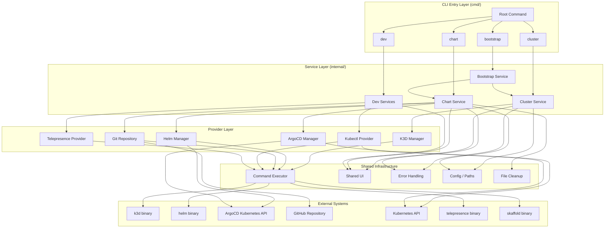
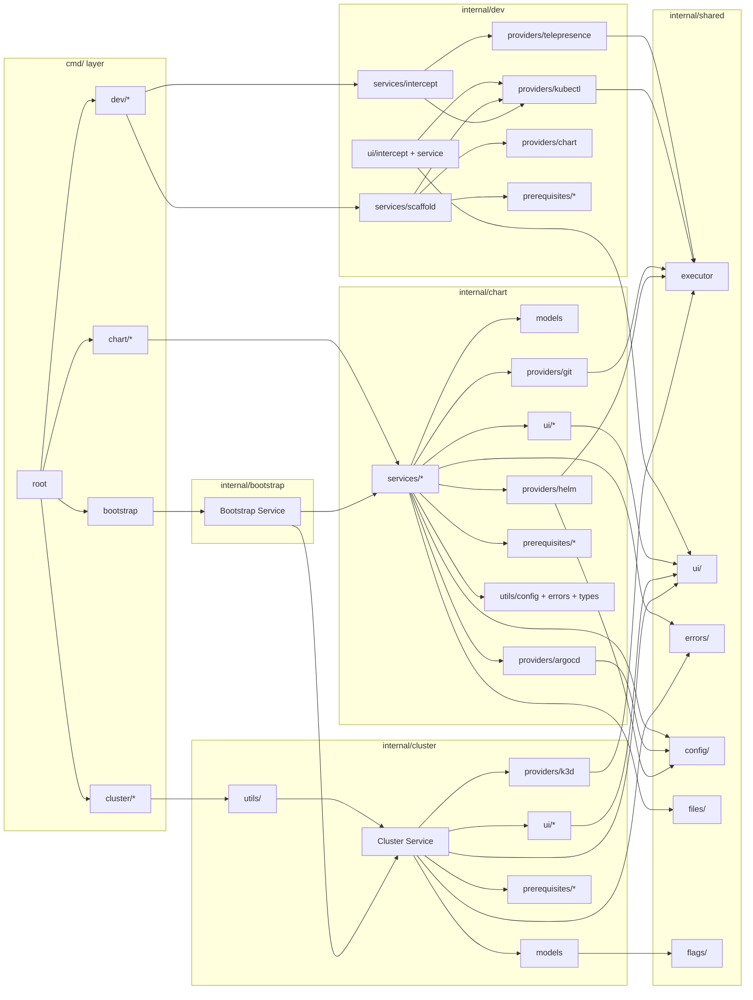
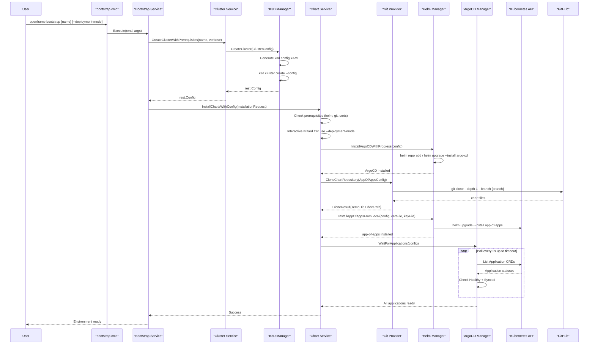
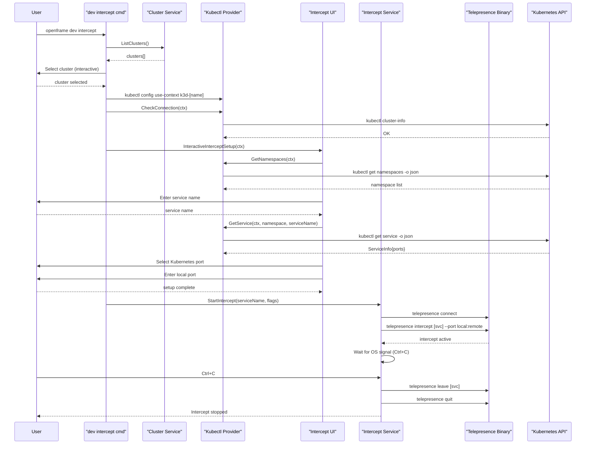

# openframe-cli Module Documentation

# OpenFrame CLI Architecture Documentation

[](https://www.youtube.com/watch?v=bINdW0CQbvY)

## Overview

OpenFrame CLI is a modern, interactive command-line tool built in Go for bootstrapping and managing OpenFrame Kubernetes environments. It provides a unified interface for full environment lifecycle management — from creating K3D clusters and installing ArgoCD via Helm, to enabling local development workflows through Telepresence service intercepts and Skaffold-based hot reloading. The CLI is the primary developer-facing entry point to the broader [OpenFrame](https://openframe.ai) AI-powered MSP platform.

---

## Architecture

OpenFrame CLI follows a layered clean architecture pattern: thin Cobra command handlers delegate to service layers, which compose providers and infrastructure utilities. All external I/O (Kubernetes API, shell commands, Git) is abstracted behind interfaces to support testability.

### High-Level Architecture Diagram


```mermaid
graph TD
    subgraph CLI["CLI Entry Layer (cmd/)"]
        Root["Root Command"]
        Bootstrap["bootstrap"]
        Cluster["cluster"]
        Chart["chart"]
        Dev["dev"]
    end

    subgraph Services["Service Layer (internal/)"]
        BootstrapSvc["Bootstrap Service"]
        ClusterSvc["Cluster Service"]
        ChartSvc["Chart Service"]
        DevSvc["Dev Services"]
    end

    subgraph Providers["Provider Layer"]
        K3D["K3D Manager"]
        HelmMgr["Helm Manager"]
        ArgoCDMgr["ArgoCD Manager"]
        GitRepo["Git Repository"]
        KubectlProv["Kubectl Provider"]
        TelepresenceProv["Telepresence Provider"]
    end

    subgraph Infra["Shared Infrastructure"]
        Executor["Command Executor"]
        UIShared["Shared UI"]
        ErrorsShared["Error Handling"]
        ConfigShared["Config / Paths"]
        FilesShared["File Cleanup"]
    end

    subgraph External["External Systems"]
        K3dBin["k3d binary"]
        HelmBin["helm binary"]
        ArgoCDAPI["ArgoCD Kubernetes API"]
        GitHubRepo["GitHub Repository"]
        K8sAPI["Kubernetes API"]
        TelepresenceBin["telepresence binary"]
        SkaffoldBin["skaffold binary"]
    end

    Root --> Bootstrap
    Root --> Cluster
    Root --> Chart
    Root --> Dev

    Bootstrap --> BootstrapSvc
    Cluster --> ClusterSvc
    Chart --> ChartSvc
    Dev --> DevSvc

    BootstrapSvc --> ClusterSvc
    BootstrapSvc --> ChartSvc

    ClusterSvc --> K3D
    ChartSvc --> HelmMgr
    ChartSvc --> ArgoCDMgr
    ChartSvc --> GitRepo
    DevSvc --> KubectlProv
    DevSvc --> TelepresenceProv

    K3D --> Executor
    HelmMgr --> Executor
    ArgoCDMgr --> K8sAPI
    GitRepo --> Executor
    KubectlProv --> Executor
    TelepresenceProv --> Executor

    Executor --> K3dBin
    Executor --> HelmBin
    Executor --> TelepresenceBin
    Executor --> SkaffoldBin
    HelmMgr --> ArgoCDAPI
    ArgoCDMgr --> ArgoCDAPI
    GitRepo --> GitHubRepo
    KubectlProv --> K8sAPI

    ClusterSvc --> UIShared
    ChartSvc --> UIShared
    DevSvc --> UIShared
    ClusterSvc --> ErrorsShared
    ChartSvc --> ErrorsShared
    ClusterSvc --> ConfigShared
    ChartSvc --> ConfigShared
    ChartSvc --> FilesShared
```

---

## Core Components

| Package | Path | Responsibility |
|---------|------|----------------|
| **Root Command** | `cmd/root.go` | CLI entrypoint, global flags (`--verbose`, `--silent`), version info, subcommand registration |
| **Bootstrap Command** | `cmd/bootstrap/` | Orchestrates full environment setup: cluster create → chart install in sequence |
| **Cluster Command** | `cmd/cluster/` | Cobra subcommands for create, delete, list, status, cleanup |
| **Chart Command** | `cmd/chart/` | Cobra subcommands for ArgoCD + app-of-apps installation |
| **Dev Command** | `cmd/dev/` | Cobra subcommands for `intercept` (Telepresence) and `skaffold` workflows |
| **Bootstrap Service** | `internal/bootstrap/` | Business logic to sequence cluster creation then chart installation; handles Windows WSL init |
| **Cluster Service** | `internal/cluster/service.go` | High-level cluster lifecycle: create, delete, list, status, cleanup; delegates to K3D manager |
| **K3D Manager** | `internal/cluster/providers/k3d/` | Low-level K3D cluster operations; config file generation, kubeconfig management, TLS SAN injection |
| **Chart Service** | `internal/chart/services/` | Installation workflow: prerequisites → git clone → helm install ArgoCD → install app-of-apps → wait for sync |
| **Helm Manager** | `internal/chart/providers/helm/` | Helm CLI wrapper; installs ArgoCD and app-of-apps charts via subprocess; native K8s client fallback |
| **ArgoCD Manager** | `internal/chart/providers/argocd/` | Watches ArgoCD `Application` CRDs via native Go client; waits for Healthy+Synced state |
| **Git Repository** | `internal/chart/providers/git/` | Clones GitHub repos (`--depth 1`) to temp dirs for app-of-apps chart content |
| **Configuration Wizard** | `internal/chart/ui/configuration/` | Multi-step interactive wizard for deployment mode, SaaS credentials, ingress, Docker registry |
| **Helm Values Modifier** | `internal/chart/ui/templates/` | Reads, modifies, and writes `helm-values.yaml`; creates `helm-values-tmp.yaml` |
| **Intercept Service** | `internal/dev/services/intercept/` | Manages full Telepresence lifecycle: connect → intercept → wait → cleanup on signal |
| **Scaffold Service** | `internal/dev/services/scaffold/` | Discovers `skaffold.yaml` files, bootstraps cluster, runs `skaffold dev` |
| **Kubectl Provider** | `internal/dev/providers/kubectl/` | kubectl wrapper for namespace/service discovery used by interactive intercept UI |
| **Telepresence Provider** | `internal/dev/providers/telepresence/` | Manages telepresence connect/intercept/quit lifecycle |
| **Command Executor** | `internal/shared/executor/` | Abstracts `os/exec` for all CLI tool invocations; supports dry-run and verbose modes; WSL detection |
| **Prerequisites Checkers** | `internal/cluster/prerequisites/`, `internal/chart/prerequisites/` | Checks/installs Docker, k3d, kubectl, helm, git, mkcert; CI-aware non-interactive mode |
| **Shared UI** | `internal/shared/ui/` | Logo rendering, selection prompts, table rendering, confirmation dialogs; `pterm` + `promptui` |
| **Shared Errors** | `internal/shared/errors/` | `BranchNotFoundError`, `ValidationError`, `AlreadyHandledError`, retry policies, error formatting |
| **Shared Config** | `internal/shared/config/` | TLS bypass utilities for k3d, credentials prompter, system service (log directory init) |
| **File Cleanup** | `internal/shared/files/` | Backup/restore `helm-values-tmp.yaml`; cleanup-on-success semantics |
| **Models** | `internal/cluster/models/`, `internal/chart/models/` | Domain types: `ClusterConfig`, `ClusterInfo`, `AppOfAppsConfig`, `ChartInstallConfig` |

---

## Component Relationships

### Dependency Graph


```mermaid
graph LR
    subgraph Commands["cmd/ layer"]
        CmdRoot["root"]
        CmdBoot["bootstrap"]
        CmdCluster["cluster/*"]
        CmdChart["chart/*"]
        CmdDev["dev/*"]
    end

    subgraph InternalBootstrap["internal/bootstrap"]
        SvcBoot["Bootstrap Service"]
    end

    subgraph InternalCluster["internal/cluster"]
        SvcCluster["Cluster Service"]
        ModCluster["models"]
        ProvK3D["providers/k3d"]
        UICluster["ui/*"]
        PrereqCluster["prerequisites/*"]
        UtilsCluster["utils/"]
    end

    subgraph InternalChart["internal/chart"]
        SvcChart["services/*"]
        ModChart["models"]
        ProvHelm["providers/helm"]
        ProvArgoCD["providers/argocd"]
        ProvGit["providers/git"]
        UIChart["ui/*"]
        PrereqChart["prerequisites/*"]
        UtilsChart["utils/config + errors + types"]
    end

    subgraph InternalDev["internal/dev"]
        SvcIntercept["services/intercept"]
        SvcScaffold["services/scaffold"]
        ProvKubectl["providers/kubectl"]
        ProvTelepresence["providers/telepresence"]
        ProvDevChart["providers/chart"]
        UIDevIntercept["ui/intercept + service"]
        PrereqDev["prerequisites/*"]
    end

    subgraph Shared["internal/shared"]
        SharedExec["executor"]
        SharedUI["ui/"]
        SharedErrors["errors/"]
        SharedConfig["config/"]
        SharedFiles["files/"]
        SharedFlags["flags/"]
    end

    CmdRoot --> CmdBoot
    CmdRoot --> CmdCluster
    CmdRoot --> CmdChart
    CmdRoot --> CmdDev

    CmdBoot --> SvcBoot
    SvcBoot --> SvcCluster
    SvcBoot --> SvcChart

    CmdCluster --> UtilsCluster
    UtilsCluster --> SvcCluster
    SvcCluster --> ProvK3D
    SvcCluster --> UICluster
    SvcCluster --> ModCluster
    SvcCluster --> PrereqCluster

    CmdChart --> SvcChart
    SvcChart --> ProvHelm
    SvcChart --> ProvArgoCD
    SvcChart --> ProvGit
    SvcChart --> UIChart
    SvcChart --> UtilsChart
    SvcChart --> ModChart
    SvcChart --> PrereqChart

    CmdDev --> SvcIntercept
    CmdDev --> SvcScaffold
    SvcIntercept --> ProvTelepresence
    SvcIntercept --> ProvKubectl
    SvcScaffold --> ProvDevChart
    SvcScaffold --> ProvKubectl
    SvcScaffold --> PrereqDev
    UIDevIntercept --> ProvKubectl

    ProvK3D --> SharedExec
    ProvHelm --> SharedExec
    ProvHelm --> SharedConfig
    ProvArgoCD --> SharedConfig
    ProvGit --> SharedExec
    ProvKubectl --> SharedExec
    ProvTelepresence --> SharedExec

    SvcCluster --> SharedUI
    SvcCluster --> SharedErrors
    SvcChart --> SharedErrors
    SvcChart --> SharedFiles
    SvcChart --> SharedConfig
    UICluster --> SharedUI
    UIChart --> SharedUI
    UIDevIntercept --> SharedUI

    ModCluster --> SharedFlags
```

---

## Data Flow

### Bootstrap Command: Full Environment Setup


```mermaid
sequenceDiagram
    participant User
    participant BootstrapCmd as "bootstrap cmd"
    participant BootstrapSvc as "Bootstrap Service"
    participant ClusterSvc as "Cluster Service"
    participant K3DMgr as "K3D Manager"
    participant ChartSvc as "Chart Service"
    participant GitProv as "Git Provider"
    participant HelmMgr as "Helm Manager"
    participant ArgoCDMgr as "ArgoCD Manager"
    participant K8sAPI as "Kubernetes API"
    participant GitHub as "GitHub"

    User->>BootstrapCmd: openframe bootstrap [name] [--deployment-mode]
    BootstrapCmd->>BootstrapSvc: Execute(cmd, args)
    BootstrapSvc->>ClusterSvc: CreateClusterWithPrerequisites(name, verbose)
    ClusterSvc->>K3DMgr: CreateCluster(ClusterConfig)
    K3DMgr->>K3DMgr: Generate k3d config YAML
    K3DMgr->>K3DMgr: k3d cluster create --config ...
    K3DMgr-->>ClusterSvc: rest.Config
    ClusterSvc-->>BootstrapSvc: rest.Config

    BootstrapSvc->>ChartSvc: InstallChartsWithConfig(InstallationRequest)
    ChartSvc->>ChartSvc: Check prerequisites (helm, git, certs)
    ChartSvc->>ChartSvc: Interactive wizard OR use --deployment-mode

    ChartSvc->>HelmMgr: InstallArgoCDWithProgress(config)
    HelmMgr->>HelmMgr: helm repo add / helm upgrade --install argo-cd
    HelmMgr-->>ChartSvc: ArgoCD installed

    ChartSvc->>GitProv: CloneChartRepository(AppOfAppsConfig)
    GitProv->>GitHub: git clone --depth 1 --branch [branch]
    GitHub-->>GitProv: chart files
    GitProv-->>ChartSvc: CloneResult{TempDir, ChartPath}

    ChartSvc->>HelmMgr: InstallAppOfAppsFromLocal(config, certFile, keyFile)
    HelmMgr->>K8sAPI: helm upgrade --install app-of-apps
    HelmMgr-->>ChartSvc: app-of-apps installed

    ChartSvc->>ArgoCDMgr: WaitForApplications(config)
    loop Poll every 2s up to timeout
        ArgoCDMgr->>K8sAPI: List Application CRDs
        K8sAPI-->>ArgoCDMgr: Application statuses
        ArgoCDMgr->>ArgoCDMgr: Check Healthy + Synced
    end
    ArgoCDMgr-->>ChartSvc: All applications ready
    ChartSvc-->>BootstrapSvc: Success
    BootstrapSvc-->>User: Environment ready
```

### Interactive Intercept: Dev Workflow


```mermaid
sequenceDiagram
    participant User
    participant DevCmd as "dev intercept cmd"
    participant ClusterSvc as "Cluster Service"
    participant KubectlProv as "Kubectl Provider"
    participant InterceptUI as "Intercept UI"
    participant InterceptSvc as "Intercept Service"
    participant Telepresence as "Telepresence Binary"
    participant K8sAPI as "Kubernetes API"

    User->>DevCmd: openframe dev intercept
    DevCmd->>ClusterSvc: ListClusters()
    ClusterSvc-->>DevCmd: clusters[]
    DevCmd->>User: Select cluster (interactive)
    User-->>DevCmd: cluster selected

    DevCmd->>KubectlProv: kubectl config use-context k3d-[name]
    DevCmd->>KubectlProv: CheckConnection(ctx)
    KubectlProv->>K8sAPI: kubectl cluster-info
    K8sAPI-->>KubectlProv: OK

    DevCmd->>InterceptUI: InteractiveInterceptSetup(ctx)
    InterceptUI->>KubectlProv: GetNamespaces(ctx)
    KubectlProv->>K8sAPI: kubectl get namespaces -o json
    K8sAPI-->>KubectlProv: namespace list
    InterceptUI->>User: Enter service name
    User-->>InterceptUI: service name

    InterceptUI->>KubectlProv: GetService(ctx, namespace, serviceName)
    KubectlProv->>K8sAPI: kubectl get service -o json
    K8sAPI-->>KubectlProv: ServiceInfo{ports}
    InterceptUI->>User: Select Kubernetes port
    InterceptUI->>User: Enter local port
    User-->>InterceptUI: setup complete

    DevCmd->>InterceptSvc: StartIntercept(serviceName, flags)
    InterceptSvc->>Telepresence: telepresence connect
    InterceptSvc->>Telepresence: telepresence intercept [svc] --port local:remote
    Telepresence-->>InterceptSvc: intercept active

    InterceptSvc->>InterceptSvc: Wait for OS signal (Ctrl+C)
    User->>InterceptSvc: Ctrl+C
    InterceptSvc->>Telepresence: telepresence leave [svc]
    InterceptSvc->>Telepresence: telepresence quit
    InterceptSvc-->>User: Intercept stopped
```

---

## Key Files

| File | Purpose |
|------|---------|
| `main.go` | Binary entrypoint; delegates to `cmd.Execute()` |
| `cmd/root.go` | Root Cobra command, global flags, version template, subcommand registration |
| `cmd/bootstrap/bootstrap.go` | Bootstrap command definition with `--deployment-mode` and `--non-interactive` flags |
| `cmd/cluster/cluster.go` | Cluster command group with prerequisite check in `PersistentPreRunE` |
| `cmd/cluster/create.go` | Cluster create with wizard/non-wizard branching |
| `cmd/chart/install.go` | Chart install command with full flag extraction and validation |
| `cmd/dev/intercept.go` | Dev intercept command; routes to interactive or flag-based intercept modes |
| `internal/bootstrap/service.go` | Core bootstrap orchestration: cluster create → chart install sequencing |
| `internal/cluster/service.go` | `ClusterService`: wraps K3D manager with UI feedback, spinner, next-steps display |
| `internal/cluster/providers/k3d/manager.go` | K3D cluster CRUD via `k3d` binary; generates config YAML, handles WSL path conversion |
| `internal/chart/services/chart_service.go` | `ChartService` factory and `Install()` entrypoint; wires all chart sub-services |
| `internal/chart/services/installer.go` | `Installer`: orchestrates ArgoCD install → app-of-apps install → wait for sync |
| `internal/chart/providers/helm/manager.go` | `HelmManager`: helm subprocess wrapper with native K8s Go client fallback |
| `internal/chart/providers/argocd/applications.go` | `Manager`: native ArgoCD client using generated clientset; polls Application status |
| `internal/chart/providers/argocd/wait.go` | Long-poll loop with stabilization checks, signal handling, repo-server health recovery |
| `internal/chart/providers/argocd/argocd_values.go` | Embedded ArgoCD Helm values (resource limits, health checks, sync timeouts) |
| `internal/chart/providers/git/repository.go` | `Repository.CloneChartRepository()`: `git clone --depth 1` to temp dir |
| `internal/chart/ui/configuration/wizard.go` | Top-level configuration wizard routing interactive vs. default modes |
| `internal/chart/ui/configuration/modes.go` | Deployment mode selection and per-mode configuration dispatching |
| `internal/chart/ui/templates/helm_modifier.go` | `HelmValuesModifier`: YAML load/apply/write for `helm-values.yaml` |
| `internal/dev/services/intercept/service.go` | `Service.StartIntercept()`: validates, connects Telepresence, creates intercept, blocks |
| `internal/dev/services/scaffold/service.go` | `Service.RunScaffoldWorkflow()`: discovers skaffold.yaml, bootstraps, runs `skaffold dev` |
| `internal/dev/providers/kubectl/services.go` | JSON-based kubectl service discovery across namespaces |
| `internal/shared/executor/executor.go` | `RealCommandExecutor`: subprocess runner; WSL detection and wake-up utilities |
| `internal/shared/executor/mock.go` | `MockCommandExecutor`: test double with pattern-matched responses |
| `internal/shared/config/transport.go` | `ApplyInsecureTLSConfig()`: disables TLS verification for local k3d clusters |
| `internal/shared/errors/errors.go` | Typed errors: `ValidationError`, `BranchNotFoundError`, `AlreadyHandledError` |
| `internal/shared/ui/logo.go` | OpenFrame ASCII logo with terminal detection and `TestMode` suppression |
| `internal/shared/ui/prompts.go` | `SelectFromList`, `ConfirmAction`, `GetInput` — all interactive UI primitives |
| `internal/cluster/utils/cmd_helpers.go` | `WrapCommandWithCommonSetup()`, `GetCommandService()`, global flag container management |
| `internal/cluster/models/flags.go` | All flag structs + `ValidateClusterName()`, `ValidateCreateFlags()` etc. |

---

## Dependencies

OpenFrame CLI uses the following key libraries:

| Library | Usage |
|---------|-------|
| `github.com/spf13/cobra` | CLI framework — all commands, flags, `PersistentPreRunE`, usage templates |
| `github.com/pterm/pterm` | Rich terminal UI — spinners, tables, boxes, progress indicators, colored output |
| `github.com/manifoldco/promptui` | Interactive selection menus and text prompts (select, confirm, text input) |
| `k8s.io/client-go` | Native Kubernetes API client — used by ArgoCD manager and Helm manager to interact with cluster |
| `github.com/argoproj/argo-cd/v2` | ArgoCD generated client — used to list and poll `Application` CRDs via the versioned clientset |
| `k8s.io/apiextensions-apiserver` | CRD client — used to verify ArgoCD CRDs are installed before polling applications |
| `k8s.io/apimachinery` | Kubernetes type system — `metav1`, `unstructured`, `schema`, `wait` utilities |
| `sigs.k8s.io/controller-runtime` | Used indirectly via ArgoCD client dependencies |
| `gopkg.in/yaml.v3` | YAML parsing and writing for `helm-values.yaml` and cluster config files |
| `golang.org/x/term` | Raw terminal mode for single-keystroke confirmation prompts |

The native Go Kubernetes clients (`k8s.io/client-go`, ArgoCD clientset) are the most strategically important dependencies — they allow the CLI to watch ArgoCD Application health status directly via the API server instead of shelling out to `kubectl`, providing reliable multi-platform behavior especially on Windows/WSL2 where subprocess path resolution is fragile.

---

## CLI Commands

### Top-Level Commands

| Command | Alias | Description |
|---------|-------|-------------|
| `openframe bootstrap` | — | One-command full environment setup (cluster + charts) |
| `openframe cluster` | `k` | Manage Kubernetes clusters |
| `openframe chart` | `c` | Manage Helm charts and ArgoCD |
| `openframe dev` | `d` | Development workflow tools |

### `openframe bootstrap`

```bash
# Interactive mode (prompts for cluster name and deployment mode)
openframe bootstrap

# Bootstrap with custom cluster name
openframe bootstrap my-cluster

# Skip deployment mode selection (OSS tenant)
openframe bootstrap --deployment-mode=oss-tenant

# Fully non-interactive for CI/CD
openframe bootstrap --deployment-mode=saas-shared --non-interactive

# Verbose output showing ArgoCD sync progress
openframe bootstrap -v --deployment-mode=oss-tenant
```

**Flags:**

| Flag | Description |
|------|-------------|
| `--deployment-mode` | `oss-tenant`, `saas-tenant`, or `saas-shared` (skips interactive selection) |
| `--non-interactive` | Skip all prompts; requires `--deployment-mode` |
| `-v, --verbose` | Show detailed logging including ArgoCD sync progress |

---

### `openframe cluster`

```bash
openframe cluster create                        # Interactive wizard
openframe cluster create my-cluster            # Custom name, interactive
openframe cluster create --skip-wizard          # Defaults only, no wizard
openframe cluster create --nodes 3 --type k3d --skip-wizard

openframe cluster delete my-cluster            # Delete with confirmation
openframe cluster delete my-cluster --force    # Skip confirmation

openframe cluster list                          # List all clusters
openframe cluster list --quiet                 # Names only

openframe cluster status my-cluster            # Cluster health overview
openframe cluster status my-cluster --detailed # Include resource usage
openframe cluster status --no-apps             # Skip ArgoCD app status

openframe cluster cleanup my-cluster           # Free disk space
openframe cluster cleanup my-cluster --force   # Aggressive cleanup
```

---

### `openframe chart`

```bash
openframe chart install                                    # Interactive mode
openframe chart install my-cluster                        # Target specific cluster
openframe chart install --deployment-mode=oss-tenant     # Pre-select mode
openframe chart install --deployment-mode=saas-shared --non-interactive
openframe chart install --github-branch develop          # Use develop branch
```

**Flags:**

| Flag | Description |
|------|-------------|
| `--deployment-mode` | `oss-tenant`, `saas-tenant`, `saas-shared` |
| `--non-interactive` | Skip interactive prompts |
| `--github-repo` | Override GitHub repository URL |
| `--github-branch` | Override Git branch (default: reads from `helm-values.yaml`) |
| `--cert-dir` | Override certificate directory path |
| `--force` | Force reinstall even if already installed |
| `--dry-run` | Validate configuration without executing |
| `-v, --verbose` | Detailed output including ArgoCD sync logs |

---

### `openframe dev`

```bash
# Intercept: route cluster service traffic to local port
openframe dev intercept                              # Interactive: select cluster, service, port
openframe dev intercept my-service --port 8080
openframe dev intercept my-service --port 8080 --namespace my-ns
openframe dev intercept my-service --global          # All traffic, not just header-matched
openframe dev intercept my-service --replace         # Replace existing intercept

# Skaffold: live reload development workflow
openframe dev skaffold                               # Interactive: discover skaffold.yaml
openframe dev skaffold my-dev-cluster               # Target specific cluster
openframe dev skaffold --skip-bootstrap              # Skip chart reinstall step
openframe dev skaffold --helm-values ./my-values.yaml
```

---

### Global Flags (all commands)

| Flag | Description |
|------|-------------|
| `-v, --verbose` | Enable verbose output |
| `--silent` | Suppress all output except errors |
| `--version` | Show version, commit, and build date |
