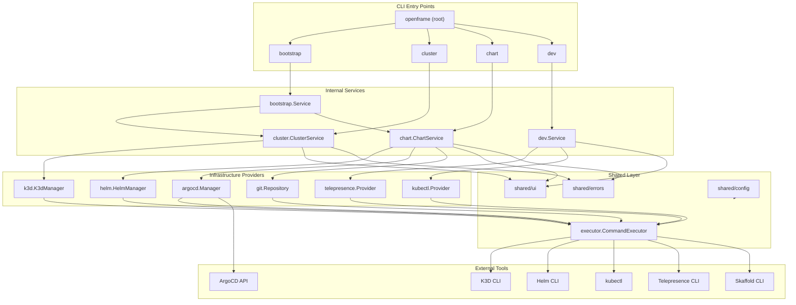
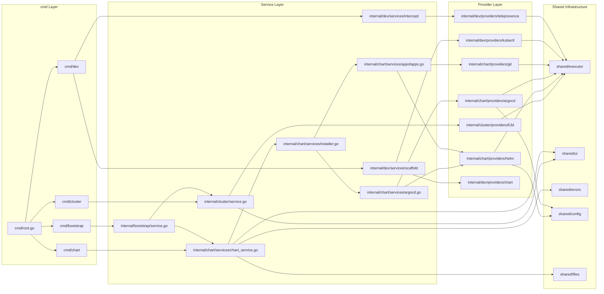
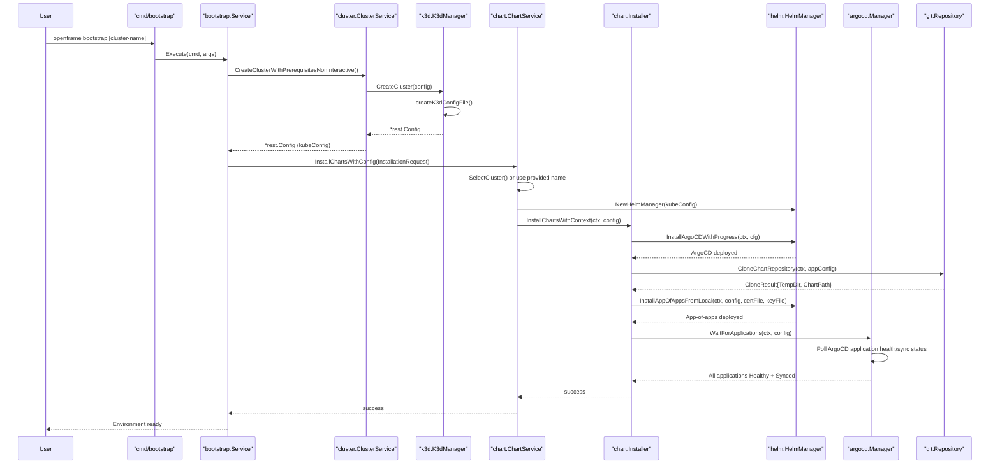
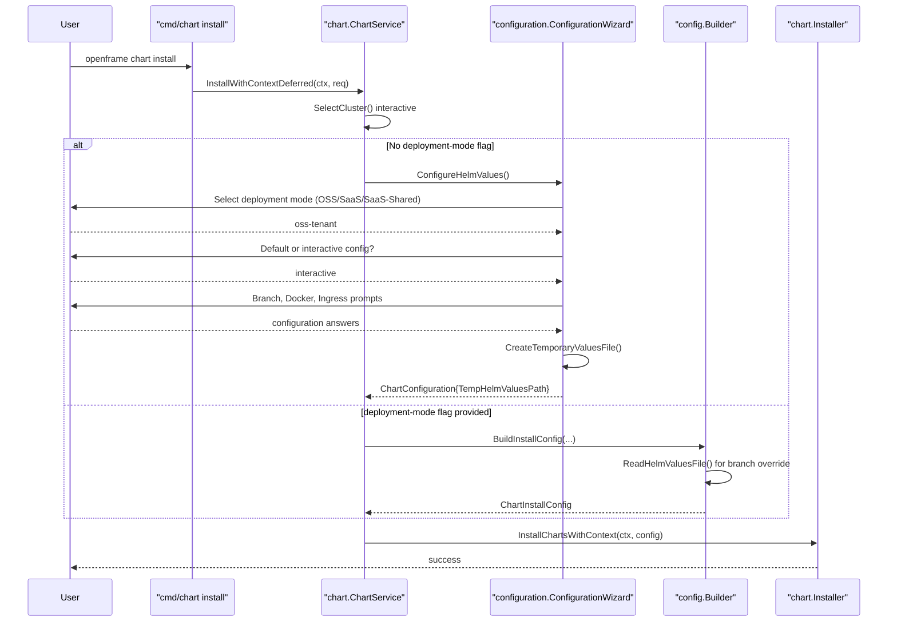
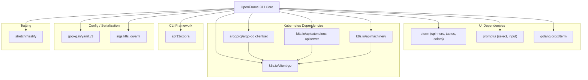

# openframe-cli Module Documentation

# OpenFrame CLI Architecture Documentation

[](https://www.youtube.com/watch?v=bINdW0CQbvY)

## Overview

OpenFrame CLI is a modern, interactive command-line tool for bootstrapping and managing OpenFrame Kubernetes environments. It orchestrates the complete lifecycle of K3D clusters, ArgoCD GitOps deployments, and developer workflows (service intercepts via Telepresence, live reloading via Skaffold) through a unified interface. As part of the [OpenFrame](https://openframe.ai) ecosystem built by [Flamingo](https://flamingo.run), it replaces shell script workflows with a structured Go CLI that supports both interactive wizard modes and fully non-interactive CI/CD automation.

---

## Architecture

### High-Level Architecture Diagram


```mermaid
graph TB
    subgraph CLI["CLI Entry Points"]
        Root["openframe (root)"]
        Bootstrap["bootstrap"]
        Cluster["cluster"]
        Chart["chart"]
        Dev["dev"]
    end

    subgraph Internal["Internal Services"]
        BootstrapSvc["bootstrap.Service"]
        ClusterSvc["cluster.ClusterService"]
        ChartSvc["chart.ChartService"]
        DevSvc["dev.Service"]
    end

    subgraph Providers["Infrastructure Providers"]
        K3dMgr["k3d.K3dManager"]
        HelmMgr["helm.HelmManager"]
        ArgoCDMgr["argocd.Manager"]
        GitRepo["git.Repository"]
        TelepresenceProv["telepresence.Provider"]
        KubectlProv["kubectl.Provider"]
    end

    subgraph External["External Tools"]
        K3D["K3D CLI"]
        HelmCLI["Helm CLI"]
        ArgoCD["ArgoCD API"]
        KubectlCLI["kubectl"]
        TelepresenceCLI["Telepresence CLI"]
        SkaffoldCLI["Skaffold CLI"]
    end

    subgraph SharedLayer["Shared Layer"]
        Executor["executor.CommandExecutor"]
        SharedUI["shared/ui"]
        SharedErrors["shared/errors"]
        SharedConfig["shared/config"]
    end

    Root --> Bootstrap
    Root --> Cluster
    Root --> Chart
    Root --> Dev

    Bootstrap --> BootstrapSvc
    Cluster --> ClusterSvc
    Chart --> ChartSvc
    Dev --> DevSvc

    BootstrapSvc --> ClusterSvc
    BootstrapSvc --> ChartSvc

    ClusterSvc --> K3dMgr
    ChartSvc --> HelmMgr
    ChartSvc --> ArgoCDMgr
    ChartSvc --> GitRepo
    DevSvc --> TelepresenceProv
    DevSvc --> KubectlProv

    K3dMgr --> Executor
    HelmMgr --> Executor
    ArgoCDMgr --> Executor
    GitRepo --> Executor
    TelepresenceProv --> Executor
    KubectlProv --> Executor

    Executor --> K3D
    Executor --> HelmCLI
    ArgoCDMgr --> ArgoCD
    Executor --> KubectlCLI
    Executor --> TelepresenceCLI
    Executor --> SkaffoldCLI

    ClusterSvc --> SharedUI
    ChartSvc --> SharedUI
    DevSvc --> SharedUI
    ClusterSvc --> SharedErrors
    ChartSvc --> SharedErrors
    SharedConfig --> SharedLayer
```

---

## Core Components

| Package | Path | Responsibility |
|---|---|---|
| `cmd` | `cmd/` | Cobra command definitions, flag parsing, entry points for all subcommands |
| `bootstrap` | `internal/bootstrap/` | Orchestrates sequential cluster creation + chart installation |
| `cluster` | `internal/cluster/` | Cluster lifecycle: create, delete, list, status, cleanup via K3D |
| `chart/services` | `internal/chart/services/` | ArgoCD + app-of-apps installation workflow orchestration |
| `chart/providers/argocd` | `internal/chart/providers/argocd/` | Native Kubernetes API calls to ArgoCD, application wait/sync logic |
| `chart/providers/helm` | `internal/chart/providers/helm/` | Helm CLI wrapper, chart install/upgrade operations |
| `chart/providers/git` | `internal/chart/providers/git/` | Git clone of app-of-apps repositories to temp directories |
| `chart/ui/configuration` | `internal/chart/ui/configuration/` | Interactive wizard for deployment mode, SaaS, ingress, Docker, GHCR config |
| `cluster/providers/k3d` | `internal/cluster/providers/k3d/` | K3D cluster CRUD, kubeconfig management, WSL2 support |
| `cluster/prerequisites` | `internal/cluster/prerequisites/` | Checks & installs Docker, kubectl, k3d, helm prerequisites |
| `chart/prerequisites` | `internal/chart/prerequisites/` | Checks & installs Git, Helm, mkcert certificates, memory requirements |
| `dev/services/intercept` | `internal/dev/services/intercept/` | Telepresence intercept lifecycle management |
| `dev/services/scaffold` | `internal/dev/services/scaffold/` | Skaffold workflow: cluster bootstrap + live reload |
| `dev/providers/kubectl` | `internal/dev/providers/kubectl/` | kubectl namespace/service queries for interactive intercept setup |
| `shared/executor` | `internal/shared/executor/` | Unified command execution abstraction (real + mock), WSL2 helpers |
| `shared/ui` | `internal/shared/ui/` | Logo, prompts, tables, progress tracking, message templates |
| `shared/errors` | `internal/shared/errors/` | Typed errors, retry policies, user-facing error formatting |
| `shared/config` | `internal/shared/config/` | TLS config helpers, system initialization, credentials prompting |
| `cluster/models` | `internal/cluster/models/` | Domain types: `ClusterConfig`, `ClusterInfo`, flag structs, error types |
| `chart/utils/types` | `internal/chart/utils/types/` | Interfaces (`ArgoCDService`, `HelmProvider`, etc.), `InstallationRequest` |

---

## Component Relationships

### Dependency Flowchart


```mermaid
graph LR
    subgraph Commands["cmd Layer"]
        CmdRoot["cmd/root.go"]
        CmdBootstrap["cmd/bootstrap"]
        CmdCluster["cmd/cluster"]
        CmdChart["cmd/chart"]
        CmdDev["cmd/dev"]
    end

    subgraph Services["Service Layer"]
        SvcBootstrap["internal/bootstrap/service.go"]
        SvcCluster["internal/cluster/service.go"]
        SvcChart["internal/chart/services/chart_service.go"]
        SvcInstaller["internal/chart/services/installer.go"]
        SvcArgoCD["internal/chart/services/argocd.go"]
        SvcAppOfApps["internal/chart/services/appofapps.go"]
        SvcIntercept["internal/dev/services/intercept"]
        SvcScaffold["internal/dev/services/scaffold"]
    end

    subgraph Providers["Provider Layer"]
        ProvK3d["internal/cluster/providers/k3d"]
        ProvHelm["internal/chart/providers/helm"]
        ProvArgoCD["internal/chart/providers/argocd"]
        ProvGit["internal/chart/providers/git"]
        ProvKubectl["internal/dev/providers/kubectl"]
        ProvTelepresence["internal/dev/providers/telepresence"]
        ProvChartDev["internal/dev/providers/chart"]
    end

    subgraph Shared["Shared Infrastructure"]
        Executor["shared/executor"]
        UI["shared/ui"]
        Errors["shared/errors"]
        Config["shared/config"]
        Files["shared/files"]
    end

    CmdRoot --> CmdBootstrap
    CmdRoot --> CmdCluster
    CmdRoot --> CmdChart
    CmdRoot --> CmdDev

    CmdBootstrap --> SvcBootstrap
    CmdCluster --> SvcCluster
    CmdChart --> SvcChart
    CmdDev --> SvcIntercept
    CmdDev --> SvcScaffold

    SvcBootstrap --> SvcCluster
    SvcBootstrap --> SvcChart

    SvcChart --> SvcInstaller
    SvcInstaller --> SvcArgoCD
    SvcInstaller --> SvcAppOfApps

    SvcCluster --> ProvK3d
    SvcArgoCD --> ProvHelm
    SvcArgoCD --> ProvArgoCD
    SvcAppOfApps --> ProvHelm
    SvcAppOfApps --> ProvGit
    SvcIntercept --> ProvTelepresence
    SvcScaffold --> ProvChartDev
    SvcScaffold --> ProvKubectl

    ProvK3d --> Executor
    ProvHelm --> Executor
    ProvArgoCD --> Executor
    ProvGit --> Executor
    ProvKubectl --> Executor
    ProvTelepresence --> Executor

    SvcCluster --> UI
    SvcChart --> UI
    SvcChart --> Errors
    SvcChart --> Files
    ProvHelm --> Config
    ProvArgoCD --> Config
```

---

## Data Flow

### Bootstrap Sequence (Full Environment Setup)


```mermaid
sequenceDiagram
    participant User
    participant CLI as "cmd/bootstrap"
    participant BSvc as "bootstrap.Service"
    participant CSvc as "cluster.ClusterService"
    participant K3dMgr as "k3d.K3dManager"
    participant ChartSvc as "chart.ChartService"
    participant Installer as "chart.Installer"
    participant HelmMgr as "helm.HelmManager"
    participant ArgoCDMgr as "argocd.Manager"
    participant GitRepo as "git.Repository"

    User->>CLI: openframe bootstrap [cluster-name]
    CLI->>BSvc: Execute(cmd, args)
    BSvc->>CSvc: CreateClusterWithPrerequisitesNonInteractive()
    CSvc->>K3dMgr: CreateCluster(config)
    K3dMgr->>K3dMgr: createK3dConfigFile()
    K3dMgr-->>CSvc: *rest.Config
    CSvc-->>BSvc: *rest.Config (kubeConfig)

    BSvc->>ChartSvc: InstallChartsWithConfig(InstallationRequest)
    ChartSvc->>ChartSvc: SelectCluster() or use provided name
    ChartSvc->>HelmMgr: NewHelmManager(kubeConfig)
    ChartSvc->>Installer: InstallChartsWithContext(ctx, config)

    Installer->>HelmMgr: InstallArgoCDWithProgress(ctx, cfg)
    HelmMgr-->>Installer: ArgoCD deployed

    Installer->>GitRepo: CloneChartRepository(ctx, appConfig)
    GitRepo-->>Installer: CloneResult{TempDir, ChartPath}

    Installer->>HelmMgr: InstallAppOfAppsFromLocal(ctx, config, certFile, keyFile)
    HelmMgr-->>Installer: App-of-apps deployed

    Installer->>ArgoCDMgr: WaitForApplications(ctx, config)
    ArgoCDMgr->>ArgoCDMgr: Poll ArgoCD application health/sync status
    ArgoCDMgr-->>Installer: All applications Healthy + Synced

    Installer-->>ChartSvc: success
    ChartSvc-->>BSvc: success
    BSvc-->>User: Environment ready
```

### Interactive Chart Install with Configuration Wizard


```mermaid
sequenceDiagram
    participant User
    participant CLI as "cmd/chart install"
    participant ChartSvc as "chart.ChartService"
    participant Wizard as "configuration.ConfigurationWizard"
    participant Builder as "config.Builder"
    participant Installer as "chart.Installer"

    User->>CLI: openframe chart install
    CLI->>ChartSvc: InstallWithContextDeferred(ctx, req)
    ChartSvc->>ChartSvc: SelectCluster() interactive

    alt No deployment-mode flag
        ChartSvc->>Wizard: ConfigureHelmValues()
        Wizard->>User: Select deployment mode (OSS/SaaS/SaaS-Shared)
        User-->>Wizard: oss-tenant
        Wizard->>User: Default or interactive config?
        User-->>Wizard: interactive
        Wizard->>User: Branch, Docker, Ingress prompts
        User-->>Wizard: configuration answers
        Wizard->>Wizard: CreateTemporaryValuesFile()
        Wizard-->>ChartSvc: ChartConfiguration{TempHelmValuesPath}
    else deployment-mode flag provided
        ChartSvc->>Builder: BuildInstallConfig(...)
        Builder->>Builder: ReadHelmValuesFile() for branch override
        Builder-->>ChartSvc: ChartInstallConfig
    end

    ChartSvc->>Installer: InstallChartsWithContext(ctx, config)
    Installer-->>User: success
```

---

## Key Files

| File | Purpose |
|---|---|
| `main.go` | Binary entry point, delegates to `cmd.Execute()` |
| `cmd/root.go` | Root Cobra command, registers all subcommands, version info, global flags |
| `cmd/bootstrap/bootstrap.go` | Bootstrap command definition with deployment-mode and non-interactive flags |
| `cmd/cluster/create.go` | Cluster create command; wizard vs skip-wizard mode selection |
| `cmd/cluster/cluster.go` | Cluster parent command, prerequisite checks via `PersistentPreRunE` |
| `cmd/chart/install.go` | Chart install command, flag extraction, delegates to `services.InstallChartsWithConfig` |
| `internal/bootstrap/service.go` | Orchestrates cluster creation → chart installation sequentially |
| `internal/cluster/service.go` | `ClusterService`: wraps K3dManager, handles UI suppression for automation |
| `internal/cluster/providers/k3d/manager.go` | Core K3D operations: config file generation, cluster CRUD, kubeconfig, WSL2 support |
| `internal/chart/services/chart_service.go` | Central chart service: deferred HelmManager init, workflow coordination |
| `internal/chart/services/installer.go` | `Installer.InstallChartsWithContext`: ArgoCD → app-of-apps → wait sequence |
| `internal/chart/providers/argocd/applications.go` | Native K8s client setup (ArgoCD clientset, apiextensions), app status monitoring |
| `internal/chart/providers/argocd/wait.go` | `WaitForApplications`: polls ArgoCD health/sync with spinner, stabilization checks |
| `internal/chart/providers/helm/manager.go` | Helm CLI invocation, ArgoCD values, app-of-apps from local path |
| `internal/chart/providers/argocd/argocd_values.go` | Embedded ArgoCD Helm values (resource limits, annotations, timeouts) |
| `internal/chart/ui/configuration/wizard.go` | Configuration wizard entry point: deployment mode → default/interactive flow |
| `internal/chart/ui/configuration/modes.go` | `configureWithDefaults` and `configureInteractive` deployment mode flows |
| `internal/chart/utils/types/interfaces.go` | All service interfaces (`ArgoCDService`, `HelmProvider`, `ClusterLister`, etc.) |
| `internal/chart/utils/types/configuration.go` | `InstallationRequest`, `ChartConfiguration`, deployment mode constants |
| `internal/cluster/models/cluster.go` | `ClusterConfig`, `ClusterInfo`, `NodeInfo` domain types |
| `internal/cluster/models/flags.go` | All command flag structs, `ValidateClusterName`, flag add helpers |
| `internal/cluster/utils/cmd_helpers.go` | Global flag container, `WrapCommandWithCommonSetup`, service factory functions |
| `internal/dev/services/intercept/service.go` | `StartIntercept`: validates, connects Telepresence, creates intercept, waits |
| `internal/dev/services/scaffold/service.go` | `RunScaffoldWorkflow`: select skaffold config → bootstrap → run skaffold dev |
| `internal/shared/executor/executor.go` | `RealCommandExecutor`, WSL availability caching, WSL recovery utilities |
| `internal/shared/executor/mock.go` | `MockCommandExecutor` for unit testing with pattern-based response injection |
| `internal/shared/config/transport.go` | `ApplyInsecureTLSConfig`: disables TLS verification for k3d local clusters |
| `internal/shared/errors/errors.go` | Typed errors (`ValidationError`, `BranchNotFoundError`), `ErrorHandler` |
| `internal/shared/ui/logo.go` | ASCII logo rendering with terminal detection and test-mode suppression |
| `tests/testutil/setup.go` | Test infrastructure: `CreateStandardTestFlags`, `MockCommandExecutor` setup |
| `tests/integration/common/cluster_management.go` | Integration test helpers for k3d cluster lifecycle |

---

## Dependencies

The project uses the following key library dependencies:

| Library | Usage in OpenFrame CLI |
|---|---|
| `github.com/spf13/cobra` | All CLI command definitions, flag parsing, help generation, subcommand routing |
| `github.com/pterm/pterm` | Spinners, tables, boxes, colored output, interactive confirms, progress bars |
| `github.com/manifoldco/promptui` | Interactive select menus and text input prompts in wizards |
| `k8s.io/client-go` | Native Kubernetes API client for ArgoCD application monitoring and cluster connectivity |
| `k8s.io/apiextensions-apiserver` | CRD client for verifying ArgoCD CRD installation before polling applications |
| `github.com/argoproj/argo-cd/v2` | ArgoCD typed clientset for listing and watching Application resources |
| `k8s.io/apimachinery` | Kubernetes API types, `metav1`, `unstructured`, `schema` for dynamic resource operations |
| `sigs.k8s.io/yaml` | YAML marshaling for Helm values file generation and Kubernetes manifests |
| `gopkg.in/yaml.v3` | YAML parsing for `helm-values.yaml` reading and modification |
| `github.com/stretchr/testify` | Test assertions (`assert`, `require`) in unit and integration tests |
| `golang.org/x/term` | Raw terminal detection for single-keypress confirmation prompts |

### Dependency Interaction Pattern


```mermaid
graph TD
    OpenFrameCLI["OpenFrame CLI Core"]

    subgraph UILayer["UI Dependencies"]
        Pterm["pterm (spinners, tables, colors)"]
        Promptui["promptui (select, input)"]
        Term["golang.org/x/term"]
    end

    subgraph K8sLayer["Kubernetes Dependencies"]
        ClientGo["k8s.io/client-go"]
        APIExtensions["k8s.io/apiextensions-apiserver"]
        ArgoCDClient["argoproj/argo-cd clientset"]
        APIMachinery["k8s.io/apimachinery"]
    end

    subgraph CLILayer["CLI Framework"]
        Cobra["spf13/cobra"]
    end

    subgraph ConfigLayer["Config / Serialization"]
        YamlV3["gopkg.in/yaml.v3"]
        SigsYaml["sigs.k8s.io/yaml"]
    end

    subgraph TestLayer["Testing"]
        Testify["stretchr/testify"]
    end

    OpenFrameCLI --> Cobra
    OpenFrameCLI --> Pterm
    OpenFrameCLI --> Promptui
    OpenFrameCLI --> Term
    OpenFrameCLI --> ClientGo
    OpenFrameCLI --> APIExtensions
    OpenFrameCLI --> ArgoCDClient
    OpenFrameCLI --> APIMachinery
    OpenFrameCLI --> YamlV3
    OpenFrameCLI --> SigsYaml
    OpenFrameCLI --> Testify

    ArgoCDClient --> ClientGo
    APIExtensions --> ClientGo
    APIMachinery --> ClientGo
```

---

## CLI Commands

### Command Reference

| Command | Flags | Description |
|---|---|---|
| `openframe bootstrap [cluster-name]` | `--deployment-mode`, `--non-interactive`, `--verbose/-v` | Full environment setup: create K3D cluster + install ArgoCD + app-of-apps |
| `openframe cluster create [name]` | `--type/-t`, `--nodes/-n`, `--version`, `--skip-wizard`, `--dry-run` | Create a K3D Kubernetes cluster, with interactive wizard or direct flags |
| `openframe cluster delete [name]` | `--force/-f` | Delete a cluster and clean up Docker resources |
| `openframe cluster list` | `--quiet/-q`, `--verbose/-v` | List all managed clusters in a formatted table |
| `openframe cluster status [name]` | `--detailed/-d`, `--no-apps` | Show cluster health, nodes, and ArgoCD application status |
| `openframe cluster cleanup [name]` | `--force/-f` | Remove unused Docker images and resources from cluster nodes |
| `openframe chart install [cluster-name]` | `--deployment-mode`, `--non-interactive`, `--github-repo`, `--github-branch`, `--cert-dir`, `--force`, `--dry-run`, `--verbose/-v` | Install ArgoCD and app-of-apps on an existing cluster |
| `openframe dev intercept [service-name]` | `--port`, `--namespace`, `--mount`, `--env-file`, `--global`, `--header`, `--replace`, `--remote-port` | Intercept Kubernetes service traffic to local dev environment via Telepresence |
| `openframe dev skaffold [cluster-name]` | `--port`, `--namespace`, `--image`, `--sync-local`, `--sync-remote`, `--skip-bootstrap`, `--helm-values` | Deploy services with Skaffold live reloading, optionally bootstrapping cluster |

### Deployment Modes

| Mode Flag | Repository | Use Case |
|---|---|---|
| `oss-tenant` | `flamingo-stack/openframe-oss-tenant` | Default self-hosted OpenFrame |
| `saas-tenant` | `flamingo-stack/openframe-saas-tenant` | SaaS tenant deployment (requires GHCR credentials) |
| `saas-shared` | `flamingo-stack/openframe-saas-shared` | Shared SaaS platform deployment (requires GHCR credentials) |

### Usage Examples

```bash
# Verify installation
openframe --version

# Interactive full bootstrap
openframe bootstrap

# CI/CD non-interactive bootstrap
openframe bootstrap my-cluster --deployment-mode=oss-tenant --non-interactive

# Create cluster only
openframe cluster create --nodes 4 --skip-wizard

# Install charts on existing cluster with verbose output
openframe chart install my-cluster --deployment-mode=oss-tenant -v

# Interactive service intercept
openframe dev intercept

# Direct service intercept
openframe dev intercept my-api --port 8080 --namespace production

# List clusters
openframe cluster list

# Check cluster status
openframe cluster status my-cluster --detailed
```
