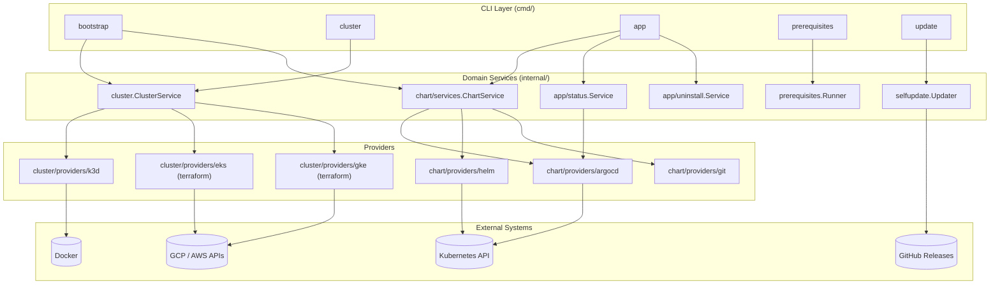
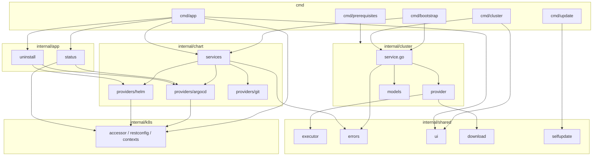
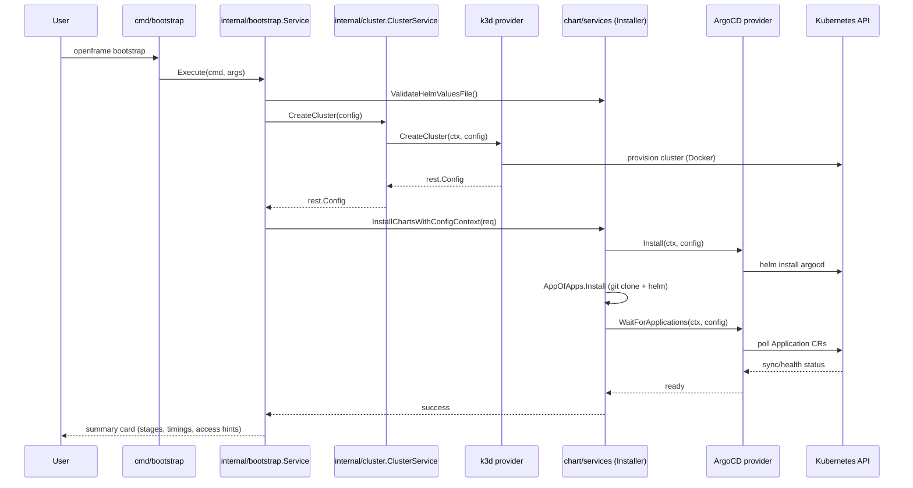
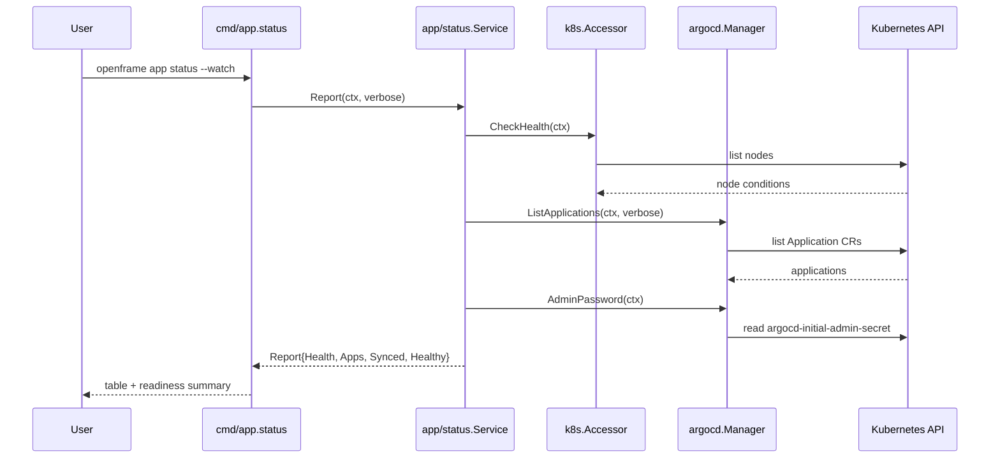

# openframe-cli Module Documentation

# OpenFrame CLI

## Overview

OpenFrame CLI is a modern, interactive command-line tool for provisioning Kubernetes clusters (local k3d, or cloud GKE/EKS via Terraform) and deploying the OpenFrame platform onto them via ArgoCD's app-of-apps pattern. It manages the full lifecycle — prerequisites, cluster creation, chart installation, status monitoring, upgrades, and teardown — with both fully interactive wizards and non-interactive flags for CI/automation.

The CLI is written in Go using Cobra for command routing and integrates directly with Kubernetes via `client-go`, shelling out to Helm, k3d, Terraform, and cloud provider CLIs (gcloud, aws) as needed.

## Architecture

OpenFrame CLI is organized around three core abstractions — **cluster** (provisioning), **app** (platform deployment via ArgoCD), and **prerequisites** (tool verification/installation) — plus supporting shared infrastructure for UI, execution, and self-update.

### Architecture Diagram


```mermaid
graph TB
    subgraph "CLI Layer (cmd/)"
        Bootstrap[bootstrap]
        Cluster[cluster]
        App[app]
        Prereq[prerequisites]
        Update[update]
    end

    subgraph "Domain Services (internal/)"
        ClusterSvc["cluster.ClusterService"]
        ChartSvc["chart/services.ChartService"]
        AppStatus["app/status.Service"]
        AppUninstall["app/uninstall.Service"]
        PrereqFw["prerequisites.Runner"]
        SelfUpdate["selfupdate.Updater"]
    end

    subgraph "Providers"
        K3d["cluster/providers/k3d"]
        EKS["cluster/providers/eks (terraform)"]
        GKE["cluster/providers/gke (terraform)"]
        ArgoCD["chart/providers/argocd"]
        Helm["chart/providers/helm"]
        Git["chart/providers/git"]
    end

    subgraph "External Systems"
        Docker[(Docker)]
        K8sAPI[(Kubernetes API)]
        CloudAPI[(GCP / AWS APIs)]
        GitHub[(GitHub Releases)]
    end

    Bootstrap --> ClusterSvc
    Bootstrap --> ChartSvc
    Cluster --> ClusterSvc
    App --> ChartSvc
    App --> AppStatus
    App --> AppUninstall
    Prereq --> PrereqFw
    Update --> SelfUpdate

    ClusterSvc --> K3d
    ClusterSvc --> EKS
    ClusterSvc --> GKE
    ChartSvc --> ArgoCD
    ChartSvc --> Helm
    ChartSvc --> Git
    AppStatus --> ArgoCD

    K3d --> Docker
    EKS --> CloudAPI
    GKE --> CloudAPI
    ArgoCD --> K8sAPI
    Helm --> K8sAPI
    SelfUpdate --> GitHub
```

The `internal/k8s` package deliberately isolates read/inspect access to an *existing* cluster (contexts, health, resources) from `internal/cluster`, which handles cluster *creation*. This lets `app install` target any reachable cluster — one made by `openframe cluster create`, or by the user directly.

## Core Components

| Component | Path | Responsibility |
|---|---|---|
| Root command | `cmd/root.go` | Cobra root, version metadata, global flags (`--silent`, `--verbose`, `--plain`), pinned-dependency reporting |
| Bootstrap | `cmd/bootstrap/`, `internal/bootstrap/` | One-shot `cluster create` + `app install` with a staged progress tracker |
| Cluster commands | `cmd/cluster/` | `create`, `delete`, `list`, `status`, `use`, `cleanup` subcommands |
| Cluster service | `internal/cluster/service.go` | Cluster lifecycle orchestration, provider dispatch, existing-cluster reuse logic |
| Cluster providers | `internal/cluster/providers/{k3d,eks,gke}` | Backend-specific cluster create/delete/status via Docker/k3d or Terraform |
| Cluster discovery | `internal/cluster/discovery/` | Finds cloud clusters outside the openframe registry (GKE/EKS), gcloud/AWS auth flows |
| Cluster prerequisites | `internal/cluster/prerequisites/` | Type-aware tool gates (Docker/k3d/helm for k3d; terraform+CLI for EKS/GKE) |
| App commands | `cmd/app/` | `install`, `upgrade`, `status`, `access`, `uninstall` subcommands |
| Chart services | `internal/chart/services/` | Orchestrates ArgoCD + app-of-apps install, validation, retries |
| ArgoCD provider | `internal/chart/providers/argocd/` | ArgoCD Helm install, application listing/sync, admin password, wait logic |
| Helm provider | `internal/chart/providers/helm/` | Helm CLI wrapper for install/upgrade/uninstall |
| Git provider | `internal/chart/providers/git/` | Clones the app-of-apps chart repository at a given ref |
| App status | `internal/app/status/` | Aggregates cluster health + ArgoCD app sync/health into a `Report` |
| App status TUI | `internal/app/status/tui/` | Interactive k9s-style bubbletea view for navigating/syncing apps |
| App uninstall | `internal/app/uninstall/` | Removes ArgoCD applications and Helm releases, keeping the cluster |
| Prerequisites framework | `internal/prerequisites/` | OS-aware `Prerequisite`/`Set`/`Runner` abstraction (auto-install on macOS/Linux, docs-only on Windows) |
| k8s access | `internal/k8s/` | Kubeconfig context resolution, `rest.Config` building, cluster health/resource checks |
| Platform hints | `internal/platform/` | Per-OS install guidance, Windows/WSL cluster-access error messaging |
| Shared executor | `internal/shared/executor/` | `CommandExecutor` abstraction (real + mock) for all shelled-out commands |
| Shared errors | `internal/shared/errors/` | Structured error handling, retry policy, friendly hints |
| Shared UI | `internal/shared/ui/` | Logo, spinners, prompts, glyphs, GitHub Actions annotations, silent/plain modes |
| Shared download | `internal/shared/download/` | Checksum-verified pinned-tool downloads (k3d, helm, mkcert, terraform, infracost) |
| Self-update | `internal/shared/selfupdate/` | Checks/applies CLI updates, cosign signature + checksum verification, rollback |
| WSL launcher | `internal/shared/wsllauncher/` | Forwards the native Windows binary into WSL2 for cluster operations |

## Component Relationships

### Dependency Diagram


```mermaid
graph TB
    subgraph cmd
        CmdCluster[cmd/cluster]
        CmdApp[cmd/app]
        CmdBootstrap[cmd/bootstrap]
        CmdPrereq[cmd/prerequisites]
        CmdUpdate[cmd/update]
    end

    subgraph internal_cluster["internal/cluster"]
        ClusterService[service.go]
        ClusterProvider[provider]
        ClusterModels[models]
    end

    subgraph internal_chart["internal/chart"]
        ChartService[services]
        ChartArgoCD[providers/argocd]
        ChartHelm[providers/helm]
        ChartGit[providers/git]
    end

    subgraph internal_app["internal/app"]
        AppStatus[status]
        AppUninstall[uninstall]
    end

    subgraph internal_shared["internal/shared"]
        Executor[executor]
        Errors[errors]
        UI[ui]
        Download[download]
        SelfUpdate[selfupdate]
    end

    subgraph internal_k8s["internal/k8s"]
        K8sAccess[accessor / restconfig / contexts]
    end

    CmdBootstrap --> ClusterService
    CmdBootstrap --> ChartService
    CmdCluster --> ClusterService
    CmdApp --> ChartService
    CmdApp --> AppStatus
    CmdApp --> AppUninstall
    CmdApp --> K8sAccess
    CmdPrereq --> internal_cluster
    CmdUpdate --> SelfUpdate

    ClusterService --> ClusterProvider
    ClusterService --> ClusterModels
    ClusterProvider --> Executor

    ChartService --> ChartArgoCD
    ChartService --> ChartHelm
    ChartService --> ChartGit
    ChartArgoCD --> K8sAccess
    ChartHelm --> K8sAccess

    AppStatus --> ChartArgoCD
    AppStatus --> K8sAccess
    AppUninstall --> ChartArgoCD
    AppUninstall --> ChartHelm

    ClusterService --> Errors
    ChartService --> Errors
    CmdCluster --> UI
    CmdApp --> UI
    ClusterProvider --> Download
```

## Data Flow

### Bootstrap Sequence


```mermaid
sequenceDiagram
    participant User
    participant CLI as cmd/bootstrap
    participant Boot as internal/bootstrap.Service
    participant Cluster as internal/cluster.ClusterService
    participant K3d as k3d provider
    participant Chart as chart/services (Installer)
    participant ArgoCD as ArgoCD provider
    participant K8s as Kubernetes API

    User->>CLI: openframe bootstrap
    CLI->>Boot: Execute(cmd, args)
    Boot->>Chart: ValidateHelmValuesFile()
    Boot->>Cluster: CreateCluster(config)
    Cluster->>K3d: CreateCluster(ctx, config)
    K3d->>K8s: provision cluster (Docker)
    K3d-->>Cluster: rest.Config
    Cluster-->>Boot: rest.Config
    Boot->>Chart: InstallChartsWithConfigContext(req)
    Chart->>ArgoCD: Install(ctx, config)
    ArgoCD->>K8s: helm install argocd
    Chart->>Chart: AppOfApps.Install (git clone + helm)
    Chart->>ArgoCD: WaitForApplications(ctx, config)
    ArgoCD->>K8s: poll Application CRs
    K8s-->>ArgoCD: sync/health status
    ArgoCD-->>Chart: ready
    Chart-->>Boot: success
    Boot-->>User: summary card (stages, timings, access hints)
```

### App Status Aggregation


```mermaid
sequenceDiagram
    participant User
    participant CLI as cmd/app.status
    participant Svc as app/status.Service
    participant Accessor as k8s.Accessor
    participant ArgoCDMgr as argocd.Manager
    participant K8s as Kubernetes API

    User->>CLI: openframe app status --watch
    CLI->>Svc: Report(ctx, verbose)
    Svc->>Accessor: CheckHealth(ctx)
    Accessor->>K8s: list nodes
    K8s-->>Accessor: node conditions
    Svc->>ArgoCDMgr: ListApplications(ctx, verbose)
    ArgoCDMgr->>K8s: list Application CRs
    K8s-->>ArgoCDMgr: applications
    Svc->>ArgoCDMgr: AdminPassword(ctx)
    ArgoCDMgr->>K8s: read argocd-initial-admin-secret
    Svc-->>CLI: Report{Health, Apps, Synced, Healthy}
    CLI-->>User: table + readiness summary
```

## Key Files

| File | Purpose |
|---|---|
| `main.go` | Entry point; exit-code fidelity for automation, error sentinel handling |
| `cmd/root.go` | Root Cobra command, version resolution, pinned dependency reporting |
| `cmd/bootstrap/bootstrap.go` | `bootstrap` command definition and cluster-name validation |
| `internal/bootstrap/service.go` | Stage-tracked bootstrap orchestration (validate → create → install) |
| `cmd/cluster/cluster.go` | Cluster command group and prerequisite-gate dispatch logic |
| `internal/cluster/service.go` | `ClusterService` — create/reuse/detect-type logic across providers |
| `internal/cluster/provider/provider.go` | Unified `Provider`/`Planner` interfaces for k3d/EKS/GKE backends |
| `cmd/app/install.go` | `app install` — resolves target cluster context, builds `InstallationRequest` |
| `cmd/app/upgrade.go` | `app upgrade` — dual-mode (change ref vs. force re-sync) |
| `internal/chart/services/chart_service.go` | Core install orchestration, retry policy, file cleanup |
| `internal/chart/services/installer.go` | Sequences ArgoCD install → app-of-apps install → wait-for-apps |
| `internal/app/status/status.go` | `Report`/`Summary` aggregation logic for platform readiness |
| `internal/app/status/tui/tui.go` | Bubbletea interactive status dashboard |
| `internal/k8s/restconfig.go`, `internal/k8s/contexts.go` | Kubeconfig context resolution shared across app/cluster commands |
| `internal/prerequisites/runner.go` | OS-aware check/install runner for tool prerequisites |
| `internal/shared/selfupdate/update.go` | Version comparison, checksum + cosign-verified binary replacement |
| `internal/shared/download/verify.go` | Verified-download substrate (SHA256-checked pinned tool binaries) |
| `internal/shared/wsllauncher/launcher.go` | Forwards the native Windows CLI into WSL2 for cluster access |

## Dependencies

OpenFrame CLI is a **service** published to the `go` ecosystem as `github.com/flamingo-stack/openframe-cli`. Per the ecosystem graph, it has no recorded upstream dependencies on other repositories in this organization's graph, and no recorded downstream consumers — it is a leaf/terminal artifact in the internal dependency graph.

Its functional dependencies are external, third-party Go modules and CLI tools rather than sibling repositories in this ecosystem:

- **Cobra** (`spf13/cobra`) — command routing and flag parsing for the entire `cmd/` tree.
- **client-go** (`k8s.io/client-go`) — native Kubernetes API access (`internal/k8s`, ArgoCD/Helm providers), replacing shelling out to `kubectl`.
- **pterm** — all terminal rendering: tables, spinners, boxes, colored status printers (`internal/shared/ui`).
- **huh** (`charmbracelet/huh`) and **bubbletea** (`charmbracelet/bubbletea`) — interactive prompts/wizards and the `app status --interactive` TUI.
- **sigstore-go** (`sigstore/sigstore-go`) — cosign keyless signature verification for self-update integrity (`internal/shared/selfupdate/cosign.go`).
- **golang.org/x/mod/semver** — version comparison for self-update and auto-update logic.
- **External CLI tools invoked via `internal/shared/executor`**: Docker, k3d, Helm, Terraform, gcloud, aws — all shelled out through the `CommandExecutor` abstraction rather than linked as libraries, with binaries themselves verified and pinned via `internal/shared/download` (k3d, Helm, mkcert, Terraform, infracost).

Because the ecosystem graph shows no other repository depends on `openframe-cli`, its `internal/` packages are considered private implementation detail — there is no public Go API surface intended for import by other modules.

## CLI Commands

| Command | Description |
|---|---|
| `openframe bootstrap [cluster-name]` | Create a k3d cluster and install the OpenFrame platform in one step |
| `openframe cluster create [NAME]` | Create a k3d, GKE, or EKS cluster (interactive wizard or `--skip-wizard`) |
| `openframe cluster list` | List managed clusters (`--all` to include discovered external cloud clusters) |
| `openframe cluster status [NAME]` | Show cluster health, nodes, and status (supports `-o json\|yaml`) |
| `openframe cluster delete [NAME]` | Delete a cluster (typed-name confirmation required for cloud clusters) |
| `openframe cluster use [NAME]` | Switch kubectl context (and gcloud config, for GKE) to a cluster |
| `openframe cluster cleanup [NAME]` | Prune unused container images from cluster nodes |
| `openframe app install [cluster-name]` | Install ArgoCD and the app-of-apps onto a cluster |
| `openframe app upgrade [cluster-name]` | Change the deployed git ref (`--ref`) or force a re-sync (`--sync`) |
| `openframe app status` | Report platform readiness (`--watch`, `--interactive`, `-o json\|yaml`) |
| `openframe app access` | Print ArgoCD admin credentials and UI access instructions |
| `openframe app uninstall` | Remove ArgoCD + apps, keeping the cluster intact |
| `openframe prerequisites check\|install` | Verify or install required tools (`--type k3d\|eks\|gke`) |
| `openframe update [version]` | Update the CLI (`check`, `rollback` subcommands available) |

### Usage Examples

```bash
# Local development
openframe bootstrap
openframe cluster status

# Cloud cluster (billed resources)
openframe cluster create my-gke --type gke --project my-project --region us-central1 --skip-wizard

# Platform lifecycle
openframe app install -c k3d-dev
openframe app status -c k3d-dev --watch
openframe app upgrade -c k3d-dev --ref v1.4.0
openframe app uninstall -c k3d-dev --yes

# Keeping the CLI current
openframe update check
openframe update rollback
```
