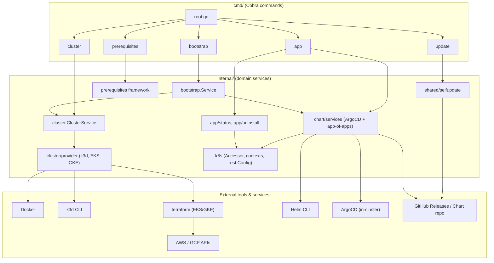
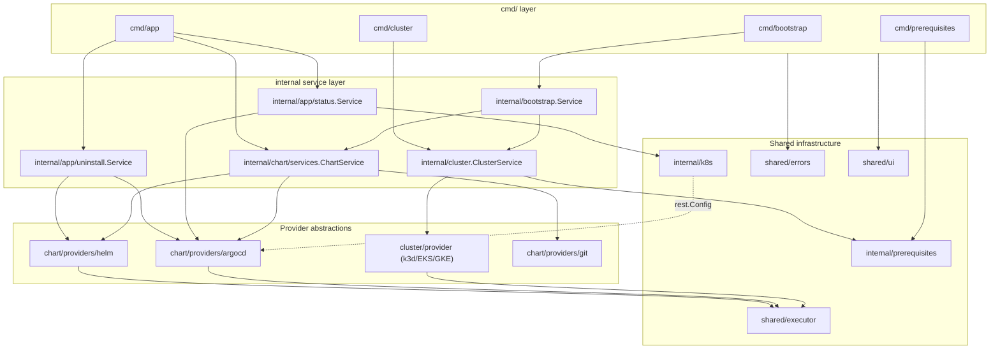
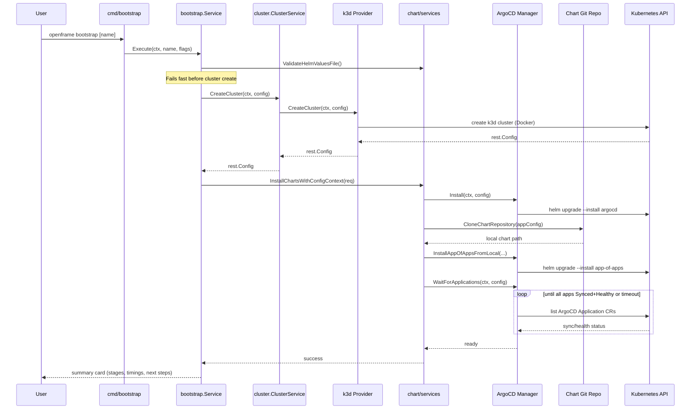

# openframe-cli Module Documentation

# OpenFrame CLI — Architecture Documentation

## Overview

OpenFrame CLI is a Go-based command-line tool for provisioning Kubernetes clusters (local k3d, or cloud GKE/EKS via Terraform) and deploying the OpenFrame platform onto them via ArgoCD's app-of-apps pattern. It manages the full lifecycle — prerequisites, cluster creation, platform install/upgrade/uninstall, status monitoring, and self-update — while providing both fully interactive wizards for humans and scriptable non-interactive flags for CI/automation.

## Architecture

OpenFrame CLI is organized as a Cobra command tree (`cmd/`) backed by domain packages under `internal/`. Each command group (`bootstrap`, `cluster`, `app`, `prerequisites`, `update`) is a thin adapter that wires flags to a corresponding internal service, keeping business logic out of the CLI layer.

### Architecture Diagram

```mermaid
graph TB
    subgraph CLI["cmd/ (Cobra commands)"]
        Root["root.go"]
        Bootstrap["bootstrap"]
        Cluster["cluster"]
        App["app"]
        Prereq["prerequisites"]
        Update["update"]
    end

    subgraph Domain["internal/ (domain services)"]
        BootstrapSvc["bootstrap.Service"]
        ClusterSvc["cluster.ClusterService"]
        Provider["cluster/provider (k3d, EKS, GKE)"]
        ChartSvc["chart/services (ArgoCD + app-of-apps)"]
        AppStatus["app/status, app/uninstall"]
        PrereqFw["prerequisites framework"]
        K8s["k8s (Accessor, contexts, rest.Config)"]
        SelfUpdate["shared/selfupdate"]
    end

    subgraph External["External tools & services"]
        Docker["Docker"]
        K3d["k3d CLI"]
        Terraform["terraform (EKS/GKE)"]
        Helm["Helm CLI"]
        ArgoCDExt["ArgoCD (in-cluster)"]
        GitHub["GitHub Releases / Chart repo"]
        CloudAPI["AWS / GCP APIs"]
    end

    Root --> Bootstrap & Cluster & App & Prereq & Update
    Bootstrap --> BootstrapSvc
    BootstrapSvc --> ClusterSvc
    BootstrapSvc --> ChartSvc
    Cluster --> ClusterSvc
    ClusterSvc --> Provider
    App --> ChartSvc
    App --> AppStatus
    Prereq --> PrereqFw
    Update --> SelfUpdate

    Provider --> Docker & K3d
    Provider --> Terraform
    Terraform --> CloudAPI
    ChartSvc --> Helm
    ChartSvc --> GitHub
    ChartSvc --> ArgoCDExt
    AppStatus --> K8s
    ChartSvc --> K8s
    SelfUpdate --> GitHub
```

## Core Components

| Package | Responsibility |
|---|---|
| `cmd/root.go` | Root Cobra command, version metadata (with VCS backfill), global flag contract (`--verbose`, `--silent`, `--plain`), WSL forwarding entry point. |
| `cmd/bootstrap` | One-shot `cluster create` + `app install` composite command. |
| `cmd/cluster` | Cluster lifecycle subcommands: `create`, `delete`, `list`, `status`, `use`, `cleanup`. |
| `cmd/app` | Platform lifecycle subcommands: `install`, `upgrade`, `status`, `access`, `uninstall`. |
| `cmd/prerequisites` | `check`/`install` for the tools required by a given cluster type. |
| `cmd/update` | Self-update command tree: `update`, `update check`, `update rollback`. |
| `internal/bootstrap` | Orchestrates cluster creation followed by chart install, with a staged progress tracker and closing summary. |
| `internal/cluster` | `ClusterService` — cluster lifecycle business logic, provider dispatch, existing-cluster reuse/resume logic. |
| `internal/cluster/provider` | Unified `Provider`/`Planner` interfaces implemented by k3d, EKS, and GKE backends; `New()` factory selects by cluster type. |
| `internal/cluster/discovery` | Read-only discovery of external (non-openframe-managed) GKE/EKS clusters; gcloud/AWS auth flows. |
| `internal/cluster/prerequisites` | Per-cluster-type requirement sets (Docker/k3d/helm vs terraform+cloud CLI) built on the shared prerequisites framework. |
| `internal/cluster/ui` | Interactive wizards, cluster pickers, confirmation prompts, list/status display formatting. |
| `internal/chart/services` | `ChartService`, `Installer`, `ArgoCD`, `AppOfApps` — orchestrates ArgoCD + app-of-apps install, upgrade, and application-readiness waits. |
| `internal/chart/providers/argocd` | ArgoCD manager: install, wait-for-apps, admin password, sync, application CRUD. |
| `internal/chart/providers/helm` | Helm CLI wrapper for chart install/upgrade/uninstall. |
| `internal/chart/providers/git` | Clones the app-of-apps chart repository at a given ref. |
| `internal/app/status` | Aggregates cluster health + ArgoCD application sync/health into a `Report` for `app status`/`app access`. |
| `internal/app/status/tui` | Bubble Tea interactive TUI for `app status --interactive`. |
| `internal/app/uninstall` | Removes ArgoCD Applications, Helm releases, and (optionally) the namespace. |
| `internal/k8s` | Read-only cluster access: kubeconfig context resolution, `rest.Config` construction, health/resource checks — deliberately isolated from cluster creation. |
| `internal/prerequisites` | OS-aware generic framework (`Set`, `Prerequisite`, `Runner`) — auto-installs on macOS/Linux, prints docs links on Windows. |
| `internal/platform` | OS detection and per-tool install-hint text; WSL-required error guidance for Windows. |
| `internal/shared/executor` | `CommandExecutor` abstraction (real + mock) for all external command invocations, with WSL and structured command recording support. |
| `internal/shared/download` | Verified, checksum-pinned binary downloads (k3d, helm, terraform, mkcert, infracost) replacing unverified curl-pipe-shell installs. |
| `internal/shared/selfupdate` | GitHub-release-based self-update: cosign signature verification, checksum verification, rollback support, auto-update opt-in. |
| `internal/shared/errors` | Structured error handling, retry policy, friendly hints, `AlreadyHandledError` sentinel for exit-code fidelity. |
| `internal/shared/ui` | Terminal presentation layer: logo, glyphs/theming, spinners, prompts, GitHub Actions annotations, silent/plain mode contracts. |
| `internal/shared/wsllauncher` | Forwards the native Windows binary into WSL2 (where Docker/k3d actually run) and auto-installs the matching Linux binary there. |

## Component Relationships

```mermaid
flowchart TD
    subgraph Commands["cmd/ layer"]
        C_Bootstrap["cmd/bootstrap"]
        C_Cluster["cmd/cluster"]
        C_App["cmd/app"]
        C_Prereq["cmd/prerequisites"]
    end

    subgraph Services["internal service layer"]
        S_Bootstrap["internal/bootstrap.Service"]
        S_Cluster["internal/cluster.ClusterService"]
        S_Chart["internal/chart/services.ChartService"]
        S_Status["internal/app/status.Service"]
        S_Uninstall["internal/app/uninstall.Service"]
    end

    subgraph Providers["Provider abstractions"]
        P_Cluster["cluster/provider (k3d/EKS/GKE)"]
        P_ArgoCD["chart/providers/argocd"]
        P_Helm["chart/providers/helm"]
        P_Git["chart/providers/git"]
    end

    subgraph SharedInfra["Shared infrastructure"]
        K8sAccess["internal/k8s"]
        Exec["shared/executor"]
        PrereqFw["internal/prerequisites"]
        Errors["shared/errors"]
        UI["shared/ui"]
    end

    C_Bootstrap --> S_Bootstrap
    S_Bootstrap --> S_Cluster
    S_Bootstrap --> S_Chart

    C_Cluster --> S_Cluster
    S_Cluster --> P_Cluster
    P_Cluster --> Exec

    C_App --> S_Chart
    C_App --> S_Status
    C_App --> S_Uninstall
    S_Chart --> P_ArgoCD
    S_Chart --> P_Helm
    S_Chart --> P_Git
    S_Status --> P_ArgoCD
    S_Status --> K8sAccess
    S_Uninstall --> P_ArgoCD
    S_Uninstall --> P_Helm

    C_Prereq --> PrereqFw
    S_Cluster --> PrereqFw

    P_ArgoCD --> Exec
    P_Helm --> Exec
    K8sAccess -.->|"rest.Config"| P_ArgoCD

    Commands --> Errors
    Commands --> UI
```

## Data Flow

The following sequence shows what happens end-to-end for `openframe bootstrap`, which is the composite of cluster creation and platform installation.

### Bootstrap Sequence Diagram

```mermaid
sequenceDiagram
    participant User
    participant CmdBootstrap as cmd/bootstrap
    participant BootstrapSvc as bootstrap.Service
    participant ClusterSvc as cluster.ClusterService
    participant K3dProvider as k3d Provider
    participant ChartSvc as chart/services
    participant ArgoCD as ArgoCD Manager
    participant GitRepo as Chart Git Repo
    participant K8sAPI as Kubernetes API

    User->>CmdBootstrap: openframe bootstrap [name]
    CmdBootstrap->>BootstrapSvc: Execute(ctx, name, flags)
    BootstrapSvc->>ChartSvc: ValidateHelmValuesFile()
    Note over BootstrapSvc: Fails fast before cluster create
    BootstrapSvc->>ClusterSvc: CreateCluster(ctx, config)
    ClusterSvc->>K3dProvider: CreateCluster(ctx, config)
    K3dProvider->>K8sAPI: create k3d cluster (Docker)
    K8sAPI-->>K3dProvider: rest.Config
    K3dProvider-->>ClusterSvc: rest.Config
    ClusterSvc-->>BootstrapSvc: rest.Config

    BootstrapSvc->>ChartSvc: InstallChartsWithConfigContext(req)
    ChartSvc->>ArgoCD: Install(ctx, config)
    ArgoCD->>K8sAPI: helm upgrade --install argocd
    ChartSvc->>GitRepo: CloneChartRepository(appConfig)
    GitRepo-->>ChartSvc: local chart path
    ChartSvc->>ArgoCD: InstallAppOfAppsFromLocal(...)
    ArgoCD->>K8sAPI: helm upgrade --install app-of-apps
    ChartSvc->>ArgoCD: WaitForApplications(ctx, config)
    loop until all apps Synced+Healthy or timeout
        ArgoCD->>K8sAPI: list ArgoCD Application CRs
        K8sAPI-->>ArgoCD: sync/health status
    end
    ArgoCD-->>ChartSvc: ready
    ChartSvc-->>BootstrapSvc: success
    BootstrapSvc-->>User: summary card (stages, timings, next steps)
```

## Key Files

| File | Purpose |
|---|---|
| `main.go` | Process entry point; maps errors to exit codes, preserving a failed external command's exit code for automation. |
| `cmd/root.go` | Builds the root Cobra command, resolves version metadata, defines pinned dependency versions shown in `--version`. |
| `internal/bootstrap/service.go` | Implements the `bootstrap` composite flow with a stage tracker and GitHub Actions Step Summary output. |
| `internal/cluster/service.go` | Core cluster business logic: create/reuse/resume decisions, provider dispatch. |
| `internal/cluster/provider/factory.go` | Selects the k3d/EKS/GKE backend based on `ClusterConfig.Type`. |
| `internal/chart/services/chart_service.go` | Central orchestrator for chart installation, wiring Helm, ArgoCD, and git-clone collaborators for one consistent install target. |
| `internal/chart/services/installer.go` | Sequences ArgoCD install → app-of-apps install → application readiness wait, with ref preflight validation. |
| `internal/k8s/restconfig.go` / `internal/k8s/contexts.go` | Builds `rest.Config` from kubeconfig contexts; the single source of "which cluster are we talking to." |
| `internal/shared/executor/executor.go` | `CommandExecutor` interface and real implementation wrapping `os/exec`, with WSL-specific error handling. |
| `internal/shared/download/verify.go` / `pins.go` | Pinned-version, checksum-verified tool downloads (replaces unverified curl-pipe-shell installs). |
| `internal/shared/selfupdate/update.go` / `cosign.go` | Self-update logic and cosign signature verification against a pinned GitHub Actions OIDC identity. |
| `internal/shared/wsllauncher/launcher.go` | Forwards the Windows binary into WSL2, since Docker/k3d/client-go networking must run inside WSL on Windows. |
| `internal/platform/wsl_hint.go` | Produces the actionable "run inside WSL" error for cluster operations attempted natively on Windows. |
| `tests/testutil/*` | Shared test helpers: command assertions, flag contract checks, mock executor wiring. |

## Dependencies

OpenFrame CLI is published as a Go module, `github.com/flamingo-stack/openframe-cli`, and has **no recorded upstream dependencies or downstream consumers** in the organization's dependency graph — it is a standalone service, not consumed by other repositories in this ecosystem.

Its functional dependencies are external tools and libraries it shells out to or vendors as Go modules, rather than internal ecosystem packages:

- **Kubernetes tooling**: `k8s.io/client-go`, `k8s.io/apimachinery` for native cluster access (health checks, rest.Config resolution) — deliberately used instead of shelling out to `kubectl`.
- **Cobra/pterm/huh**: CLI framework (`spf13/cobra`), terminal rendering (`pterm`), and interactive prompts (`charmbracelet/huh`, `charmbracelet/bubbletea` for the status TUI).
- **Pinned external CLIs** (downloaded and checksum-verified by `internal/shared/download`, not Go modules): `k3d`, `helm`, `terraform`, `mkcert`, `infracost`.
- **Cloud provider CLIs**: `gcloud` (+ `gke-gcloud-auth-plugin`) and the AWS CLI, invoked via the shared executor for authentication and discovery.
- **Sigstore/cosign** (`sigstore/sigstore-go`): verifies release signatures during self-update against a pinned GitHub Actions OIDC identity for this repository's release workflow.
- **GitHub Releases API**: source of truth for self-update version checks and the platform chart repository (`flamingo-stack/openframe-oss-tenant`) cloned by `internal/chart/providers/git`.

Since no other repository in the organization graph depends on this one, changes to OpenFrame CLI's public behavior (its CLI surface) have no automatically-tracked downstream impact — compatibility is governed by the documented command/flag contract itself (see `tests/testutil/flag_contract.go`) rather than by dependent-repository builds.

## CLI Commands

| Command | Description | Example |
|---|---|---|
| `openframe bootstrap [name]` | Create a cluster and install the OpenFrame platform in one step | `openframe bootstrap my-cluster` |
| `openframe cluster create [name]` | Create a k3d or cloud (EKS/GKE) cluster | `openframe cluster create dev --type k3d --nodes 3` |
| `openframe cluster list` | List managed clusters (`--all` discovers external cloud clusters) | `openframe cluster list -o json` |
| `openframe cluster status [name]` | Show cluster health and node status | `openframe cluster status dev` |
| `openframe cluster use [name]` | Switch the kubectl context to a cluster | `openframe cluster use my-gke` |
| `openframe cluster delete [name]` | Delete a cluster and its resources | `openframe cluster delete dev --force` |
| `openframe cluster cleanup [name]` | Prune unused container images from cluster nodes | `openframe cluster cleanup dev` |
| `openframe app install [name]` | Install ArgoCD and the app-of-apps | `openframe app install -c k3d-dev --ref v1.3.0` |
| `openframe app upgrade [name]` | Change ref (`--ref`) or force re-sync (`--sync`) | `openframe app upgrade -c k3d-dev --sync` |
| `openframe app status` | Report platform readiness (`--watch`, `--interactive` supported) | `openframe app status -c k3d-dev --interactive` |
| `openframe app access` | Print ArgoCD admin credentials and UI access instructions | `openframe app access -c k3d-dev` |
| `openframe app uninstall` | Remove ArgoCD + apps, keeping the cluster | `openframe app uninstall -c k3d-dev --yes` |
| `openframe prerequisites check` / `install` | Check or install required tools for a cluster type | `openframe prerequisites install --type gke` |
| `openframe update [version]` | Self-update the CLI (`check`, `rollback` subcommands) | `openframe update v1.4.0` |

**Global output flags** (apply across command groups): `--verbose` (timestamped debug output), `--silent` (errors only), `--plain` (sequential output, no spinners), `-o json|yaml` (machine-readable output where supported).
