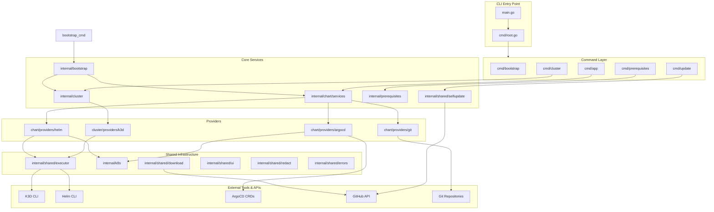
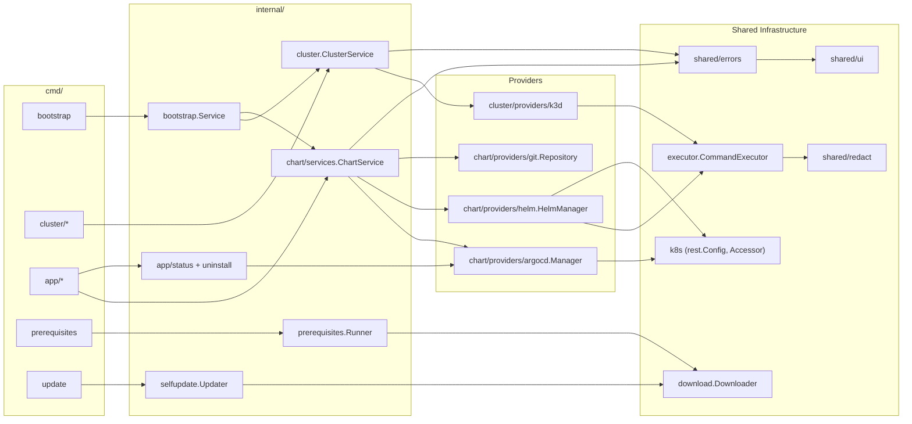
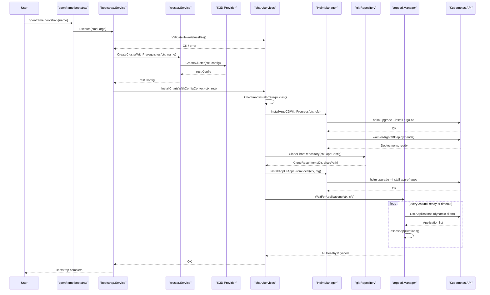
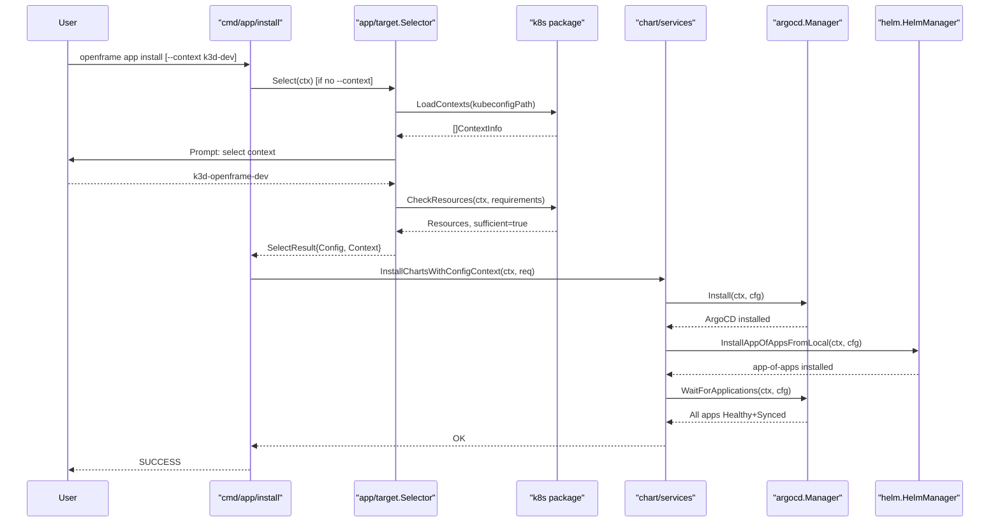

# openframe-cli Module Documentation

# OpenFrame CLI — Architecture Documentation

## Overview

OpenFrame CLI is a modern, interactive command-line tool written in Go that bootstraps and manages OpenFrame Kubernetes environments. It orchestrates the full lifecycle of local K3D clusters, installs the OpenFrame platform via ArgoCD GitOps (using the public `openframe-oss-tenant` chart), and provides developer utilities — all from a single `openframe` binary with both interactive wizards and fully scriptable non-interactive modes.

---

## Architecture

### High-Level System Design


```mermaid
graph TB
    subgraph CLI["CLI Entry Point"]
        main["main.go"]
        root["cmd/root.go"]
    end

    subgraph Commands["Command Layer"]
        bootstrap["cmd/bootstrap"]
        cluster_cmd["cmd/cluster"]
        app_cmd["cmd/app"]
        prereq_cmd["cmd/prerequisites"]
        update_cmd["cmd/update"]
    end

    subgraph Core["Core Services"]
        bootstrap_svc["internal/bootstrap"]
        cluster_svc["internal/cluster"]
        chart_svc["internal/chart/services"]
        prereq_fw["internal/prerequisites"]
        selfupdate["internal/shared/selfupdate"]
    end

    subgraph Providers["Providers"]
        k3d_prov["cluster/providers/k3d"]
        argocd_prov["chart/providers/argocd"]
        helm_prov["chart/providers/helm"]
        git_prov["chart/providers/git"]
    end

    subgraph Shared["Shared Infrastructure"]
        executor["internal/shared/executor"]
        k8s["internal/k8s"]
        download["internal/shared/download"]
        ui["internal/shared/ui"]
        redact["internal/shared/redact"]
        errors["internal/shared/errors"]
    end

    subgraph External["External Tools & APIs"]
        k3d_tool["K3D CLI"]
        helm_tool["Helm CLI"]
        argocd_cr["ArgoCD CRDs"]
        github["GitHub API"]
        git_repo["Git Repositories"]
    end

    main --> root
    root --> Commands
    bootstrap_cmd --> bootstrap_svc
    cluster_cmd --> cluster_svc
    app_cmd --> chart_svc
    prereq_cmd --> prereq_fw
    update_cmd --> selfupdate

    bootstrap_svc --> cluster_svc
    bootstrap_svc --> chart_svc

    cluster_svc --> k3d_prov
    chart_svc --> argocd_prov
    chart_svc --> helm_prov
    chart_svc --> git_prov

    k3d_prov --> executor
    helm_prov --> executor
    argocd_prov --> k8s
    helm_prov --> k8s

    executor --> k3d_tool
    executor --> helm_tool
    argocd_prov --> argocd_cr
    git_prov --> git_repo
    selfupdate --> github
    download --> github
```

---

## Core Components

| Package | Path | Responsibility |
|---|---|---|
| **Root Command** | `cmd/root.go` | Cobra root; wires subcommands, global flags (`--verbose`, `--silent`), version info, WSL launcher |
| **Bootstrap Command** | `cmd/bootstrap/` | Orchestrates `cluster create` + `app install` as a single user-facing workflow |
| **Cluster Commands** | `cmd/cluster/` | Cobra subcommands: create, delete, list, status, cleanup |
| **App Commands** | `cmd/app/` | Cobra subcommands: install, upgrade, status, access, uninstall |
| **Prerequisites Command** | `cmd/prerequisites/` | Exposes `check` / `install` for Docker, k3d, helm |
| **Update Command** | `cmd/update/` | Self-update, rollback, update-check with cosign signature verification |
| **Bootstrap Service** | `internal/bootstrap/` | Coordinates cluster creation then chart installation end-to-end |
| **Cluster Service** | `internal/cluster/service.go` | Lifecycle operations (create, delete, list, status, cleanup) via the provider interface |
| **K3D Provider** | `internal/cluster/providers/k3d/` | K3D-specific cluster creation and management |
| **Cluster Provider Interface** | `internal/cluster/provider/` | Unified `Provider` interface; K3D satisfies it today |
| **Chart Services** | `internal/chart/services/` | High-level install workflow: prerequisites → ArgoCD → app-of-apps → wait |
| **ArgoCD Provider** | `internal/chart/providers/argocd/` | Install, wait, refresh/sync, application management via native client-go dynamic client |
| **Helm Provider** | `internal/chart/providers/helm/` | Helm CLI wrapper; ArgoCD and app-of-apps installation |
| **Git Provider** | `internal/chart/providers/git/` | Shallow clone of chart repository using go-git (no `git` binary) |
| **App Status Service** | `internal/app/status/` | Aggregates cluster health + ArgoCD app status into a unified Report |
| **App Uninstall Service** | `internal/app/uninstall/` | Removes ArgoCD applications and Helm releases safely |
| **App Target Selector** | `internal/app/target/` | Interactive/non-interactive kube-context selection with resource check |
| **k8s Package** | `internal/k8s/` | Kubeconfig context loading, `rest.Config` construction, cluster health/resource checks |
| **Prerequisites Framework** | `internal/prerequisites/` | OS-aware check + auto-install runner (macOS/Linux auto-installs, Windows shows docs) |
| **Cluster Prerequisites** | `internal/cluster/prerequisites/` | Docker, k3d, helm prerequisite definitions and installer |
| **Chart Prerequisites** | `internal/chart/prerequisites/` | Helm, mkcert/certificates, memory prerequisite definitions |
| **Executor** | `internal/shared/executor/` | Command execution abstraction (real + mock); records argv for security testing |
| **Self-Update** | `internal/shared/selfupdate/` | GitHub release fetch, cosign signature verification, binary swap, rollback |
| **Download** | `internal/shared/download/` | Verified binary downloads (SHA256 + pinned versions) for k3d, mkcert, helm |
| **Redact** | `internal/shared/redact/` | Secret redaction from log/debug output |
| **WSL Launcher** | `internal/shared/wsllauncher/` | Re-runs the CLI inside WSL on Windows; auto-installs the Linux binary |
| **Platform** | `internal/platform/` | Host OS detection, per-tool install hints, WSL guidance errors |
| **Shared UI** | `internal/shared/ui/` | Logo, prompts, silent mode, status colors, selection menus |
| **Shared Config** | `internal/shared/config/` | `EnvBool`, TLS config for local clusters, system service |
| **Shared Errors** | `internal/shared/errors/` | Error types, friendly hints, retry policies, `AlreadyHandledError` sentinel |

---

## Component Relationships

### Dependency Flowchart


```mermaid
graph LR
    subgraph Commands["cmd/"]
        bootstrap["bootstrap"]
        cluster_cmd["cluster/*"]
        app_cmd["app/*"]
        prereq_cmd["prerequisites"]
        update_cmd["update"]
    end

    subgraph Services["internal/"]
        bsvc["bootstrap.Service"]
        csvc["cluster.ClusterService"]
        chsvc["chart/services.ChartService"]
        appsvc["app/status + uninstall"]
        prefw["prerequisites.Runner"]
        supdater["selfupdate.Updater"]
    end

    subgraph Providers["Providers"]
        k3dp["cluster/providers/k3d"]
        argop["chart/providers/argocd.Manager"]
        helmp["chart/providers/helm.HelmManager"]
        gitp["chart/providers/git.Repository"]
    end

    subgraph Infra["Shared Infrastructure"]
        exec["executor.CommandExecutor"]
        k8spkg["k8s (rest.Config, Accessor)"]
        dlpkg["download.Downloader"]
        uipkg["shared/ui"]
        errpkg["shared/errors"]
        redactpkg["shared/redact"]
    end

    bootstrap --> bsvc
    cluster_cmd --> csvc
    app_cmd --> chsvc
    app_cmd --> appsvc
    prereq_cmd --> prefw
    update_cmd --> supdater

    bsvc --> csvc
    bsvc --> chsvc

    csvc --> k3dp
    chsvc --> argop
    chsvc --> helmp
    chsvc --> gitp
    appsvc --> argop

    k3dp --> exec
    helmp --> exec
    argop --> k8spkg
    helmp --> k8spkg

    prefw --> dlpkg
    supdater --> dlpkg

    exec --> redactpkg
    errpkg --> uipkg
    chsvc --> errpkg
    csvc --> errpkg
```

---

## Data Flow

### Bootstrap Sequence Diagram


```mermaid
sequenceDiagram
    participant User
    participant CLI as "openframe bootstrap"
    participant BSvc as "bootstrap.Service"
    participant CSvc as "cluster.Service"
    participant K3D as "K3D Provider"
    participant ChSvc as "chart/services"
    participant Helm as "HelmManager"
    participant Git as "git.Repository"
    participant ArgoCD as "argocd.Manager"
    participant K8s as "Kubernetes API"

    User->>CLI: openframe bootstrap [name]
    CLI->>BSvc: Execute(cmd, args)
    BSvc->>ChSvc: ValidateHelmValuesFile()
    ChSvc-->>BSvc: OK / error

    BSvc->>CSvc: CreateClusterWithPrerequisites(ctx, name)
    CSvc->>K3D: CreateCluster(ctx, config)
    K3D-->>CSvc: rest.Config
    CSvc-->>BSvc: rest.Config

    BSvc->>ChSvc: InstallChartsWithConfigContext(ctx, req)
    ChSvc->>ChSvc: CheckAndInstallPrerequisites()
    ChSvc->>Helm: InstallArgoCDWithProgress(ctx, cfg)
    Helm->>K8s: helm upgrade --install argo-cd
    K8s-->>Helm: OK
    Helm->>K8s: waitForArgoCDDeployments()
    K8s-->>Helm: Deployments ready

    ChSvc->>Git: CloneChartRepository(ctx, appConfig)
    Git-->>ChSvc: CloneResult{tempDir, chartPath}

    ChSvc->>Helm: InstallAppOfAppsFromLocal(ctx, cfg)
    Helm->>K8s: helm upgrade --install app-of-apps
    K8s-->>Helm: OK

    ChSvc->>ArgoCD: WaitForApplications(ctx, cfg)
    loop Every 2s until ready or timeout
        ArgoCD->>K8s: List Applications (dynamic client)
        K8s-->>ArgoCD: Application list
        ArgoCD->>ArgoCD: assessApplications()
    end
    ArgoCD-->>ChSvc: All Healthy+Synced

    ChSvc-->>BSvc: OK
    BSvc-->>User: Bootstrap complete
```

### App Install / Upgrade Data Flow


```mermaid
sequenceDiagram
    participant User
    participant AppCmd as "cmd/app/install"
    participant Target as "app/target.Selector"
    participant K8sPkg as "k8s package"
    participant ChSvc as "chart/services"
    participant ArgoProv as "argocd.Manager"
    participant HelmProv as "helm.HelmManager"

    User->>AppCmd: openframe app install [--context k3d-dev]
    AppCmd->>Target: Select(ctx) [if no --context]
    Target->>K8sPkg: LoadContexts(kubeconfigPath)
    K8sPkg-->>Target: []ContextInfo
    Target->>User: Prompt: select context
    User-->>Target: k3d-openframe-dev
    Target->>K8sPkg: CheckResources(ctx, requirements)
    K8sPkg-->>Target: Resources, sufficient=true
    Target-->>AppCmd: SelectResult{Config, Context}

    AppCmd->>ChSvc: InstallChartsWithConfigContext(ctx, req)
    ChSvc->>ArgoProv: Install(ctx, cfg)
    ArgoProv-->>ChSvc: ArgoCD installed
    ChSvc->>HelmProv: InstallAppOfAppsFromLocal(ctx, cfg)
    HelmProv-->>ChSvc: app-of-apps installed
    ChSvc->>ArgoProv: WaitForApplications(ctx, cfg)
    ArgoProv-->>ChSvc: All apps Healthy+Synced
    ChSvc-->>AppCmd: OK
    AppCmd-->>User: SUCCESS
```

---

## Key Files

| File | Purpose |
|---|---|
| [`main.go`](https://github.com/flamingo-stack/openframe-cli/blob/main/main.go) | Entry point; exits with child process exit code for automation fidelity |
| [`cmd/root.go`](https://github.com/flamingo-stack/openframe-cli/blob/main/cmd/root.go) | Root Cobra command; wires all subcommands, persistent flags, version info, WSL launcher |
| [`cmd/bootstrap/bootstrap.go`](https://github.com/flamingo-stack/openframe-cli/blob/main/cmd/bootstrap/bootstrap.go) | `openframe bootstrap` command: validates cluster name, delegates to bootstrap service |
| [`cmd/app/install.go`](https://github.com/flamingo-stack/openframe-cli/blob/main/cmd/app/install.go) | `openframe app install`: flag parsing, context/target selection, request assembly |
| [`cmd/app/upgrade.go`](https://github.com/flamingo-stack/openframe-cli/blob/main/cmd/app/upgrade.go) | `openframe app upgrade`: two modes (change-ref Mode 1, force-sync Mode 2) |
| [`cmd/update/update.go`](https://github.com/flamingo-stack/openframe-cli/blob/main/cmd/update/update.go) | `openframe update`: self-update with cosign verification, rollback, update-check |
| [`internal/bootstrap/service.go`](https://github.com/flamingo-stack/openframe-cli/blob/main/internal/bootstrap/service.go) | Orchestrates pre-flight → cluster create → chart install end-to-end |
| [`internal/cluster/service.go`](https://github.com/flamingo-stack/openframe-cli/blob/main/internal/cluster/service.go) | `ClusterService`: lifecycle operations, `ApplicationCleaner` interface injection |
| [`internal/cluster/provider/provider.go`](https://github.com/flamingo-stack/openframe-cli/blob/main/internal/cluster/provider/provider.go) | `Provider` interface; compile-time assertion that K3D satisfies it |
| [`internal/chart/services/chart_service.go`](https://github.com/flamingo-stack/openframe-cli/blob/main/internal/chart/services/chart_service.go) | `ChartService`: top-level install orchestration, HelmManager wiring |
| [`internal/chart/services/preflight.go`](https://github.com/flamingo-stack/openframe-cli/blob/main/internal/chart/services/preflight.go) | Pre-flights `openframe-helm-values.yaml` before any cluster work begins |
| [`internal/chart/providers/argocd/applications.go`](https://github.com/flamingo-stack/openframe-cli/blob/main/internal/chart/providers/argocd/applications.go) | `Manager`: native client-go dynamic client for ArgoCD Application CRDs |
| [`internal/chart/providers/argocd/wait.go`](https://github.com/flamingo-stack/openframe-cli/blob/main/internal/chart/providers/argocd/wait.go) | `WaitForApplications`: stabilization loop, stall detection, repo-server recovery |
| [`internal/chart/providers/argocd/sync.go`](https://github.com/flamingo-stack/openframe-cli/blob/main/internal/chart/providers/argocd/sync.go) | `RefreshAndSync`: hard refresh + sync patches via dynamic client; group-ordered child sync |
| [`internal/chart/providers/argocd/values.go`](https://github.com/flamingo-stack/openframe-cli/blob/main/internal/chart/providers/argocd/values.go) | Embedded ArgoCD Helm values; deep-merge with user `argocd:` overrides; pre-flight validation |
| [`internal/chart/providers/argocd/stall.go`](https://github.com/flamingo-stack/openframe-cli/blob/main/internal/chart/providers/argocd/stall.go) | Per-application stall tracker; detects OutOfSync stragglers after ref changes |
| [`internal/chart/providers/argocd/fatalmanifest.go`](https://github.com/flamingo-stack/openframe-cli/blob/main/internal/chart/providers/argocd/fatalmanifest.go) | Fail-fast for deterministic manifest errors (missing chart path) |
| [`internal/chart/providers/argocd/refassert.go`](https://github.com/flamingo-stack/openframe-cli/blob/main/internal/chart/providers/argocd/refassert.go) | Verifies deployed git ref matches the requested ref; catches silent V3 failures |
| [`internal/chart/providers/helm/manager.go`](https://github.com/flamingo-stack/openframe-cli/blob/main/internal/chart/providers/helm/manager.go) | `HelmManager`: helm CLI execution, Kubernetes client for workload verification |
| [`internal/chart/providers/git/repository.go`](https://github.com/flamingo-stack/openframe-cli/blob/main/internal/chart/providers/git/repository.go) | go-git shallow clone; branch→tag fallback; credential isolation |
| [`internal/k8s/accessor.go`](https://github.com/flamingo-stack/openframe-cli/blob/main/internal/k8s/accessor.go) | `Accessor`: cluster health (reachable, nodes ready) and resource sufficiency checks |
| [`internal/k8s/contexts.go`](https://github.com/flamingo-stack/openframe-cli/blob/main/internal/k8s/contexts.go) | Kubeconfig context loading, `ResolveContextForCluster` for k3d naming convention |
| [`internal/prerequisites/runner.go`](https://github.com/flamingo-stack/openframe-cli/blob/main/internal/prerequisites/runner.go) | OS-aware `Runner`: auto-installs on macOS/Linux, shows docs on Windows |
| [`internal/shared/executor/executor.go`](https://github.com/flamingo-stack/openframe-cli/blob/main/internal/shared/executor/executor.go) | `RealCommandExecutor`: runs external binaries; captures stderr for error enrichment |
| [`internal/shared/executor/mock.go`](https://github.com/flamingo-stack/openframe-cli/blob/main/internal/shared/executor/mock.go) | `MockCommandExecutor`: structured argv recording for security tests |
| [`internal/shared/selfupdate/update.go`](https://github.com/flamingo-stack/openframe-cli/blob/main/internal/shared/selfupdate/update.go) | Core update logic: GitHub release fetch, version comparison, binary swap |
| [`internal/shared/selfupdate/cosign.go`](https://github.com/flamingo-stack/openframe-cli/blob/main/internal/shared/selfupdate/cosign.go) | Sigstore/cosign signature verification against pinned GitHub Actions identity |
| [`internal/shared/download/pins.go`](https://github.com/flamingo-stack/openframe-cli/blob/main/internal/shared/download/pins.go) | Pinned tool versions + SHA256 for k3d, mkcert, helm; verified download infra |
| [`internal/shared/config/transport.go`](https://github.com/flamingo-stack/openframe-cli/blob/main/internal/shared/config/transport.go) | `ApplyInsecureTLSConfig`: bypasses TLS only for local/loopback clusters |
| [`internal/shared/errors/errors.go`](https://github.com/flamingo-stack/openframe-cli/blob/main/internal/shared/errors/errors.go) | `HandleGlobalError`, `AlreadyHandledError` sentinel, typed error handlers |
| [`internal/shared/errors/friendly.go`](https://github.com/flamingo-stack/openframe-cli/blob/main/internal/shared/errors/friendly.go) | `friendlyHint`: maps low-level errors to actionable user guidance |
| [`internal/shared/ui/silent.go`](https://github.com/flamingo-stack/openframe-cli/blob/main/internal/shared/ui/silent.go) | `SetSilent`: routes all non-error pterm printers to `io.Discard` |
| [`internal/shared/redact/redact.go`](https://github.com/flamingo-stack/openframe-cli/blob/main/internal/shared/redact/redact.go) | `Redact`: removes registered secrets and URL-embedded credentials from output |
| [`internal/shared/wsllauncher/launcher.go`](https://github.com/flamingo-stack/openframe-cli/blob/main/internal/shared/wsllauncher/launcher.go) | `Forward`: re-runs the whole CLI inside WSL on Windows; installs Linux binary if missing |
| [`internal/app/status/status.go`](https://github.com/flamingo-stack/openframe-cli/blob/main/internal/app/status/status.go) | `Report`: aggregates cluster health, ArgoCD app sync/health, admin password |
| [`internal/app/uninstall/uninstall.go`](https://github.com/flamingo-stack/openframe-cli/blob/main/internal/app/uninstall/uninstall.go) | Removes Applications, Helm releases, and optionally the `argocd` namespace safely |
| [`tests/testutil/command_assertions.go`](https://github.com/flamingo-stack/openframe-cli/blob/main/tests/testutil/command_assertions.go) | Security-spec assertions on `RecordedCommand` (no secrets in argv, no shell injection) |

---

## Dependencies

The project uses these key Go library dependencies:

| Library | How It Is Used |
|---|---|
| **github.com/spf13/cobra** | CLI framework for all commands, flags, help generation, and completion |
| **github.com/pterm/pterm** | Rich terminal UI: spinners, tables, boxes, interactive prompts, color output |
| **github.com/charmbracelet/huh** | Interactive selection menus (with `/` filtering) and text input prompts in wizards |
| **github.com/charmbracelet/bubbletea** | TUI runtime: powers huh prompts and the interactive `app status` view |
| **k8s.io/client-go** | Native Kubernetes API access: kubeconfig loading, rest.Config, typed clients |
| **k8s.io/apimachinery** | Kubernetes API types, GVR definitions for ArgoCD Application CRDs |
| **k8s.io/apiextensions-apiserver** | CRD client for checking/managing ArgoCD CRD installation |
| **sigs.k8s.io/yaml** | YAML marshaling/unmarshaling (round-trips through JSON for consistent field names) |
| **github.com/go-git/go-git/v5** | Pure-Go git clone for the app-of-apps chart repository (no `git` binary required) |
| **github.com/sigstore/sigstore-go** | Cosign bundle parsing and Sigstore trust-root verification for self-update |
| **golang.org/x/mod/semver** | Semantic version comparison for self-update logic |
| **golang.org/x/term** | Terminal detection (`IsTerminal`) for non-interactive mode detection |
| **github.com/elastic/go-sysinfo** | Cross-platform total RAM query (no shell-outs to `sysctl`/`/proc`) |
| **k8s.io/apimachinery/pkg/util/wait** | `PollUntilContextTimeout` for resilient workload readiness polling |

---

## CLI Commands

### Global Flags

| Flag | Description |
|---|---|
| `--verbose`, `-v` | Enable verbose/debug output |
| `--silent` | Suppress all output except errors |
| `--version` | Print version, commit, and build date |

### Command Reference

#### `openframe bootstrap`

Creates a K3D cluster and installs the OpenFrame platform in a single step.

```bash
openframe bootstrap                          # Interactive mode
openframe bootstrap my-cluster              # Named cluster
openframe bootstrap --non-interactive       # CI/CD mode (uses existing openframe-helm-values.yaml)
openframe bootstrap --verbose               # Show detailed ArgoCD sync progress
```

#### `openframe cluster`

| Subcommand | Description | Example |
|---|---|---|
| `create [NAME]` | Create a K3D cluster (wizard or flags) | `openframe cluster create dev --skip-wizard --nodes 1` |
| `delete [NAME]` | Delete a cluster and its resources | `openframe cluster delete dev --force` |
| `list` | List all managed clusters | `openframe cluster list -o json` |
| `status [NAME]` | Show detailed cluster status | `openframe cluster status dev -o yaml` |
| `cleanup [NAME]` | Remove unused images and resources | `openframe cluster cleanup dev --force` |

**`cluster create` flags:**

```bash
openframe cluster create                    # Interactive wizard
openframe cluster create my-cluster        # Named with wizard
openframe cluster create --skip-wizard     # Defaults (k3d, 3 nodes)
openframe cluster create --type k3d --nodes 1 --skip-wizard
```

#### `openframe app`

| Subcommand | Description | Example |
|---|---|---|
| `install [cluster]` | Install ArgoCD + app-of-apps | `openframe app install -c k3d-dev` |
| `upgrade [cluster]` | Re-sync or change git ref | `openframe app upgrade --ref v1.3.0` |
| `status` | Show platform readiness | `openframe app status -c k3d-dev -o json` |
| `access` | Print ArgoCD credentials | `openframe app access -c k3d-dev` |
| `uninstall` | Remove app (keep cluster) | `openframe app uninstall -c k3d-dev --yes` |

**`app install` flags:**

```bash
openframe app install                                # Interactive context picker
openframe app install -c k3d-openframe-dev          # Explicit context
openframe app install --non-interactive             # CI (reuse existing values file)
openframe app install --ref 1.0.48                  # Deploy specific tag
openframe app install --dry-run                     # Preview only
```

**`app upgrade` modes:**

```bash
openframe app upgrade                               # Force re-sync current ref (Mode 2)
openframe app upgrade --sync --prune               # Re-sync + delete removed resources
openframe app upgrade --ref v1.4.0                 # Change to new release tag (Mode 1)
openframe app upgrade -c k3d-dev --ref main        # Target explicit context + ref
```

#### `openframe prerequisites`

```bash
openframe prerequisites check              # Report status, no changes
openframe prerequisites install            # Install missing tools (macOS/Linux)
```

#### `openframe update`

```bash
openframe update                           # Update to latest release
openframe update v1.4.0                    # Switch to specific version (up or down)
openframe update check                     # Report availability only
openframe update check -o json            # Machine-readable check
openframe update rollback                  # Revert to previous version (offline)
```

### Non-Interactive / CI Usage

Every destructive or interactive command supports scripted operation:

```bash
# Fully non-interactive bootstrap
openframe bootstrap my-cluster --non-interactive

# Force-delete without confirmation
openframe cluster delete my-cluster --force

# Install without prompts, output JSON for parsing
openframe app install -c k3d-dev --non-interactive
openframe app status -c k3d-dev -o json

# Uninstall without confirmation
openframe app uninstall -c k3d-dev --yes
```

Non-interactive mode is also engaged automatically when `CI`, `GITHUB_ACTIONS`, `GITLAB_CI`, or `CIRCLECI` environment variables are set, or when `stdin` is not a terminal.

---

## Community and Support

- **OpenMSP Slack**: [Join the community](https://join.slack.com/t/openmsp/shared_invite/zt-36bl7mx0h-3~U2nFH6nqHqoTPXMaHEHA) — primary support channel
- **Releases**: [https://github.com/flamingo-stack/openframe-cli/releases](https://github.com/flamingo-stack/openframe-cli/releases)
- **OpenFrame Platform**: [https://openframe.ai](https://openframe.ai)
- **Flamingo**: [https://flamingo.run](https://flamingo.run)
