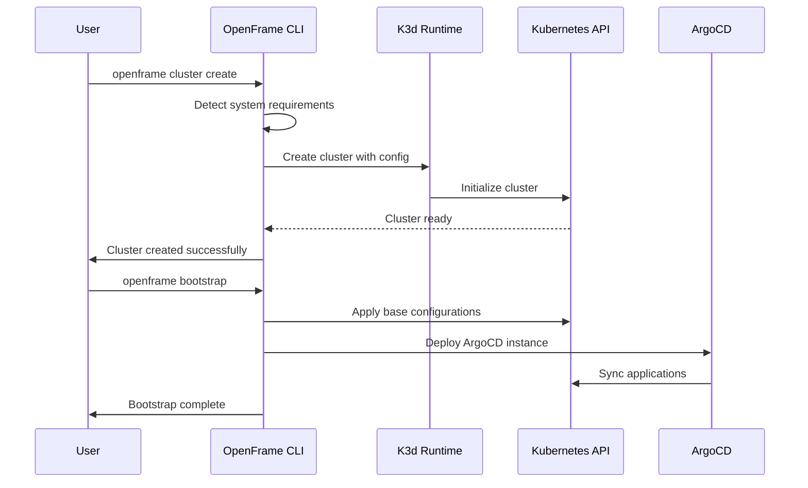
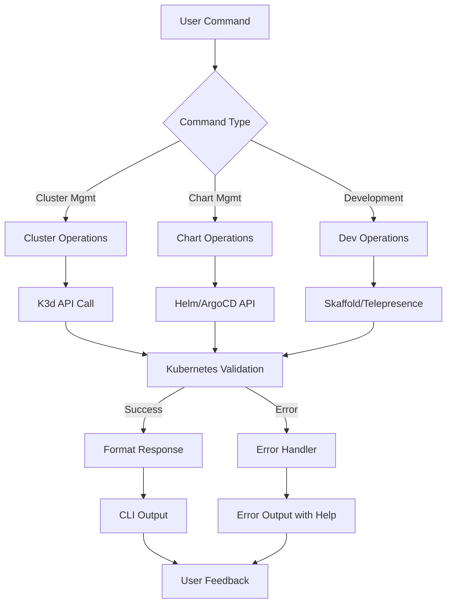

# API Usage Examples

This guide provides comprehensive examples for using the OpenFrame CLI tool effectively in your development workflows.

## Main API Endpoints/Functions

| Method | Command | Description | Example |
|--------|---------|-------------|---------|
| `CREATE` | `openframe cluster create` | Create a new K3d cluster with interactive wizard | `openframe cluster create --name dev-cluster` |
| `GET` | `openframe cluster list` | List all available clusters | `openframe cluster list --format json` |
| `GET` | `openframe cluster status` | Show detailed cluster information | `openframe cluster status --cluster dev-cluster` |
| `DELETE` | `openframe cluster delete` | Remove a cluster and its resources | `openframe cluster delete --cluster dev-cluster` |
| `POST` | `openframe cluster start` | Start a stopped cluster | `openframe cluster start --cluster dev-cluster` |
| `POST` | `openframe bootstrap` | Bootstrap OpenFrame installation | `openframe bootstrap --deployment-mode oss-tenant` |
| `POST` | `openframe chart install` | Install Helm charts and ArgoCD | `openframe chart install --chart-name core` |
| `POST` | `openframe dev scaffold` | Run Skaffold for development | `openframe dev scaffold --service api` |
| `POST` | `openframe dev intercept` | Intercept service traffic | `openframe dev intercept --service frontend` |
| `POST` | `openframe cluster cleanup` | Clean up cluster resources | `openframe cluster cleanup --all` |

## Authentication Flow



## API Request/Response Flow



## Common Use Cases

### 1. Setting Up a Development Environment

```bash
# Create and configure a new development cluster
openframe cluster create --name dev-env --ports "8080:80,8443:443"

# Verify cluster is running
openframe cluster status --cluster dev-env

# Bootstrap OpenFrame services
openframe bootstrap --deployment-mode oss-tenant --cluster dev-env
```

**Expected Output:**
```bash
✅ Cluster 'dev-env' created successfully
🔧 Configuring port mappings...
📊 Cluster Status: Running
🚀 Bootstrap completed in 2m 34s
```

### 2. Installing Custom Charts

```bash
# Install core OpenFrame charts
openframe chart install \
  --chart-name core \
  --namespace openframe \
  --values custom-values.yaml

# Install with specific version
openframe chart install \
  --chart-name monitoring \
  --version 1.2.0 \
  --set prometheus.enabled=true
```

### 3. Development Workflow with Service Intercept

```typescript
// First, start the intercept
// Terminal 1:
openframe dev intercept \
  --service user-api \
  --port 3000 \
  --namespace default

// Terminal 2: Start your local development server
npm run dev:local
```

```bash
# Expected intercept output
🔗 Intercepting traffic for service 'user-api'
📡 Local server: http://localhost:3000
🌐 Remote traffic redirected to local environment
```

### 4. Scaffolding for Continuous Development

```yaml
# skaffold.yaml (generated by scaffold command)
apiVersion: skaffold/v4beta1
kind: Config
metadata:
  name: openframe-dev
build:
  artifacts:
  - image: myapp
    docker:
      dockerfile: Dockerfile
deploy:
  kubectl:
    manifests:
    - k8s/*.yaml
```

```bash
# Run scaffolding
openframe dev scaffold \
  --service myapp \
  --port-forward 3000:3000 \
  --auto-reload
```

### 5. Cluster Management Operations

```bash
# List all clusters with detailed information
openframe cluster list --output table

# Start multiple clusters
openframe cluster start --cluster dev-env,staging-env

# Clean up resources before deletion
openframe cluster cleanup --cluster old-dev --dry-run
openframe cluster cleanup --cluster old-dev --confirm
```

## Error Handling Patterns

### Common Error Responses

<details>
<summary>Click to expand error examples</summary>

#### Cluster Creation Errors

```json
{
  "error": "ClusterCreationFailed",
  "message": "Failed to create cluster 'dev-env'",
  "details": {
    "reason": "Port 8080 already in use",
    "suggestion": "Use different port or stop conflicting service"
  },
  "code": 409
}
```

```bash
# CLI Output
❌ Error: Failed to create cluster 'dev-env'
💡 Suggestion: Port 8080 is already in use. Try:
   • openframe cluster create --ports "8081:80"
   • Or stop the service using port 8080
```

#### Authentication Errors

```json
{
  "error": "KubernetesConnectionFailed", 
  "message": "Cannot connect to Kubernetes cluster",
  "details": {
    "kubeconfig": "/Users/dev/.kube/config",
    "context": "k3d-dev-env"
  },
  "code": 401
}
```

#### Resource Not Found

```bash
❌ Error: Cluster 'nonexistent' not found
📋 Available clusters:
   • dev-env (running)
   • staging (stopped)
   
💡 Run 'openframe cluster list' to see all clusters
```

</details>

### Error Handling Best Practices

```go
// Example error handling in Go
func (c *ClusterManager) CreateCluster(name string, config Config) error {
    if err := c.validateConfig(config); err != nil {
        return fmt.Errorf("invalid configuration: %w", err)
    }
    
    if exists, _ := c.clusterExists(name); exists {
        return &ClusterExistsError{
            Name: name,
            Suggestion: "Use a different name or delete existing cluster",
        }
    }
    
    return c.k3d.CreateCluster(name, config)
}
```

## Best Practices

### 🏗️ **Cluster Management**
- Always check cluster status before operations
- Use descriptive cluster names (e.g., `feature-auth`, `staging-v2`)
- Clean up unused clusters regularly to save resources

### 🔐 **Security & Configuration**
> **Pro Tip:** Store sensitive configurations in separate files and reference them:
```bash
openframe bootstrap --values-file secrets.yaml --deployment-mode oss-tenant
```

### 📊 **Development Workflow**
- Use `--dry-run` flag to preview changes before applying
- Leverage port-forwarding for local debugging
- Set up aliases for frequently used commands

### ⚡ **Performance Optimization**
> **Note:** For faster cluster creation, pre-pull images:
```bash
openframe cluster create --name dev --pre-pull-images
```

### 🛠️ **Debugging & Monitoring**
- Enable verbose output with `--verbose` flag for troubleshooting
- Use `openframe cluster status` to monitor resource usage
- Check logs with `--logs` flag when operations fail

### 📦 **Chart Management**
> **Warning:** Always backup configurations before major updates:
```bash
kubectl get configmaps -o yaml > backup-$(date +%Y%m%d).yaml
```

### 🔄 **CI/CD Integration**
```bash
# Example GitHub Actions integration
openframe cluster create --name ci-${{ github.run_id }}
openframe bootstrap --deployment-mode oss-tenant --wait
# Run tests
openframe cluster delete --name ci-${{ github.run_id }}
```

---

> **💡 Pro Tip:** Use `openframe --help` or `openframe <command> --help` for detailed information about any command and its available options.