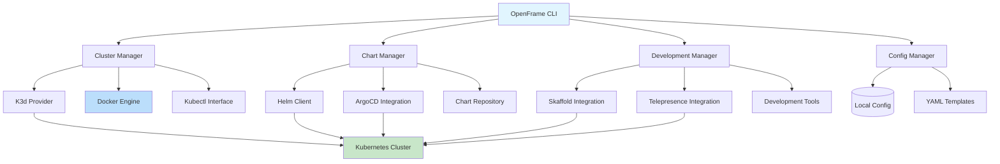
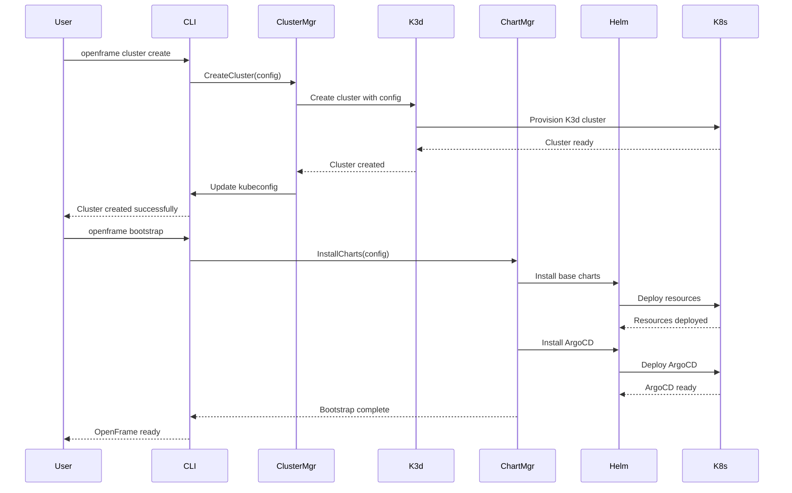

# OpenFrame CLI - Architecture Overview

A comprehensive guide to understanding the OpenFrame CLI architecture and codebase structure.

## 🏗️ High-Level Architecture



## 📋 Main Components and Responsibilities

| Component | Responsibility | Key Features |
|-----------|---------------|--------------|
| **CLI Interface** | Command routing and user interaction | Interactive wizards, argument parsing, help system |
| **Cluster Manager** | K3d cluster lifecycle management | Create, start, stop, delete clusters; status monitoring |
| **Chart Manager** | Helm chart and ArgoCD management | Chart installation, dependency resolution, GitOps setup |
| **Development Manager** | Developer workflow tools | Skaffold integration, Telepresence traffic interception |
| **Config Manager** | Configuration and templates | Local config storage, YAML template rendering |
| **K3d Provider** | Kubernetes cluster provisioning | Local K3d cluster creation with load balancer support |
| **Docker Interface** | Container runtime management | Image pulling, container status, network management |
| **Kubectl Interface** | Kubernetes API interactions | Resource management, status checking, log retrieval |

## 🔄 Data Flow Architecture



## 🎯 Key Design Decisions and Patterns

### Design Patterns Used

<details>
<summary><strong>Command Pattern</strong></summary>

Each CLI command is implemented as a separate command struct with standardized interfaces:
- Consistent command structure across all operations
- Easy to add new commands and maintain existing ones
- Clear separation of concerns between CLI parsing and business logic

</details>

<details>
<summary><strong>Provider Pattern</strong></summary>

Kubernetes cluster providers (currently K3d) are abstracted through interfaces:
- Easy to add support for other cluster types (Kind, Minikube, etc.)
- Consistent API regardless of underlying provider
- Testable through mock implementations

</details>

<details>
<summary><strong>Configuration as Code</strong></summary>

All cluster and application configurations are stored as YAML templates:
- Version-controlled configuration
- Reproducible deployments
- Easy customization through template variables

</details>

### Key Decisions

> **💡 Pro Tip**: These decisions optimize for local development workflows while maintaining production-like environments.

| Decision | Rationale | Trade-offs |
|----------|-----------|------------|
| **K3d as Primary Provider** | Lightweight, fast startup, built-in load balancer | Limited to local development |
| **Helm + ArgoCD Integration** | Combines imperative setup with declarative GitOps | Initial complexity for simple deployments |
| **Interactive CLI Design** | Reduces cognitive load for new users | More code to maintain vs. flag-only approach |
| **Template-based Config** | Flexible, maintainable, version-controlled | Requires YAML knowledge |

## 📁 Directory Structure

```
openframe-cli/
├── cmd/                          # CLI command definitions
│   ├── bootstrap.go             # Bootstrap command implementation
│   ├── chart/                   # Chart management commands
│   │   ├── install.go
│   │   └── list.go
│   ├── cluster/                 # Cluster management commands
│   │   ├── create.go
│   │   ├── delete.go
│   │   ├── list.go
│   │   ├── start.go
│   │   ├── status.go
│   │   └── stop.go
│   ├── dev/                     # Development workflow commands
│   │   ├── intercept.go
│   │   └── scaffold.go
│   └── root.go                  # Root command and CLI setup
├── internal/                    # Private application code
│   ├── cluster/                 # Cluster management logic
│   │   ├── k3d.go              # K3d provider implementation
│   │   ├── manager.go          # Cluster manager
│   │   └── types.go            # Cluster-related types
│   ├── config/                  # Configuration management
│   │   ├── manager.go          # Config file handling
│   │   └── templates/          # YAML templates
│   ├── chart/                   # Chart and Helm management
│   │   ├── installer.go        # Helm chart installer
│   │   └── argocd.go          # ArgoCD integration
│   ├── dev/                     # Development tools
│   │   ├── skaffold.go         # Skaffold integration
│   │   └── telepresence.go     # Telepresence integration
│   └── utils/                   # Shared utilities
│       ├── docker.go           # Docker client wrapper
│       ├── kubectl.go          # Kubernetes client wrapper
│       └── spinner.go          # CLI progress indicators
├── pkg/                         # Public API packages
│   └── types/                   # Shared type definitions
├── docs/                        # Documentation
│   └── codewiki/               # Architecture documentation
├── scripts/                     # Build and development scripts
├── .goreleaser.yml             # Release configuration
├── go.mod                      # Go module definition
├── go.sum                      # Go module checksums
├── main.go                     # Application entry point
└── README.md                   # Project overview
```

### Directory Responsibilities

| Directory | Purpose | Key Files |
|-----------|---------|-----------|
| **`cmd/`** | CLI command definitions and argument parsing | Command implementations, flag definitions |
| **`internal/cluster/`** | Cluster lifecycle management | K3d provider, cluster creation/management logic |
| **`internal/config/`** | Configuration and template management | Config file handling, YAML templates |
| **`internal/chart/`** | Helm chart and ArgoCD operations | Chart installation, GitOps setup |
| **`internal/dev/`** | Development workflow tools | Skaffold and Telepresence integrations |
| **`internal/utils/`** | Shared utilities and clients | Docker, kubectl wrappers, UI components |
| **`pkg/`** | Public APIs and shared types | Exported interfaces and types |

> **📝 Note**: The `internal/` package structure follows Go best practices, ensuring internal implementation details remain private while exposing only necessary APIs through `pkg/`.

---

This architecture provides a solid foundation for extending OpenFrame CLI with additional cluster providers, development tools, and management capabilities while maintaining clean separation of concerns and testability.