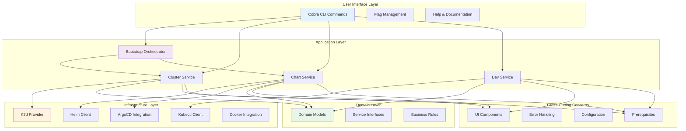
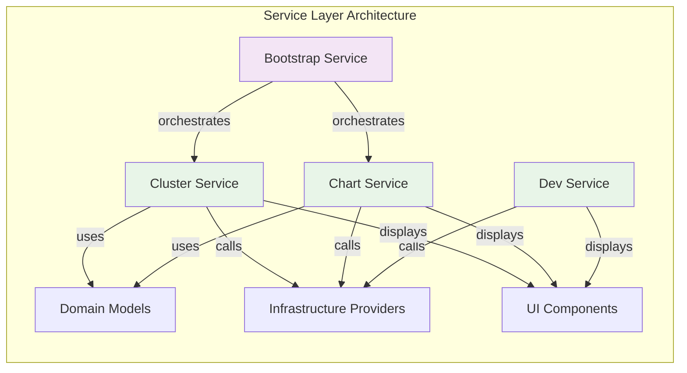
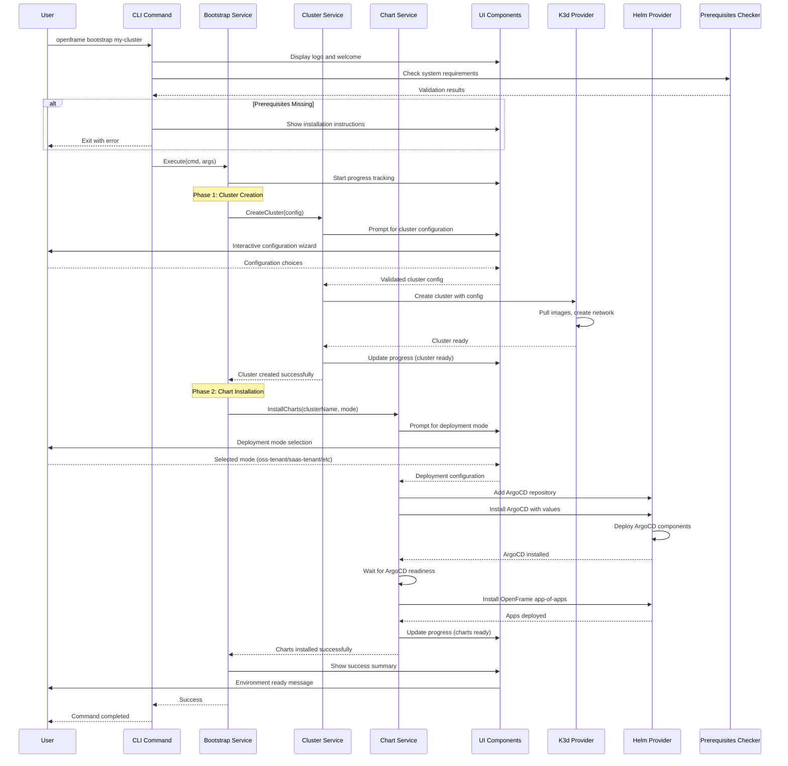
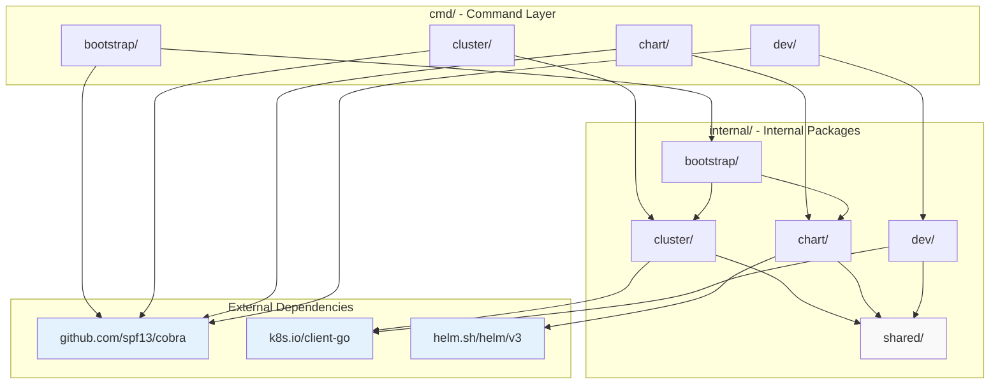

# OpenFrame CLI - Architecture Overview

This document provides a comprehensive technical overview of the OpenFrame CLI architecture, focusing on system design, component relationships, data flow, and key design patterns used throughout the codebase.

## High-Level Architecture

OpenFrame CLI follows a layered architecture with clear separation of concerns, making it maintainable, testable, and extensible.



## Core Components

### Command Layer (`cmd/`)

The command layer implements the CLI interface using the Cobra framework. Each command group has its own package with clear responsibilities.

| Component | Package | Responsibility | Key Files |
|-----------|---------|---------------|-----------|
| **Bootstrap** | `cmd/bootstrap/` | Complete environment setup orchestration | `bootstrap.go` |
| **Cluster Management** | `cmd/cluster/` | K3d cluster lifecycle operations | `cluster.go`, `create.go`, `delete.go`, `list.go`, `status.go`, `cleanup.go` |
| **Chart Management** | `cmd/chart/` | Helm/ArgoCD installation and management | `chart.go`, `install.go` |
| **Development Tools** | `cmd/dev/` | Local development workflow tools | `dev.go` |

#### Command Structure Pattern

```go
// Standard command structure used across all commands
func GetCommandCmd() *cobra.Command {
    cmd := &cobra.Command{
        Use:   "command [args]",
        Short: "Brief description", 
        Long:  "Detailed description with examples",
        Args:  cobra.MaximumNArgs(1),
        PreRunE: func(cmd *cobra.Command, args []string) error {
            // Validation and prerequisites
            return validatePrerequisites()
        },
        RunE: func(cmd *cobra.Command, args []string) error {
            // Delegate to service layer
            return service.Execute(cmd, args)
        },
    }
    
    // Add command-specific flags
    addFlags(cmd)
    return cmd
}
```

### Service Layer (`internal/*/services/`)

The service layer contains the core business logic, orchestrating interactions between different components while maintaining separation of concerns.



#### Service Interface Pattern

```go
// Standard service interface pattern
type ClusterService interface {
    CreateCluster(config models.ClusterConfig) error
    DeleteCluster(name string) error
    ListClusters() ([]models.Cluster, error)
    GetClusterStatus(name string) (*models.ClusterStatus, error)
    CleanupResources(name string) error
}

// Service implementation with dependency injection
type clusterService struct {
    k3dProvider   providers.K3dProvider
    ui           ui.ClusterUI
    prerequisites prerequisites.Checker
    logger       log.Logger
}
```

### Domain Layer (`internal/*/models/`)

The domain layer defines the core business entities, validation rules, and interfaces that represent the problem domain.

| Model Category | Purpose | Key Types |
|---------------|---------|-----------|
| **Cluster Models** | Cluster configuration and state | `ClusterConfig`, `ClusterStatus`, `ClusterType` |
| **Chart Models** | Chart installation and deployment | `DeploymentMode`, `ChartConfig`, `ArgoConfig` |
| **Dev Models** | Development workflow configuration | `InterceptConfig`, `SkaffoldConfig` |
| **Common Models** | Shared data structures | `GlobalFlags`, `Prerequisites`, `UIConfig` |

#### Model Validation Pattern

```go
// Domain models with embedded validation
type ClusterConfig struct {
    Name       string      `validate:"required,cluster_name"`
    Type       ClusterType `validate:"required,oneof=k3d kind"`
    K8sVersion string      `validate:"omitempty,k8s_version"`
    NodeCount  int         `validate:"min=1,max=10"`
    Ports      []PortMap   `validate:"dive"`
}

// Validation method pattern
func (c ClusterConfig) Validate() error {
    return validator.New().Struct(c)
}

// Custom validation rules
func ValidateClusterName(fl validator.FieldLevel) bool {
    name := fl.Field().String()
    return regexp.MustCompile(`^[a-z0-9-]+$`).MatchString(name)
}
```

## Data Flow Architecture

The following sequence diagram shows the typical data flow for the `openframe bootstrap` command, which demonstrates the interaction patterns used throughout the system.



## Key Design Patterns

### 1. Dependency Injection Pattern

Services receive their dependencies through constructor injection, making the code testable and modular.

```go
// Service constructor with dependency injection
func NewClusterService(
    k3dProvider providers.K3dProvider,
    ui ui.ClusterUI,
    prereq prerequisites.Checker,
    logger log.Logger,
) ClusterService {
    return &clusterService{
        k3dProvider:   k3dProvider,
        ui:           ui,
        prerequisites: prereq,
        logger:       logger,
    }
}

// Usage in command layer
func runCreateCluster(cmd *cobra.Command, args []string) error {
    // Dependencies injected during service creation
    service := utils.GetCommandService()
    return service.CreateCluster(config)
}
```

### 2. Provider Pattern for Infrastructure

Infrastructure concerns are abstracted behind provider interfaces, allowing easy testing and future extensibility.

```go
// Provider interface for cluster operations
type K3dProvider interface {
    CreateCluster(config K3dConfig) error
    DeleteCluster(name string) error  
    ListClusters() ([]K3dCluster, error)
    GetClusterStatus(name string) (*K3dStatus, error)
}

// Implementation can be swapped for testing
type k3dProvider struct {
    client k3d.Client
}

// Mock implementation for testing  
type mockK3dProvider struct {
    clusters map[string]*K3dCluster
}
```

### 3. UI Abstraction Pattern

User interface interactions are abstracted into dedicated UI components, separating presentation logic from business logic.

```go
// UI interface for cluster operations
type ClusterUI interface {
    ShowLogo()
    PromptClusterConfig(defaultName string) (ClusterConfig, error)
    ShowProgress(message string)
    ShowConfigurationSummary(config ClusterConfig, dryRun bool)
    ShowSuccess(cluster Cluster)
    ShowError(err error)
}

// Implementation handles all user interaction details
type clusterUI struct {
    interactive bool
    verbose     bool
}

func (ui *clusterUI) PromptClusterConfig(defaultName string) (ClusterConfig, error) {
    // Interactive prompts, validation, etc.
    return config, nil
}
```

### 4. Command Wrapper Pattern

Common command setup and error handling are abstracted into wrapper functions.

```go
// Command wrapper providing common functionality
func WrapCommandWithCommonSetup(runFunc func(*cobra.Command, []string) error) func(*cobra.Command, []string) error {
    return func(cmd *cobra.Command, args []string) error {
        // Common setup: logo, prerequisites, context
        ui.ShowLogo()
        
        if err := checkPrerequisites(); err != nil {
            return err
        }
        
        // Execute the actual command
        if err := runFunc(cmd, args); err != nil {
            ui.ShowError(err)
            return err
        }
        
        return nil
    }
}
```

## Module Dependencies and Relationships

### Internal Module Structure



### Dependency Rules

| Layer | Can Import From | Cannot Import From | Rationale |
|-------|-----------------|-------------------|-----------|
| **cmd/** | `internal/*`, external packages | Other `cmd/*` packages | Commands are entry points, not shared |
| **internal/services/** | `internal/models`, `internal/providers`, external | `cmd/*`, other service packages | Services are independent business logic |
| **internal/models/** | Standard library, validation packages | `internal/services`, `cmd/*` | Models are pure domain objects |
| **internal/providers/** | `internal/models`, external clients | `internal/services`, `cmd/*` | Providers are infrastructure adapters |
| **internal/shared/** | Standard library, common external packages | Other `internal/*` packages except models | Shared utilities only |

## Performance and Scalability Considerations

### Resource Management

```go
// Resource cleanup pattern used throughout
type ResourceManager interface {
    Acquire() error
    Release() error
}

// Example: Docker resource management
type dockerResourceManager struct {
    containers []string
    networks   []string
}

func (r *dockerResourceManager) Acquire() error {
    // Create resources
    return nil
}

func (r *dockerResourceManager) Release() error {
    // Cleanup containers, networks, volumes
    for _, container := range r.containers {
        docker.RemoveContainer(container)
    }
    return nil
}
```

### Concurrent Operations

```go
// Safe concurrent operations with proper synchronization
type ClusterCache struct {
    mu       sync.RWMutex
    clusters map[string]*ClusterInfo
}

func (c *ClusterCache) GetCluster(name string) (*ClusterInfo, bool) {
    c.mu.RLock()
    defer c.mu.RUnlock()
    cluster, exists := c.clusters[name]
    return cluster, exists
}

func (c *ClusterCache) UpdateCluster(name string, info *ClusterInfo) {
    c.mu.Lock()
    defer c.mu.Unlock()
    c.clusters[name] = info
}
```

### Memory Optimization

- **Lazy Loading**: Cluster information loaded on-demand
- **Resource Pooling**: Docker client connections reused
- **Stream Processing**: Large outputs (logs, events) processed as streams
- **Context Cancellation**: Operations can be cancelled gracefully

## Error Handling Strategy

### Error Hierarchy

```go
// Custom error types with context
type OpenFrameError struct {
    Code    ErrorCode
    Message string
    Cause   error
    Context map[string]interface{}
}

type ErrorCode string

const (
    ErrClusterExists     ErrorCode = "CLUSTER_EXISTS"
    ErrClusterNotFound   ErrorCode = "CLUSTER_NOT_FOUND"
    ErrInvalidConfig     ErrorCode = "INVALID_CONFIG"
    ErrPrerequisites     ErrorCode = "PREREQUISITES_FAILED"
    ErrInfrastructure    ErrorCode = "INFRASTRUCTURE_ERROR"
)

// Error wrapping with context
func WrapError(err error, code ErrorCode, message string) error {
    return &OpenFrameError{
        Code:    code,
        Message: message,
        Cause:   err,
        Context: map[string]interface{}{
            "timestamp": time.Now(),
            "version":   version.GetVersion(),
        },
    }
}
```

### Error Recovery Patterns

```go
// Retry with exponential backoff
func (s *clusterService) CreateClusterWithRetry(config ClusterConfig) error {
    return retry.Do(
        func() error {
            return s.k3dProvider.CreateCluster(config)
        },
        retry.Attempts(3),
        retry.Delay(time.Second),
        retry.DelayType(retry.BackOffDelay),
        retry.OnRetry(func(n uint, err error) {
            s.logger.Warnf("Cluster creation attempt %d failed: %v", n+1, err)
        }),
    )
}

// Graceful degradation
func (s *chartService) InstallWithFallback(config ChartConfig) error {
    // Try ArgoCD installation
    if err := s.installArgoCD(config); err != nil {
        s.logger.Warnf("ArgoCD installation failed: %v", err)
        
        // Fallback to direct Helm installation
        s.ui.ShowWarning("Falling back to direct Helm installation")
        return s.installHelmCharts(config)
    }
    return nil
}
```

## Testing Architecture

### Testing Pyramid

```mermaid
pyramid
    title OpenFrame CLI Testing Strategy
    
    level1: Unit Tests
        - Service layer logic
        - Model validation
        - UI components
        - Provider implementations
        
    level2: Integration Tests
        - Command execution
        - Service interactions  
        - External tool integration
        - Configuration handling
        
    level3: End-to-End Tests
        - Full workflow scenarios
        - CLI command combinations
        - Real cluster operations
```

### Test Patterns

```go
// Service testing with mocked dependencies
func TestClusterService_CreateCluster(t *testing.T) {
    // Setup
    mockProvider := &mockK3dProvider{}
    mockUI := &mockClusterUI{}
    service := NewClusterService(mockProvider, mockUI, nil, nil)
    
    config := ClusterConfig{
        Name: "test-cluster",
        Type: ClusterTypeK3d,
        NodeCount: 1,
    }
    
    // Execute
    err := service.CreateCluster(config)
    
    // Assert
    assert.NoError(t, err)
    assert.True(t, mockProvider.CreateClusterCalled)
    assert.Equal(t, "test-cluster", mockProvider.LastConfig.Name)
}

// Integration testing with real dependencies
func TestBootstrapIntegration(t *testing.T) {
    if testing.Short() {
        t.Skip("Skipping integration test in short mode")
    }
    
    // Setup test environment
    testCluster := "test-bootstrap-" + uuid.New().String()[:8]
    
    // Cleanup
    defer func() {
        exec.Command("openframe", "cluster", "delete", testCluster).Run()
    }()
    
    // Execute bootstrap
    cmd := exec.Command("openframe", "bootstrap", testCluster, "--non-interactive")
    output, err := cmd.CombinedOutput()
    
    // Assert
    assert.NoError(t, err)
    assert.Contains(t, string(output), "Bootstrap completed successfully")
}
```

## Future Architecture Considerations

### Extensibility Points

1. **Plugin System**: Design interfaces for future plugin support
2. **Multiple Providers**: Abstract cluster providers for kind, minikube, etc.
3. **Custom Charts**: Support for user-defined chart repositories
4. **Remote Clusters**: Extend beyond local development clusters

### Scalability Improvements

1. **Parallel Operations**: Concurrent cluster operations
2. **Caching Layer**: Persistent cache for cluster state
3. **Event System**: Pub/sub for cross-component communication
4. **Configuration Management**: Advanced config file support

---

This architecture overview provides the foundation for understanding and extending the OpenFrame CLI codebase. For specific implementation details, refer to the inline code documentation and the [Developer Getting Started Guide](getting-started-dev.md).