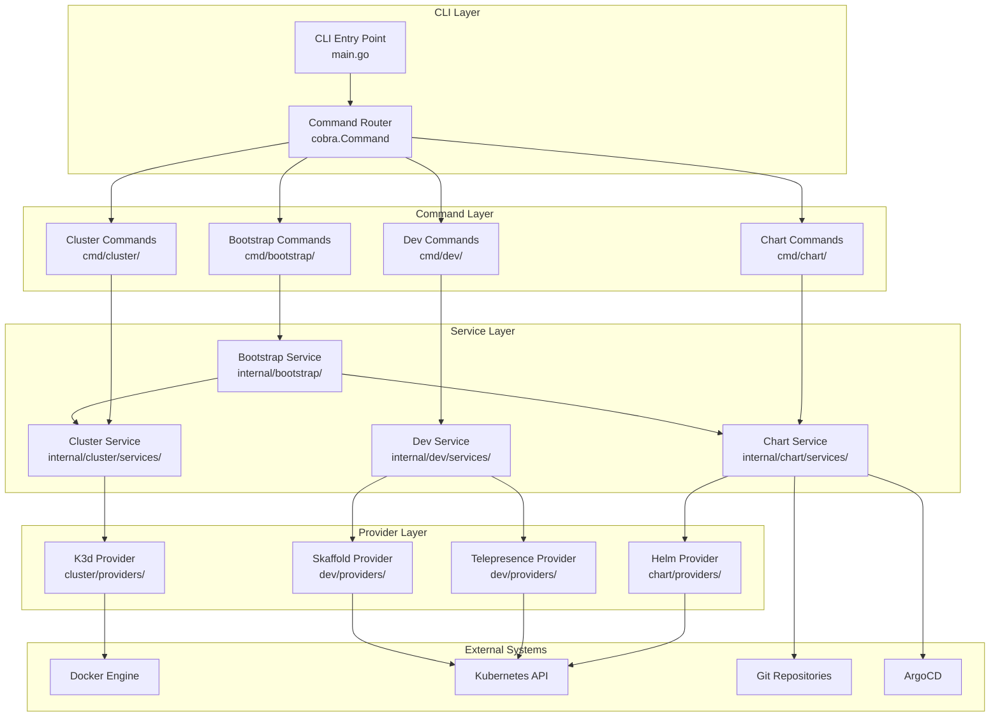
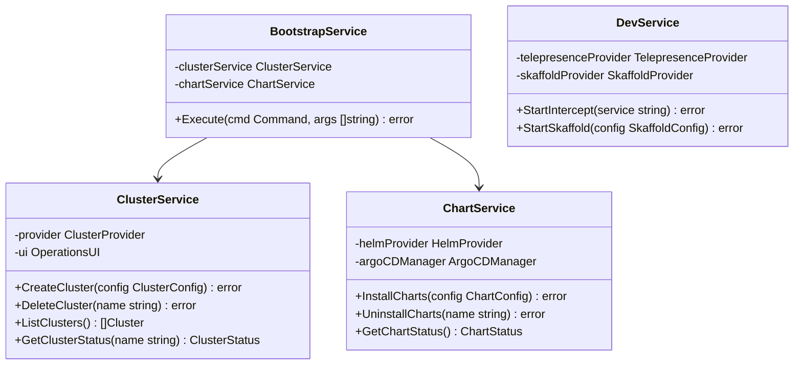
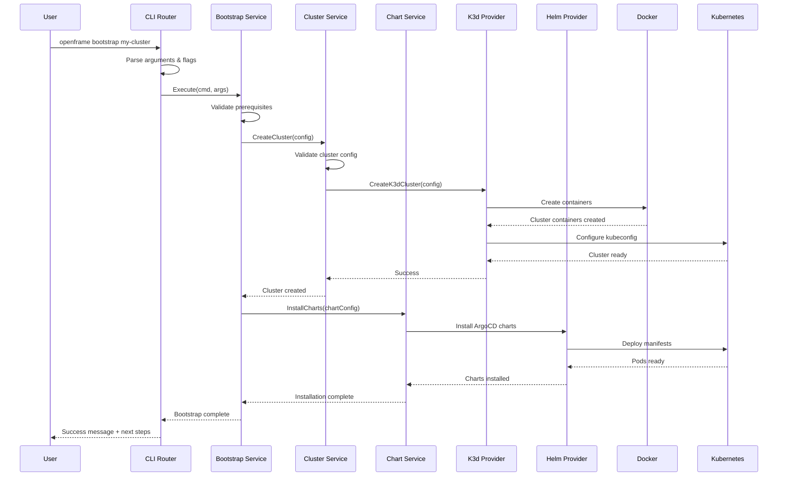
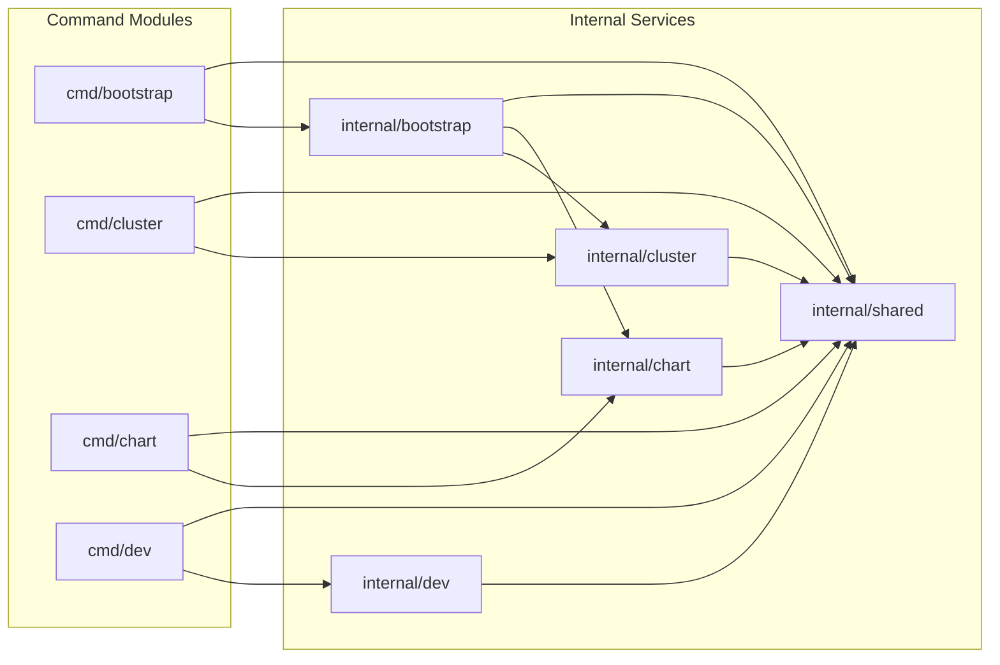

# OpenFrame CLI Architecture Overview

This document provides a comprehensive technical overview of the OpenFrame CLI architecture, designed for developers who need to understand the system's internal design, component relationships, and data flow patterns.

## High-Level Architecture

The OpenFrame CLI follows a layered, modular architecture that separates concerns between user interface, business logic, and external system integrations.



## Core Components

### 1. Command Layer (`cmd/`)

The command layer handles CLI argument parsing, flag validation, and user input/output formatting.

| Component | Location | Responsibility |
|-----------|----------|----------------|
| **Bootstrap Command** | `cmd/bootstrap/` | Orchestrates complete environment setup |
| **Cluster Commands** | `cmd/cluster/` | Manages K3d cluster lifecycle operations |
| **Chart Commands** | `cmd/chart/` | Handles Helm chart and ArgoCD management |
| **Dev Commands** | `cmd/dev/` | Provides development workflow tools |

#### Command Structure Pattern

```go
// Standard command structure
func GetCommandCmd() *cobra.Command {
    cmd := &cobra.Command{
        Use:     "command [args]",
        Short:   "Brief description",
        Long:    "Detailed description with examples",
        PreRunE: validateFlags,                    // Flag validation
        RunE:    utils.WrapCommandWithCommonSetup(runCommand), // Main logic
    }
    
    // Add flags specific to this command
    addCommandFlags(cmd)
    return cmd
}
```

### 2. Service Layer (`internal/*/services/`)

The service layer contains business logic and coordinates between UI components and external providers.



### 3. Model Layer (`internal/*/models/`)

Defines data structures, validation rules, and configuration management.

```go
// Core data structures
type ClusterConfig struct {
    Name       string      `yaml:"name" validate:"required,cluster_name"`
    Type       ClusterType `yaml:"type" validate:"required,oneof=k3d kind"`
    NodeCount  int         `yaml:"nodes" validate:"min=1,max=10"`
    K8sVersion string      `yaml:"k8s_version" validate:"semver"`
    Ports      []PortMap   `yaml:"ports,omitempty"`
}

type ClusterType string

const (
    ClusterTypeK3d  ClusterType = "k3d"
    ClusterTypeKind ClusterType = "kind"
)
```

### 4. Provider Layer (`internal/*/providers/`)

Handles integration with external tools and systems.

| Provider | Purpose | External Tool |
|----------|---------|---------------|
| **K3dProvider** | Manages K3d cluster operations | K3d CLI, Docker |
| **HelmProvider** | Handles Helm chart installations | Helm CLI, Kubernetes API |
| **TelepresenceProvider** | Manages traffic interception | Telepresence CLI |
| **SkaffoldProvider** | Development workflow automation | Skaffold CLI |

### 5. Shared Components (`internal/shared/`)

Cross-cutting concerns used across multiple modules.

| Component | Purpose |
|-----------|---------|
| **UI Components** | Interactive prompts, progress bars, formatting |
| **Error Handling** | Standardized error types and user-friendly messages |
| **Prerequisites** | Tool validation and installation guidance |
| **Configuration** | Common configuration file handling |

## Data Flow Architecture

The following diagram shows how data flows through the system during a typical bootstrap operation:



## Module Dependencies

### Internal Module Relationships



### External Dependencies

| Category | Dependencies | Usage |
|----------|-------------|--------|
| **CLI Framework** | cobra, pflag | Command structure, argument parsing |
| **Kubernetes** | client-go, kubectl | API interactions, cluster management |
| **Container Runtime** | docker/api | Container lifecycle, image management |
| **Configuration** | yaml.v3, viper | Config file parsing, environment variables |
| **UI/UX** | survey, lipgloss | Interactive prompts, terminal formatting |
| **Validation** | validator/v10 | Input validation, struct validation |
| **Testing** | testify, gomock | Unit testing, mocking |

## Key Design Patterns

### 1. Command Pattern with Cobra

Each command is self-contained with its own configuration and execution logic:

```go
type Command interface {
    Execute(cmd *cobra.Command, args []string) error
}

func WrapCommandWithCommonSetup(fn func(*cobra.Command, []string) error) func(*cobra.Command, []string) error {
    return func(cmd *cobra.Command, args []string) error {
        // Common setup: logging, UI initialization, etc.
        if err := initializeCommonResources(); err != nil {
            return err
        }
        
        // Execute the actual command
        return fn(cmd, args)
    }
}
```

### 2. Provider Pattern for External Integrations

```go
type ClusterProvider interface {
    CreateCluster(config ClusterConfig) error
    DeleteCluster(name string) error
    ListClusters() ([]Cluster, error)
    GetClusterInfo(name string) (*Cluster, error)
}

type K3dProvider struct {
    dockerClient *docker.Client
    kubeClient   kubernetes.Interface
}

func (p *K3dProvider) CreateCluster(config ClusterConfig) error {
    // K3d-specific implementation
}
```

### 3. Service Layer Pattern

Services orchestrate between UI, validation, and providers:

```go
type ClusterService struct {
    provider    ClusterProvider
    ui          OperationsUI
    validator   ConfigValidator
}

func (s *ClusterService) CreateCluster(config ClusterConfig) error {
    // 1. Validate configuration
    if err := s.validator.ValidateClusterConfig(config); err != nil {
        return fmt.Errorf("invalid configuration: %w", err)
    }
    
    // 2. Show progress to user
    s.ui.ShowCreateProgress(config)
    
    // 3. Delegate to provider
    if err := s.provider.CreateCluster(config); err != nil {
        return fmt.Errorf("cluster creation failed: %w", err)
    }
    
    // 4. Show success
    s.ui.ShowCreateSuccess(config)
    return nil
}
```

### 4. UI Abstraction Pattern

UI components are abstracted to allow for different presentation modes:

```go
type OperationsUI interface {
    ShowCreateProgress(config ClusterConfig)
    ShowCreateSuccess(config ClusterConfig)
    ShowError(err error)
}

type InteractiveUI struct{}
type SilentUI struct{}
type VerboseUI struct{}

// Each implements OperationsUI differently
```

## Configuration Management

### Configuration Hierarchy

1. **Command-line flags** (highest priority)
2. **Environment variables** 
3. **Configuration files** (`~/.openframe/config.yaml`)
4. **Default values** (lowest priority)

### Configuration Structure

```yaml
# ~/.openframe/config.yaml
default_cluster:
  type: k3d
  nodes: 3
  k8s_version: "v1.27.0"

default_deployment:
  mode: oss-tenant
  
preferences:
  non_interactive: false
  verbose: false
  auto_cleanup: true

repositories:
  charts: "https://charts.openframe.dev"
  manifests: "https://github.com/openframe/manifests"
```

## Error Handling Strategy

### Error Types

```go
// Domain-specific errors
type ClusterError struct {
    Operation string
    Cluster   string
    Cause     error
}

func (e *ClusterError) Error() string {
    return fmt.Sprintf("cluster %s %s failed: %v", e.Cluster, e.Operation, e.Cause)
}

// User-friendly error messages
type UserError struct {
    Message     string
    Suggestions []string
}
```

### Error Propagation

```go
func (s *ClusterService) CreateCluster(config ClusterConfig) error {
    if err := s.provider.CreateCluster(config); err != nil {
        // Wrap with context and user-friendly suggestions
        return &UserError{
            Message: fmt.Sprintf("Failed to create cluster '%s'", config.Name),
            Suggestions: []string{
                "Check if Docker is running",
                "Ensure port 6443 is not in use",
                "Try 'openframe cluster cleanup' to remove stuck resources",
            },
        }
    }
    return nil
}
```

## Performance Considerations

### Asynchronous Operations

```go
type ProgressTracker interface {
    StartTask(name string) TaskTracker
    CompleteTask(tracker TaskTracker)
}

func (s *ClusterService) CreateCluster(config ClusterConfig) error {
    tracker := s.ui.StartTask("Creating cluster")
    defer s.ui.CompleteTask(tracker)
    
    // Long-running operation with progress updates
    return s.provider.CreateClusterAsync(config, tracker.UpdateProgress)
}
```

### Resource Management

- **Connection pooling** for Kubernetes clients
- **Lazy loading** of heavy dependencies
- **Resource cleanup** with defer statements and context cancellation
- **Memory management** for large cluster operations

## Security Considerations

### Access Control

- **Kubeconfig isolation** per cluster
- **Docker socket access** validation
- **File permission** checks for sensitive files

### Input Validation

```go
func ValidateClusterName(name string) error {
    if !regexp.MustCompile(`^[a-z0-9-]+$`).MatchString(name) {
        return errors.New("cluster name must contain only lowercase letters, numbers, and hyphens")
    }
    if len(name) > 63 {
        return errors.New("cluster name cannot exceed 63 characters")
    }
    return nil
}
```

## Testing Architecture

### Test Structure

```
internal/cluster/
├── services/
│   ├── cluster_service.go
│   └── cluster_service_test.go    # Unit tests
├── providers/
│   ├── k3d_provider.go
│   └── k3d_provider_test.go       # Provider tests
└── integration/
    └── cluster_integration_test.go # Integration tests
```

### Testing Patterns

- **Unit tests** for individual components with mocked dependencies
- **Integration tests** for provider interactions with real external systems
- **End-to-end tests** for complete command workflows
- **Contract tests** for provider interfaces

## Extensibility Points

### Adding New Cluster Providers

1. Implement the `ClusterProvider` interface
2. Register in the provider factory
3. Add provider-specific configuration options
4. Write tests for the new provider

### Adding New Commands

1. Create command structure in `cmd/` package
2. Implement business logic in `internal/` service
3. Add UI components if needed
4. Register command with root CLI

### Adding New Development Tools

1. Create provider for the new tool
2. Add commands to `cmd/dev/`
3. Implement service layer integration
4. Add configuration options

---

This architecture provides a solid foundation for extending OpenFrame CLI while maintaining clear separation of concerns and testability. The modular design allows for independent development and testing of components while ensuring consistent user experience across all operations.