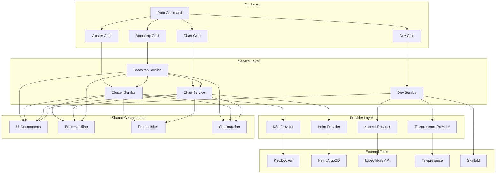
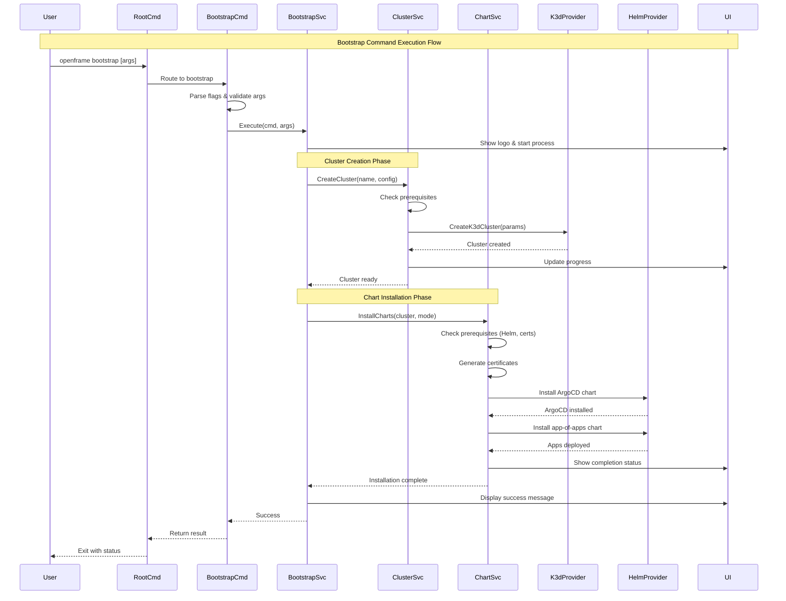
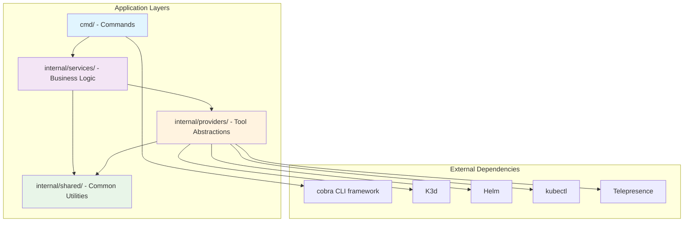

# OpenFrame CLI Architecture Overview

This document provides a comprehensive technical overview of the OpenFrame CLI architecture, design patterns, and implementation details for developers working on the codebase.

## High-Level Architecture

OpenFrame CLI follows a layered architecture pattern with clear separation of concerns between the command interface, business logic, and external tool integrations.



## Core Components

### Command Layer (`cmd/`)

The command layer implements the CLI interface using the Cobra framework. Each command is thin and delegates business logic to services.

| Component | File | Responsibility |
|-----------|------|---------------|
| **Root Command** | `cmd/root.go` | CLI entry point, version info, global flags |
| **Bootstrap Command** | `cmd/bootstrap/bootstrap.go` | Orchestrates cluster + chart installation |
| **Cluster Commands** | `cmd/cluster/*.go` | K3d cluster lifecycle management |
| **Chart Commands** | `cmd/chart/*.go` | Helm chart and ArgoCD operations |
| **Dev Commands** | `cmd/dev/*.go` | Development workflow tools |

#### Command Pattern Implementation

```go
// Standard command structure
func GetCommandCmd() *cobra.Command {
    cmd := &cobra.Command{
        Use:   "command [args]",
        Short: "Brief description",
        Long:  `Detailed description with examples`,
        RunE: func(cmd *cobra.Command, args []string) error {
            // Delegate to service layer
            return services.NewService().Execute(cmd, args)
        },
    }
    
    // Add command-specific flags
    cmd.Flags().String("flag", "", "Flag description")
    return cmd
}
```

### Service Layer (`internal/`)

The service layer contains business logic and orchestrates operations across multiple providers.

| Service | Package | Purpose |
|---------|---------|---------|
| **Bootstrap Service** | `internal/bootstrap/` | Coordinates cluster creation + chart installation |
| **Cluster Service** | `internal/cluster/` | K3d cluster management and status monitoring |
| **Chart Service** | `internal/chart/` | Helm chart installation and ArgoCD configuration |
| **Dev Service** | `internal/dev/` | Development tools (Telepresence, Skaffold) |

#### Service Responsibilities

```go
type Service interface {
    Execute(cmd *cobra.Command, args []string) error
    Validate(params ServiceParams) error
    ProcessResults(results ProviderResults) error
}
```

### Provider Layer

Providers abstract external tool integrations and provide consistent interfaces for different Kubernetes and development tools.

### Shared Components (`internal/shared/`)

| Component | Package | Purpose |
|-----------|---------|---------|
| **UI Components** | `internal/shared/ui/` | Interactive prompts, progress indicators, branding |
| **Error Handling** | `internal/shared/errors/` | Centralized error processing and display |
| **Configuration** | `internal/shared/config/` | Application configuration management |
| **Prerequisites** | Various `*/prerequisites/` | Tool validation and installation guidance |

## Data Flow Architecture

The following sequence diagram shows the typical data flow for the bootstrap command:



## Key Design Patterns

### 1. Command Pattern
Each CLI command follows the same pattern:
- Parse arguments and flags
- Delegate to appropriate service
- Handle errors consistently
- Display results through UI components

### 2. Service Orchestration Pattern
Services coordinate multiple operations:
```go
func (s *BootstrapService) Execute(cmd *cobra.Command, args []string) error {
    // Phase 1: Cluster creation
    if err := s.clusterService.Create(clusterName); err != nil {
        return fmt.Errorf("cluster creation failed: %w", err)
    }
    
    // Phase 2: Chart installation
    if err := s.chartService.Install(clusterName, deploymentMode); err != nil {
        return fmt.Errorf("chart installation failed: %w", err)
    }
    
    return nil
}
```

### 3. Provider Abstraction Pattern
External tools are abstracted behind provider interfaces:
```go
type K3dProvider interface {
    CreateCluster(name string, config ClusterConfig) error
    DeleteCluster(name string) error
    ListClusters() ([]Cluster, error)
    GetClusterStatus(name string) (*ClusterStatus, error)
}
```

### 4. Progressive Enhancement Pattern
CLI supports both interactive and non-interactive modes:
```go
if nonInteractive {
    // Use flags and default values
    config = buildConfigFromFlags(cmd)
} else {
    // Use interactive prompts
    config = promptForConfig(ui)
}
```

## Module Dependencies

The dependency graph shows clear layering without circular dependencies:



### Dependency Rules

1. **Commands** only depend on services and cobra
2. **Services** depend on providers and shared utilities
3. **Providers** depend only on shared utilities and external tools
4. **Shared utilities** have no internal dependencies
5. **No circular dependencies** between any modules

## Error Handling Strategy

### Centralized Error Processing

All services use a shared error handler for consistent display:

```go
// Service layer
if err := operation(); err != nil {
    return sharedErrors.HandleGlobalError(err, verbose)
}

// Error handler provides consistent formatting
func HandleGlobalError(err error, verbose bool) error {
    if verbose {
        return fmt.Errorf("detailed error: %w", err)
    }
    return fmt.Errorf("user-friendly message: %s", err.Error())
}
```

### Error Categories

| Category | Handling Strategy | Example |
|----------|------------------|---------|
| **User Input Errors** | Immediate feedback with suggestions | Invalid cluster name format |
| **Prerequisite Errors** | Guidance for tool installation | kubectl not found |
| **External Tool Errors** | Wrapped with context | K3d cluster creation failed |
| **Configuration Errors** | Clear fix instructions | Invalid deployment mode |

## Configuration Management

### Configuration Sources (Priority Order)

1. **Command-line flags** (highest priority)
2. **Environment variables** 
3. **Configuration files**
4. **Interactive prompts**
5. **Default values** (lowest priority)

### Configuration Flow

```go
type Config struct {
    ClusterName    string
    DeploymentMode string
    Verbose        bool
    NonInteractive bool
}

func BuildConfig(cmd *cobra.Command) (*Config, error) {
    config := &Config{}
    
    // 1. Apply defaults
    config.ApplyDefaults()
    
    // 2. Load from config file
    if err := config.LoadFromFile(); err != nil {
        return nil, err
    }
    
    // 3. Apply environment variables
    config.ApplyEnvironment()
    
    // 4. Apply command flags
    config.ApplyFlags(cmd)
    
    // 5. Validate final configuration
    return config, config.Validate()
}
```

## UI and User Experience

### Interactive Components

The CLI provides consistent interactive experiences:

```go
// Logo display
ui.ShowLogo()

// Progress indicators
progress := ui.NewProgressBar("Creating cluster...")
progress.Start()
// ... operations ...
progress.Complete()

// User prompts
clusterName := ui.PromptString("Cluster name:", "openframe")
deploymentMode := ui.PromptSelect("Deployment mode:", modes)

// Error display
ui.ShowError(err, verbose)
```

### Non-Interactive Mode

All interactive prompts have non-interactive alternatives:

```go
if nonInteractive {
    // Use flag values or defaults
    config.ClusterName = flagValue
} else {
    // Prompt user
    config.ClusterName = ui.PromptString("Cluster name:", defaultValue)
}
```

## Testing Architecture

### Test Layers

| Test Type | Location | Purpose | Examples |
|-----------|----------|---------|----------|
| **Unit Tests** | `*_test.go` | Test individual functions | Service method validation |
| **Integration Tests** | `internal/*/integration_test.go` | Test component interactions | Service + provider integration |
| **CLI Tests** | `cmd/*/cmd_test.go` | Test command behavior | Flag parsing, help text |
| **End-to-End Tests** | `e2e/` | Full workflow testing | Complete bootstrap process |

### Test Utilities

```go
// Mock providers for testing
type MockK3dProvider struct {
    clusters map[string]*Cluster
}

func (m *MockK3dProvider) CreateCluster(name string, config ClusterConfig) error {
    m.clusters[name] = &Cluster{Name: name, Status: "running"}
    return nil
}

// Test helpers
func setupTestCluster(t *testing.T) (*Cluster, func()) {
    cluster := createTestCluster()
    cleanup := func() { deleteTestCluster(cluster.Name) }
    return cluster, cleanup
}
```

## Performance Considerations

### Optimization Strategies

1. **Lazy Loading**: External tool checks only when needed
2. **Caching**: Cluster status and tool availability
3. **Parallel Operations**: Independent prerequisite checks
4. **Resource Cleanup**: Automatic cleanup of failed operations

### Resource Management

```go
// Context-based timeouts
ctx, cancel := context.WithTimeout(context.Background(), 5*time.Minute)
defer cancel()

// Resource cleanup
defer func() {
    if err := cleanup(); err != nil {
        log.Warnf("Cleanup failed: %v", err)
    }
}()
```

## Extension Points

### Adding New Commands

1. **Create command file** in appropriate `cmd/` directory
2. **Implement service** in `internal/`
3. **Add provider** if external tool integration needed
4. **Register command** in parent command
5. **Add tests** and documentation

### Adding New Providers

1. **Define interface** in appropriate service package
2. **Implement provider** with external tool integration
3. **Add prerequisite checks** for required tools
4. **Mock for testing**
5. **Document configuration options**

## Security Considerations

### Tool Execution Safety

```go
// Validate external command inputs
func validateClusterName(name string) error {
    if matched, _ := regexp.MatchString(`^[a-zA-Z0-9-]+$`, name); !matched {
        return fmt.Errorf("invalid cluster name: %s", name)
    }
    return nil
}

// Secure external command execution
cmd := exec.Command("k3d", "cluster", "create", validatedName)
cmd.Env = sanitizedEnvironment()
```

### Configuration Security

- **No secrets in logs**: Sensitive data filtered from verbose output
- **File permissions**: Configuration files have appropriate permissions
- **Input validation**: All user inputs validated before processing

## Monitoring and Observability

### Logging Strategy

```go
// Structured logging with levels
log.WithFields(log.Fields{
    "cluster": clusterName,
    "command": "create",
}).Info("Creating cluster")

// Error context preservation
log.WithError(err).Error("Failed to create cluster")
```

### Debugging Support

- **Verbose mode**: Detailed operation logs
- **Progress indicators**: Real-time status updates
- **Error context**: Clear error messages with suggested fixes
- **Status commands**: Comprehensive system state inspection

This architecture provides a solid foundation for the OpenFrame CLI, enabling maintainable code, consistent user experience, and reliable Kubernetes cluster management.