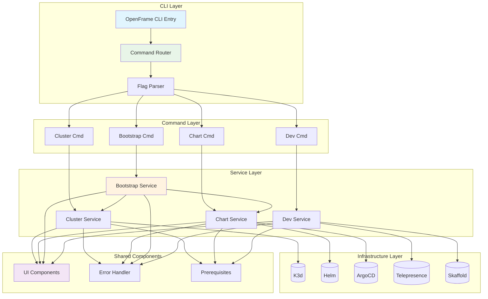
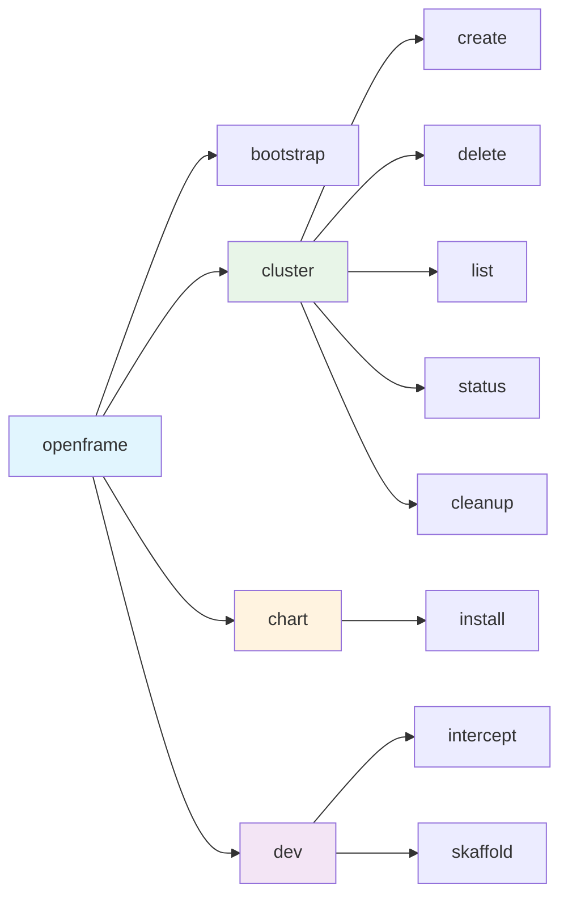
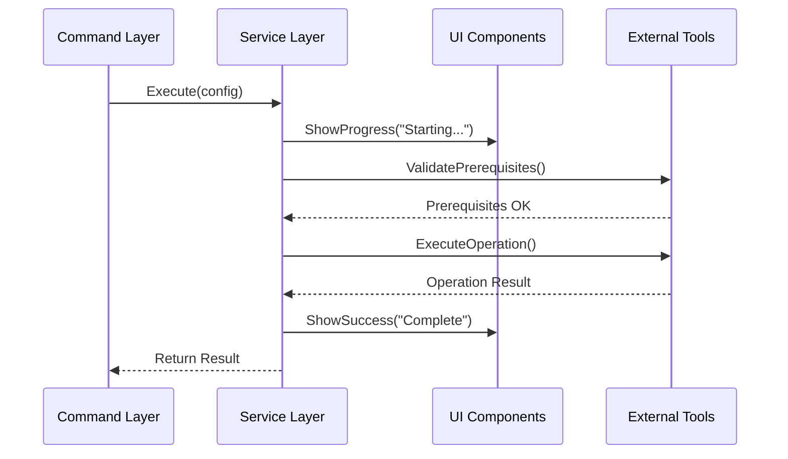
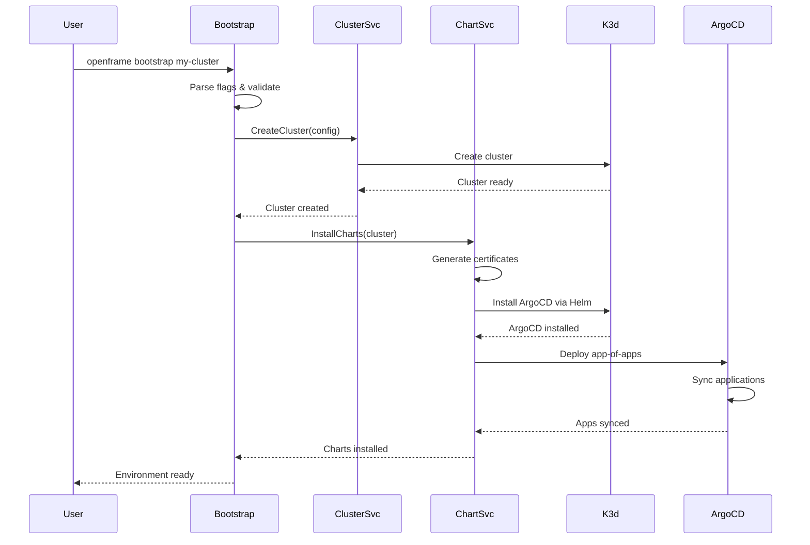
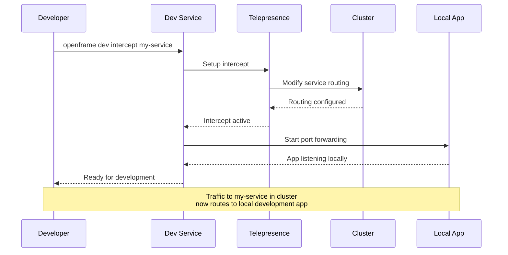
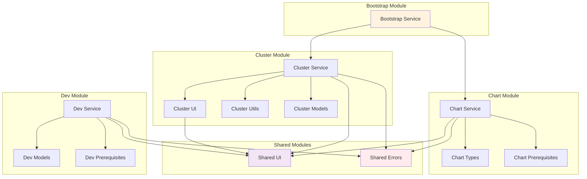
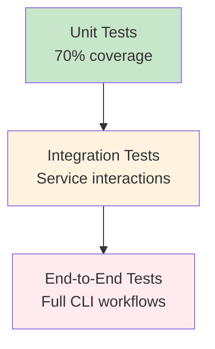

# OpenFrame CLI Architecture Overview

This document provides a comprehensive technical overview of the OpenFrame CLI architecture, including core components, design patterns, and data flow diagrams.

## High-Level Architecture

OpenFrame CLI follows a modular command-driven architecture built on the Cobra CLI framework, with clear separation between presentation logic, business services, and external tool integrations.



## Core Components

### Command Layer Components

| Component | Package | Responsibilities | Dependencies |
|-----------|---------|------------------|--------------|
| **Bootstrap Command** | `cmd/bootstrap/` | Orchestrates complete environment setup | Cluster Service, Chart Service |
| **Cluster Commands** | `cmd/cluster/` | K3d cluster lifecycle management | Cluster Service, K3d |
| **Chart Commands** | `cmd/chart/` | Helm chart and ArgoCD management | Chart Service, Helm, ArgoCD |
| **Dev Commands** | `cmd/dev/` | Development workflow tools | Dev Service, Telepresence, Skaffold |

### Service Layer Components

| Service | Package | Core Functions | External Tools |
|---------|---------|----------------|----------------|
| **Bootstrap Service** | `internal/bootstrap/` | End-to-end environment orchestration | Delegates to Cluster + Chart services |
| **Cluster Service** | `internal/cluster/` | K3d cluster CRUD operations, status monitoring | K3d, Docker |
| **Chart Service** | `internal/chart/` | ArgoCD installation, app-of-apps deployment | Helm, ArgoCD, Git repositories |
| **Dev Service** | `internal/dev/` | Traffic interception, live reload workflows | Telepresence, Skaffold |

### Shared Components

| Component | Package | Purpose | Usage |
|-----------|---------|---------|-------|
| **UI Components** | `internal/shared/ui/` | Interactive menus, progress indicators, logo display | All commands for user interaction |
| **Error Handler** | `internal/shared/errors/` | Centralized error formatting and logging | All services for consistent error handling |
| **Prerequisites** | `*/prerequisites/` | Tool validation and installation | Per-module validation of external dependencies |

## Detailed Component Architecture

### 1. Command Layer Design

The command layer uses the Cobra framework with a hierarchical structure:



#### Flag Management Pattern
```go
// Global flags are managed through utils package
type GlobalFlags struct {
    Create *CreateFlags
    Verbose bool
    DryRun bool
}

// Each command adds specific flags
func addCreateFlags(cmd *cobra.Command, flags *CreateFlags) {
    cmd.Flags().IntVar(&flags.Nodes, "nodes", 1, "Number of nodes")
    cmd.Flags().StringVar(&flags.Type, "type", "k3d", "Cluster type")
}
```

### 2. Service Layer Architecture

Services implement business logic and coordinate external tool interactions:



#### Service Interface Pattern
```go
// Common interface pattern for services
type ClusterService interface {
    Create(ctx context.Context, config ClusterConfig) error
    Delete(ctx context.Context, name string) error
    List(ctx context.Context) ([]Cluster, error)
    Status(ctx context.Context, name string) (*ClusterStatus, error)
}

// Implementation with dependency injection
type service struct {
    ui     ui.Handler
    k3d    k3d.Client
    errors errors.Handler
}
```

### 3. Data Flow Patterns

#### Bootstrap Flow (Complete Environment Setup)



#### Development Workflow Integration



## Design Patterns and Principles

### 1. Command Pattern Implementation
Each CLI command follows the command pattern with clear separation:
- **Command**: Defines interface and flags (`cmd/` packages)
- **Invoker**: Cobra framework handles execution
- **Receiver**: Service layer implements business logic (`internal/` packages)

### 2. Dependency Injection
Services use constructor injection for testability:
```go
func NewClusterService(ui ui.Handler, k3d k3d.Client) ClusterService {
    return &service{
        ui:  ui,
        k3d: k3d,
    }
}
```

### 3. Interface Segregation
Interfaces are focused and role-specific:
```go
// UI interfaces are action-specific
type ProgressReporter interface {
    StartProgress(message string)
    UpdateProgress(percentage int)
    StopProgress(success bool)
}

type UserPrompter interface {
    PromptSelect(options []string) (int, error)
    PromptConfirm(message string) bool
}
```

### 4. Error Handling Strategy
Centralized error handling with context preservation:
```go
// Errors include context and suggested actions
type OpenFrameError struct {
    Operation string
    Cause     error
    Suggestion string
}

func (e *OpenFrameError) Error() string {
    return fmt.Sprintf("%s failed: %v\nSuggestion: %s", 
        e.Operation, e.Cause, e.Suggestion)
}
```

## Module Dependencies

### Internal Module Relationships



### External Dependencies

| Category | Tools | Integration Method | Purpose |
|----------|-------|-------------------|----------|
| **Container Runtime** | Docker | Direct CLI calls | K3d cluster node management |
| **Kubernetes Distribution** | K3d | Go client library | Local cluster creation and management |
| **Package Management** | Helm | CLI integration | Chart installation and management |
| **GitOps** | ArgoCD | Kubernetes API + Web UI | Application deployment and synchronization |
| **Development Tools** | Telepresence, Skaffold | CLI integration | Local development workflows |

## Configuration Management

### Configuration Hierarchy
1. **Command-line flags** (highest priority)
2. **Environment variables**
3. **Configuration files** (`~/.openframe/config.yaml`)
4. **Default values** (lowest priority)

### Configuration Structure
```yaml
# ~/.openframe/config.yaml
clusters:
  default_type: k3d
  default_nodes: 1
  registry_mirror: docker.io

charts:
  github_repo: https://github.com/flamingo-stack/openframe-apps
  github_branch: main
  argocd_version: 8.2.7

development:
  telepresence_timeout: 300s
  skaffold_profile: dev
```

## Performance Considerations

### Resource Management
- **Cluster Resources**: K3d clusters consume ~1GB RAM per cluster
- **Concurrent Operations**: Limited to prevent Docker daemon overload
- **Caching**: Helm charts and Docker images cached locally

### Optimization Strategies
- **Lazy Loading**: Services initialized only when needed
- **Connection Pooling**: Kubernetes clients reused across operations
- **Progress Feedback**: Long operations show progress to improve UX

## Security Architecture

### Credential Management
- **Kubernetes Contexts**: Managed through standard kubeconfig
- **Certificate Generation**: Automatic TLS cert creation for local development
- **Secret Handling**: No hardcoded secrets, environment-based configuration

### Network Security
- **Local-only**: All clusters created for local development
- **Ingress Control**: Configurable ingress controllers for service exposure
- **Network Policies**: Support for Kubernetes network policy testing

## Testing Strategy

### Test Pyramid Structure


#### Testing Approach
- **Unit Tests**: Mock external dependencies, test business logic
- **Integration Tests**: Test service interactions with real tools
- **End-to-End Tests**: Full CLI command execution against real clusters

## Extension Points

### Adding New Commands
1. Create command package in `cmd/newcommand/`
2. Implement service in `internal/newcommand/`
3. Add to main command router
4. Include prerequisites validation
5. Add comprehensive tests

### External Tool Integration
1. Create client interface in service package
2. Implement prerequisite checking
3. Add configuration options
4. Include error handling and user feedback

---

## Summary

The OpenFrame CLI architecture provides:

✅ **Modularity**: Clear separation between commands, services, and tools  
✅ **Extensibility**: Easy to add new commands and external tool integrations  
✅ **Testability**: Interfaces and dependency injection enable comprehensive testing  
✅ **User Experience**: Consistent UI patterns and error handling across all operations  
✅ **Maintainability**: Well-defined patterns and clear module boundaries  

This architecture supports the goal of providing a unified, user-friendly interface for complex Kubernetes development workflows while maintaining code quality and developer productivity.