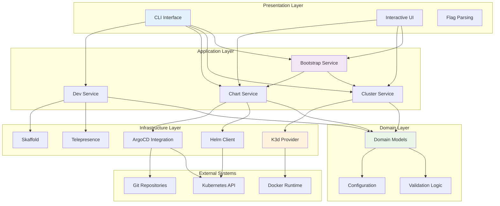
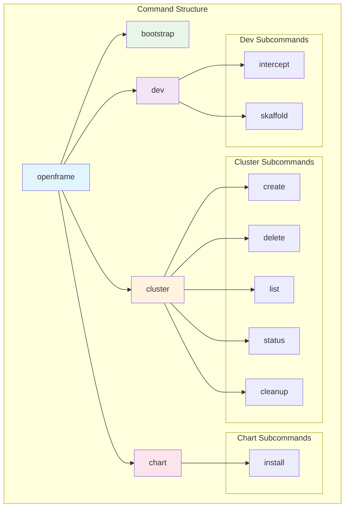
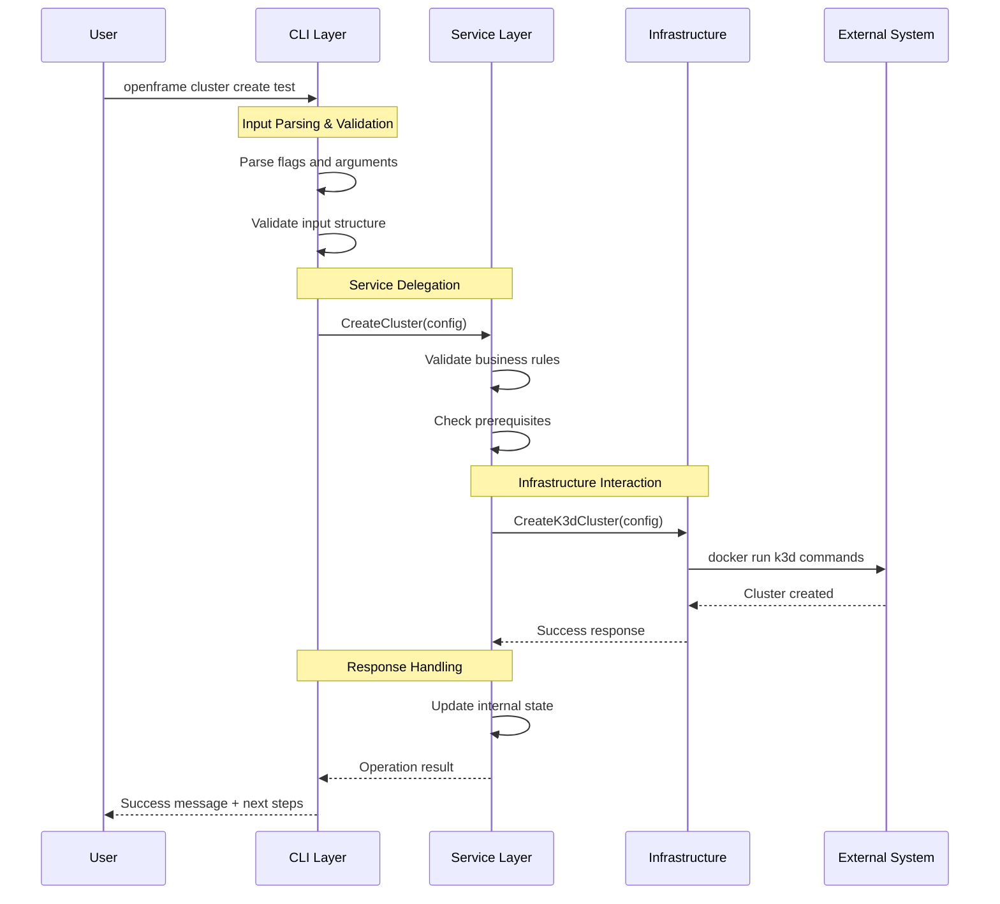
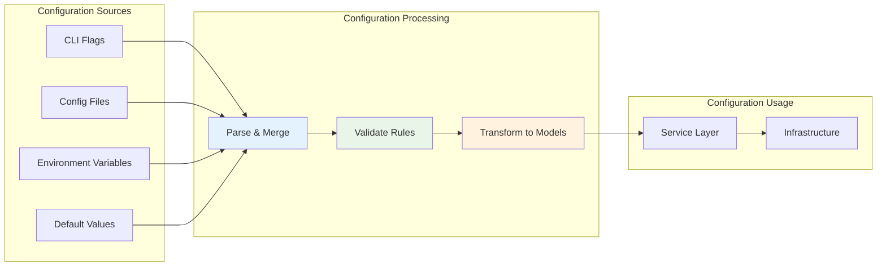
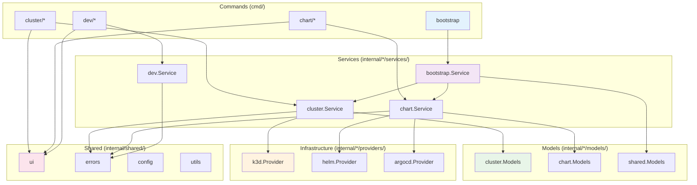
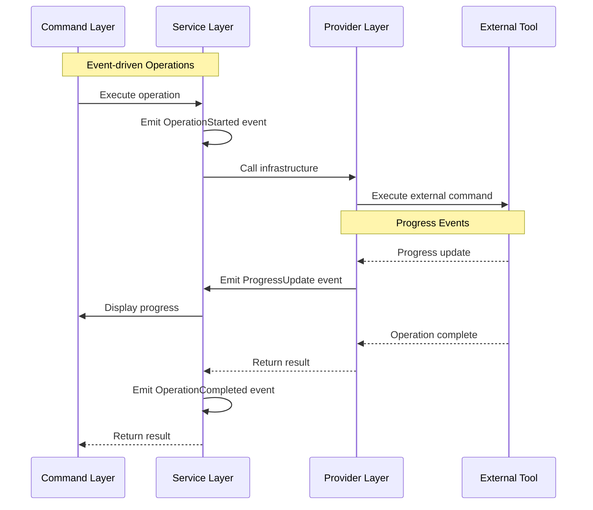

# OpenFrame CLI Architecture Overview

This document provides a comprehensive technical overview of the OpenFrame CLI architecture, design patterns, and implementation details for developers working on or integrating with the codebase.

## Table of Contents

1. [High-Level Architecture](#high-level-architecture)
2. [Component Architecture](#component-architecture)
3. [Data Flow Patterns](#data-flow-patterns)
4. [Design Patterns and Principles](#design-patterns-and-principles)
5. [Module Dependencies](#module-dependencies)
6. [Integration Points](#integration-points)
7. [Extension and Plugin Architecture](#extension-and-plugin-architecture)

## High-Level Architecture

OpenFrame CLI follows a layered, modular architecture that separates concerns between command handling, business logic, and infrastructure integrations.



### Architectural Principles

| Principle | Implementation | Benefits |
|-----------|----------------|----------|
| **Separation of Concerns** | Layered architecture with distinct responsibilities | Maintainable, testable code |
| **Dependency Inversion** | Interfaces define contracts, implementations are injected | Flexible, mockable dependencies |
| **Single Responsibility** | Each package/service has one clear purpose | Clear ownership, reduced coupling |
| **Command Query Separation** | Commands modify state, queries return data | Predictable side effects |
| **Fail Fast** | Validation at boundaries with detailed error messages | Better user experience |

## Component Architecture

### Command Layer (cmd/)

The command layer handles CLI interaction and delegates to services.



#### Command Implementation Pattern

```go
// Standard command structure
func getCommandCmd() *cobra.Command {
    cmd := &cobra.Command{
        Use:     "command",
        Short:   "Brief description", 
        Long:    "Detailed description with examples",
        Args:    cobra.MaximumNArgs(1),
        PreRunE: validateInput,
        RunE:    runCommand,
    }
    
    // Add flags
    addCommandFlags(cmd)
    
    return cmd
}

func runCommand(cmd *cobra.Command, args []string) error {
    // 1. Parse and validate input
    config, err := parseCommandConfig(cmd, args)
    if err != nil {
        return err
    }
    
    // 2. Get service instance
    service := getServiceFromContainer()
    
    // 3. Execute business logic
    return service.ExecuteCommand(cmd.Context(), config)
}
```

### Service Layer (internal/*/services/)

Business logic services implement core functionality with clean interfaces.

#### Service Interface Pattern

```go
// Service interfaces define contracts
type ClusterService interface {
    CreateCluster(ctx context.Context, config ClusterConfig) error
    DeleteCluster(ctx context.Context, name string) error
    ListClusters(ctx context.Context) ([]ClusterInfo, error)
    GetClusterStatus(ctx context.Context, name string) (*ClusterStatus, error)
}

// Implementation handles business logic
type clusterService struct {
    k3dProvider    K3dProvider
    configManager  ConfigManager
    logger        Logger
    prerequisites PrerequisiteChecker
}

func (s *clusterService) CreateCluster(ctx context.Context, config ClusterConfig) error {
    // 1. Validate configuration
    if err := config.Validate(); err != nil {
        return fmt.Errorf("invalid configuration: %w", err)
    }
    
    // 2. Check prerequisites
    if err := s.prerequisites.Check(ctx); err != nil {
        return fmt.Errorf("prerequisites not met: %w", err)
    }
    
    // 3. Execute creation
    return s.k3dProvider.CreateCluster(ctx, config)
}
```

### Model Layer (internal/*/models/)

Domain models encapsulate data structures and business rules.

#### Model Design Pattern

```go
// Domain models with validation
type ClusterConfig struct {
    Name       string      `json:"name" validate:"required,cluster-name"`
    Type       ClusterType `json:"type" validate:"required,oneof=k3d kind"`
    K8sVersion string      `json:"k8sVersion" validate:"version"`
    NodeCount  int         `json:"nodeCount" validate:"min=1,max=10"`
    Registry   *Registry   `json:"registry,omitempty"`
}

// Business rules as methods
func (c ClusterConfig) Validate() error {
    return validation.ValidateStruct(&c)
}

func (c ClusterConfig) IsProduction() bool {
    return c.NodeCount > 1 && c.Registry != nil
}

func (c ClusterConfig) GetDefaults() ClusterConfig {
    defaults := ClusterConfig{
        Type:       ClusterTypeK3d,
        K8sVersion: "latest",
        NodeCount:  3,
    }
    
    if c.Name == "" {
        defaults.Name = "openframe-dev"
    }
    
    return defaults
}
```

#### Model Composition

```go
// Composed models for complex scenarios
type BootstrapConfig struct {
    ClusterConfig ClusterConfig `json:"cluster"`
    ChartConfig   ChartConfig   `json:"chart"`
    DeployMode    DeployMode    `json:"deployMode"`
    Interactive   bool          `json:"interactive"`
    Verbose       bool          `json:"verbose"`
}

func (b BootstrapConfig) Validate() error {
    if err := b.ClusterConfig.Validate(); err != nil {
        return fmt.Errorf("cluster config: %w", err)
    }
    
    if err := b.ChartConfig.Validate(); err != nil {
        return fmt.Errorf("chart config: %w", err)
    }
    
    return nil
}
```

## Data Flow Patterns

### Command Execution Flow



### Error Propagation Pattern

```go
// Error wrapping preserves context through layers
func (cmd *createCommand) Execute(args []string) error {
    config, err := cmd.parseConfig(args)
    if err != nil {
        return fmt.Errorf("parsing configuration: %w", err)
    }
    
    service := cmd.getClusterService()
    if err := service.CreateCluster(cmd.ctx, config); err != nil {
        return fmt.Errorf("creating cluster %q: %w", config.Name, err)
    }
    
    return nil
}

func (s *clusterService) CreateCluster(ctx context.Context, config ClusterConfig) error {
    if err := s.validateConfig(config); err != nil {
        return fmt.Errorf("configuration validation failed: %w", err)
    }
    
    if err := s.k3dProvider.Create(ctx, config); err != nil {
        return fmt.Errorf("k3d cluster creation failed: %w", err) 
    }
    
    return nil
}
```

### Configuration Flow



## Design Patterns and Principles

### Factory Pattern

Used for creating service instances with proper dependency injection:

```go
// Service factory with dependency injection
type ServiceFactory struct {
    config Config
    logger Logger
}

func NewServiceFactory(config Config, logger Logger) *ServiceFactory {
    return &ServiceFactory{
        config: config,
        logger: logger,
    }
}

func (f *ServiceFactory) CreateClusterService() ClusterService {
    return &clusterService{
        k3dProvider:   NewK3dProvider(f.config.K3d),
        configManager: NewConfigManager(f.config.Paths),
        logger:       f.logger.WithField("service", "cluster"),
        prerequisites: NewPrerequisiteChecker(f.logger),
    }
}
```

### Builder Pattern

Used for complex configuration construction:

```go
// Configuration builder for complex scenarios
type ClusterConfigBuilder struct {
    config ClusterConfig
}

func NewClusterConfigBuilder() *ClusterConfigBuilder {
    return &ClusterConfigBuilder{
        config: ClusterConfig{
            Type:       ClusterTypeK3d,
            K8sVersion: "latest",
            NodeCount:  3,
        },
    }
}

func (b *ClusterConfigBuilder) WithName(name string) *ClusterConfigBuilder {
    b.config.Name = name
    return b
}

func (b *ClusterConfigBuilder) WithNodeCount(count int) *ClusterConfigBuilder {
    b.config.NodeCount = count
    return b
}

func (b *ClusterConfigBuilder) Build() ClusterConfig {
    return b.config
}

// Usage
config := NewClusterConfigBuilder().
    WithName("production").
    WithNodeCount(5).
    Build()
```

### Observer Pattern

Used for progress reporting and event handling:

```go
// Progress observer for long-running operations
type ProgressObserver interface {
    OnProgress(operation string, percent int, message string)
    OnComplete(operation string, result interface{})
    OnError(operation string, err error)
}

type clusterService struct {
    observers []ProgressObserver
}

func (s *clusterService) notifyProgress(op string, percent int, msg string) {
    for _, observer := range s.observers {
        observer.OnProgress(op, percent, msg)
    }
}

func (s *clusterService) CreateCluster(ctx context.Context, config ClusterConfig) error {
    s.notifyProgress("cluster-create", 10, "Validating configuration")
    
    if err := config.Validate(); err != nil {
        s.notifyError("cluster-create", err)
        return err
    }
    
    s.notifyProgress("cluster-create", 50, "Creating k3d cluster")
    // ... implementation
}
```

### Strategy Pattern

Used for different deployment modes and cluster types:

```go
// Strategy for different cluster types
type ClusterStrategy interface {
    Create(ctx context.Context, config ClusterConfig) error
    Delete(ctx context.Context, name string) error
    GetStatus(ctx context.Context, name string) (*ClusterStatus, error)
}

type K3dStrategy struct {
    client K3dClient
}

type KindStrategy struct {
    client KindClient
}

// Context uses strategy based on cluster type
type ClusterManager struct {
    strategies map[ClusterType]ClusterStrategy
}

func (m *ClusterManager) CreateCluster(ctx context.Context, config ClusterConfig) error {
    strategy, exists := m.strategies[config.Type]
    if !exists {
        return fmt.Errorf("unsupported cluster type: %s", config.Type)
    }
    
    return strategy.Create(ctx, config)
}
```

## Module Dependencies

### Dependency Graph



### Dependency Rules

| Layer | Can Import | Cannot Import | Rationale |
|-------|-----------|---------------|-----------|
| **Commands** | Services, Models, Shared | Infrastructure directly | Commands should delegate to services |
| **Services** | Models, Infrastructure, Shared | Commands | Services shouldn't know about CLI |
| **Models** | Shared utilities only | Services, Infrastructure | Models are pure data structures |
| **Infrastructure** | Models, External libraries | Services, Commands | Infrastructure is implementation detail |
| **Shared** | External libraries only | Any internal packages | Shared code is foundational |

### Import Pattern Examples

```go
// ✅ Good - Command imports service
package cluster

import (
    "github.com/flamingo-stack/openframe-cli/internal/cluster/services"
    "github.com/flamingo-stack/openframe-cli/internal/shared/ui"
)

// ✅ Good - Service imports models and infrastructure  
package services

import (
    "github.com/flamingo-stack/openframe-cli/internal/cluster/models"
    "github.com/flamingo-stack/openframe-cli/internal/cluster/providers"
    "github.com/flamingo-stack/openframe-cli/internal/shared/errors"
)

// ❌ Bad - Model imports service
package models

import (
    "github.com/flamingo-stack/openframe-cli/internal/cluster/services" // WRONG
)
```

## Integration Points

### External Tool Integration

The CLI integrates with multiple external tools through provider interfaces:

#### K3d Integration

```go
type K3dProvider interface {
    CreateCluster(ctx context.Context, config K3dConfig) error
    DeleteCluster(ctx context.Context, name string) error
    ListClusters(ctx context.Context) ([]K3dCluster, error)
    GetClusterKubeconfig(ctx context.Context, name string) ([]byte, error)
}

type k3dProvider struct {
    execRunner CommandRunner
    logger     Logger
}

func (p *k3dProvider) CreateCluster(ctx context.Context, config K3dConfig) error {
    args := []string{
        "cluster", "create", config.Name,
        "--agents", strconv.Itoa(config.NodeCount-1),
        "--servers", "1",
        "--image", fmt.Sprintf("rancher/k3s:%s", config.K8sVersion),
    }
    
    if config.Registry != nil {
        args = append(args, "--registry-create", config.Registry.Name)
    }
    
    return p.execRunner.Run(ctx, "k3d", args...)
}
```

#### ArgoCD Integration

```go
type ArgoCDProvider interface {
    Install(ctx context.Context, config ArgoCDConfig) error
    CreateApplication(ctx context.Context, app Application) error
    SyncApplication(ctx context.Context, name string) error
    WaitForSync(ctx context.Context, name string, timeout time.Duration) error
}

type argoCDProvider struct {
    helmProvider HelmProvider
    k8sClient    kubernetes.Interface
    logger       Logger
}

func (p *argoCDProvider) Install(ctx context.Context, config ArgoCDConfig) error {
    // Install ArgoCD via Helm
    helmConfig := HelmConfig{
        ChartName:    "argo-cd",
        ChartVersion: config.Version,
        Namespace:    "argocd",
        Values:       config.Values,
    }
    
    return p.helmProvider.InstallChart(ctx, helmConfig)
}
```

### Event System



## Extension and Plugin Architecture

### Plugin Interface Design

```go
// Plugin interface for extending functionality
type Plugin interface {
    Name() string
    Version() string
    Initialize(ctx context.Context, config PluginConfig) error
    Commands() []*cobra.Command
    Hooks() []Hook
}

type Hook interface {
    Name() string
    Execute(ctx context.Context, event Event) error
}

// Plugin manager
type PluginManager struct {
    plugins []Plugin
    hooks   map[string][]Hook
}

func (pm *PluginManager) LoadPlugin(path string) error {
    // Load plugin from file system
    plugin, err := loadPluginFromPath(path)
    if err != nil {
        return err
    }
    
    // Register hooks
    for _, hook := range plugin.Hooks() {
        pm.hooks[hook.Name()] = append(pm.hooks[hook.Name()], hook)
    }
    
    pm.plugins = append(pm.plugins, plugin)
    return nil
}

func (pm *PluginManager) ExecuteHook(ctx context.Context, name string, event Event) error {
    hooks := pm.hooks[name]
    for _, hook := range hooks {
        if err := hook.Execute(ctx, event); err != nil {
            return fmt.Errorf("hook %s failed: %w", hook.Name(), err)
        }
    }
    return nil
}
```

### Configuration Extension

```go
// Extensible configuration system
type ConfigExtension interface {
    ConfigKey() string
    DefaultConfig() interface{}
    ValidateConfig(config interface{}) error
    MergeConfig(base, override interface{}) interface{}
}

type ConfigManager struct {
    extensions map[string]ConfigExtension
}

func (cm *ConfigManager) RegisterExtension(ext ConfigExtension) {
    cm.extensions[ext.ConfigKey()] = ext
}

func (cm *ConfigManager) LoadConfig(path string) (*Config, error) {
    baseConfig, err := cm.loadBaseConfig(path)
    if err != nil {
        return nil, err
    }
    
    // Process extensions
    for key, ext := range cm.extensions {
        if extConfig, exists := baseConfig.Extensions[key]; exists {
            if err := ext.ValidateConfig(extConfig); err != nil {
                return nil, fmt.Errorf("invalid config for %s: %w", key, err)
            }
            baseConfig.Extensions[key] = ext.MergeConfig(ext.DefaultConfig(), extConfig)
        }
    }
    
    return baseConfig, nil
}
```

### Custom Provider Registration

```go
// Provider registry for custom implementations
type ProviderRegistry struct {
    clusterProviders map[ClusterType]func(Config) ClusterProvider
    chartProviders   map[ChartType]func(Config) ChartProvider
}

func (pr *ProviderRegistry) RegisterClusterProvider(clusterType ClusterType, factory func(Config) ClusterProvider) {
    pr.clusterProviders[clusterType] = factory
}

func (pr *ProviderRegistry) CreateClusterProvider(clusterType ClusterType, config Config) (ClusterProvider, error) {
    factory, exists := pr.clusterProviders[clusterType]
    if !exists {
        return nil, fmt.Errorf("unsupported cluster type: %s", clusterType)
    }
    
    return factory(config), nil
}

// Usage - register custom provider
func init() {
    registry := GetProviderRegistry()
    registry.RegisterClusterProvider("custom-k8s", func(config Config) ClusterProvider {
        return NewCustomK8sProvider(config.CustomK8s)
    })
}
```

## Performance Considerations

### Async Operations

```go
// Async pattern for long-running operations
type AsyncOperation struct {
    ID       string
    Status   OperationStatus
    Progress int
    Error    error
    Result   interface{}
}

func (s *clusterService) CreateClusterAsync(ctx context.Context, config ClusterConfig) (*AsyncOperation, error) {
    op := &AsyncOperation{
        ID:     uuid.New().String(),
        Status: StatusInProgress,
    }
    
    go func() {
        defer func() {
            if r := recover(); r != nil {
                op.Error = fmt.Errorf("panic: %v", r)
                op.Status = StatusFailed
            }
        }()
        
        err := s.createClusterSync(ctx, config, func(progress int) {
            op.Progress = progress
        })
        
        if err != nil {
            op.Error = err
            op.Status = StatusFailed
        } else {
            op.Status = StatusCompleted
        }
    }()
    
    return op, nil
}
```

### Caching Strategy

```go
// Cache for expensive operations
type Cache interface {
    Get(key string, target interface{}) error
    Set(key string, value interface{}, ttl time.Duration) error
    Delete(key string) error
}

type clusterService struct {
    cache Cache
}

func (s *clusterService) GetClusterStatus(ctx context.Context, name string) (*ClusterStatus, error) {
    cacheKey := fmt.Sprintf("cluster:status:%s", name)
    
    // Try cache first
    var cached ClusterStatus
    if err := s.cache.Get(cacheKey, &cached); err == nil {
        return &cached, nil
    }
    
    // Fetch from source
    status, err := s.fetchClusterStatus(ctx, name)
    if err != nil {
        return nil, err
    }
    
    // Cache result
    _ = s.cache.Set(cacheKey, status, 30*time.Second)
    
    return status, nil
}
```

## Next Steps

This architecture overview provides the foundation for understanding OpenFrame CLI's design. For hands-on development:

1. **Start Contributing**: Follow the [Developer Getting Started](getting-started-dev.md) guide
2. **Explore Patterns**: Look at existing implementations in the codebase
3. **Extend Functionality**: Use the plugin architecture for custom features
4. **Improve Performance**: Apply async patterns and caching where appropriate

The architecture is designed to be extensible and maintainable while providing excellent user experience through the CLI interface.