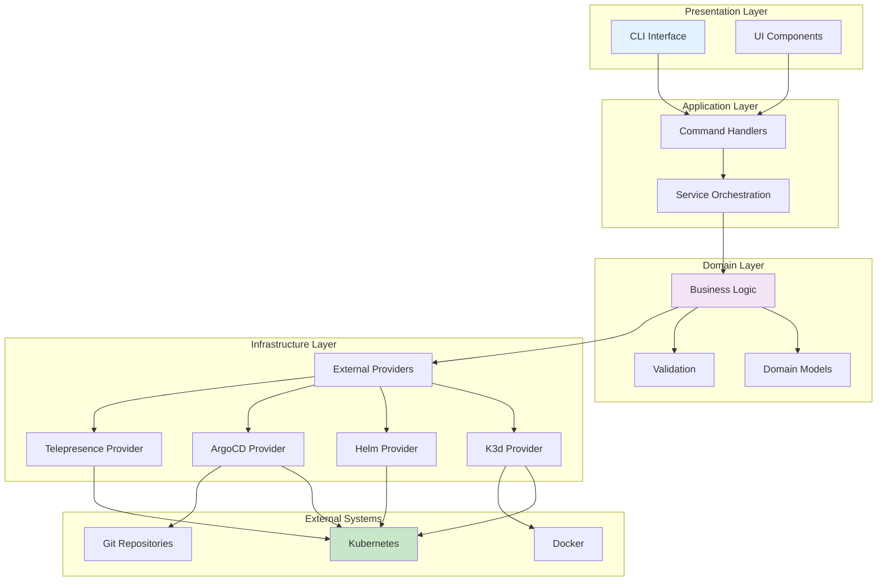
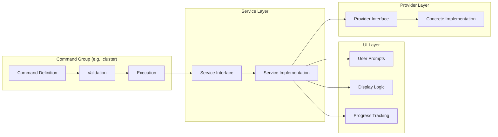
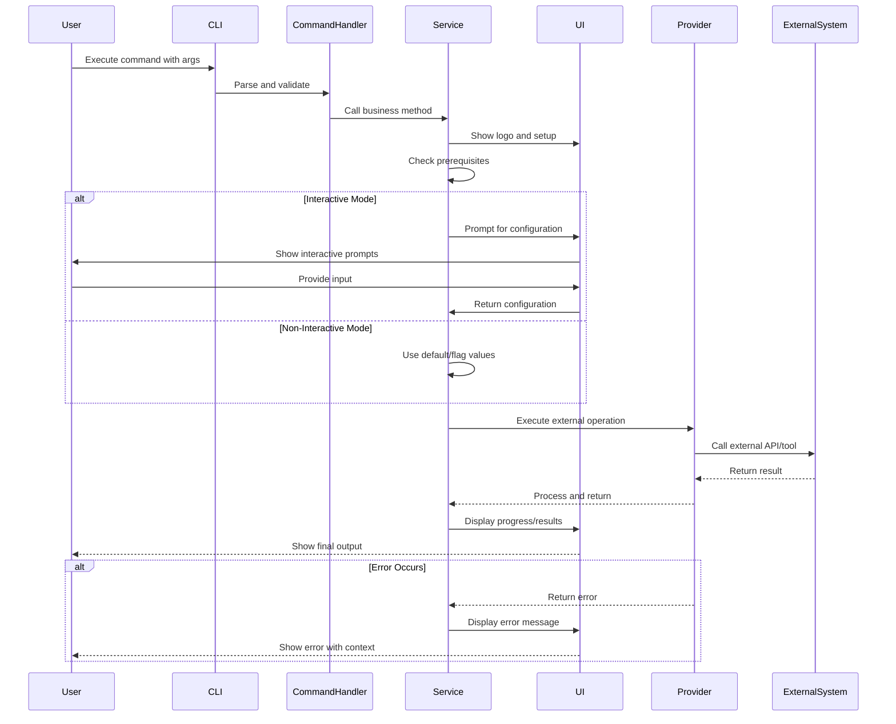
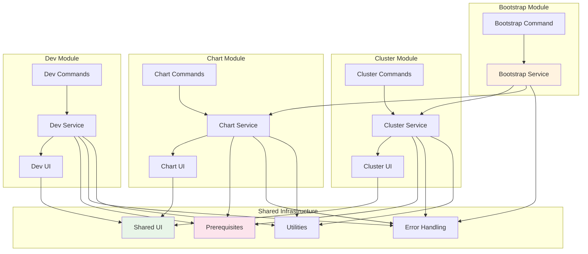
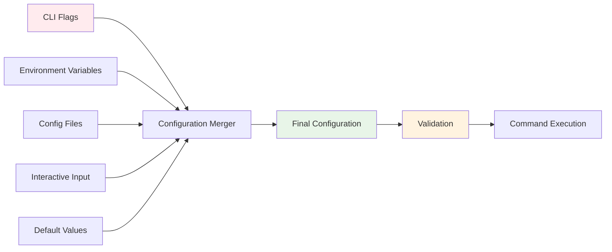

# OpenFrame CLI - Architecture Overview

This document provides a comprehensive overview of the OpenFrame CLI architecture, designed for engineers who need to understand the system's design patterns, component relationships, and data flow.

## High-Level Architecture

OpenFrame CLI follows a layered architecture pattern with clear separation of concerns:



## Core Components and Responsibilities

| Component | Package Location | Primary Responsibilities |
|-----------|------------------|------------------------|
| **CLI Interface** | `cmd/` | Command parsing, argument validation, help text |
| **Command Handlers** | `cmd/*/` | Command execution flow, flag management |
| **Service Orchestration** | `internal/*/services/` | Business process coordination, cross-cutting concerns |
| **Domain Models** | `internal/*/models/` | Data structures, business rules, validation logic |
| **UI Components** | `internal/*/ui/` | User interaction, prompts, progress display |
| **External Providers** | `internal/providers/` | Integration with external tools and APIs |
| **Shared Utilities** | `internal/shared/` | Common functionality, error handling |

## Command Architecture Pattern

Each command group follows a consistent architectural pattern:



## Data Flow and Component Interactions

### Typical Command Execution Flow



## Module Dependencies and Relationships

### Inter-Module Communication



## Key Design Patterns

### 1. Command Pattern

Each CLI command is implemented using the Command pattern with Cobra:

```go
type Command struct {
    Use   string
    Short string
    Long  string
    RunE  func(cmd *cobra.Command, args []string) error
}

// Example implementation
func getCreateCmd() *cobra.Command {
    return &cobra.Command{
        Use:   "create [NAME]",
        Short: "Create a new cluster",
        RunE:  utils.WrapCommandWithCommonSetup(runCreateCluster),
    }
}
```

### 2. Service Layer Pattern

Business logic is encapsulated in service interfaces:

```go
type ClusterService interface {
    Create(config ClusterConfig) error
    Delete(name string) error
    List() ([]ClusterInfo, error)
    Status(name string) (*ClusterStatus, error)
}
```

### 3. Provider Pattern

External tool integrations use the Provider pattern:

```go
type K3dProvider interface {
    CreateCluster(config K3dConfig) error
    DeleteCluster(name string) error
    ListClusters() ([]K3dCluster, error)
}
```

### 4. Factory Pattern

UI components and services use factory methods:

```go
func NewConfigurationHandler() ConfigurationHandler {
    return &configurationHandler{
        prompter: NewPrompter(),
        validator: NewValidator(),
    }
}
```

## Error Handling Strategy

OpenFrame CLI implements a comprehensive error handling strategy:

| Error Type | Handling Strategy | Example |
|------------|------------------|---------|
| **User Input Errors** | Validation with helpful messages | "Cluster name must be lowercase alphanumeric" |
| **System Errors** | Wrapped errors with context | "Failed to create cluster: docker daemon not running" |
| **External Tool Errors** | Parsed and user-friendly messages | "k3d cluster creation failed: port 6443 already in use" |
| **Network Errors** | Retry logic with timeouts | "ArgoCD installation timeout, retrying..." |

```go
// Error wrapping pattern
func (s *clusterService) Create(config ClusterConfig) error {
    if err := s.validator.Validate(config); err != nil {
        return fmt.Errorf("invalid cluster configuration: %w", err)
    }
    
    if err := s.provider.Create(config); err != nil {
        return fmt.Errorf("failed to create cluster %s: %w", config.Name, err)
    }
    
    return nil
}
```

## Configuration Management

### Configuration Sources (Priority Order)

1. **Command-line flags** (highest priority)
2. **Environment variables**
3. **Configuration files**
4. **Interactive prompts**
5. **Default values** (lowest priority)

### Configuration Flow



## State Management

### Cluster State Tracking

OpenFrame CLI manages cluster state through:

1. **kubectl context** - Active cluster selection
2. **Local metadata** - Cluster creation history
3. **Runtime queries** - Real-time status from k3d/k8s APIs

### State Persistence

| Data Type | Storage Location | Purpose |
|-----------|------------------|---------|
| **Cluster metadata** | `~/.openframe/clusters/` | Creation history, configuration |
| **CLI configuration** | `~/.openframe/config.yaml` | User preferences, defaults |
| **Cache data** | `~/.openframe/cache/` | Temporary data, performance optimization |

## Performance Considerations

### Optimization Strategies

1. **Lazy Loading**: External providers are instantiated only when needed
2. **Caching**: Frequently accessed data is cached locally
3. **Parallel Operations**: Independent operations run concurrently
4. **Early Validation**: Input validation happens before expensive operations

### Resource Management

```go
// Example: Resource cleanup pattern
type ClusterManager struct {
    provider Provider
}

func (m *ClusterManager) Create(config ClusterConfig) error {
    // Setup cleanup on error
    cleanup := func() {
        if err := m.provider.Cleanup(config.Name); err != nil {
            log.Printf("cleanup failed: %v", err)
        }
    }
    
    defer func() {
        if r := recover(); r != nil {
            cleanup()
            panic(r)
        }
    }()
    
    // Main operation
    return m.provider.Create(config)
}
```

## Security Architecture

### Security Boundaries

1. **Input Validation**: All user input is validated and sanitized
2. **Privilege Escalation**: Commands requiring elevated privileges are clearly marked
3. **Credential Management**: Sensitive data is not logged or stored in plain text
4. **Network Security**: TLS verification for external communications

### Secure Coding Practices

- Input sanitization for shell commands
- Secure temporary file handling
- Proper secret management for ArgoCD credentials
- Network timeout and retry limits

## Testing Architecture

### Testing Layers

| Test Type | Location | Purpose | Tools |
|-----------|----------|---------|--------|
| **Unit Tests** | `*_test.go` | Individual function testing | Go testing framework |
| **Integration Tests** | `test/integration/` | Component interaction testing | Testcontainers, Docker |
| **End-to-End Tests** | `test/e2e/` | Full workflow validation | Real external tools |
| **Performance Tests** | `test/performance/` | Resource usage, timing | Go benchmarks |

### Test Patterns

```go
// Table-driven tests pattern
func TestClusterValidation(t *testing.T) {
    tests := []struct {
        name        string
        config      ClusterConfig
        expectError bool
        errorMsg    string
    }{
        {
            name: "valid config",
            config: ClusterConfig{Name: "test", Type: "k3d"},
            expectError: false,
        },
        {
            name: "invalid name",
            config: ClusterConfig{Name: "INVALID"},
            expectError: true,
            errorMsg: "cluster name must be lowercase",
        },
    }
    
    for _, tt := range tests {
        t.Run(tt.name, func(t *testing.T) {
            err := ValidateClusterConfig(tt.config)
            // Test assertions...
        })
    }
}
```

## Extension Points

### Adding New Commands

1. Create command file in appropriate `cmd/` directory
2. Implement service interface in `internal/*/services/`
3. Add UI components in `internal/*/ui/`
4. Register with parent command
5. Add tests and documentation

### Adding New Providers

1. Define provider interface in `internal/providers/`
2. Implement concrete provider
3. Add to dependency injection
4. Write integration tests
5. Update documentation

## Monitoring and Observability

### Logging Strategy

```go
// Structured logging pattern
log.WithFields(log.Fields{
    "operation": "cluster_create",
    "cluster":   config.Name,
    "duration":  duration,
}).Info("cluster creation completed")
```

### Metrics Collection

- Command execution time
- Success/failure rates
- Resource usage
- Error frequency by type

## Future Architecture Considerations

### Planned Enhancements

1. **Plugin Architecture**: Support for third-party extensions
2. **Remote Backend**: Centralized cluster management
3. **Multi-Cloud Support**: Support for cloud Kubernetes services
4. **Advanced Networking**: Service mesh integration

### Scalability Design

- Microservice-ready architecture
- API-first design for potential REST interface
- Event-driven architecture preparation
- Database abstraction layer

---

This architecture overview provides the foundation for understanding and contributing to OpenFrame CLI. For specific implementation details, refer to the codebase and inline documentation.