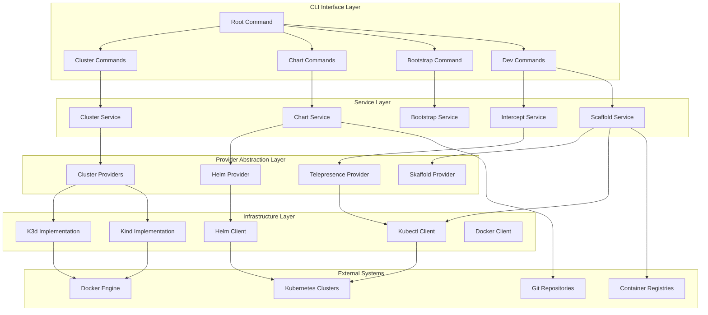
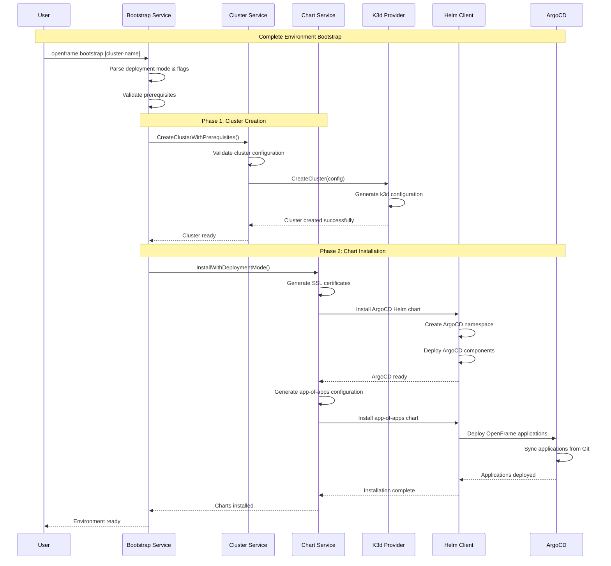
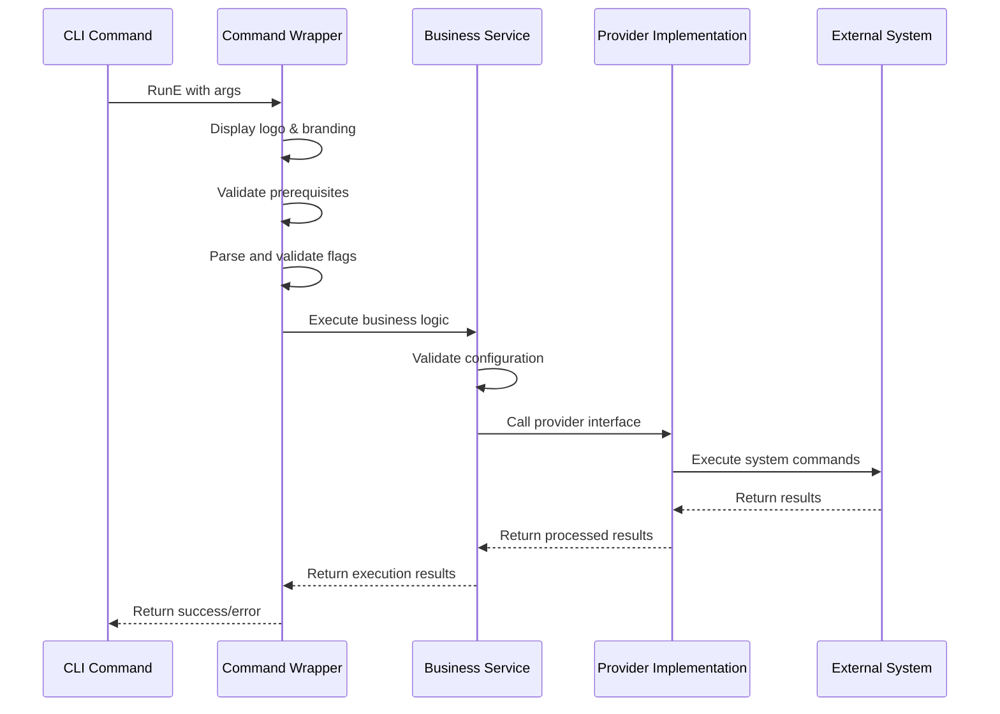
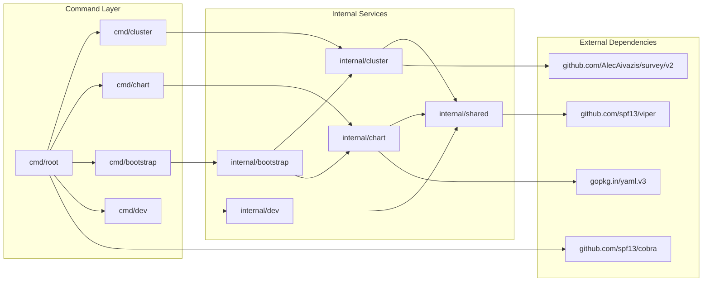
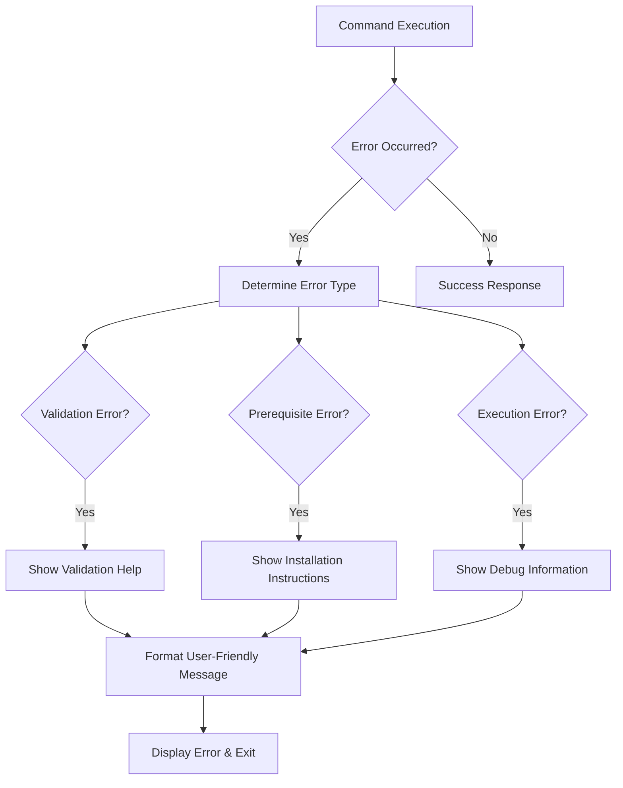

# OpenFrame CLI Architecture Overview

This document provides a comprehensive technical overview of the OpenFrame CLI architecture, designed for engineers working on or extending the codebase.

## High-Level Architecture

OpenFrame CLI follows a layered, modular architecture that separates concerns between command handling, business logic, and external integrations. The design emphasizes testability, extensibility, and clear separation of responsibilities.



## Core Components and Responsibilities

| Component | Package | Primary Responsibilities | Key Interfaces |
|-----------|---------|-------------------------|----------------|
| **Root Command** | `cmd/root.go` | CLI entry point, global flags, version management | `cobra.Command` |
| **Cluster Management** | `cmd/cluster/` | K3d/Kind cluster lifecycle operations | `ClusterProvider` |
| **Chart Management** | `cmd/chart/` | Helm chart installation, ArgoCD setup | `ChartInstaller` |
| **Bootstrap Orchestration** | `cmd/bootstrap/` | End-to-end environment provisioning | `BootstrapService` |
| **Dev Tools** | `cmd/dev/` | Telepresence intercepts, Skaffold workflows | `InterceptService`, `ScaffoldService` |
| **Business Services** | `internal/*/services/` | Core business logic, workflow orchestration | Service interfaces |
| **Data Models** | `internal/*/models/` | Configuration structures, validation | Validation interfaces |
| **UI Components** | `internal/*/ui/` | Interactive prompts, output formatting | `UIHandler` |
| **Shared Utilities** | `internal/shared/` | Cross-cutting concerns (config, errors, execution) | Utility interfaces |

## Data Flow Architecture

### Bootstrap Workflow

The bootstrap command orchestrates the most complex workflow in the system:



### Command Execution Pattern

All commands follow a consistent execution pattern:



## Module Dependencies

### Dependency Graph



### Import Rules

1. **Commands** only import their corresponding services
2. **Services** can import shared utilities and other services
3. **Providers** are isolated and only imported by their services
4. **Shared** packages have no internal dependencies
5. **No circular dependencies** between internal packages

## Key Design Patterns

### 1. Provider Pattern

Abstract external tool integrations behind interfaces:

```go
// Provider interface abstraction
type ClusterProvider interface {
    Create(config ClusterConfig) error
    Delete(name string) error
    List() ([]ClusterInfo, error)
    GetStatus(name string) (ClusterStatus, error)
}

// K3d implementation
type K3dProvider struct {
    executor command.Executor
    config   K3dConfig
}

func (p *K3dProvider) Create(config ClusterConfig) error {
    k3dConfig := p.buildK3dConfig(config)
    return p.executor.Execute("k3d", "cluster", "create", k3dConfig...)
}
```

### 2. Service Pattern

Encapsulate business logic in service structs:

```go
type ClusterService struct {
    provider     ClusterProvider
    ui          UIHandler
    prereqChecker PrerequisiteChecker
}

func (s *ClusterService) CreateCluster(config ClusterConfig) error {
    if err := s.prereqChecker.CheckPrerequisites(); err != nil {
        return err
    }
    
    if err := s.ui.ConfirmClusterCreation(config); err != nil {
        return err
    }
    
    return s.provider.Create(config)
}
```

### 3. Command Wrapper Pattern

Standardize command execution with common setup:

```go
func WrapCommandWithCommonSetup(fn CommandFunc) cobra.RunE {
    return func(cmd *cobra.Command, args []string) error {
        ui.ShowLogo()
        
        if err := ValidatePrerequisites(); err != nil {
            return err
        }
        
        return fn(cmd, args)
    }
}
```

### 4. Configuration Builder Pattern

Build complex configurations step by step:

```go
type ClusterConfigBuilder struct {
    config ClusterConfig
}

func NewClusterConfigBuilder() *ClusterConfigBuilder {
    return &ClusterConfigBuilder{
        config: ClusterConfig{
            Type:       ClusterTypeK3d,
            NodeCount:  3,
            K8sVersion: "latest",
        },
    }
}

func (b *ClusterConfigBuilder) WithName(name string) *ClusterConfigBuilder {
    b.config.Name = name
    return b
}

func (b *ClusterConfigBuilder) Build() ClusterConfig {
    return b.config
}
```

## Error Handling Strategy

### Error Types and Hierarchy

```go
// Base error types
type CLIError struct {
    Type    ErrorType
    Message string
    Cause   error
}

type ErrorType string

const (
    ErrorTypeValidation    ErrorType = "validation"
    ErrorTypePrerequisite  ErrorType = "prerequisite" 
    ErrorTypeExecution     ErrorType = "execution"
    ErrorTypeConfiguration ErrorType = "configuration"
)

// Specialized errors
type PrerequisiteError struct {
    Tool     string
    Required string
    Found    string
}

type ValidationError struct {
    Field   string
    Value   interface{}
    Reason  string
}
```

### Error Handling Flow



## Testing Strategy

### Test Architecture

| Test Type | Location | Purpose | Tools |
|-----------|----------|---------|-------|
| **Unit Tests** | `*_test.go` files | Test individual functions and methods | Go testing, testify |
| **Integration Tests** | `tests/integration/` | Test command workflows end-to-end | Go testing, Docker |
| **Provider Tests** | `internal/*/providers/*_test.go` | Test external tool integrations | Go testing, mocks |
| **UI Tests** | `internal/*/ui/*_test.go` | Test interactive prompts | Go testing, survey mocks |

### Mock Strategy

```go
// Provider mocks for testing
type MockClusterProvider struct {
    mock.Mock
}

func (m *MockClusterProvider) Create(config ClusterConfig) error {
    args := m.Called(config)
    return args.Error(0)
}

func TestClusterService_CreateCluster(t *testing.T) {
    mockProvider := new(MockClusterProvider)
    mockProvider.On("Create", mock.Anything).Return(nil)
    
    service := NewClusterService(mockProvider)
    err := service.CreateCluster(validConfig)
    
    assert.NoError(t, err)
    mockProvider.AssertExpectations(t)
}
```

## Performance Considerations

### Command Execution Optimization

1. **Lazy Loading**: Providers are initialized only when needed
2. **Parallel Execution**: Independent operations run concurrently
3. **Caching**: Command outputs cached to avoid repeated executions
4. **Resource Cleanup**: Automatic cleanup of temporary resources

### Memory Management

- **Streaming**: Large outputs processed in streams
- **Buffer Limits**: Configurable limits on command output buffers
- **Garbage Collection**: Explicit cleanup of large objects

## Security Considerations

### Input Validation

```go
func ValidateClusterName(name string) error {
    if matched, _ := regexp.MatchString(`^[a-zA-Z0-9][a-zA-Z0-9\-]*[a-zA-Z0-9]$`, name); !matched {
        return errors.New("cluster name must contain only alphanumeric characters and hyphens")
    }
    
    if len(name) > 63 {
        return errors.New("cluster name cannot exceed 63 characters")
    }
    
    return nil
}
```

### Command Injection Prevention

```go
func (e *Executor) Execute(command string, args ...string) error {
    // Use exec.Command to prevent shell injection
    cmd := exec.Command(command, args...)
    cmd.Env = e.buildSecureEnv()
    
    return cmd.Run()
}
```

## Extension Points

### Adding New Commands

1. **Create command package**: `cmd/newcommand/`
2. **Implement service**: `internal/newcommand/service.go`
3. **Register command**: Add to `cmd/root.go`
4. **Add tests**: Unit and integration tests

### Adding New Providers

1. **Define interface**: Extend or create provider interface
2. **Implement provider**: `internal/*/providers/newprovider/`
3. **Register provider**: Add to provider factory
4. **Add configuration**: Extend models for provider config

### Adding New Deployment Modes

1. **Extend models**: Add to deployment mode enum
2. **Update validation**: Add validation rules
3. **Extend chart service**: Handle new mode in installation
4. **Update documentation**: Add mode-specific documentation

## Monitoring and Observability

### Logging Strategy

```go
// Structured logging with levels
log.WithFields(logrus.Fields{
    "cluster": clusterName,
    "action":  "create",
    "duration": duration,
}).Info("Cluster creation completed")

// Error logging with context
log.WithError(err).WithFields(logrus.Fields{
    "cluster": clusterName,
    "step":    "k3d-create",
}).Error("Failed to create cluster")
```

### Metrics Collection

- **Command execution time**: Track performance of operations
- **Success/failure rates**: Monitor command reliability  
- **Resource usage**: Track memory and CPU usage during operations
- **Error categorization**: Classify and count error types

---

## Future Architecture Considerations

### Planned Enhancements

1. **Plugin System**: Support for external command plugins
2. **Remote Providers**: Cloud provider integrations (EKS, GKE, AKS)
3. **Configuration Management**: Centralized config with profiles
4. **API Mode**: REST API for programmatic access

### Scalability Improvements

1. **Async Operations**: Background cluster operations
2. **Batch Processing**: Multiple cluster operations
3. **Resource Pooling**: Shared resources across operations
4. **Caching Layer**: Persistent caching for expensive operations

This architecture provides a solid foundation for the OpenFrame CLI while maintaining flexibility for future enhancements and integrations.