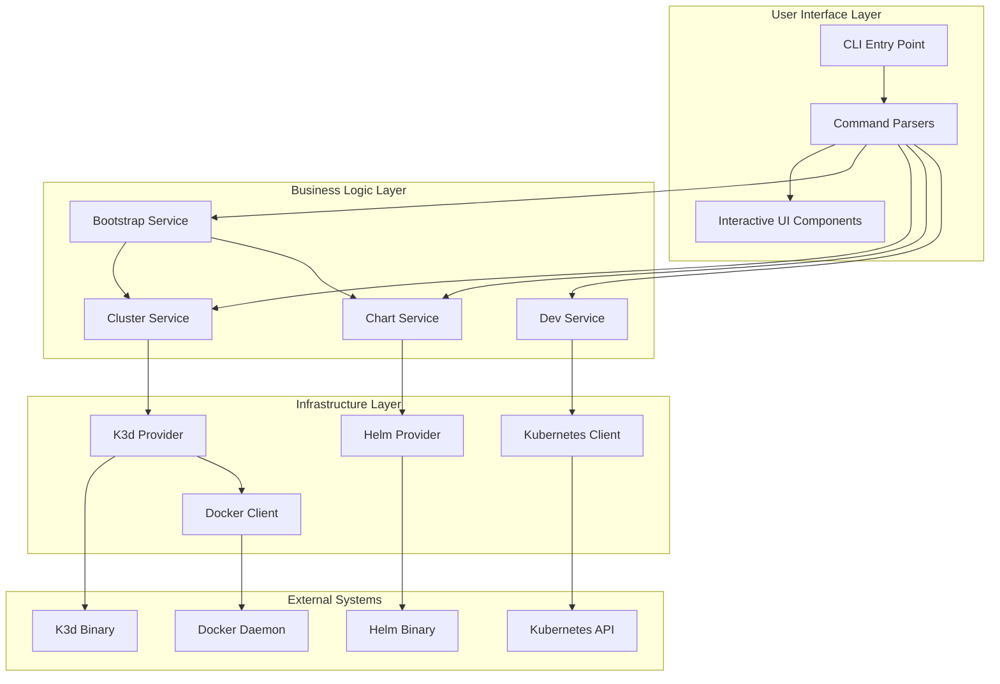
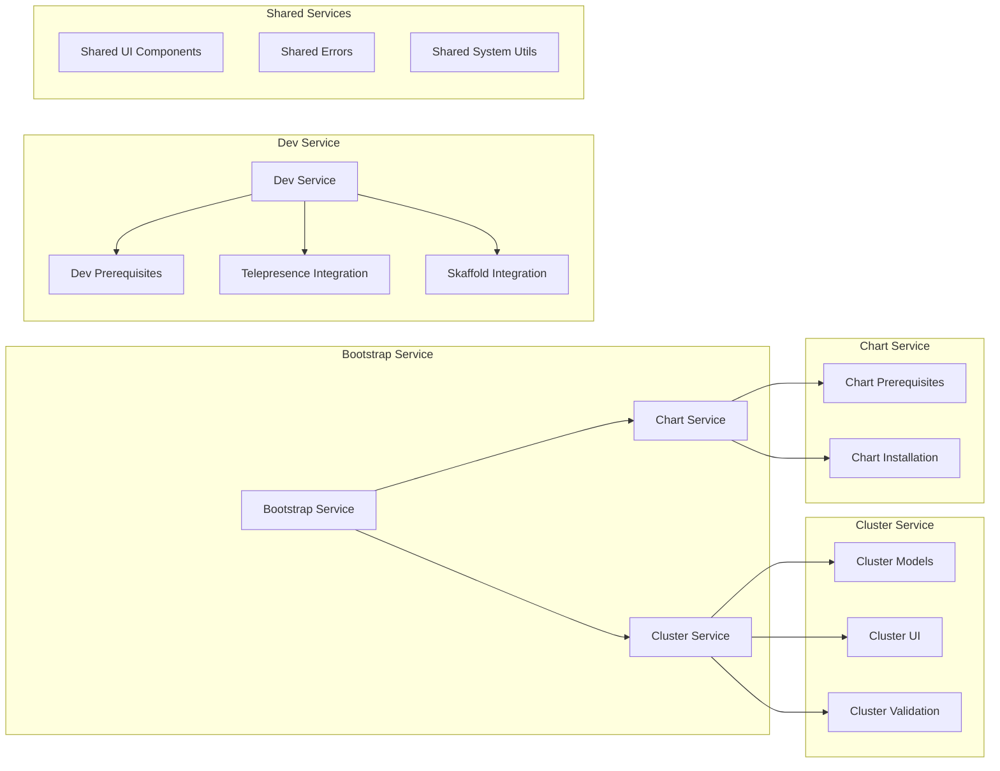
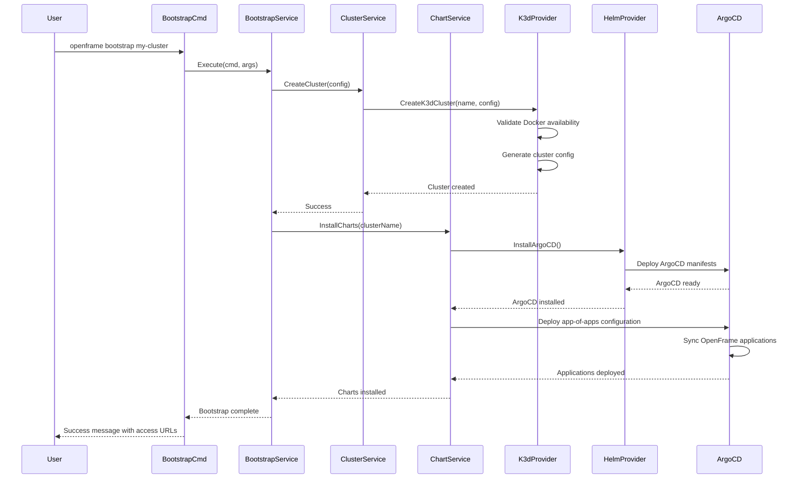
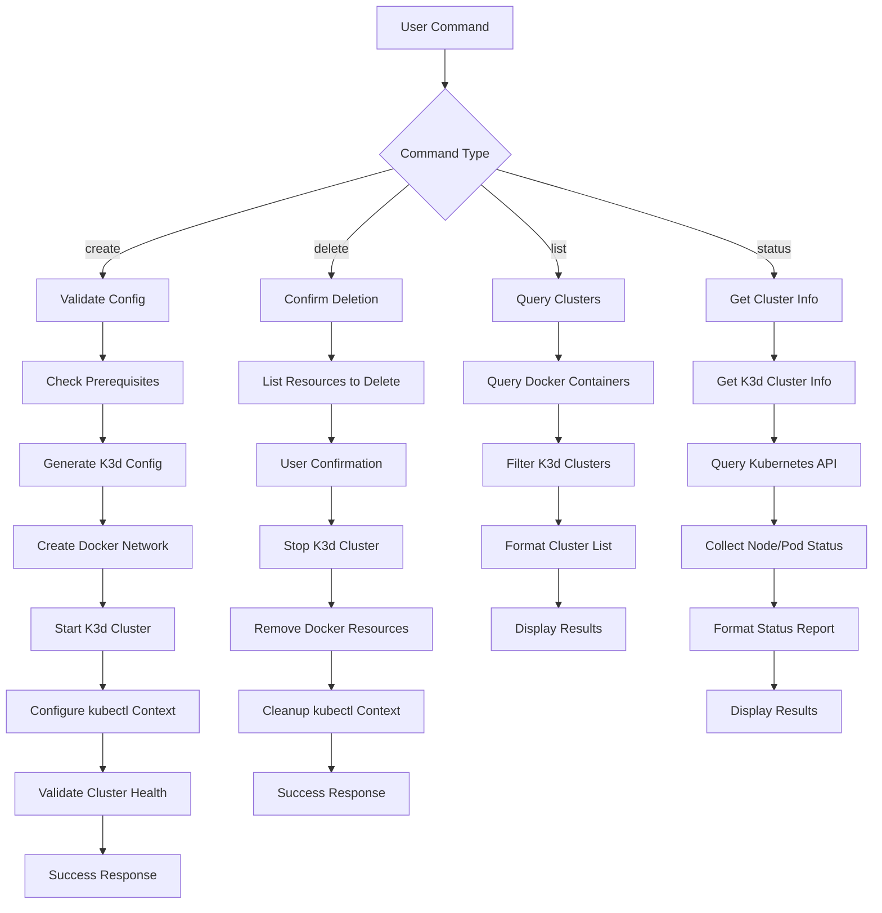
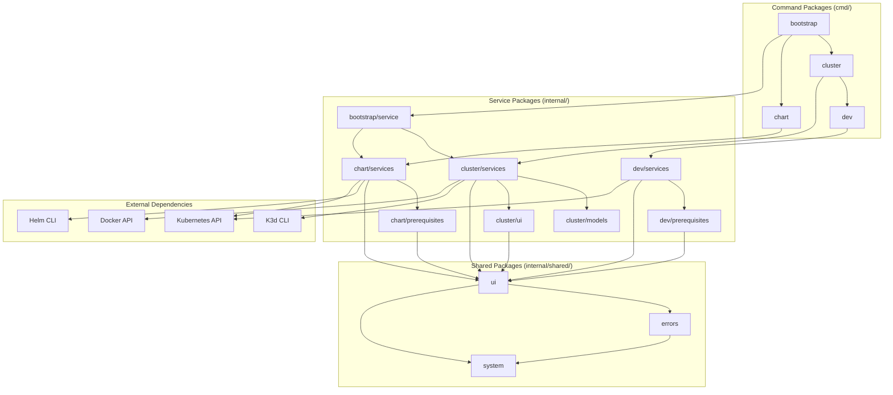
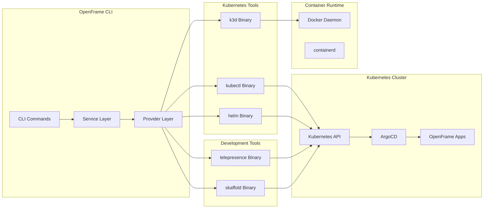

# OpenFrame CLI Architecture Overview

This document provides a comprehensive technical overview of the OpenFrame CLI architecture, designed for engineers who need to understand the system's design patterns, component relationships, and data flows.

## High-Level Architecture

The OpenFrame CLI follows a layered architecture with clear separation between command handling, business logic, and external integrations:



## Core Components

### Command Layer (`cmd/`)

The command layer implements the CLI interface using the Cobra framework and follows a hierarchical command structure:

| Component | Package | Responsibility | Key Files |
|-----------|---------|----------------|-----------|
| **Bootstrap Command** | `cmd/bootstrap` | Orchestrates complete environment setup | `bootstrap.go` |
| **Cluster Commands** | `cmd/cluster` | Cluster lifecycle management | `cluster.go`, `create.go`, `delete.go`, `list.go`, `status.go`, `cleanup.go` |
| **Chart Commands** | `cmd/chart` | ArgoCD and Helm chart deployment | `chart.go`, `install.go` |
| **Dev Commands** | `cmd/dev` | Development workflow integration | `dev.go` |

#### Command Structure Pattern

```go
// Standard command structure
func GetCommandCmd() *cobra.Command {
    cmd := &cobra.Command{
        Use:      "command [args]",
        Short:    "Brief description",
        Long:     "Detailed description with examples",
        PreRunE:  validatePrerequisites,  // Validation before execution
        RunE:     executeCommand,         // Main execution logic
        PostRunE: cleanup,                // Cleanup after execution
    }
    
    // Add flags and subcommands
    addFlags(cmd)
    addSubcommands(cmd)
    
    return cmd
}
```

### Service Layer (`internal/`)

The service layer contains the core business logic organized by functional domains:



#### Service Design Patterns

1. **Dependency Injection**: Services accept interfaces, not concrete implementations
2. **Error Wrapping**: Contextual error information throughout the stack
3. **Configuration Validation**: Input validation at service boundaries
4. **Progress Tracking**: User feedback for long-running operations

```go
// Service interface pattern
type ClusterService interface {
    CreateCluster(ctx context.Context, config ClusterConfig) error
    DeleteCluster(ctx context.Context, name string) error
    GetClusterStatus(ctx context.Context, name string) (*ClusterStatus, error)
}

// Service implementation with injected dependencies
type clusterService struct {
    k3dClient    K3dClientInterface
    dockerClient DockerClientInterface
    uiHandler    UIHandlerInterface
}

func NewClusterService(k3d K3dClientInterface, docker DockerClientInterface, ui UIHandlerInterface) ClusterService {
    return &clusterService{
        k3dClient:    k3d,
        dockerClient: docker,
        uiHandler:    ui,
    }
}
```

## Data Flow Architecture

### Bootstrap Operation Flow

This sequence diagram shows the complete bootstrap process flow:



### Cluster Management Data Flow



## Key Design Patterns

### 1. Command Pattern with Cobra

```go
// Command registration pattern
func init() {
    rootCmd.AddCommand(getClusterCmd())
    rootCmd.AddCommand(getBootstrapCmd())
    rootCmd.AddCommand(getChartCmd())
    rootCmd.AddCommand(getDevCmd())
}

// Command execution pattern
func executeCommand(cmd *cobra.Command, args []string) error {
    // Parse flags and arguments
    config, err := parseConfig(cmd, args)
    if err != nil {
        return fmt.Errorf("config parsing failed: %w", err)
    }
    
    // Get service instance
    service := getService()
    
    // Execute business logic
    return service.Execute(cmd.Context(), config)
}
```

### 2. Strategy Pattern for Providers

```go
// Provider interface allows different implementations
type ClusterProvider interface {
    CreateCluster(config ClusterConfig) error
    DeleteCluster(name string) error
    ListClusters() ([]ClusterInfo, error)
}

// K3d implementation
type K3dProvider struct {
    dockerClient DockerClient
}

// Future: Kind implementation
type KindProvider struct {
    kindClient KindClient
}

// Factory pattern for provider selection
func NewClusterProvider(providerType string) ClusterProvider {
    switch providerType {
    case "k3d":
        return NewK3dProvider()
    case "kind":
        return NewKindProvider()
    default:
        return NewK3dProvider() // default
    }
}
```

### 3. Observer Pattern for Progress Tracking

```go
// Progress tracking interface
type ProgressObserver interface {
    OnProgress(stage string, percent int, message string)
}

// UI implementation
type UIProgressObserver struct {
    progressBar ProgressBar
}

func (ui *UIProgressObserver) OnProgress(stage string, percent int, message string) {
    ui.progressBar.Update(percent)
    ui.progressBar.SetMessage(fmt.Sprintf("[%s] %s", stage, message))
}

// Service uses observer for progress updates
type ClusterService struct {
    observer ProgressObserver
}

func (s *ClusterService) CreateCluster(config ClusterConfig) error {
    s.observer.OnProgress("validation", 10, "Validating configuration")
    // ... validation logic
    
    s.observer.OnProgress("docker", 30, "Checking Docker availability")
    // ... docker checks
    
    s.observer.OnProgress("creation", 70, "Creating K3d cluster")
    // ... cluster creation
    
    s.observer.OnProgress("complete", 100, "Cluster ready")
    return nil
}
```

### 4. Template Method Pattern for Commands

```go
// Base command execution template
func executeWithCommonSetup(runFunc CommandRunFunc) CommandRunFunc {
    return func(cmd *cobra.Command, args []string) error {
        // Pre-execution setup
        if err := validatePrerequisites(); err != nil {
            return err
        }
        
        if err := setupLogging(); err != nil {
            return err
        }
        
        // Execute actual command
        err := runFunc(cmd, args)
        
        // Post-execution cleanup
        cleanup()
        
        return err
    }
}

// Usage in commands
func getCreateCmd() *cobra.Command {
    return &cobra.Command{
        Use:  "create",
        RunE: executeWithCommonSetup(runCreateCommand),
    }
}
```

## Module Dependencies and Relationships

### Internal Package Dependencies



### Dependency Injection Map

| Component | Dependencies | Injected Via |
|-----------|-------------|--------------|
| **BootstrapService** | ClusterService, ChartService | Constructor |
| **ClusterService** | K3dProvider, DockerClient, UIHandler | Constructor |
| **ChartService** | HelmProvider, KubernetesClient | Constructor |
| **DevService** | TelepresenceClient, SkaffoldClient | Constructor |
| **K3dProvider** | DockerClient, SystemCommand | Constructor |
| **HelmProvider** | KubernetesClient, SystemCommand | Constructor |

### External System Integrations



## Configuration and State Management

### Configuration Hierarchy

```go
// Configuration precedence (highest to lowest)
type ConfigSource int

const (
    CommandLineFlags ConfigSource = iota  // Highest precedence
    EnvironmentVariables
    ConfigFile
    DefaultValues                         // Lowest precedence
)

// Configuration merging strategy
func MergeConfigs(sources ...Config) Config {
    result := DefaultConfig()
    
    for _, source := range sources {
        result = mergeWithPrecedence(result, source)
    }
    
    return result
}
```

### State Storage Strategy

| State Type | Storage Location | Persistence | Example |
|------------|------------------|-------------|---------|
| **Cluster Config** | `~/.openframe/clusters/` | Persistent | K3d cluster configurations |
| **Runtime State** | In-memory | Temporary | Current operation progress |
| **Cache Data** | `~/.openframe/cache/` | Temporary | Downloaded binaries, images |
| **User Preferences** | `~/.openframe/config.yaml` | Persistent | Default deployment modes |

### Error Handling Architecture

```go
// Hierarchical error handling
type ErrorSeverity int

const (
    Warning ErrorSeverity = iota
    Error
    Fatal
)

// Error context preservation
type ContextualError struct {
    Cause     error
    Context   string
    Severity  ErrorSeverity
    Component string
}

func (e ContextualError) Error() string {
    return fmt.Sprintf("[%s] %s: %v", e.Component, e.Context, e.Cause)
}

// Error handling in services
func (s *ClusterService) CreateCluster(config ClusterConfig) error {
    if err := s.validateConfig(config); err != nil {
        return ContextualError{
            Cause:     err,
            Context:   "cluster configuration validation",
            Severity:  Error,
            Component: "cluster-service",
        }
    }
    // ... rest of implementation
}
```

## Performance and Scalability Considerations

### Async Operations

```go
// Long-running operations use context for cancellation
func (s *ClusterService) CreateCluster(ctx context.Context, config ClusterConfig) error {
    // Check for cancellation
    select {
    case <-ctx.Done():
        return ctx.Err()
    default:
    }
    
    // Progress reporting through channels
    progressCh := make(chan ProgressUpdate)
    go s.reportProgress(progressCh)
    
    // Actual work with cancellation checks
    return s.doCreateCluster(ctx, config, progressCh)
}
```

### Resource Management

```go
// Resource cleanup patterns
type ResourceManager struct {
    resources []CleanupFunc
}

func (rm *ResourceManager) AddCleanup(fn CleanupFunc) {
    rm.resources = append(rm.resources, fn)
}

func (rm *ResourceManager) Cleanup() error {
    var errors []error
    
    // Cleanup in reverse order
    for i := len(rm.resources) - 1; i >= 0; i-- {
        if err := rm.resources[i](); err != nil {
            errors = append(errors, err)
        }
    }
    
    if len(errors) > 0 {
        return fmt.Errorf("cleanup errors: %v", errors)
    }
    
    return nil
}
```

## Testing Architecture

### Test Structure

```
internal/
├── cluster/
│   ├── services/
│   │   ├── cluster_service.go
│   │   ├── cluster_service_test.go      # Unit tests
│   │   └── cluster_service_integration_test.go  # Integration tests
│   └── models/
│       ├── config.go
│       └── config_test.go               # Model validation tests
└── shared/
    ├── testutil/                        # Test utilities
    │   ├── mocks.go                     # Mock implementations
    │   ├── fixtures.go                  # Test data
    │   └── helpers.go                   # Test helpers
    └── testing/
        └── integration_test.go          # End-to-end tests
```

### Mock Strategy

```go
// Interface-based mocking
type MockK3dClient struct {
    CreateClusterFunc func(name string, config K3dConfig) error
    DeleteClusterFunc func(name string) error
}

func (m *MockK3dClient) CreateCluster(name string, config K3dConfig) error {
    if m.CreateClusterFunc != nil {
        return m.CreateClusterFunc(name, config)
    }
    return nil // Default success
}

// Test using mocks
func TestClusterService_CreateCluster(t *testing.T) {
    mockK3d := &MockK3dClient{
        CreateClusterFunc: func(name string, config K3dConfig) error {
            assert.Equal(t, "test-cluster", name)
            return nil
        },
    }
    
    service := NewClusterService(mockK3d, nil, nil)
    err := service.CreateCluster(context.Background(), testConfig)
    
    assert.NoError(t, err)
}
```

## Security Considerations

### Input Validation

```go
// Comprehensive input validation
func ValidateClusterName(name string) error {
    if name == "" {
        return errors.New("cluster name cannot be empty")
    }
    
    if len(name) > 63 {
        return errors.New("cluster name too long (max 63 characters)")
    }
    
    // DNS-1123 compliant names
    regex := regexp.MustCompile(`^[a-z0-9]([-a-z0-9]*[a-z0-9])?$`)
    if !regex.MatchString(name) {
        return errors.New("invalid cluster name format")
    }
    
    return nil
}
```

### Command Injection Prevention

```go
// Safe command execution
func (p *K3dProvider) executeK3dCommand(args []string) error {
    // Validate arguments
    for _, arg := range args {
        if strings.Contains(arg, ";") || strings.Contains(arg, "&") {
            return errors.New("invalid characters in argument")
        }
    }
    
    // Use exec.Command with separate arguments
    cmd := exec.Command("k3d", args...)
    cmd.Env = sanitizeEnvironment()
    
    return cmd.Run()
}
```

---

## Next Steps for Developers

1. **Study the Service Layer**: Focus on `internal/` packages to understand business logic
2. **Examine Provider Patterns**: Look at how external tools are abstracted
3. **Understand Error Flow**: Trace how errors propagate through the system
4. **Review Test Patterns**: Study existing tests to understand testing conventions
5. **Explore Extension Points**: Identify where new features can be added

This architecture enables the OpenFrame CLI to be maintainable, testable, and extensible while providing a robust foundation for Kubernetes development workflows.