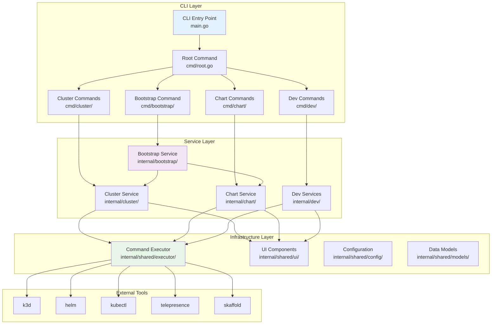
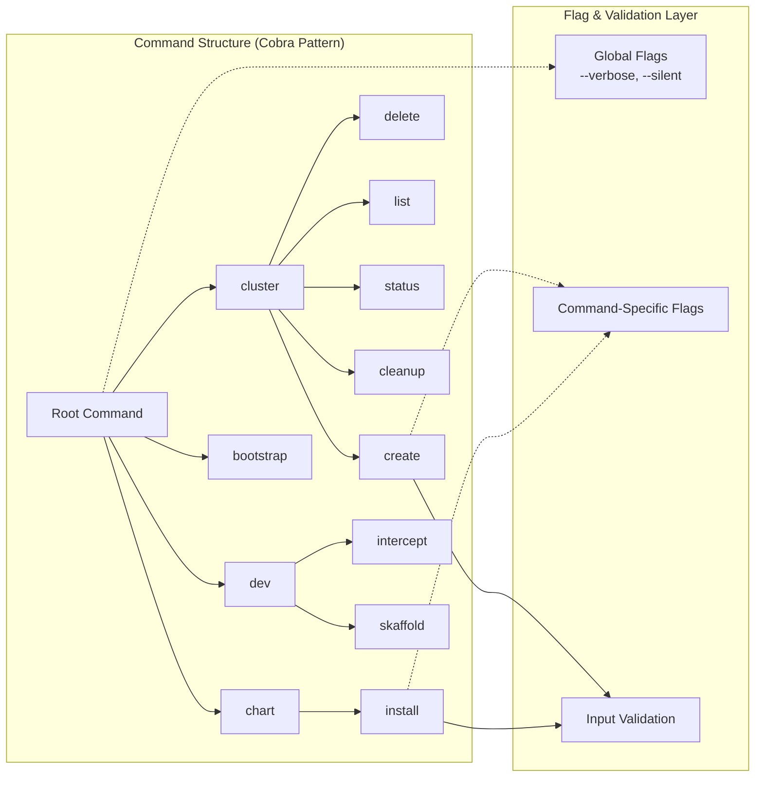
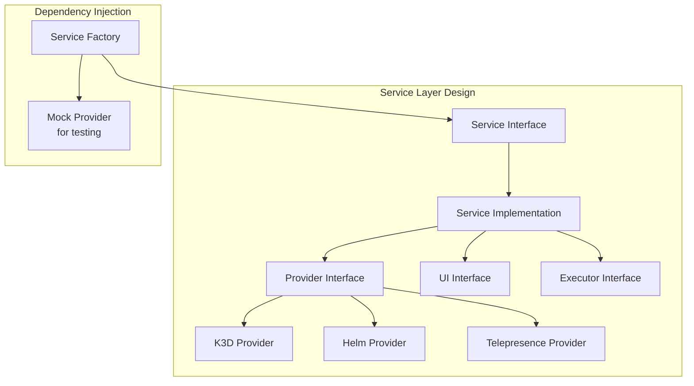
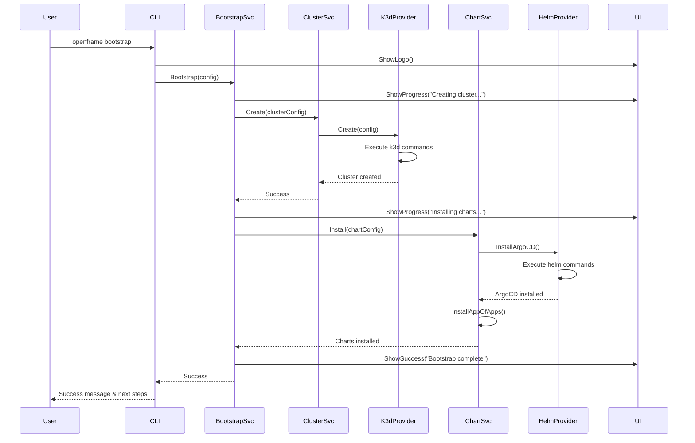
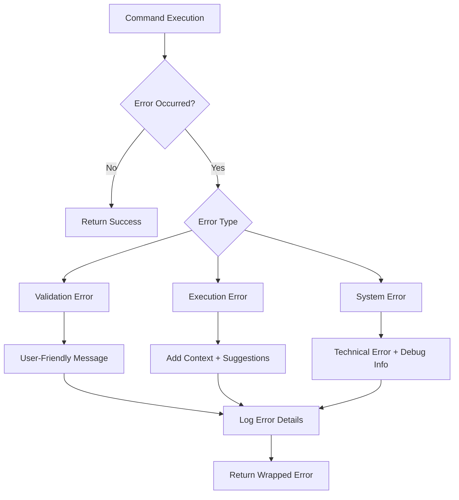
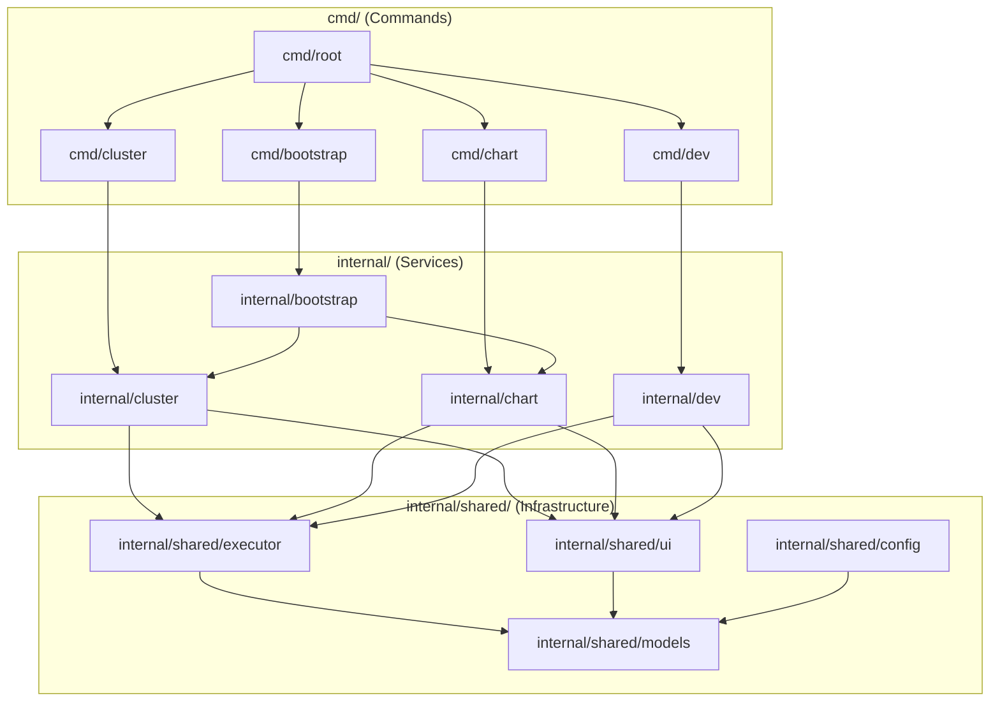
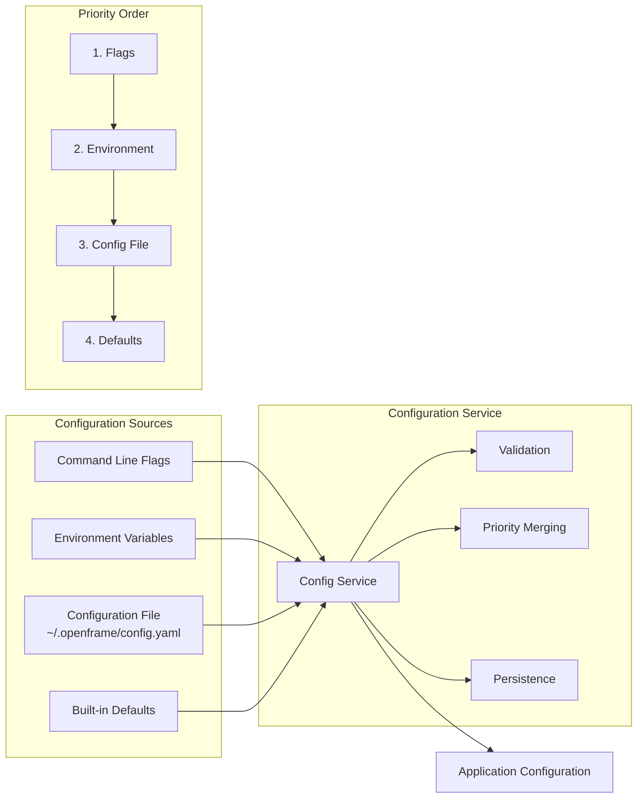
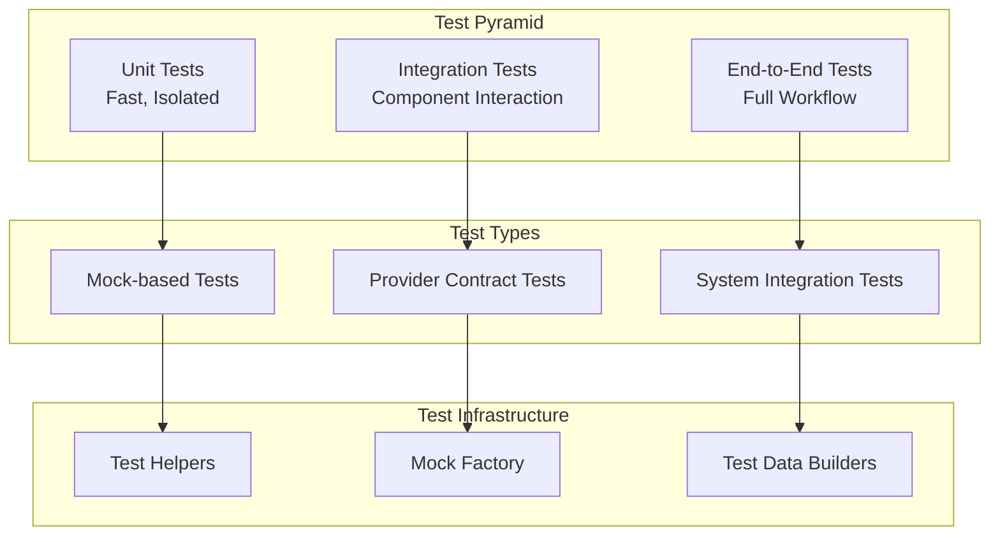

# OpenFrame CLI Architecture Overview for Developers

This document provides a comprehensive technical overview of the OpenFrame CLI architecture, core components, and design patterns for developers working on the project.

## High-Level Architecture



## Core Components Overview

| Component | Package | Responsibility | Key Files |
|-----------|---------|----------------|-----------|
| **CLI Commands** | `cmd/` | Command definitions, flag parsing, user input | `cmd/root.go`, `cmd/*/` |
| **Service Layer** | `internal/*/` | Business logic, workflow orchestration | `service.go`, `manager.go` |
| **Infrastructure** | `internal/shared/` | Cross-cutting concerns, utilities | `executor/`, `ui/`, `config/` |
| **Providers** | `internal/*/providers/` | External tool integrations | `k3d/`, `helm/`, etc. |

## Component Deep Dive

### 1. Command Layer Architecture



#### Command Implementation Pattern

```go
// Standard command structure
func GetCreateCmd() *cobra.Command {
    cmd := &cobra.Command{
        Use:   "create [cluster-name]",
        Short: "Create a new K3d cluster",
        Long:  `Detailed description...`,
        Args:  cobra.MaximumNArgs(1),
        RunE:  runCreateCommand,
        PreRunE: func(cmd *cobra.Command, args []string) error {
            // Prerequisites validation
            return validatePrerequisites()
        },
    }
    
    // Flag definitions
    cmd.Flags().IntP("nodes", "n", 1, "Number of nodes")
    cmd.Flags().StringSlice("port", []string{}, "Port mappings")
    
    return cmd
}

func runCreateCommand(cmd *cobra.Command, args []string) error {
    // Extract configuration from flags
    config, err := buildConfigFromFlags(cmd, args)
    if err != nil {
        return err
    }
    
    // Delegate to service layer
    service := cluster.NewService()
    return service.Create(config)
}
```

### 2. Service Layer Architecture

The service layer implements the business logic and orchestrates workflows between different providers.



#### Service Implementation Pattern

```go
// Service interface definition
type ClusterService interface {
    Create(config *CreateConfig) error
    Delete(name string) error
    List() ([]ClusterInfo, error)
    Status(name string) (*ClusterStatus, error)
}

// Service implementation with dependency injection
type clusterService struct {
    provider Provider
    ui       ui.Interface
    executor executor.Interface
    config   config.Service
}

func NewService(opts ...ServiceOption) ClusterService {
    service := &clusterService{
        provider: k3d.NewProvider(),
        ui:       ui.New(),
        executor: executor.New(),
        config:   config.NewSystemService(),
    }
    
    // Apply configuration options
    for _, opt := range opts {
        opt(service)
    }
    
    return service
}

// Service option pattern for dependency injection
type ServiceOption func(*clusterService)

func WithProvider(provider Provider) ServiceOption {
    return func(s *clusterService) {
        s.provider = provider
    }
}

func WithUI(ui ui.Interface) ServiceOption {
    return func(s *clusterService) {
        s.ui = ui
    }
}
```

### 3. Provider Pattern Implementation

Providers abstract external tool interactions and enable testing through mocking.

```go
// Provider interface
type Provider interface {
    Create(config *CreateConfig) error
    Delete(name string) error
    List() ([]ClusterInfo, error)
    Exists(name string) bool
}

// K3D provider implementation
type k3dProvider struct {
    executor executor.Interface
}

func (p *k3dProvider) Create(config *CreateConfig) error {
    // Build k3d command
    cmd := p.buildCreateCommand(config)
    
    // Execute with error handling
    if err := p.executor.Execute(cmd); err != nil {
        return fmt.Errorf("k3d cluster creation failed: %w", err)
    }
    
    // Wait for cluster to be ready
    return p.waitForClusterReady(config.Name)
}

func (p *k3dProvider) buildCreateCommand(config *CreateConfig) string {
    args := []string{"k3d", "cluster", "create", config.Name}
    
    if config.Nodes > 1 {
        args = append(args, fmt.Sprintf("--agents=%d", config.Nodes-1))
    }
    
    for _, port := range config.Ports {
        args = append(args, "--port", port)
    }
    
    return strings.Join(args, " ")
}
```

## Data Flow and Interactions

### 1. Bootstrap Workflow Data Flow



### 2. Error Handling Flow



## Key Design Patterns

### 1. Command Pattern with Cobra

```go
// Command registration pattern
func init() {
    rootCmd.AddCommand(clusterCmd)
    clusterCmd.AddCommand(createCmd)
    clusterCmd.AddCommand(deleteCmd)
}

// Command execution delegation
func runCommand(cmd *cobra.Command, args []string) error {
    // Parse flags into configuration
    config := parseFlags(cmd)
    
    // Create service with dependencies
    service := newService()
    
    // Execute business logic
    return service.Execute(config)
}
```

### 2. Dependency Injection Pattern

```go
// Service factory with options
type ServiceOptions struct {
    Executor executor.Interface
    UI       ui.Interface
    Provider Provider
}

func NewServiceWithOptions(opts ServiceOptions) Service {
    return &serviceImpl{
        executor: opts.Executor,
        ui:       opts.UI,
        provider: opts.Provider,
    }
}

// Usage in tests
func TestService(t *testing.T) {
    mockExecutor := &MockExecutor{}
    mockUI := &MockUI{}
    
    service := NewServiceWithOptions(ServiceOptions{
        Executor: mockExecutor,
        UI:       mockUI,
        Provider: &MockProvider{},
    })
    
    // Test implementation
}
```

### 3. Strategy Pattern for Providers

```go
// Provider strategy interface
type Provider interface {
    Create(config *Config) error
    Delete(name string) error
}

// Context that uses strategy
type Service struct {
    provider Provider  // Strategy
}

// Runtime strategy selection
func NewService(providerType string) Service {
    var provider Provider
    
    switch providerType {
    case "k3d":
        provider = k3d.NewProvider()
    case "kind":
        provider = kind.NewProvider()
    default:
        provider = k3d.NewProvider()
    }
    
    return Service{provider: provider}
}
```

### 4. Observer Pattern for UI Updates

```go
// Event-driven UI updates
type EventPublisher interface {
    Subscribe(eventType string, handler func(data interface{}))
    Publish(eventType string, data interface{})
}

// Service publishes events
func (s *Service) Create(config *Config) error {
    s.publisher.Publish("cluster.creation.started", config)
    
    err := s.provider.Create(config)
    
    if err != nil {
        s.publisher.Publish("cluster.creation.failed", err)
        return err
    }
    
    s.publisher.Publish("cluster.creation.completed", config)
    return nil
}

// UI subscribes to events
func (ui *UI) Initialize() {
    ui.publisher.Subscribe("cluster.creation.started", ui.showProgress)
    ui.publisher.Subscribe("cluster.creation.completed", ui.showSuccess)
    ui.publisher.Subscribe("cluster.creation.failed", ui.showError)
}
```

## Module Dependencies and Relationships

### Internal Module Dependency Graph



### External Dependencies

| Dependency | Purpose | Usage Pattern |
|------------|---------|---------------|
| **github.com/spf13/cobra** | CLI framework | Command structure and flag parsing |
| **github.com/pterm/pterm** | Terminal UI | Progress bars, spinners, formatted output |
| **github.com/manifoldco/promptui** | Interactive prompts | User input collection |
| **github.com/stretchr/testify** | Testing framework | Assertions and mocks |
| **golang.org/x/term** | Terminal handling | Interactive features and terminal detection |
| **gopkg.in/yaml.v3** | YAML processing | Configuration file parsing |

## Configuration Management

### Configuration Architecture



### Configuration Implementation

```go
// Configuration structure
type Config struct {
    Cluster  ClusterConfig  `yaml:"cluster"`
    Chart    ChartConfig    `yaml:"chart"`
    Dev      DevConfig      `yaml:"dev"`
    Global   GlobalConfig   `yaml:"global"`
}

// Configuration service interface
type Service interface {
    Load() (*Config, error)
    Save(config *Config) error
    GetClusterConfig() ClusterConfig
    SetClusterDefaults(defaults ClusterConfig)
}

// Priority-based configuration loading
func (s *configService) Load() (*Config, error) {
    config := &Config{}
    
    // 1. Load defaults
    s.applyDefaults(config)
    
    // 2. Load from config file
    if err := s.loadFromFile(config); err != nil {
        log.Debug("Config file not found, using defaults")
    }
    
    // 3. Override with environment variables
    s.loadFromEnvironment(config)
    
    // 4. Override with command flags (handled in command layer)
    
    return config, s.validate(config)
}
```

## Error Handling Strategy

### Error Type Hierarchy

```go
// Base error types
type OpenFrameError struct {
    Code    string
    Message string
    Cause   error
}

// Specific error types
type ValidationError struct {
    OpenFrameError
    Field string
    Value interface{}
}

type ExecutionError struct {
    OpenFrameError
    Command string
    Output  string
}

type SystemError struct {
    OpenFrameError
    Component string
}

// Error creation helpers
func NewValidationError(field string, value interface{}, message string) *ValidationError {
    return &ValidationError{
        OpenFrameError: OpenFrameError{
            Code:    "VALIDATION_ERROR",
            Message: fmt.Sprintf("Validation failed for %s: %s", field, message),
        },
        Field: field,
        Value: value,
    }
}
```

### Error Handling Flow

```go
// Service layer error handling
func (s *Service) Create(config *Config) error {
    // Validate input
    if err := s.validate(config); err != nil {
        return NewValidationError("config", config, err.Error())
    }
    
    // Execute operation
    if err := s.provider.Create(config); err != nil {
        // Wrap with context
        return NewExecutionError("cluster_create", err.Error(), 
            "Failed to create cluster. Check Docker and k3d installation.")
    }
    
    return nil
}

// Command layer error handling
func runCommand(cmd *cobra.Command, args []string) error {
    if err := service.Execute(config); err != nil {
        // Log technical details
        log.Error("Command execution failed", "error", err, "config", config)
        
        // Return user-friendly error
        switch e := err.(type) {
        case *ValidationError:
            return fmt.Errorf("Invalid %s: %s", e.Field, e.Message)
        case *ExecutionError:
            return fmt.Errorf("Operation failed: %s\nSuggestion: %s", 
                e.Message, e.Suggestion)
        default:
            return fmt.Errorf("Unexpected error: %v", err)
        }
    }
    
    return nil
}
```

## Testing Architecture

### Testing Strategy Overview



### Testing Patterns

```go
// Table-driven tests
func TestClusterService_Create(t *testing.T) {
    tests := []struct {
        name      string
        config    *CreateConfig
        mockSetup func(*MockProvider)
        wantError bool
        errorType error
    }{
        {
            name: "successful creation",
            config: &CreateConfig{
                Name:  "test-cluster",
                Nodes: 1,
            },
            mockSetup: func(m *MockProvider) {
                m.On("Create", mock.Anything).Return(nil)
            },
            wantError: false,
        },
        {
            name: "provider failure",
            config: &CreateConfig{Name: "test-cluster"},
            mockSetup: func(m *MockProvider) {
                m.On("Create", mock.Anything).Return(errors.New("k3d failed"))
            },
            wantError: true,
            errorType: &ExecutionError{},
        },
    }
    
    for _, tt := range tests {
        t.Run(tt.name, func(t *testing.T) {
            // Setup
            mockProvider := &MockProvider{}
            if tt.mockSetup != nil {
                tt.mockSetup(mockProvider)
            }
            
            service := NewServiceWithOptions(ServiceOptions{
                Provider: mockProvider,
                UI:       &MockUI{},
                Executor: &MockExecutor{},
            })
            
            // Execute
            err := service.Create(tt.config)
            
            // Assert
            if tt.wantError {
                assert.Error(t, err)
                if tt.errorType != nil {
                    assert.IsType(t, tt.errorType, err)
                }
            } else {
                assert.NoError(t, err)
            }
            
            mockProvider.AssertExpectations(t)
        })
    }
}

// Integration test example
func TestBootstrapWorkflow_Integration(t *testing.T) {
    if testing.Short() {
        t.Skip("Skipping integration test in short mode")
    }
    
    // Setup real dependencies but with safe defaults
    service := bootstrap.NewService()
    config := &bootstrap.Config{
        ClusterName:    "test-" + uuid.New().String()[:8],
        DeploymentMode: "oss-tenant",
    }
    
    // Execute
    err := service.Bootstrap(config)
    
    // Assert
    require.NoError(t, err)
    
    // Verify cluster exists
    clusters, err := service.ListClusters()
    require.NoError(t, err)
    assert.Contains(t, clusters, config.ClusterName)
    
    // Cleanup
    defer func() {
        _ = service.DeleteCluster(config.ClusterName)
    }()
}
```

## Performance Considerations

### Command Execution Optimization

```go
// Concurrent command execution
func (s *Service) CreateMultiNodeCluster(config *Config) error {
    // Create cluster
    if err := s.provider.Create(config); err != nil {
        return err
    }
    
    // Install components concurrently
    var wg sync.WaitGroup
    errChan := make(chan error, 3)
    
    // ArgoCD installation
    wg.Add(1)
    go func() {
        defer wg.Done()
        if err := s.installArgoCD(); err != nil {
            errChan <- fmt.Errorf("ArgoCD installation failed: %w", err)
        }
    }()
    
    // Monitoring stack
    wg.Add(1)
    go func() {
        defer wg.Done()
        if err := s.installMonitoring(); err != nil {
            errChan <- fmt.Errorf("Monitoring installation failed: %w", err)
        }
    }()
    
    // Wait for completion
    wg.Wait()
    close(errChan)
    
    // Check for errors
    for err := range errChan {
        if err != nil {
            return err
        }
    }
    
    return nil
}
```

### Memory Management

```go
// Stream large command outputs
func (e *Executor) ExecuteWithStreaming(cmd string) error {
    command := exec.Command("sh", "-c", cmd)
    
    stdout, err := command.StdoutPipe()
    if err != nil {
        return err
    }
    
    stderr, err := command.StderrPipe()
    if err != nil {
        return err
    }
    
    // Start command
    if err := command.Start(); err != nil {
        return err
    }
    
    // Stream output
    go io.Copy(os.Stdout, stdout)
    go io.Copy(os.Stderr, stderr)
    
    return command.Wait()
}
```

## Security Considerations

### Input Validation and Sanitization

```go
// Command injection prevention
func (e *Executor) Execute(cmd string) error {
    // Validate command structure
    if err := e.validateCommand(cmd); err != nil {
        return fmt.Errorf("invalid command: %w", err)
    }
    
    // Use structured command execution
    parts := strings.Fields(cmd)
    if len(parts) == 0 {
        return errors.New("empty command")
    }
    
    command := exec.Command(parts[0], parts[1:]...)
    output, err := command.CombinedOutput()
    
    if err != nil {
        return fmt.Errorf("command failed: %w\nOutput: %s", err, output)
    }
    
    return nil
}

func (e *Executor) validateCommand(cmd string) error {
    // Check for dangerous patterns
    dangerous := []string{";", "&&", "||", "|", ">", "<", "`", "$("}
    for _, pattern := range dangerous {
        if strings.Contains(cmd, pattern) {
            return fmt.Errorf("potentially dangerous pattern detected: %s", pattern)
        }
    }
    
    // Validate allowed command prefixes
    allowed := []string{"k3d", "helm", "kubectl", "telepresence", "skaffold"}
    parts := strings.Fields(cmd)
    if len(parts) > 0 {
        for _, prefix := range allowed {
            if strings.HasPrefix(parts[0], prefix) {
                return nil
            }
        }
        return fmt.Errorf("command not in allowlist: %s", parts[0])
    }
    
    return nil
}
```

This architecture overview provides the technical foundation for understanding and extending the OpenFrame CLI codebase. The modular design, clear separation of concerns, and comprehensive error handling make the system maintainable and testable while providing a robust user experience.