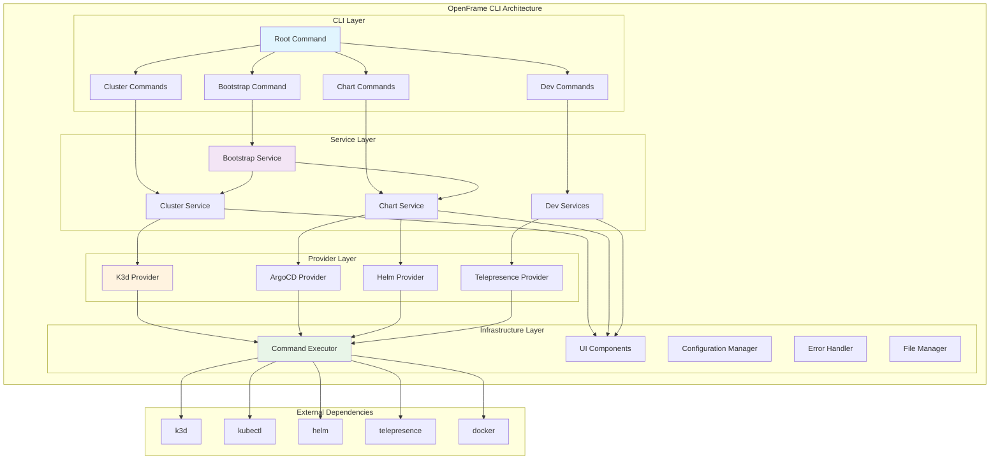
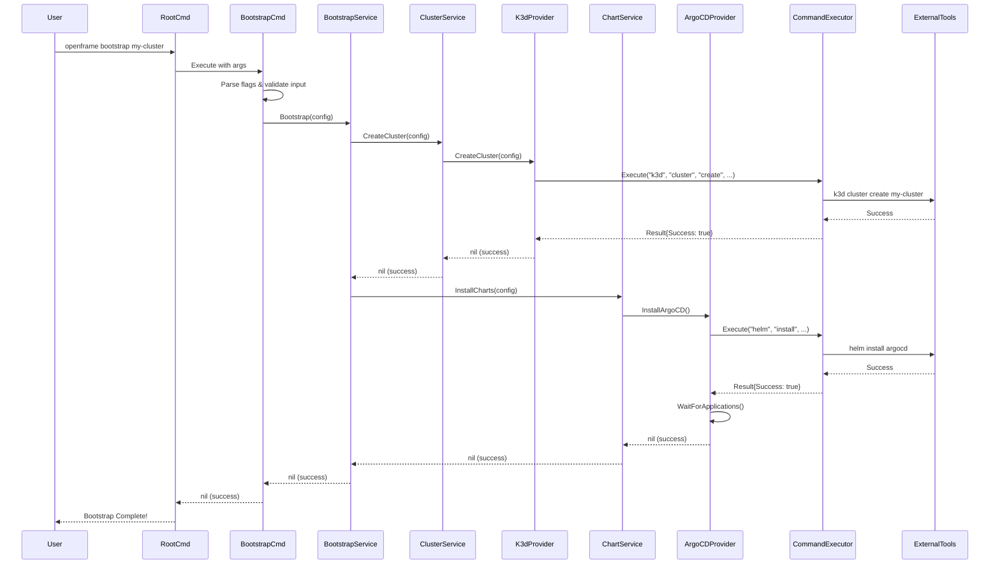
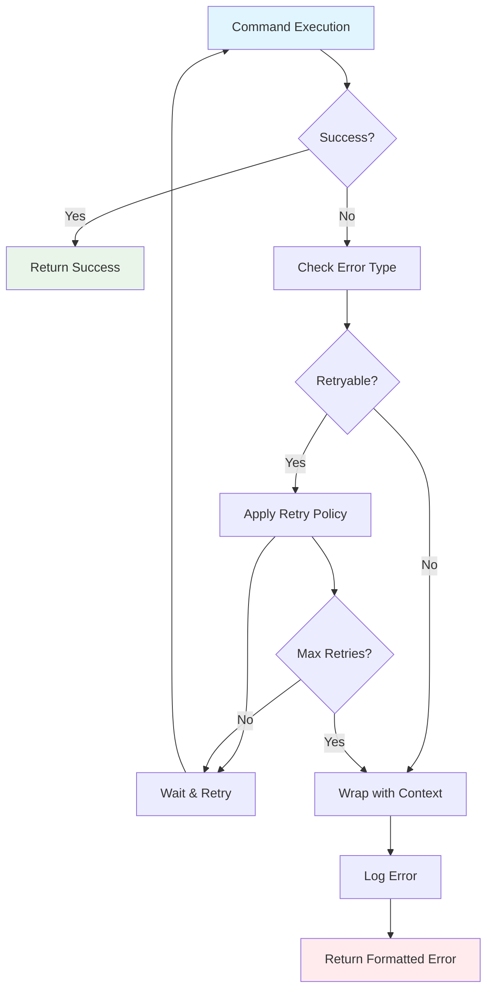
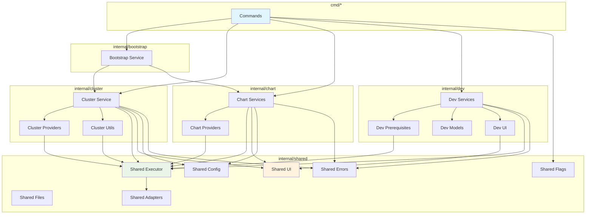
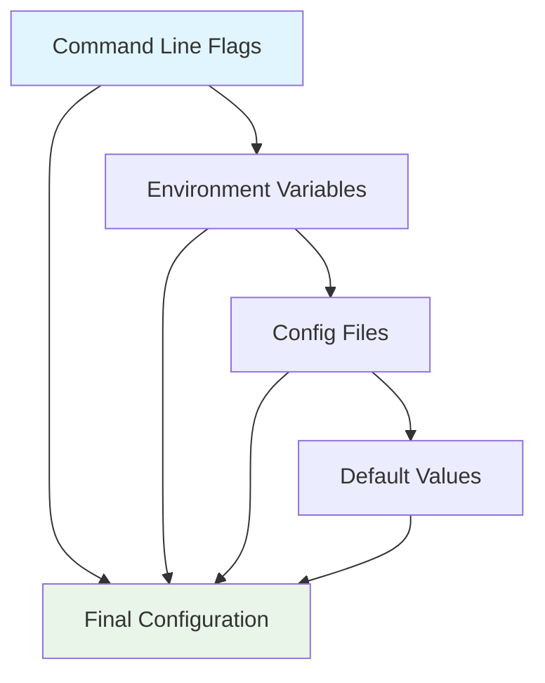

# Architecture Overview - OpenFrame CLI

This document provides a comprehensive overview of OpenFrame CLI's architecture, designed for engineers who need to understand the system's structure, components, and design patterns.

## System Overview

OpenFrame CLI is a Go-based command-line tool that orchestrates Kubernetes cluster management and development workflows. It follows a layered architecture with clear separation of concerns between CLI interaction, business logic, and external tool integration.



## Core Components

### Component Responsibility Matrix

| Layer | Component | Primary Responsibilities | Key Interfaces |
|-------|-----------|-------------------------|----------------|
| **CLI** | Root Command | CLI entry point, command routing, version management | `cobra.Command` |
| **CLI** | Bootstrap Command | User interaction for complete environment setup | `cobra.Command` |
| **CLI** | Cluster Commands | Cluster lifecycle CLI operations | `cobra.Command` |
| **CLI** | Chart Commands | Chart management CLI operations | `cobra.Command` |
| **CLI** | Dev Commands | Development tools CLI operations | `cobra.Command` |
| **Service** | Bootstrap Service | Orchestrates cluster + chart installation | `BootstrapService` |
| **Service** | Cluster Service | Cluster lifecycle business logic | `ClusterService` |
| **Service** | Chart Service | Chart installation and management | `ChartService` |
| **Service** | Dev Services | Development workflow orchestration | `InterceptService`, `ScaffoldService` |
| **Provider** | K3d Provider | K3d-specific cluster operations | `ClusterProvider` |
| **Provider** | ArgoCD Provider | ArgoCD installation and app management | `ChartProvider` |
| **Provider** | Helm Provider | Direct Helm chart operations | `ChartProvider` |
| **Provider** | Telepresence Provider | Traffic interception for development | `InterceptProvider` |
| **Infrastructure** | Command Executor | External command execution abstraction | `CommandExecutor` |
| **Infrastructure** | UI Components | User interface elements and feedback | `ProgressTracker`, `Prompter` |
| **Infrastructure** | Configuration | Application and cluster configuration | `ConfigManager` |
| **Infrastructure** | Error Handler | Centralized error processing and retry logic | `ErrorHandler` |

## Architectural Patterns

### 1. Layered Architecture

The system is organized in distinct layers with well-defined responsibilities:

- **CLI Layer**: Handles user interaction, command parsing, and input validation
- **Service Layer**: Contains business logic and orchestrates operations
- **Provider Layer**: Implements specific tool integrations
- **Infrastructure Layer**: Provides shared utilities and cross-cutting concerns

### 2. Dependency Injection

Services receive their dependencies through constructor functions:

```go
// Service depends on abstractions, not concrete implementations
func NewClusterService(executor executor.CommandExecutor) ClusterService {
    return &clusterService{
        manager:  k3d.NewManager(),
        executor: executor,
    }
}
```

### 3. Interface Segregation

Components depend on focused interfaces rather than concrete implementations:

```go
type CommandExecutor interface {
    Execute(command string, args ...string) Result
    ExecuteWithOutput(command string, args ...string) (string, error)
}

type ClusterProvider interface {
    CreateCluster(config ClusterConfig) error
    DeleteCluster(name string) error
    ListClusters() ([]ClusterInfo, error)
}
```

### 4. Command Pattern (Cobra)

CLI commands follow the Cobra framework pattern with clear separation:

```go
func GetBootstrapCmd() *cobra.Command {
    return &cobra.Command{
        Use:   "bootstrap [cluster-name]",
        Short: "Bootstrap complete OpenFrame environment",
        RunE: func(cmd *cobra.Command, args []string) error {
            service := bootstrap.NewBootstrapService(executor.NewCommandExecutor())
            return service.Bootstrap(parseFlags(cmd, args))
        },
    }
}
```

## Data Flow Architecture

### Bootstrap Flow (Primary Use Case)



### Error Handling Flow



## Module Dependencies

### Internal Dependencies



### External Dependencies

| Dependency | Purpose | Integration Pattern |
|------------|---------|-------------------|
| **Cobra** (`spf13/cobra`) | CLI framework | Direct usage in `cmd/` packages |
| **PTerm** (`pterm/pterm`) | Terminal UI components | Wrapped in `internal/shared/ui` |
| **PromptUI** (`manifoldco/promptui`) | Interactive prompts | Wrapped in `internal/shared/ui` |
| **YAML** (`gopkg.in/yaml.v3`) | Configuration parsing | Used in `internal/shared/config` |
| **Testify** (`stretchr/testify`) | Testing framework | Used across all test files |

## Key Design Decisions

### 1. Command Executor Abstraction

**Decision**: All external tool interactions go through a `CommandExecutor` interface.

**Rationale**: 
- Enables easy mocking for tests
- Centralizes command execution logic
- Allows for future enhancements (logging, retries, etc.)

```go
type CommandExecutor interface {
    Execute(command string, args ...string) Result
    ExecuteWithTimeout(timeout time.Duration, command string, args ...string) Result
}
```

### 2. Provider Pattern for Tool Integration

**Decision**: Each external tool (k3d, helm, argocd) has a dedicated provider.

**Rationale**:
- Isolates tool-specific logic
- Enables swapping implementations
- Clear testing boundaries

### 3. Service Layer Orchestration

**Decision**: Services orchestrate multiple providers but contain minimal business logic.

**Rationale**:
- Single responsibility principle
- Easy to test and modify
- Clear separation between orchestration and implementation

### 4. Error Context Wrapping

**Decision**: Errors are wrapped with contextual information at each layer.

**Rationale**:
- Better debugging experience
- Preserves error chain for analysis
- Enables targeted error handling

```go
func (s *clusterService) CreateCluster(config ClusterConfig) error {
    if err := s.provider.CreateCluster(config); err != nil {
        return fmt.Errorf("failed to create cluster %s: %w", config.Name, err)
    }
    return nil
}
```

## Configuration Management

### Configuration Hierarchy



### Configuration Sources

| Source | Priority | Example | Usage |
|--------|----------|---------|-------|
| **CLI Flags** | Highest | `--deployment-mode=oss-tenant` | One-time overrides |
| **Environment Variables** | High | `OPENFRAME_MODE=oss-tenant` | CI/CD automation |
| **Config Files** | Medium | `~/.openframe/config.yaml` | User preferences |
| **Default Values** | Lowest | Built-in defaults | Fallback values |

## Testing Architecture

### Test Strategy

| Test Type | Location | Purpose | Dependencies |
|-----------|----------|---------|--------------|
| **Unit Tests** | `*_test.go` files | Test individual functions/methods | Mocks only |
| **Integration Tests** | `*_integration_test.go` | Test component interactions | Docker, k3d |
| **End-to-End Tests** | `e2e/` directory | Test complete workflows | Full environment |

### Mock Strategy

```go
// Mock interfaces for testing
type MockCommandExecutor struct {
    commands []string
    results  map[string]Result
}

func (m *MockCommandExecutor) Execute(cmd string, args ...string) Result {
    fullCmd := fmt.Sprintf("%s %s", cmd, strings.Join(args, " "))
    m.commands = append(m.commands, fullCmd)
    
    if result, exists := m.results[fullCmd]; exists {
        return result
    }
    
    return Result{Success: true} // Default success
}
```

## Performance Considerations

### Bottlenecks and Optimizations

| Component | Potential Bottleneck | Optimization Strategy |
|-----------|---------------------|----------------------|
| **Cluster Creation** | k3d startup time | Parallel node creation, image pre-pulling |
| **ArgoCD Installation** | Helm chart download | Chart caching, parallel installs |
| **Application Sync** | ArgoCD sync wait | Configurable timeouts, progress tracking |
| **Command Execution** | External tool startup | Connection pooling, command batching |

### Resource Management

- **Memory**: Minimal memory footprint, streaming command output
- **CPU**: Concurrent operations where safe (e.g., parallel cluster operations)
- **Network**: Efficient ArgoCD polling with exponential backoff
- **Disk**: Temporary file cleanup, Docker image management

## Extension Points

### Adding New Commands

1. Create command in appropriate `cmd/` subdirectory
2. Implement service logic in `internal/` package
3. Add provider if external tool integration needed
4. Register command in parent command's `init()` function

### Adding New Providers

1. Define interface in service package
2. Implement provider in `providers/` subdirectory
3. Use `CommandExecutor` for external tool calls
4. Add comprehensive tests with mocks

### Adding New External Tools

1. Extend `CommandExecutor` if special handling needed
2. Create adapter in `internal/shared/adapters/`
3. Add prerequisite checking in `internal/dev/prerequisites/`
4. Update installation guides

## Security Considerations

### Security Principles

| Principle | Implementation | Example |
|-----------|----------------|---------|
| **Least Privilege** | Minimal required permissions | K3d clusters run as current user |
| **Input Validation** | Sanitize all user inputs | Validate cluster names, file paths |
| **Secure Defaults** | Safe default configurations | Enable RBAC, secure networking |
| **Audit Trail** | Log security-relevant operations | Cluster creation, deletion events |

### Threat Model

- **Malicious Input**: Validated through Cobra flag validation
- **Command Injection**: Prevented by structured command building
- **File System Access**: Limited to specific directories
- **Network Security**: K3d clusters isolated by default

## Monitoring and Observability

### Logging Strategy

```go
// Structured logging approach
log.WithFields(log.Fields{
    "cluster":   clusterName,
    "operation": "create",
    "duration":  elapsed,
}).Info("Cluster creation completed")
```

### Metrics Collection

- Command execution times
- Success/failure rates
- Resource utilization
- User interaction patterns

## Future Architecture Considerations

### Planned Enhancements

1. **Plugin System**: Support for third-party providers
2. **Config Management**: Advanced configuration templating
3. **Multi-Cloud**: Support for EKS, GKE, AKS providers
4. **State Management**: Cluster state persistence and sync
5. **API Server**: REST API for programmatic access

### Scalability Considerations

- **Multiple Clusters**: Efficient management of 10+ clusters
- **Large Teams**: Role-based access and resource quotas
- **CI/CD Integration**: High-throughput automation support
- **Enterprise Features**: SSO, audit logging, compliance

---

This architecture overview provides the foundation for understanding and extending OpenFrame CLI. For implementation details, refer to the codebase and inline documentation.