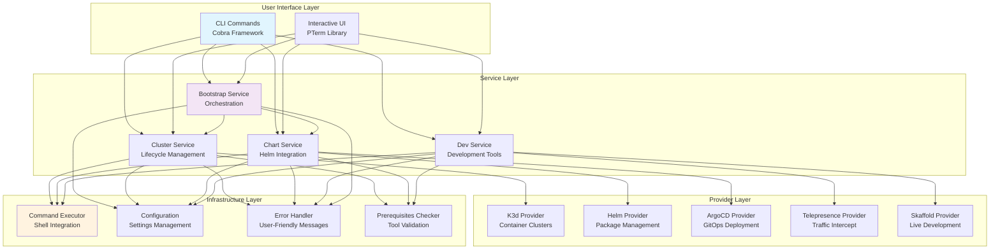
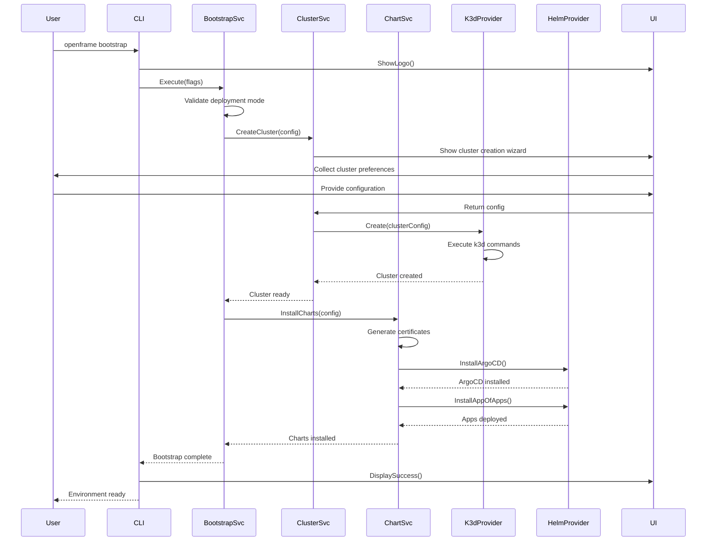
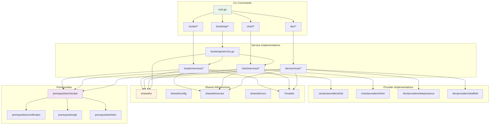

# OpenFrame CLI - Architecture Overview

This document provides a comprehensive technical overview of the OpenFrame CLI architecture, designed for engineers working on or integrating with the platform.

## High-Level Architecture

OpenFrame CLI is built as a modular, layered Go application that orchestrates Kubernetes cluster creation and OpenFrame platform deployment through a modern CLI interface.



## Core Components Deep Dive

### Command Layer (`cmd/`)

The command layer implements the Cobra CLI framework pattern with hierarchical commands:

| Component | Responsibility | Key Files |
|-----------|---------------|-----------|
| **Root Command** | CLI entry point, version info, global flags | `cmd/root.go` |
| **Bootstrap Command** | Orchestrates complete setup workflow | `cmd/bootstrap/bootstrap.go` |
| **Cluster Commands** | Cluster lifecycle (create, delete, list, status, cleanup) | `cmd/cluster/*.go` |
| **Chart Commands** | Helm chart installation and management | `cmd/chart/*.go` |
| **Dev Commands** | Development tools (intercept, scaffold) | `cmd/dev/*.go` |

#### Command Registration Pattern:
```go
// Each command package exposes a getter function
func GetClusterCmd() *cobra.Command {
    clusterCmd := &cobra.Command{...}
    clusterCmd.AddCommand(getCreateCmd())
    clusterCmd.AddCommand(getDeleteCmd())
    return clusterCmd
}

// Root command registers all subcommands
rootCmd.AddCommand(cluster.GetClusterCmd())
rootCmd.AddCommand(chart.GetChartCmd())
```

### Service Layer (`internal/`)

The service layer contains the core business logic, abstracted from CLI concerns:

#### Bootstrap Service
- **Purpose**: Orchestrates cluster creation + chart installation
- **Key Logic**: Validates deployment modes, coordinates service calls
- **Dependencies**: Cluster Service, Chart Service

#### Cluster Service
- **Purpose**: Manages K3d cluster lifecycle
- **Key Logic**: Interactive configuration, cluster creation/deletion, status monitoring
- **Dependencies**: K3d Provider, Prerequisites Checker

#### Chart Service  
- **Purpose**: Manages Helm chart installation and ArgoCD setup
- **Key Logic**: Certificate generation, ArgoCD installation, app-of-apps pattern
- **Dependencies**: Helm Provider, Certificate Manager

#### Dev Service
- **Purpose**: Provides development workflow tools
- **Key Logic**: Traffic interception, live development setup
- **Dependencies**: Telepresence Provider, Skaffold Provider

### Provider Layer

Providers abstract external tool integration:

```go
// Example provider interface
type ClusterProvider interface {
    Create(config *models.ClusterConfig) error
    Delete(name string) error
    List() ([]models.Cluster, error)
    GetStatus(name string) (*models.ClusterStatus, error)
}

// K3d implementation
type K3dProvider struct {
    executor executor.Executor
}

func (p *K3dProvider) Create(config *models.ClusterConfig) error {
    cmd := fmt.Sprintf("k3d cluster create %s --agents %d", config.Name, config.Nodes)
    return p.executor.Execute(cmd)
}
```

## Data Flow Architecture

The following diagram shows how data flows through the system during a typical bootstrap operation:



## Module Relationships

The following diagram illustrates the dependency relationships between major modules:



## Key Design Patterns

### 1. Command Pattern
Each CLI command is implemented as a separate struct with a consistent interface:
```go
type Command interface {
    Execute(cmd *cobra.Command, args []string) error
}
```

### 2. Service Layer Pattern
Business logic is separated from CLI concerns:
```go
// CLI layer - thin adapter
func runBootstrap(cmd *cobra.Command, args []string) error {
    service := bootstrap.NewService()
    return service.Execute(cmd, args)
}

// Service layer - contains business logic
func (s *Service) Execute(cmd *cobra.Command, args []string) error {
    // Actual implementation
}
```

### 3. Provider Pattern
External tool integration is abstracted behind interfaces:
```go
type ClusterProvider interface {
    Create(config *ClusterConfig) error
    Delete(name string) error
}

// Multiple implementations possible
type K3dProvider struct{}
type KindProvider struct{}
type EKSProvider struct{}
```

### 4. Dependency Injection
Services receive their dependencies through constructors:
```go
type Service struct {
    clusterProvider ClusterProvider
    executor        executor.Executor
    ui             ui.Interface
}

func NewService(provider ClusterProvider, executor executor.Executor) *Service {
    return &Service{
        clusterProvider: provider,
        executor:       executor,
    }
}
```

### 5. Error Wrapping
Errors are wrapped with context as they bubble up:
```go
// Low level
if err := k3d.CreateCluster(name); err != nil {
    return fmt.Errorf("k3d cluster creation failed: %w", err)
}

// Service level
if err := s.provider.Create(config); err != nil {
    return fmt.Errorf("failed to create cluster %s: %w", config.Name, err)
}

// Command level
if err := service.CreateCluster(config); err != nil {
    return sharedErrors.HandleGlobalError(err, verbose)
}
```

## Configuration Management

Configuration follows a hierarchical priority:

1. **Command-line flags** (highest priority)
2. **Environment variables**
3. **Configuration files**
4. **Interactive prompts**
5. **Default values** (lowest priority)

```go
// Example configuration resolution
func resolveConfig(cmd *cobra.Command) (*Config, error) {
    config := &Config{}
    
    // Start with defaults
    config.SetDefaults()
    
    // Load from config file
    if err := config.LoadFromFile(); err != nil {
        return nil, err
    }
    
    // Override with environment variables
    config.LoadFromEnv()
    
    // Override with command flags
    config.LoadFromFlags(cmd)
    
    return config, nil
}
```

## Error Handling Strategy

OpenFrame CLI implements a multi-layer error handling approach:

### 1. Error Types
```go
// User-facing errors
type UserError struct {
    Message string
    Cause   error
}

// System errors
type SystemError struct {
    Operation string
    Cause     error
}

// Validation errors
type ValidationError struct {
    Field   string
    Value   interface{}
    Message string
}
```

### 2. Error Display
```go
// Consistent error formatting
func HandleGlobalError(err error, verbose bool) error {
    switch e := err.(type) {
    case *UserError:
        ui.DisplayError(e.Message)
    case *SystemError:
        if verbose {
            ui.DisplayError(fmt.Sprintf("%s: %v", e.Operation, e.Cause))
        } else {
            ui.DisplayError("System error occurred. Use --verbose for details.")
        }
    }
    return err
}
```

## Security Considerations

### 1. Command Execution
All external commands are executed through a controlled executor:
```go
type Executor interface {
    Execute(command string) error
    ExecuteWithOutput(command string) (string, error)
}

// Prevents command injection
func (e *DefaultExecutor) Execute(command string) error {
    args := strings.Fields(command)
    cmd := exec.Command(args[0], args[1:]...)
    return cmd.Run()
}
```

### 2. Certificate Management
Certificates are generated securely and stored appropriately:
```go
func GenerateCertificates(domain string) error {
    // Use mkcert for local development
    // Use cert-manager for production
}
```

### 3. Credential Handling
No credentials are stored in plain text or logged:
```go
func (s *Service) handleCredentials(secret string) {
    // Never log credentials
    if verbose && secret != "" {
        log.Println("Credential provided (hidden)")
    }
}
```

## Testing Strategy

### 1. Unit Tests
Each package has comprehensive unit tests:
```go
func TestClusterCreate(t *testing.T) {
    mockProvider := &MockK3dProvider{}
    service := NewService(mockProvider, mockExecutor)
    
    err := service.CreateCluster(&models.ClusterConfig{
        Name: "test-cluster",
    })
    
    assert.NoError(t, err)
    assert.True(t, mockProvider.CreateCalled)
}
```

### 2. Integration Tests
Integration tests verify real tool interactions:
```go
//go:build integration
func TestRealClusterCreation(t *testing.T) {
    if testing.Short() {
        t.Skip("Skipping integration test")
    }
    
    // Test with real K3d
    provider := k3d.NewProvider()
    err := provider.Create(&models.ClusterConfig{
        Name: "integration-test",
    })
    defer provider.Delete("integration-test")
    
    assert.NoError(t, err)
}
```

### 3. CLI Tests
CLI behavior is tested using Cobra's testing framework:
```go
func TestBootstrapCommand(t *testing.T) {
    cmd := GetRootCmd(DefaultVersionInfo)
    cmd.SetArgs([]string{"bootstrap", "--non-interactive", "--deployment-mode", "oss-tenant"})
    
    err := cmd.Execute()
    assert.NoError(t, err)
}
```

## Performance Considerations

### 1. Concurrent Operations
Where possible, operations run concurrently:
```go
func (s *Service) InstallMultipleCharts(charts []Chart) error {
    var wg sync.WaitGroup
    errors := make(chan error, len(charts))
    
    for _, chart := range charts {
        wg.Add(1)
        go func(c Chart) {
            defer wg.Done()
            if err := s.InstallChart(c); err != nil {
                errors <- err
            }
        }(chart)
    }
    
    wg.Wait()
    close(errors)
    
    for err := range errors {
        return err
    }
    return nil
}
```

### 2. Resource Management
External resources are cleaned up properly:
```go
func (s *Service) createClusterWithCleanup(config *Config) error {
    cluster, err := s.provider.Create(config)
    if err != nil {
        return err
    }
    
    // Register cleanup function
    defer func() {
        if err != nil {
            s.provider.Delete(cluster.Name)
        }
    }()
    
    return s.configureCluster(cluster)
}
```

### 3. Caching
Expensive operations are cached when appropriate:
```go
var (
    prerequisiteCache = make(map[string]bool)
    cacheMutex       sync.RWMutex
)

func checkPrerequisite(tool string) bool {
    cacheMutex.RLock()
    if cached, exists := prerequisiteCache[tool]; exists {
        cacheMutex.RUnlock()
        return cached
    }
    cacheMutex.RUnlock()
    
    // Expensive check
    result := actualCheck(tool)
    
    cacheMutex.Lock()
    prerequisiteCache[tool] = result
    cacheMutex.Unlock()
    
    return result
}
```

## Extension Points

The architecture provides several extension points for adding new functionality:

### 1. New Commands
Add new commands by implementing the command pattern:
```go
func GetNewCmd() *cobra.Command {
    return &cobra.Command{
        Use:   "new",
        Short: "New functionality",
        RunE:  runNewCommand,
    }
}
```

### 2. New Providers
Add support for new tools by implementing provider interfaces:
```go
type NewProvider struct{}

func (p *NewProvider) SomeOperation(config *Config) error {
    // Implementation
}
```

### 3. New UI Components
Extend the UI framework with new interactive elements:
```go
func ShowCustomPrompt(message string, options []string) (string, error) {
    return pterm.DefaultInteractiveSelect.
        WithOptions(options).
        Show(message)
}
```

---

This architecture provides a solid foundation for building robust CLI tools while maintaining flexibility for future enhancements and integrations.