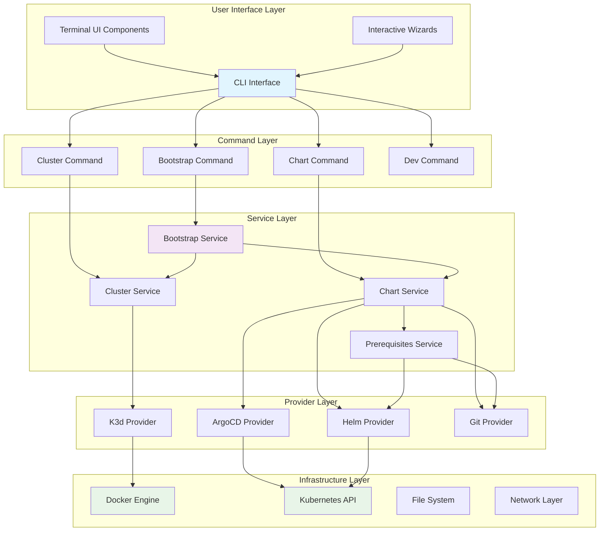
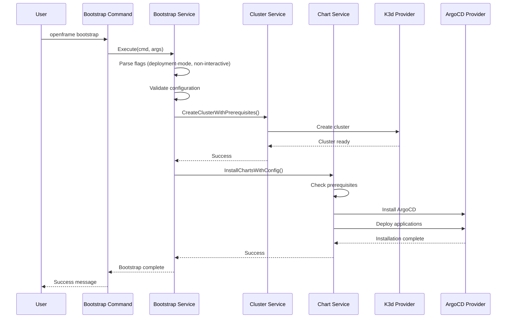
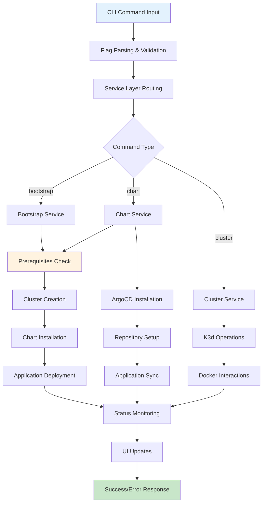
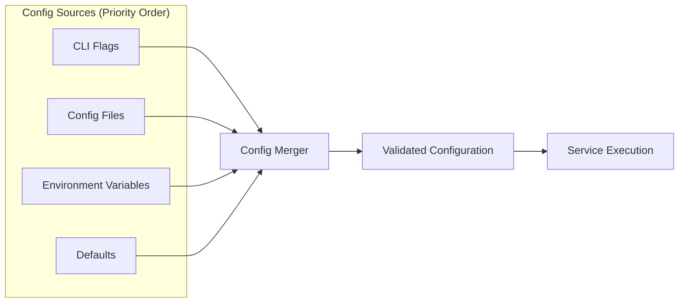
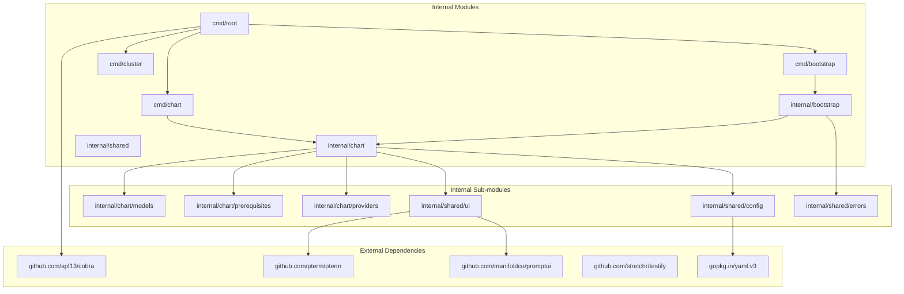
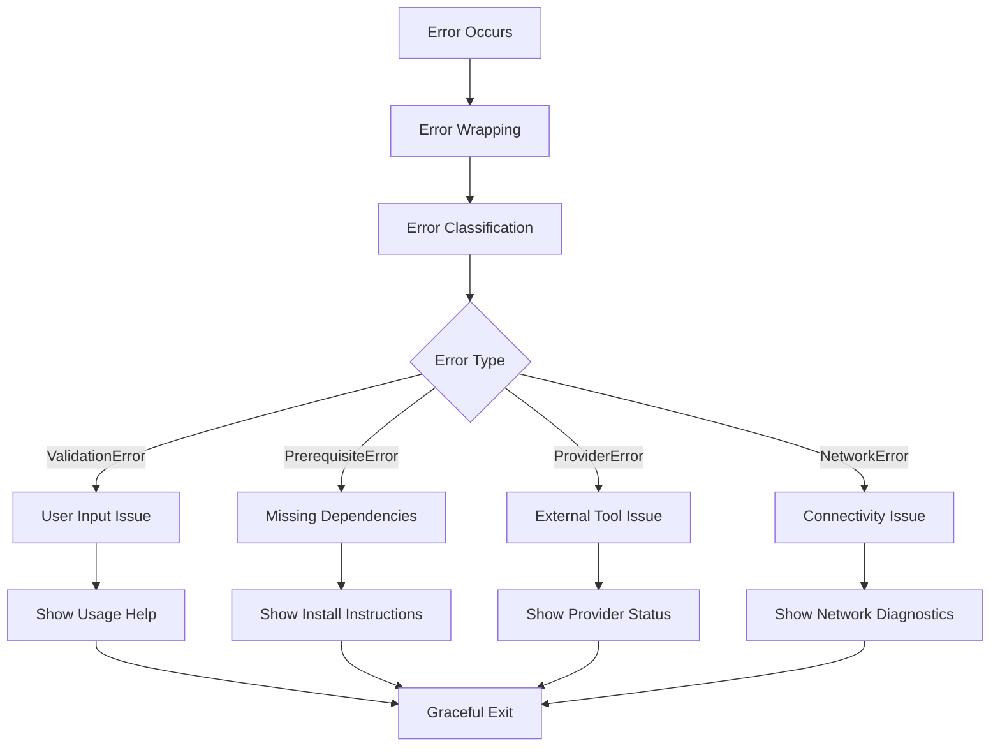
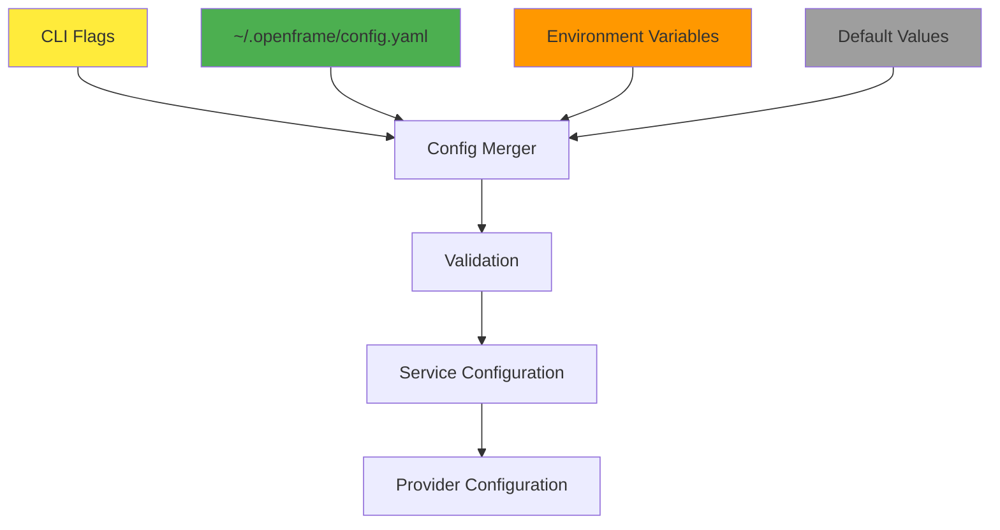
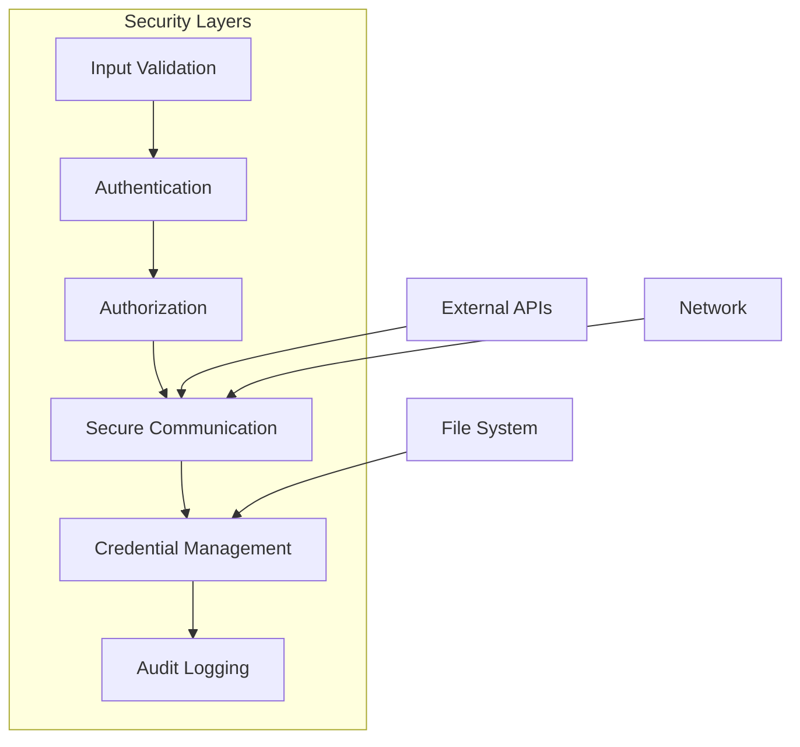
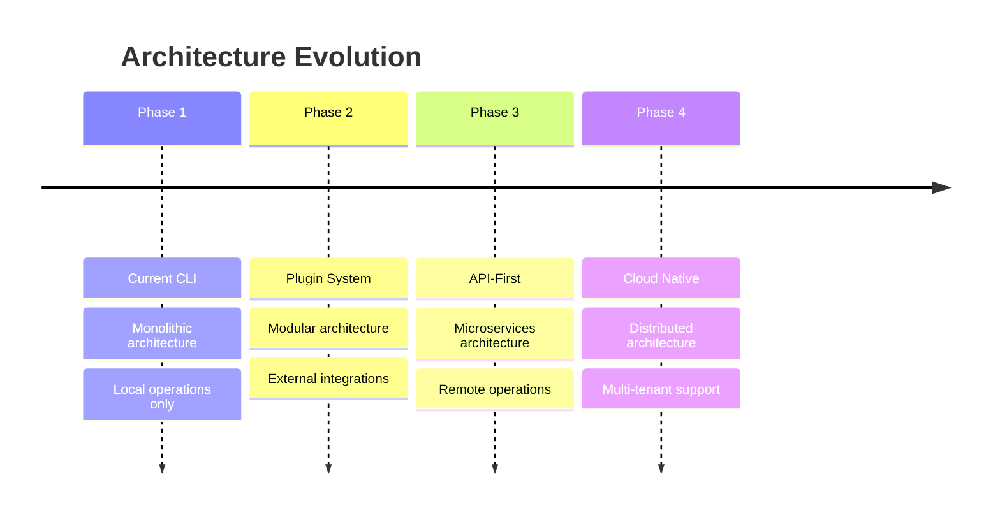

# OpenFrame CLI Architecture Overview

This document provides a comprehensive technical overview of the OpenFrame CLI architecture, design patterns, and internal workings. It's intended for developers who need to understand the system deeply for maintenance, extension, or integration purposes.

## System Architecture

OpenFrame CLI follows a layered architecture with clear separation of concerns, enabling maintainability and testability.

### High-Level Architecture



## Core Components Deep Dive

### 1. Command Layer (`cmd/`)

The command layer implements the Cobra CLI framework and handles user interaction.

| Component | Responsibility | Key Files |
|-----------|---------------|-----------|
| **Root Command** | CLI entry point, global flags, version info | `cmd/root.go` |
| **Bootstrap Command** | Orchestrates complete environment setup | `cmd/bootstrap/bootstrap.go` |
| **Chart Command** | Manages Helm charts and ArgoCD installation | `cmd/chart/chart.go`, `cmd/chart/install.go` |
| **Cluster Command** | K3d cluster lifecycle management | `cmd/cluster/*.go` |
| **Dev Command** | Development tools and utilities | `cmd/dev/*.go` |

#### Command Pattern Implementation

```go
// Standard command structure
func GetCommandCmd() *cobra.Command {
    cmd := &cobra.Command{
        Use:   "command [args]",
        Short: "Brief description",
        Long:  `Detailed description with examples`,
        RunE: func(cmd *cobra.Command, args []string) error {
            // 1. Parse flags and arguments
            // 2. Validate input
            // 3. Create service instance
            // 4. Execute business logic
            // 5. Handle errors consistently
            return service.Execute(cmd, args)
        },
    }
    
    // Flag definitions
    cmd.Flags().StringP("flag", "f", "default", "Description")
    
    return cmd
}
```

### 2. Service Layer (`internal/*/`)

The service layer contains the core business logic and orchestrates provider interactions.

#### Bootstrap Service Architecture



### 3. Provider Layer

Providers encapsulate external tool interactions and implement consistent interfaces.

#### Provider Interface Pattern

```go
// Example provider interface
type Provider interface {
    IsAvailable() bool
    Install() error
    Configure(config Config) error
    Execute(operation Operation) error
}

// Implementation example
type ArgoCDProvider struct {
    kubeConfig string
    namespace  string
}

func (p *ArgoCDProvider) Install() error {
    // Helm-based ArgoCD installation
    return helmProvider.Install("argocd", argoCDChartConfig)
}
```

## Data Flow Architecture

### Request Processing Flow



### Configuration Flow



## Key Design Patterns

### 1. Command Pattern
- **Usage**: CLI command structure
- **Implementation**: Each command is a self-contained unit with defined interface
- **Benefits**: Easy to add new commands, testable in isolation

### 2. Service Layer Pattern
- **Usage**: Business logic separation
- **Implementation**: Services orchestrate provider interactions
- **Benefits**: Clear separation of concerns, reusable business logic

### 3. Provider Pattern
- **Usage**: External tool integration
- **Implementation**: Consistent interfaces for different tools
- **Benefits**: Easy to swap implementations, mockable for testing

### 4. Factory Pattern
- **Usage**: Service and provider creation
- **Implementation**: `NewService()` functions with dependency injection
- **Benefits**: Centralized object creation, easy to configure

### 5. Strategy Pattern
- **Usage**: Deployment mode handling
- **Implementation**: Different strategies for oss-tenant, saas-tenant, saas-shared
- **Benefits**: Extensible deployment configurations

## Module Dependencies and Relationships

### Dependency Graph



### Module Responsibility Matrix

| Module | Purpose | Dependencies | Exports |
|--------|---------|--------------|---------|
| `cmd/root` | CLI entry point, global configuration | cobra, internal services | Root command |
| `cmd/bootstrap` | Bootstrap orchestration | internal/bootstrap | Bootstrap command |
| `cmd/chart` | Chart management commands | internal/chart | Chart commands |
| `internal/bootstrap` | Bootstrap business logic | chart, cluster services | Bootstrap service |
| `internal/chart/prerequisites` | System validation | git, helm, certificates | Prerequisite checkers |
| `internal/chart/providers` | External tool providers | argocd, helm, git providers | Provider interfaces |
| `internal/shared/ui` | Terminal UI components | pterm, promptui | UI utilities |

## System Integration Points

### 1. Kubernetes Integration

```go
// Kubernetes client configuration
type KubernetesProvider struct {
    clientset *kubernetes.Clientset
    config    *rest.Config
}

// Integration points:
// - Cluster health checks
// - Resource status monitoring  
// - Application deployment status
// - Log retrieval
```

### 2. Docker Integration

```go
// Docker integration for K3d
type DockerProvider struct {
    client *docker.Client
}

// Integration points:
// - Container lifecycle management
// - Image pulling and management
// - Network configuration
// - Volume management
```

### 3. Git Integration

```go
// Git provider for repository operations
type GitProvider struct {
    repoURL    string
    branch     string
    localPath  string
}

// Integration points:
// - Repository cloning
// - Branch switching
// - Authentication handling
// - Update checking
```

## Error Handling Architecture

### Error Types and Hierarchy

```go
// Custom error types
type OpenFrameError struct {
    Code    string
    Message string
    Cause   error
}

// Specific error types
type ValidationError struct{ OpenFrameError }
type PrerequisiteError struct{ OpenFrameError }
type ProviderError struct{ OpenFrameError }
type NetworkError struct{ OpenFrameError }
```

### Error Flow



## Testing Architecture

### Test Organization

| Test Type | Location | Purpose | Tools |
|-----------|----------|---------|-------|
| **Unit Tests** | `*_test.go` | Individual function testing | testify |
| **Integration Tests** | `*_integration_test.go` | Service interaction testing | testify, docker |
| **E2E Tests** | `tests/e2e/` | Full workflow testing | Custom framework |
| **Mock Tests** | `mocks/` | Provider interface testing | testify/mock |

### Test Patterns

```go
// Table-driven tests
func TestBootstrapService_Execute(t *testing.T) {
    tests := []struct {
        name           string
        args           []string
        deploymentMode string
        nonInteractive bool
        wantErr        bool
        expectedCalls  map[string]int
    }{
        {
            name:           "successful bootstrap",
            args:           []string{"test-cluster"},
            deploymentMode: "oss-tenant",
            nonInteractive: true,
            wantErr:        false,
            expectedCalls:  map[string]int{"CreateCluster": 1, "InstallCharts": 1},
        },
    }
    
    for _, tt := range tests {
        t.Run(tt.name, func(t *testing.T) {
            // Test implementation
        })
    }
}
```

## Configuration Architecture

### Configuration Hierarchy

```go
// Configuration structure
type Config struct {
    Global    GlobalConfig    `yaml:"global"`
    Bootstrap BootstrapConfig `yaml:"bootstrap"`
    Chart     ChartConfig     `yaml:"chart"`
    Cluster   ClusterConfig   `yaml:"cluster"`
}

// Configuration sources (priority order)
// 1. Command line flags
// 2. Environment variables
// 3. Configuration files
// 4. Default values
```

### Configuration Flow



## Performance Considerations

### Optimization Strategies

| Area | Strategy | Implementation |
|------|----------|----------------|
| **Startup Time** | Lazy loading | Load providers only when needed |
| **Memory Usage** | Resource pooling | Reuse Kubernetes clients |
| **Network I/O** | Caching | Cache prerequisite checks |
| **Disk I/O** | Batch operations | Group file operations |

### Monitoring Points

```go
// Performance monitoring
type Metrics struct {
    CommandDuration    time.Duration
    ClusterCreateTime  time.Duration
    ChartInstallTime   time.Duration
    MemoryUsage       int64
}
```

## Security Architecture

### Security Considerations



### Security Measures

1. **Input Sanitization**: All user inputs are validated
2. **Credential Storage**: Secure handling of certificates and tokens
3. **Network Security**: TLS for all external communications
4. **File Permissions**: Proper permissions for configuration files
5. **Audit Trail**: Logging of security-relevant operations

## Extension Points

### Adding New Commands

```go
// Extension interface
type CommandProvider interface {
    GetCommand() *cobra.Command
    GetServiceDependencies() []string
}

// Registration in root command
func registerCommand(provider CommandProvider) {
    cmd := provider.GetCommand()
    rootCmd.AddCommand(cmd)
}
```

### Adding New Providers

```go
// Provider interface
type Provider interface {
    Name() string
    IsAvailable() bool
    Install() error
    Configure(map[string]interface{}) error
}

// Provider registration
func RegisterProvider(name string, provider Provider) {
    providers[name] = provider
}
```

## Future Architecture Considerations

### Planned Enhancements

1. **Plugin System**: Support for external plugins
2. **Remote Configuration**: Centralized configuration management
3. **Multi-Cluster Support**: Enhanced cluster orchestration
4. **Event System**: Pub/sub for component communication
5. **GraphQL API**: API-first architecture for UI separation

### Scalability Roadmap



---

## Conclusion

The OpenFrame CLI architecture is designed for maintainability, extensibility, and reliability. The layered approach with clear separation of concerns enables:

- **Easy Testing**: Each layer can be tested independently
- **Simple Extension**: New commands and providers can be added easily
- **Maintainable Code**: Clear responsibilities and interfaces
- **Robust Error Handling**: Consistent error propagation and handling
- **Performance**: Optimized resource usage and caching

This architecture supports the current requirements while providing a foundation for future enhancements and scaling.

---

> **📚 Next Steps**: Explore the [Developer Getting Started Guide](getting-started-dev.md) to begin contributing to this architecture.