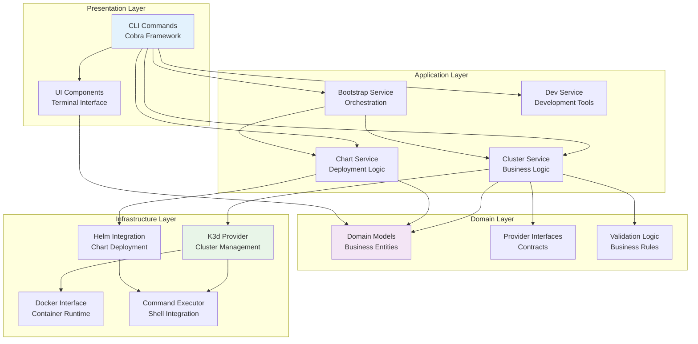
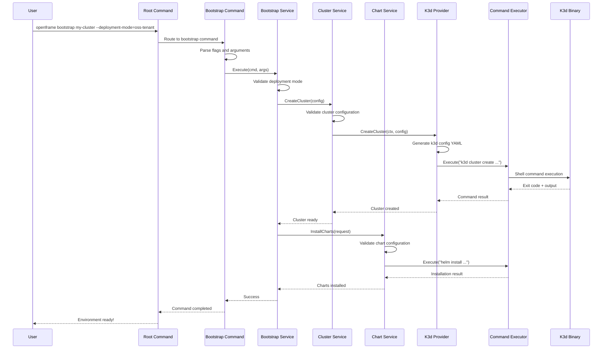
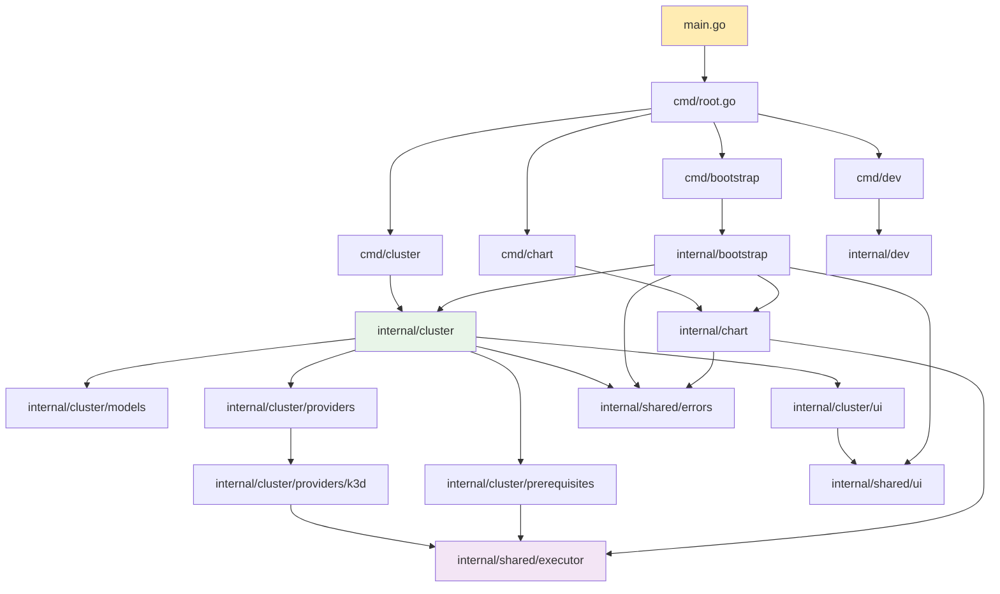

# Architecture Overview - Developer Guide

This guide provides a comprehensive technical overview of the OpenFrame CLI architecture, design patterns, and component relationships. It's designed for engineers who want to understand the system's internal structure and contribute effectively to the codebase.

## High-Level Architecture

OpenFrame CLI follows **Clean Architecture** principles with clear separation between presentation, business logic, and infrastructure concerns. The system is designed as a modular, testable, and maintainable CLI application.



## Core Components

### Component Responsibility Matrix

| Layer | Component | Package | Primary Responsibility | Key Dependencies |
|-------|-----------|---------|----------------------|------------------|
| **Presentation** | CLI Commands | `cmd/*` | User interface, flag parsing, command routing | Cobra, Services |
| **Presentation** | UI Components | `internal/shared/ui` | Terminal output, prompts, formatting | pterm, promptui |
| **Application** | Bootstrap Service | `internal/bootstrap` | Orchestrates cluster creation + chart installation | Cluster Service, Chart Service |
| **Application** | Cluster Service | `internal/cluster` | Cluster lifecycle management business logic | Domain Models, Providers |
| **Application** | Chart Service | `internal/chart` | Helm chart installation and configuration | Helm Client, Domain Models |
| **Domain** | Domain Models | `internal/*/models` | Business entities, validation, data structures | None (pure domain) |
| **Domain** | Provider Interfaces | `internal/cluster/providers` | Contracts for infrastructure providers | Domain Models |
| **Infrastructure** | K3d Provider | `internal/cluster/providers/k3d` | K3d-specific cluster operations | Command Executor |
| **Infrastructure** | Command Executor | `internal/shared/executor` | Shell command execution with dry-run support | OS package |
| **Infrastructure** | Prerequisites | `internal/cluster/prerequisites` | Tool installation and validation | Command Executor |

## Data Flow Architecture

The following sequence diagram shows how data flows through the system during a typical bootstrap operation:



## Design Patterns and Principles

### 1. Clean Architecture

The codebase strictly follows clean architecture principles:

- **Dependency Rule**: Dependencies point inward (infrastructure depends on domain, not vice versa)
- **Separation of Concerns**: Each layer has a single responsibility
- **Testability**: Business logic is isolated and easily testable

### 2. Dependency Injection

Services receive their dependencies through constructors:

```go
// Example from internal/cluster/service.go
type Service struct {
    provider      providers.ClusterProvider
    validator     *Validator
    ui           ui.Interface
    executor     executor.Interface
}

func NewService(
    provider providers.ClusterProvider,
    validator *Validator,
    ui ui.Interface,
    executor executor.Interface,
) *Service {
    return &Service{
        provider:  provider,
        validator: validator,
        ui:        ui,
        executor:  executor,
    }
}
```

### 3. Interface Segregation

Interfaces are small and focused on specific responsibilities:

```go
// ClusterProvider interface focuses only on cluster operations
type ClusterProvider interface {
    CreateCluster(ctx context.Context, config *models.ClusterConfig) error
    DeleteCluster(ctx context.Context, name string) error
    GetCluster(ctx context.Context, name string) (*models.Cluster, error)
    ListClusters(ctx context.Context) ([]*models.Cluster, error)
}

// Executor interface focuses only on command execution
type CommandExecutor interface {
    Execute(ctx context.Context, command string, args ...string) (*Result, error)
    ExecuteWithInput(ctx context.Context, input string, command string, args ...string) (*Result, error)
}
```

### 4. Strategy Pattern

Different cluster providers implement the same interface:

```go
// K3d provider implementation
type K3dProvider struct {
    executor executor.Interface
    config   *Config
}

// Kind provider implementation (hypothetical)
type KindProvider struct {
    executor executor.Interface
    config   *Config
}

// Both implement the ClusterProvider interface
```

### 5. Command Pattern

CLI commands encapsulate operations with undo capabilities:

```go
type ClusterCreateCommand struct {
    service   *cluster.Service
    config    *models.ClusterConfig
    dryRun    bool
}

func (c *ClusterCreateCommand) Execute() error {
    if c.dryRun {
        return c.preview()
    }
    return c.service.CreateCluster(c.config)
}
```

## Module Dependencies

### Dependency Graph



### Import Rules

1. **No circular dependencies**: Enforced by Go compiler
2. **Internal packages only**: All business logic in `internal/` to prevent external imports
3. **Shared components**: Common utilities in `internal/shared/`
4. **Domain independence**: Domain models don't import infrastructure

## Key Architectural Decisions

### 1. Clean Architecture Implementation

**Decision**: Use clean architecture with strict dependency rules

**Rationale**: 
- Improves testability by isolating business logic
- Enables easy swapping of infrastructure components
- Reduces coupling between layers

**Implementation**:
```go
// Domain layer - no external dependencies
package models

type ClusterConfig struct {
    Name     string
    Nodes    int
    Type     ClusterType
    Version  string
}

// Application layer - uses domain models
package service

func (s *Service) CreateCluster(config *models.ClusterConfig) error {
    // Business logic here
}

// Infrastructure layer - implements domain interfaces
package k3d

func (p *K3dProvider) CreateCluster(ctx context.Context, config *models.ClusterConfig) error {
    // Infrastructure-specific implementation
}
```

### 2. Command Execution Abstraction

**Decision**: Abstract all external command execution behind interfaces

**Rationale**:
- Enables comprehensive testing with mocks
- Supports dry-run functionality
- Centralizes error handling for command execution

**Implementation**:
```go
type CommandExecutor interface {
    Execute(ctx context.Context, command string, args ...string) (*Result, error)
}

// Allows easy mocking in tests
type MockExecutor struct {
    commands []string
    results  []*Result
}

func (m *MockExecutor) Execute(ctx context.Context, command string, args ...string) (*Result, error) {
    // Return predetermined results for testing
}
```

### 3. UI Component Separation

**Decision**: Separate UI components from business logic

**Rationale**:
- Enables headless operation for automation
- Improves testability
- Allows different UI implementations

**Implementation**:
```go
type UIInterface interface {
    ShowProgress(message string)
    ShowSuccess(message string)
    ShowError(message string)
    PromptForString(prompt, defaultValue string) (string, error)
}

// Service doesn't know about UI implementation details
func (s *Service) CreateCluster(config *models.ClusterConfig) error {
    s.ui.ShowProgress("Creating cluster...")
    // Business logic
    s.ui.ShowSuccess("Cluster created!")
}
```

## Error Handling Architecture

### Error Types and Patterns

```go
// Domain errors - business logic violations
type ValidationError struct {
    Field   string
    Message string
}

func (e ValidationError) Error() string {
    return fmt.Sprintf("validation failed for %s: %s", e.Field, e.Message)
}

// Infrastructure errors - external command failures  
type CommandError struct {
    Command   string
    ExitCode  int
    Output    string
}

func (e CommandError) Error() string {
    return fmt.Sprintf("command '%s' failed with exit code %d: %s", e.Command, e.ExitCode, e.Output)
}

// Error wrapping with context
func (s *Service) CreateCluster(config *models.ClusterConfig) error {
    if err := s.validateConfig(config); err != nil {
        return fmt.Errorf("failed to validate cluster configuration: %w", err)
    }
    
    if err := s.provider.CreateCluster(ctx, config); err != nil {
        return fmt.Errorf("failed to create cluster %s: %w", config.Name, err)
    }
    
    return nil
}
```

## Testing Architecture

### Testing Strategy by Layer

| Layer | Testing Approach | Tools | Example |
|-------|------------------|-------|---------|
| **Domain** | Unit tests with table-driven tests | testify, Go stdlib | Model validation, business rules |
| **Application** | Service tests with mocked dependencies | testify/mock, testify/suite | Service behavior, error handling |
| **Infrastructure** | Integration tests with real external systems | Docker, testcontainers | Provider implementations |
| **Presentation** | Command tests with mocked services | Cobra testing, testify | CLI argument parsing, flag handling |

### Example Test Structure

```go
// Service layer test with mocks
func TestClusterService_CreateCluster(t *testing.T) {
    tests := []struct {
        name          string
        config        *models.ClusterConfig
        providerErr   error
        expectedErr   string
    }{
        {
            name: "successful creation",
            config: &models.ClusterConfig{
                Name:  "test-cluster",
                Nodes: 3,
                Type:  models.K3dClusterType,
            },
            providerErr: nil,
            expectedErr: "",
        },
        {
            name: "provider failure",
            config: &models.ClusterConfig{
                Name:  "test-cluster",
                Nodes: 3,
                Type:  models.K3dClusterType,
            },
            providerErr: errors.New("provider error"),
            expectedErr: "failed to create cluster test-cluster: provider error",
        },
    }

    for _, tt := range tests {
        t.Run(tt.name, func(t *testing.T) {
            // Setup mocks
            mockProvider := &mocks.ClusterProvider{}
            mockUI := &mocks.UIInterface{}
            mockExecutor := &mocks.CommandExecutor{}

            service := cluster.NewService(mockProvider, validator, mockUI, mockExecutor)

            // Configure mock expectations
            mockProvider.On("CreateCluster", mock.Anything, tt.config).Return(tt.providerErr)

            // Execute
            err := service.CreateCluster(tt.config)

            // Assert
            if tt.expectedErr != "" {
                assert.Error(t, err)
                assert.Contains(t, err.Error(), tt.expectedErr)
            } else {
                assert.NoError(t, err)
            }

            mockProvider.AssertExpectations(t)
        })
    }
}
```

## Performance and Scalability Considerations

### Resource Management

```go
// Context-based cancellation for long-running operations
func (p *K3dProvider) CreateCluster(ctx context.Context, config *models.ClusterConfig) error {
    select {
    case <-ctx.Done():
        return ctx.Err()
    default:
        // Continue with cluster creation
    }
    
    // Use context in command execution
    return p.executor.Execute(ctx, "k3d", "cluster", "create", config.Name)
}

// Timeout handling
ctx, cancel := context.WithTimeout(context.Background(), 5*time.Minute)
defer cancel()

err := service.CreateCluster(ctx, config)
```

### Concurrent Operations

```go
// Parallel prerequisite checking
func (c *Checker) CheckAll(ctx context.Context) error {
    checks := []func(context.Context) error{
        c.checkDocker,
        c.checkKubectl,
        c.checkHelm,
    }
    
    var wg sync.WaitGroup
    errChan := make(chan error, len(checks))
    
    for _, check := range checks {
        wg.Add(1)
        go func(checkFn func(context.Context) error) {
            defer wg.Done()
            if err := checkFn(ctx); err != nil {
                errChan <- err
            }
        }(check)
    }
    
    wg.Wait()
    close(errChan)
    
    var errors []error
    for err := range errChan {
        errors = append(errors, err)
    }
    
    if len(errors) > 0 {
        return fmt.Errorf("prerequisite checks failed: %v", errors)
    }
    
    return nil
}
```

## Extension Points

### Adding New Cluster Providers

1. **Define provider interface** (already exists):
   ```go
   type ClusterProvider interface {
       CreateCluster(ctx context.Context, config *models.ClusterConfig) error
       DeleteCluster(ctx context.Context, name string) error
       GetCluster(ctx context.Context, name string) (*models.Cluster, error)
       ListClusters(ctx context.Context) ([]*models.Cluster, error)
   }
   ```

2. **Implement new provider**:
   ```go
   package kind

   type KindProvider struct {
       executor executor.Interface
       config   *Config
   }

   func (p *KindProvider) CreateCluster(ctx context.Context, config *models.ClusterConfig) error {
       // Kind-specific implementation
   }
   ```

3. **Register in factory**:
   ```go
   func NewClusterProvider(providerType models.ClusterType) ClusterProvider {
       switch providerType {
       case models.K3dClusterType:
           return k3d.NewProvider()
       case models.KindClusterType:
           return kind.NewProvider()
       default:
           return k3d.NewProvider() // Default fallback
       }
   }
   ```

### Adding New Commands

1. **Create command file** in appropriate `cmd/` subdirectory
2. **Implement Cobra command** with proper flag parsing
3. **Create service layer** in `internal/` if needed
4. **Add tests** for both command and service layers

## Monitoring and Observability

### Logging Strategy

```go
// Structured logging with context
func (s *Service) CreateCluster(config *models.ClusterConfig) error {
    logger := s.logger.WithFields(logrus.Fields{
        "cluster_name": config.Name,
        "cluster_type": config.Type,
        "nodes":        config.Nodes,
    })
    
    logger.Info("Starting cluster creation")
    
    if err := s.provider.CreateCluster(ctx, config); err != nil {
        logger.WithError(err).Error("Failed to create cluster")
        return err
    }
    
    logger.Info("Cluster created successfully")
    return nil
}
```

### Metrics Collection

```go
// Operation timing
func (s *Service) CreateCluster(config *models.ClusterConfig) error {
    start := time.Now()
    defer func() {
        duration := time.Since(start)
        s.metrics.RecordClusterCreationDuration(config.Type, duration)
    }()
    
    return s.provider.CreateCluster(ctx, config)
}
```

---

## Summary

The OpenFrame CLI architecture is built on solid software engineering principles:

- **Clean Architecture** ensures maintainability and testability
- **Interface segregation** enables easy mocking and testing
- **Dependency injection** provides flexibility and loose coupling
- **Command abstraction** supports dry-run and comprehensive testing
- **Layered design** separates concerns and improves code organization

This architecture enables:
- ✅ Easy addition of new cluster providers
- ✅ Comprehensive testing with mocks
- ✅ Clear separation of business logic and infrastructure
- ✅ Maintainable and readable codebase
- ✅ Extensible command structure

Understanding this architecture will help you navigate the codebase effectively and contribute meaningful improvements to the project.

> **🔍 Deep Dive**: For specific implementation details, refer to the generated CodeWiki documentation and explore the source code in the key files mentioned in each section.