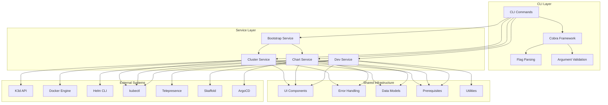
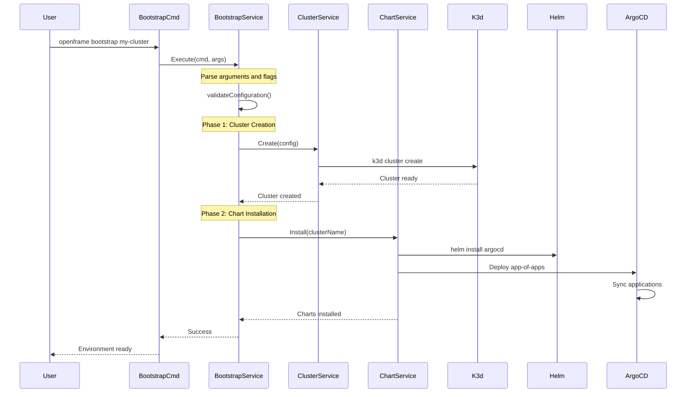
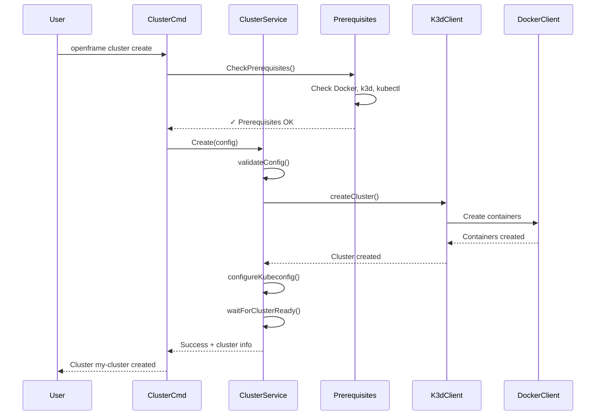
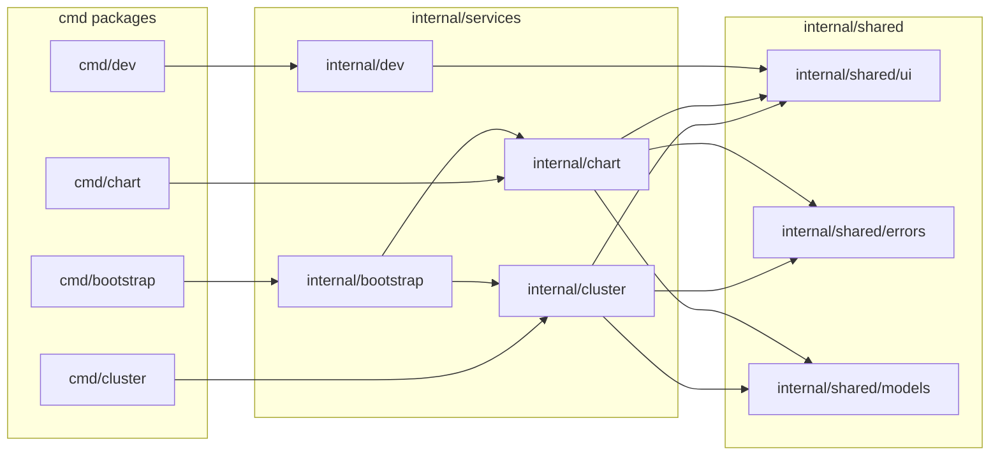

# OpenFrame CLI Architecture Overview

This document provides a comprehensive technical overview of OpenFrame CLI's architecture, design patterns, and internal systems for developers working on the project.

## High-Level Architecture

OpenFrame CLI follows a layered architecture with clear separation of concerns between the CLI interface, business logic, and external system integration.



## Core Components and Responsibilities

### Command Layer (cmd/)

The command layer provides the CLI interface using the Cobra framework:

| Component | File | Responsibilities |
|-----------|------|------------------|
| **Bootstrap Command** | `cmd/bootstrap/bootstrap.go` | End-to-end environment setup, combining cluster creation and chart installation |
| **Cluster Commands** | `cmd/cluster/*.go` | Cluster lifecycle management (create, delete, list, status, cleanup) |
| **Chart Commands** | `cmd/chart/*.go` | ArgoCD and Helm chart installation and management |
| **Dev Commands** | `cmd/dev/dev.go` | Development tools for traffic interception and live reloading |
| **Main Entry** | `cmd/main.go` | Application bootstrap and root command configuration |

### Service Layer (internal/)

The service layer contains the core business logic:

| Service | Location | Purpose | Key Methods |
|---------|----------|---------|-------------|
| **Bootstrap Service** | `internal/bootstrap/` | Orchestrates cluster creation and chart installation | `Execute()` |
| **Cluster Service** | `internal/cluster/services/` | K3d cluster management operations | `Create()`, `Delete()`, `GetStatus()`, `List()` |
| **Chart Service** | `internal/chart/services/` | ArgoCD installation and chart management | `Install()`, `Uninstall()`, `Status()` |
| **Dev Service** | `internal/dev/services/` | Development workflow tools | `StartIntercept()`, `StartSkaffold()` |

### Data Models (internal/*/models/)

Strongly-typed data structures for configuration and state management:

```go
// Example: Cluster configuration model
type ClusterConfig struct {
    Name            string            `json:"name" yaml:"name"`
    KubernetesVersion string          `json:"kubernetesVersion" yaml:"kubernetesVersion"`
    NodeCount       int               `json:"nodeCount" yaml:"nodeCount"`
    PortMappings    []PortMapping     `json:"portMappings" yaml:"portMappings"`
    Environment     map[string]string `json:"environment" yaml:"environment"`
    Interactive     bool              `json:"interactive" yaml:"interactive"`
}

func (c *ClusterConfig) Validate() error {
    if c.Name == "" {
        return errors.New("cluster name is required")
    }
    if c.NodeCount < 1 {
        return errors.New("node count must be at least 1")
    }
    return nil
}
```

## Data Flow and Interaction Patterns

### Bootstrap Command Flow



### Cluster Management Flow



## Key Design Patterns

### 1. Command Pattern
Each CLI command follows a consistent pattern:
```go
func getCommandCmd() *cobra.Command {
    return &cobra.Command{
        Use:   "command-name",
        Short: "Brief description",
        Long:  "Detailed description with examples",
        Args:  cobra.ExactArgs(1), // Or other validation
        RunE:  func(cmd *cobra.Command, args []string) error {
            // Minimal logic here - delegate to service
            return services.NewCommandService().Execute(cmd, args)
        },
    }
}
```

### 2. Service Locator Pattern
Services are created using constructor functions:
```go
type ClusterService struct {
    k3dClient    k3d.Client
    dockerClient docker.Client
    kubeClient   kubernetes.Interface
}

func NewClusterService() *ClusterService {
    return &ClusterService{
        k3dClient:    k3d.NewClient(),
        dockerClient: docker.NewClient(),
        kubeClient:   kubernetes.NewForConfig(config),
    }
}
```

### 3. Strategy Pattern
Different deployment modes use strategy pattern:
```go
type DeploymentStrategy interface {
    Deploy(config *ChartConfig) error
    Validate(config *ChartConfig) error
}

type OssTenantStrategy struct{}
type SaasTenantStrategy struct{}
type SaasSharedStrategy struct{}

func (s *ChartService) Deploy(mode string, config *ChartConfig) error {
    strategy := s.getStrategy(mode)
    return strategy.Deploy(config)
}
```

### 4. Builder Pattern
Complex configurations use builder pattern:
```go
type ClusterConfigBuilder struct {
    config *ClusterConfig
}

func NewClusterConfigBuilder() *ClusterConfigBuilder {
    return &ClusterConfigBuilder{
        config: &ClusterConfig{
            NodeCount: 1, // Default
        },
    }
}

func (b *ClusterConfigBuilder) WithName(name string) *ClusterConfigBuilder {
    b.config.Name = name
    return b
}

func (b *ClusterConfigBuilder) WithNodeCount(count int) *ClusterConfigBuilder {
    b.config.NodeCount = count
    return b
}

func (b *ClusterConfigBuilder) Build() (*ClusterConfig, error) {
    if err := b.config.Validate(); err != nil {
        return nil, err
    }
    return b.config, nil
}
```

## Module Dependencies and Relationships

### Internal Package Dependencies



### External Dependencies

| Category | Dependencies | Purpose |
|----------|--------------|---------|
| **CLI Framework** | `github.com/spf13/cobra`, `github.com/spf13/viper` | Command-line interface and configuration |
| **Kubernetes** | `k8s.io/client-go`, `k8s.io/api` | Kubernetes API interaction |
| **Container Runtime** | `github.com/docker/docker` | Docker API for container management |
| **K3d Integration** | `github.com/k3d-io/k3d/v5` | K3d cluster management |
| **Logging** | `github.com/sirupsen/logrus` | Structured logging |
| **Testing** | `github.com/stretchr/testify` | Test assertions and mocking |
| **YAML/JSON** | `gopkg.in/yaml.v3` | Configuration file parsing |

## Configuration Management

### Configuration Sources (Priority Order)

1. **Command-line flags** (highest priority)
2. **Environment variables** 
3. **Configuration files** (`openframe.yaml`, `helm-values.yaml`)
4. **Default values** (lowest priority)

### Configuration Structure

```go
type Config struct {
    Global   GlobalConfig   `yaml:"global"`
    Cluster  ClusterConfig  `yaml:"cluster"`
    Chart    ChartConfig    `yaml:"chart"`
    Dev      DevConfig      `yaml:"dev"`
}

type GlobalConfig struct {
    LogLevel    string `yaml:"logLevel" env:"OPENFRAME_LOG_LEVEL"`
    ConfigPath  string `yaml:"configPath" env:"OPENFRAME_CONFIG_PATH"`
    Verbose     bool   `yaml:"verbose" env:"OPENFRAME_VERBOSE"`
}
```

## Error Handling Strategy

### Error Types and Handling

```go
// Custom error types for different categories
type PrerequisiteError struct {
    Tool    string
    Message string
}

type ClusterError struct {
    ClusterName string
    Operation   string
    Cause       error
}

type ChartError struct {
    ChartName string
    Action    string
    Cause     error
}

// Centralized error handling
func HandleError(err error, operation string) {
    switch e := err.(type) {
    case *PrerequisiteError:
        ui.ShowPrerequisiteError(e)
    case *ClusterError:
        ui.ShowClusterError(e)
    case *ChartError:
        ui.ShowChartError(e)
    default:
        ui.ShowGenericError(err, operation)
    }
}
```

## Testing Architecture

### Test Structure

```
internal/
├── cluster/
│   ├── services/
│   │   ├── cluster_service.go
│   │   ├── cluster_service_test.go      # Unit tests
│   │   └── cluster_service_integration_test.go  # Integration tests
│   └── models/
│       ├── cluster_config.go
│       └── cluster_config_test.go
└── shared/
    ├── testutil/                        # Test utilities
    │   ├── fixtures.go                  # Test data
    │   ├── mocks.go                     # Mock objects
    │   └── docker.go                    # Docker test helpers
    └── integration/                     # End-to-end tests
        ├── bootstrap_test.go
        └── cluster_lifecycle_test.go
```

### Testing Patterns

```go
// Unit test example
func TestClusterService_Create(t *testing.T) {
    tests := []struct {
        name    string
        config  *models.ClusterConfig
        wantErr bool
    }{
        {
            name: "valid config",
            config: &models.ClusterConfig{
                Name: "test-cluster",
                NodeCount: 1,
            },
            wantErr: false,
        },
        {
            name: "invalid config - empty name",
            config: &models.ClusterConfig{
                Name: "",
                NodeCount: 1,
            },
            wantErr: true,
        },
    }

    for _, tt := range tests {
        t.Run(tt.name, func(t *testing.T) {
            service := NewClusterService()
            err := service.Create(tt.config)
            if (err != nil) != tt.wantErr {
                t.Errorf("Create() error = %v, wantErr %v", err, tt.wantErr)
            }
        })
    }
}
```

## Performance Considerations

### Optimization Strategies

| Area | Strategy | Implementation |
|------|----------|---------------|
| **CLI Startup** | Lazy loading of dependencies | Only initialize clients when needed |
| **Docker Operations** | Connection pooling | Reuse Docker client connections |
| **Kubernetes API** | Client caching | Cache Kubernetes client instances |
| **Parallel Operations** | Goroutines for independent tasks | Concurrent cluster operations where possible |
| **Resource Cleanup** | Defer statements | Ensure proper cleanup of resources |

### Memory Management

```go
// Proper resource cleanup
func (s *ClusterService) Create(config *ClusterConfig) error {
    client, err := docker.NewClient()
    if err != nil {
        return err
    }
    defer client.Close() // Ensure cleanup
    
    // Use context for timeouts
    ctx, cancel := context.WithTimeout(context.Background(), 5*time.Minute)
    defer cancel()
    
    return s.createWithContext(ctx, client, config)
}
```

## Security Considerations

### Security Measures

1. **Input Validation**: All user inputs validated and sanitized
2. **Path Traversal Protection**: File operations use filepath.Clean()
3. **Command Injection Prevention**: Use of exec.CommandContext with validated args
4. **Credential Handling**: No credentials stored in logs or temporary files
5. **Docker Security**: Run containers with minimal privileges

```go
// Example: Safe command execution
func (s *K3dService) executeCommand(name string, args ...string) error {
    // Validate command name
    if !isValidCommand(name) {
        return fmt.Errorf("invalid command: %s", name)
    }
    
    // Use context for timeout
    ctx, cancel := context.WithTimeout(context.Background(), 30*time.Second)
    defer cancel()
    
    cmd := exec.CommandContext(ctx, name, args...)
    cmd.Env = getSafeEnvironment() // Sanitized environment
    
    return cmd.Run()
}
```

## Future Architecture Considerations

### Extensibility Points

1. **Plugin System**: Interface for adding new commands
2. **Provider Abstraction**: Support for cloud providers beyond k3d
3. **Chart Repository**: Support for custom chart repositories
4. **Configuration Providers**: Support for external configuration sources

### Planned Improvements

- **Async Operations**: Background cluster operations with progress tracking
- **State Management**: Persistent state storage for cluster metadata
- **Multi-cluster Support**: Managing clusters across different providers
- **Enhanced Testing**: Property-based testing for configuration validation

This architecture provides a solid foundation for the OpenFrame CLI while maintaining flexibility for future enhancements and extensions.