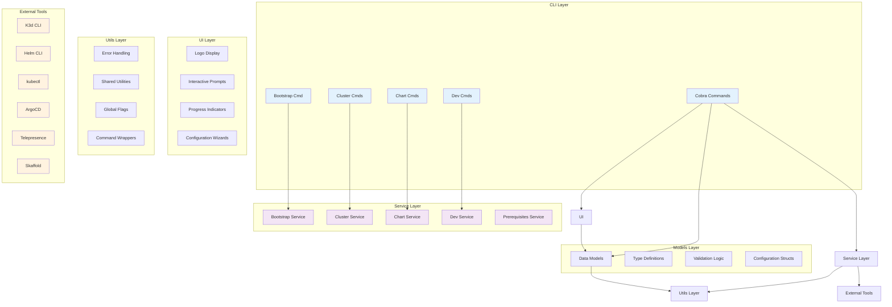
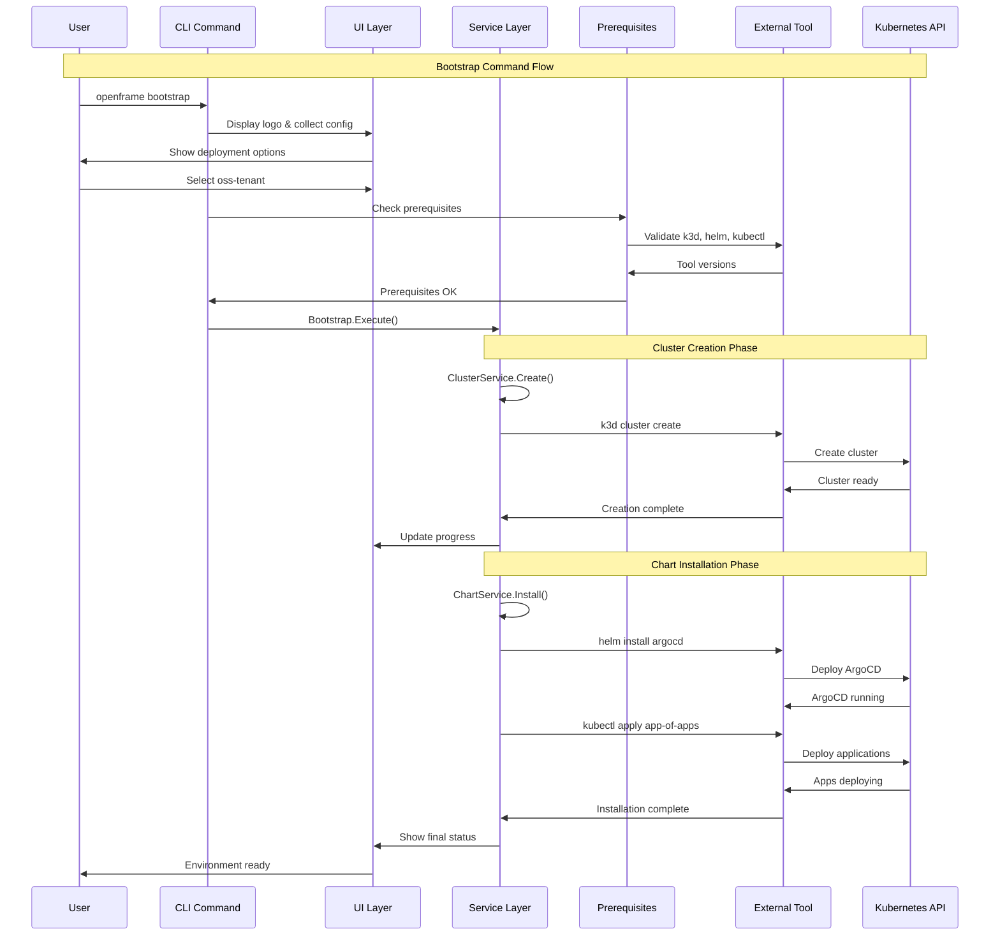
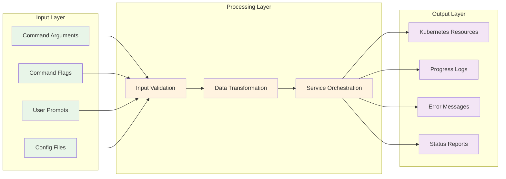
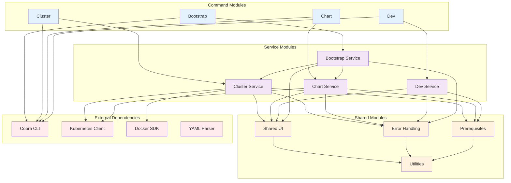
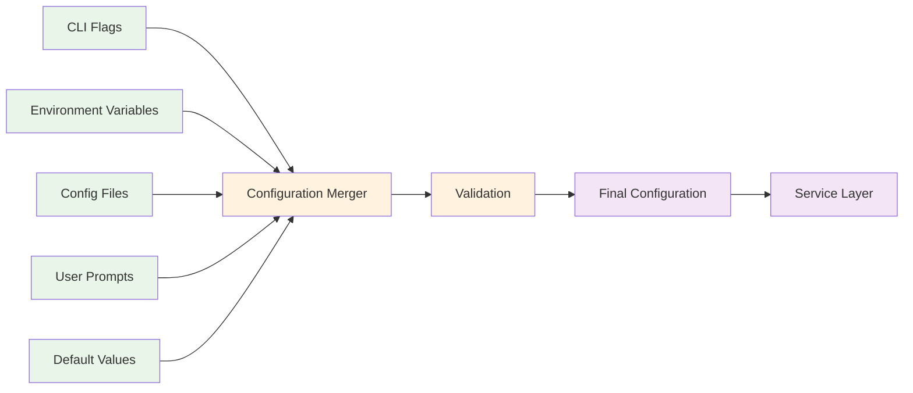
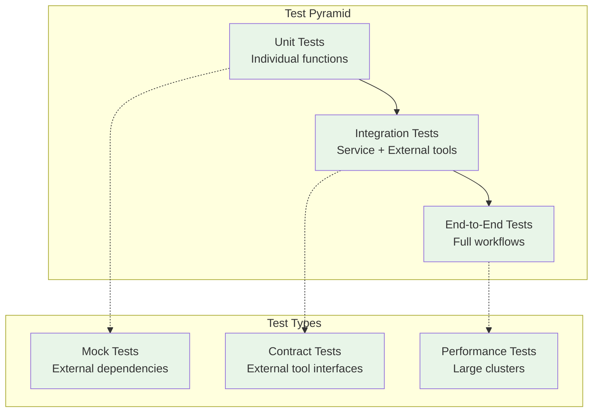

# OpenFrame CLI Architecture Overview

This document provides a comprehensive technical overview of the OpenFrame CLI architecture, designed for engineers working on or integrating with the system.

## High-Level Architecture

OpenFrame CLI follows a layered architecture with clear separation of concerns, built around the Cobra command framework with modular service layers.



## Core Components and Responsibilities

| Component | Package Path | Primary Responsibilities |
|-----------|--------------|-------------------------|
| **Bootstrap Orchestration** | `cmd/bootstrap/`, `internal/bootstrap/` | End-to-end environment setup, coordinates cluster creation and chart installation |
| **Cluster Management** | `cmd/cluster/`, `internal/cluster/` | K3d cluster lifecycle: create, delete, list, status, cleanup operations |
| **Chart Management** | `cmd/chart/`, `internal/chart/` | ArgoCD installation, Helm chart deployment, GitOps application management |
| **Development Tools** | `cmd/dev/`, `internal/dev/` | Telepresence traffic interception, Skaffold live reloading workflows |
| **Prerequisites Validation** | `internal/*/prerequisites/` | Tool availability checks, version validation, installation guidance |
| **Interactive UI** | `internal/*/ui/` | Configuration wizards, progress displays, user prompts and experience |
| **Service Layer** | `internal/*/services/` | Business logic, external tool integration, core functionality implementation |
| **Shared Components** | `internal/shared/` | Common utilities, error handling, UI components, global flag management |

## Component Interaction Flow



## Data Flow Architecture

The CLI follows a unidirectional data flow pattern with clear separation between user input, business logic, and external system integration.



## Design Patterns and Principles

### 1. Command Pattern Implementation

Each CLI command follows a consistent structure:

```go
// Command structure pattern
func GetCommandCmd() *cobra.Command {
    cmd := &cobra.Command{
        Use:     "command [args]",
        Short:   "Brief description", 
        Long:    "Detailed description with examples",
        PreRunE: validateInputs,           // Input validation
        RunE:    utils.WrapCommandWithCommonSetup(execute), // Business logic
    }
    
    // Add flags
    addCommandFlags(cmd)
    return cmd
}

// Business logic is delegated to services
func execute(cmd *cobra.Command, args []string) error {
    service := getCommandService()
    return service.Execute(cmd, args)
}
```

### 2. Service Layer Pattern

Services encapsulate business logic and external tool integration:

```go
type ClusterService interface {
    Create(config ClusterConfig) error
    Delete(name string) error
    List() ([]ClusterInfo, error)
    GetStatus(name string) (*ClusterStatus, error)
    Cleanup() error
}

// Implementation handles external tool integration
type clusterService struct {
    k3dClient   K3dClient
    kubectlClient KubectlClient
    ui          UIHandler
}
```

### 3. UI Abstraction Pattern

User interface components are abstracted to enable testing and consistent experience:

```go
type UIHandler interface {
    ShowLogo()
    PromptSelect(message string, options []string) (string, error)
    ShowProgress(message string)
    ShowSuccess(message string)
    ShowError(error)
}

// Implementations can be interactive, quiet, or test-friendly
type InteractiveUI struct{}
type QuietUI struct{}
type TestUI struct{}
```

### 4. Prerequisites Validation Pattern

All commands validate prerequisites before execution:

```go
type PrerequisiteChecker interface {
    CheckAll() error
    CheckTool(name string) error
    InstallIfMissing(tool string) error
}

// Each command group has specific prerequisites
var ClusterPrerequisites = []string{"docker", "k3d", "kubectl"}
var ChartPrerequisites = []string{"helm", "kubectl"}
var DevPrerequisites = []string{"telepresence", "skaffold"}
```

## Module Dependencies and Relationships

### Dependency Graph



### Import Hierarchy Rules

| Level | Modules | Can Import From |
|-------|---------|-----------------|
| **Commands** | `cmd/*` | Internal services, Cobra, shared utilities |
| **Services** | `internal/*/services/` | Models, shared components, external clients |
| **UI** | `internal/*/ui/` | Models, shared utilities, no external tools |
| **Models** | `internal/*/models/` | Shared utilities, validation libraries |
| **Shared** | `internal/shared/` | Standard library, common utilities only |

### Anti-Patterns to Avoid

❌ **Circular Dependencies**: Services should not import command packages  
❌ **UI in Services**: Services should use UI interfaces, not concrete implementations  
❌ **Tool Logic in Commands**: External tool integration belongs in services  
❌ **Shared State**: Avoid global variables; use dependency injection  

## Configuration Management

### Configuration Sources Priority

1. **Command Line Flags** (highest priority)
2. **Environment Variables**
3. **Configuration Files** (`helm-values.yaml`, cluster configs)
4. **Interactive Prompts**
5. **Default Values** (lowest priority)

### Configuration Flow



## Error Handling Strategy

### Error Categories and Handling

| Error Type | Example | Handling Strategy |
|------------|---------|-------------------|
| **User Input Errors** | Invalid cluster name | User-friendly message, retry option |
| **Prerequisite Errors** | Missing Docker | Installation guidance, clear instructions |
| **External Tool Errors** | K3d creation fails | Wrapped error with context, troubleshooting tips |
| **Network Errors** | Helm repo unreachable | Retry logic, fallback options |
| **System Errors** | Out of disk space | Clear diagnosis, cleanup suggestions |

### Error Wrapping Pattern

```go
// Service layer - add context
func (s *ClusterService) CreateCluster(name string) error {
    if err := s.validatePrerequisites(); err != nil {
        return fmt.Errorf("prerequisites check failed for cluster %s: %w", name, err)
    }
    
    if err := s.k3d.CreateCluster(name); err != nil {
        return fmt.Errorf("k3d cluster creation failed: %w", err)
    }
    
    return nil
}

// Command layer - user-friendly messages
func runCreateCommand(cmd *cobra.Command, args []string) error {
    if err := service.CreateCluster(name); err != nil {
        return fmt.Errorf("❌ Failed to create cluster '%s'.\n\n%v\n\n💡 Try: openframe cluster cleanup", name, err)
    }
    return nil
}
```

## Performance Considerations

### Optimization Strategies

| Component | Optimization | Impact |
|-----------|--------------|--------|
| **Prerequisites** | Parallel checking | 50% faster startup |
| **UI Updates** | Buffered progress | Smoother experience |
| **K8s Operations** | Client reuse | Reduced connection overhead |
| **Build Process** | Go modules caching | Faster CI/CD |

### Resource Management

- **Memory**: Minimal allocation in CLI operations, cleanup after external tool execution
- **CPU**: Parallel operations where safe, avoid blocking on I/O
- **Network**: Connection pooling for Kubernetes API calls, retry with backoff
- **Disk**: Temporary file cleanup, configurable cache directories

## Testing Architecture

### Test Strategy Overview



### Test Organization

| Test Level | Location | Purpose | Dependencies |
|------------|----------|---------|--------------|
| **Unit** | `*_test.go` | Function-level testing | None |
| **Integration** | `tests/integration/` | Service + tool interaction | Docker, K3d |
| **End-to-End** | `tests/e2e/` | Full command workflows | Full tool stack |
| **Performance** | `tests/perf/` | Large-scale scenarios | Dedicated test clusters |

---

## Next Steps for Contributors

1. **Study the service layer** in `internal/*/services/` to understand business logic
2. **Review UI patterns** in `internal/*/ui/` for consistent user experience
3. **Understand error handling** in `internal/shared/errors/` for proper error management
4. **Explore external integrations** to understand tool orchestration patterns

**Questions or need clarification?** Check the [Developer Getting Started Guide](getting-started-dev.md) or reach out to the development team.