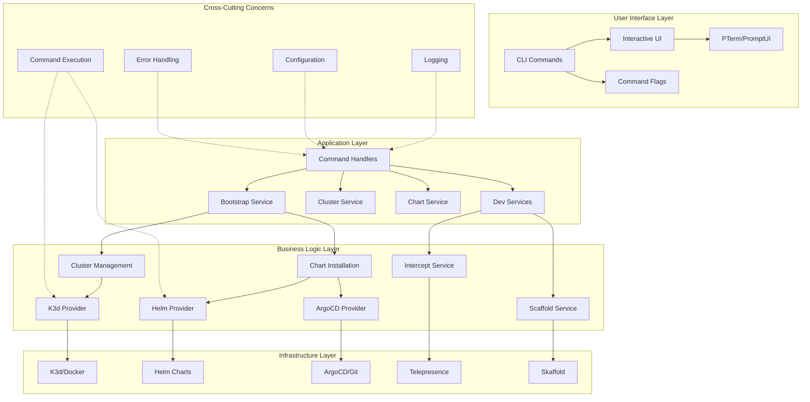
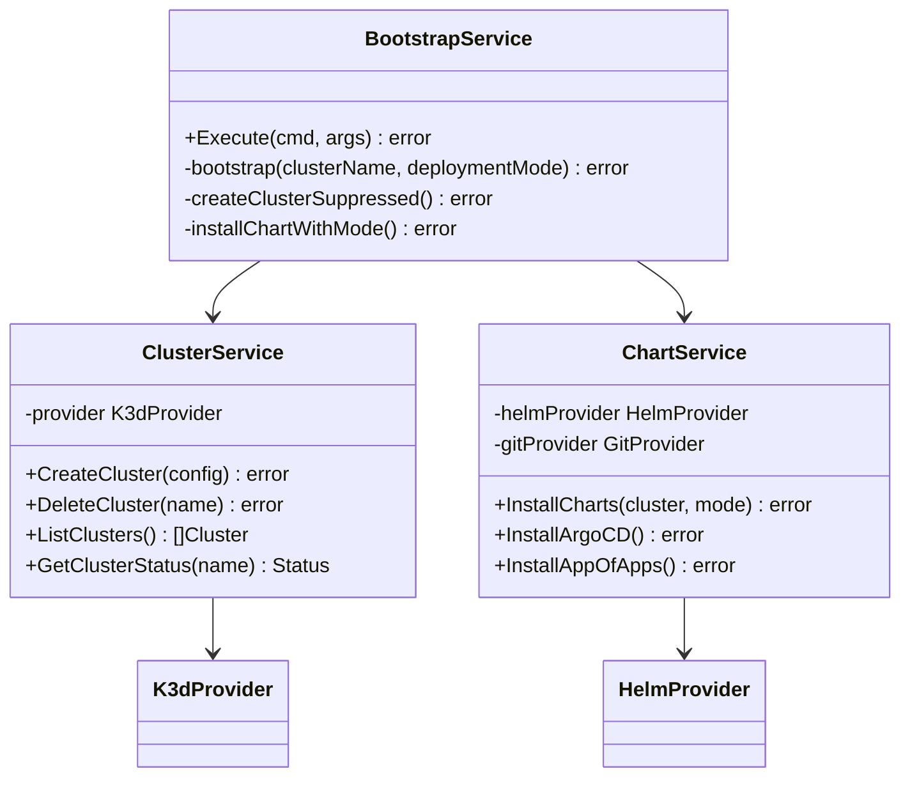
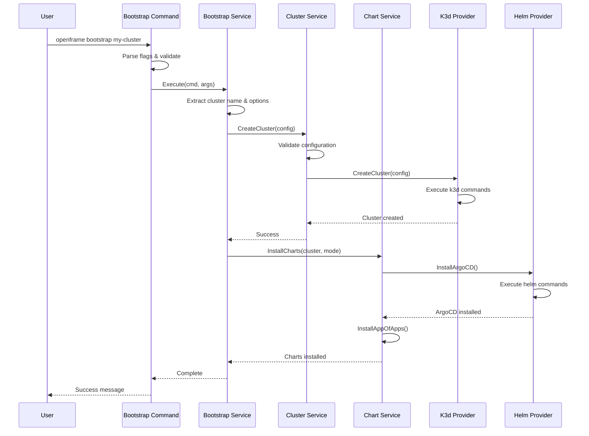
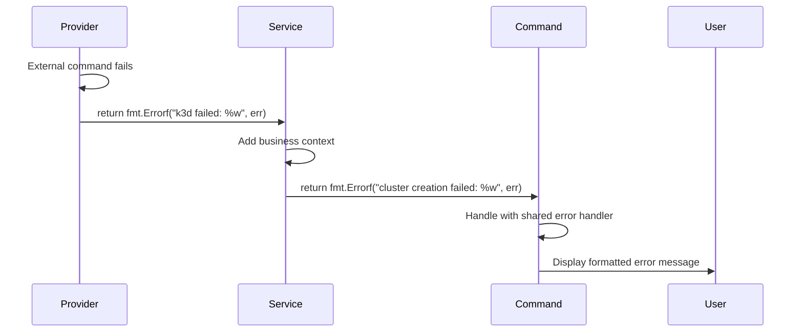
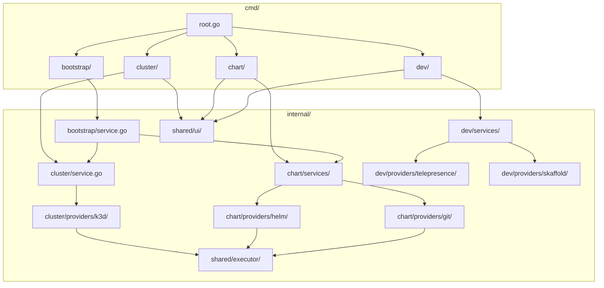
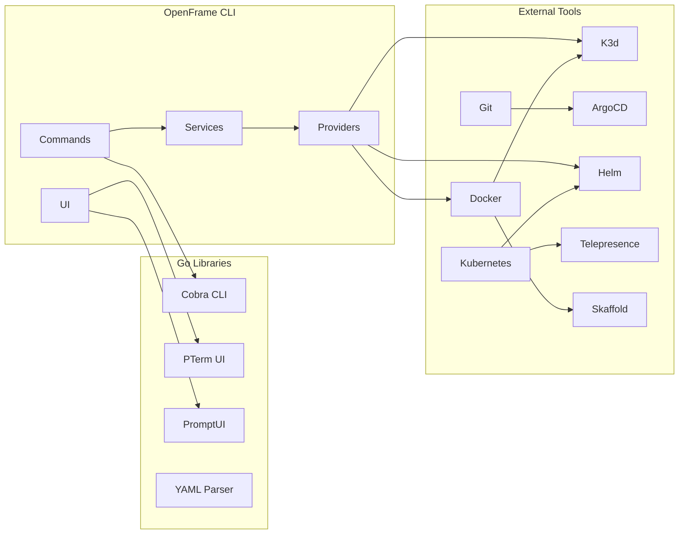

# OpenFrame CLI Architecture Overview

This document provides a comprehensive overview of the OpenFrame CLI's architecture, design patterns, and component relationships for developers working on or integrating with the system.

## System Overview

OpenFrame CLI is a modern command-line tool built with Go that manages Kubernetes development environments through a layered architecture. It orchestrates multiple external tools (K3d, Helm, ArgoCD, Telepresence) to provide streamlined developer workflows.



## Core Components and Responsibilities

### Command Layer (`cmd/` package)

The command layer handles CLI parsing, user interaction, and delegates to services for business logic.

| Component | File | Responsibility |
|-----------|------|---------------|
| **Root Command** | `cmd/root.go` | CLI entry point, global flags, version info |
| **Cluster Commands** | `cmd/cluster/` | K3d cluster lifecycle management |
| **Chart Commands** | `cmd/chart/` | ArgoCD and chart installation |
| **Bootstrap Command** | `cmd/bootstrap/` | Combined cluster + chart workflows |
| **Dev Commands** | `cmd/dev/` | Developer tools (intercept, scaffold) |

#### Command Architecture Pattern

```go
// All commands follow this pattern
func GetCommandCmd() *cobra.Command {
    cmd := &cobra.Command{
        Use:   "command",
        Short: "Description",
        RunE: func(cmd *cobra.Command, args []string) error {
            // 1. Parse flags and arguments
            // 2. Validate input
            // 3. Delegate to service layer
            service := NewService()
            return service.Execute(cmd, args)
        },
    }
    
    // Add flags
    cmd.Flags().StringP("flag", "f", "default", "description")
    
    return cmd
}
```

### Service Layer (`internal/*/service.go`)

Services contain pure business logic without CLI dependencies, making them testable and reusable.



### Provider Layer (`internal/*/providers/`)

Providers encapsulate external tool integrations and can be mocked for testing.

#### Provider Interface Pattern

```go
// Providers implement interfaces for testability
type K3dProvider interface {
    CreateCluster(config models.ClusterConfig) error
    DeleteCluster(name string) error
    ListClusters() ([]models.Cluster, error)
    GetClusterStatus(name string) (models.ClusterStatus, error)
}

// Implementation delegates to external tools
type k3dProvider struct {
    executor shared.CommandExecutor
}

func (p *k3dProvider) CreateCluster(config models.ClusterConfig) error {
    cmd := []string{"k3d", "cluster", "create", config.Name}
    return p.executor.Execute(cmd...)
}
```

### Shared Infrastructure (`internal/shared/`)

Cross-cutting concerns used throughout the application.

| Component | Purpose | Usage |
|-----------|---------|-------|
| **UI Components** | Interactive prompts, tables, progress bars | User interactions |
| **Command Executor** | Abstraction for external command execution | Provider implementations |
| **Configuration** | System configuration management | Global settings |
| **Error Handling** | Consistent error formatting and logging | Error responses |

## Data Flow Architecture

### Bootstrap Workflow

The bootstrap command demonstrates the complete data flow through the system:



### Error Flow

Errors flow up through the layers with appropriate context:



## Key Design Patterns

### 1. Layered Architecture

Each layer has specific responsibilities and depends only on lower layers:

- **Commands**: User interface concerns only
- **Services**: Pure business logic
- **Providers**: External tool integration
- **Models**: Data structures

### 2. Dependency Injection

Services accept provider interfaces, enabling testing and flexibility:

```go
type ClusterService struct {
    provider   K3dProvider
    ui         shared.UIProvider
    config     shared.ConfigProvider
}

func NewClusterService(provider K3dProvider) *ClusterService {
    return &ClusterService{
        provider: provider,
        ui:       shared.NewUIProvider(),
        config:   shared.NewConfigProvider(),
    }
}
```

### 3. Command Executor Pattern

All external command execution goes through a shared abstraction:

```go
type CommandExecutor interface {
    Execute(command string, args ...string) error
    ExecuteWithOutput(command string, args ...string) (string, error)
    ExecuteInDirectory(dir, command string, args ...string) error
}

// Enables testing with mock executor
type mockExecutor struct {
    commands []string
    results  []error
}

func (m *mockExecutor) Execute(command string, args ...string) error {
    m.commands = append(m.commands, command+" "+strings.Join(args, " "))
    if len(m.results) > 0 {
        err := m.results[0]
        m.results = m.results[1:]
        return err
    }
    return nil
}
```

### 4. Configuration Management

Centralized configuration with environment and flag override:

```go
type Config struct {
    DefaultClusterName string `yaml:"default_cluster_name"`
    K8sVersion        string `yaml:"k8s_version"`  
    NodeCount         int    `yaml:"node_count"`
}

// Priority: CLI flags > Environment > Config file > Defaults
func LoadConfig() (*Config, error) {
    config := &Config{
        DefaultClusterName: "openframe-dev",
        K8sVersion:        "latest",
        NodeCount:         3,
    }
    
    // Load from file, environment, flags...
    return config, nil
}
```

## Module Dependencies and Relationships

### Internal Package Dependencies



### External Dependencies

| Category | Tools | Purpose | Integration Point |
|----------|-------|---------|-------------------|
| **Container Runtime** | Docker, K3d | Local cluster creation | `cluster/providers/k3d/` |
| **Kubernetes** | kubectl, Helm | Cluster interaction, package management | `chart/providers/helm/` |
| **GitOps** | ArgoCD, Git | Application deployment | `chart/providers/argocd/` |
| **Development** | Telepresence, Skaffold | Local development workflows | `dev/providers/` |
| **CLI Framework** | Cobra, PTerm | Command structure, UI | `cmd/` packages |

### Dependency Graph



## Component Integration Patterns

### 1. Service Orchestration

The Bootstrap service demonstrates how to orchestrate multiple services:

```go
func (s *Service) bootstrap(clusterName, deploymentMode string, nonInteractive, verbose bool) error {
    // Step 1: Create cluster
    if err := s.createClusterSuppressed(clusterName, verbose, nonInteractive); err != nil {
        return fmt.Errorf("failed to create cluster: %w", err)
    }
    
    // Step 2: Install charts  
    if err := s.installChartWithMode(clusterName, deploymentMode, nonInteractive, verbose); err != nil {
        return fmt.Errorf("failed to install charts: %w", err)
    }
    
    return nil
}
```

### 2. Provider Chaining

Chart installation chains multiple providers:

```go
func (s *ChartService) InstallCharts(cluster, mode string) error {
    // 1. Install ArgoCD via Helm
    if err := s.helmProvider.InstallArgoCD(cluster); err != nil {
        return err
    }
    
    // 2. Wait for ArgoCD to be ready
    if err := s.argoCDProvider.WaitForReady(); err != nil {
        return err
    }
    
    // 3. Install App-of-Apps via Git
    if err := s.gitProvider.InstallAppOfApps(mode); err != nil {
        return err
    }
    
    return nil
}
```

### 3. UI Integration

Commands integrate with shared UI components:

```go
func (s *ClusterService) CreateClusterInteractive() error {
    // Use shared UI for consistent experience
    name, err := s.ui.PromptString("Cluster name", "openframe-dev")
    if err != nil {
        return err
    }
    
    nodes, err := s.ui.PromptInt("Number of nodes", 3)
    if err != nil {
        return err
    }
    
    // Show progress during creation
    return s.ui.WithProgress("Creating cluster", func() error {
        return s.provider.CreateCluster(models.ClusterConfig{
            Name:      name,
            NodeCount: nodes,
        })
    })
}
```

## Performance and Scalability Considerations

### Resource Management

| Resource | Consideration | Solution |
|----------|---------------|----------|
| **Memory** | Each K3d cluster uses ~1GB RAM | Cluster cleanup commands |
| **Disk Space** | Docker images and cluster data | Automatic cleanup on delete |
| **CPU** | Concurrent cluster operations | Sequential processing |
| **Network Ports** | Port conflicts between clusters | Dynamic port allocation |

### Concurrent Operations

```go
// Services handle concurrency safely
type ClusterService struct {
    mu       sync.RWMutex
    clusters map[string]*models.Cluster
}

func (s *ClusterService) ListClusters() []models.Cluster {
    s.mu.RLock()
    defer s.mu.RUnlock()
    
    // Safe concurrent read access
    var clusters []models.Cluster
    for _, cluster := range s.clusters {
        clusters = append(clusters, *cluster)
    }
    return clusters
}
```

### Error Recovery

The system includes automatic recovery mechanisms:

- **Cleanup on failure**: Failed operations clean up partial state
- **Retry logic**: Network operations retry with backoff
- **Graceful degradation**: Continue with warnings when possible

## Extension Points

### Adding New Commands

1. Create command file in appropriate `cmd/` subdirectory
2. Implement service in `internal/` package
3. Add provider if external tool integration needed
4. Update root command to include new subcommand

### Adding New Providers

1. Define interface in appropriate service package
2. Implement interface with external tool integration
3. Use dependency injection in service constructor
4. Add tests with mock implementation

### Custom UI Components

1. Add component to `internal/shared/ui/`
2. Follow existing patterns (PTerm/PromptUI)
3. Make components reusable across commands
4. Include accessibility considerations

## Testing Architecture

### Test Organization

```
tests/
├── unit/              # Fast, isolated unit tests
│   ├── cmd/          # Command layer tests
│   ├── services/     # Business logic tests
│   └── providers/    # Provider tests with mocks
├── integration/      # Tests with real external tools
│   ├── cluster/      # K3d cluster tests
│   └── chart/        # Helm/ArgoCD tests
└── e2e/              # End-to-end workflow tests
    └── bootstrap/    # Full bootstrap workflow
```

### Mock Strategy

Each provider has a corresponding mock for testing:

```go
type MockK3dProvider struct {
    clusters map[string]models.Cluster
    errors   map[string]error
}

func (m *MockK3dProvider) CreateCluster(config models.ClusterConfig) error {
    if err, exists := m.errors["create"]; exists {
        return err
    }
    
    m.clusters[config.Name] = models.Cluster{
        Name:   config.Name,
        Status: models.ClusterStatusRunning,
    }
    return nil
}
```

---

## Summary

The OpenFrame CLI architecture provides:

- **Separation of Concerns**: Clear boundaries between layers
- **Testability**: Interface-based design enables comprehensive testing
- **Extensibility**: New commands and providers can be added easily
- **Maintainability**: Consistent patterns and shared utilities
- **Reliability**: Error handling and recovery mechanisms

This architecture supports the project's goal of providing a streamlined Kubernetes development experience while maintaining code quality and developer productivity.

For implementation details and examples, see the [Developer Getting Started Guide](getting-started-dev.md) and explore the codebase following the patterns described in this document.