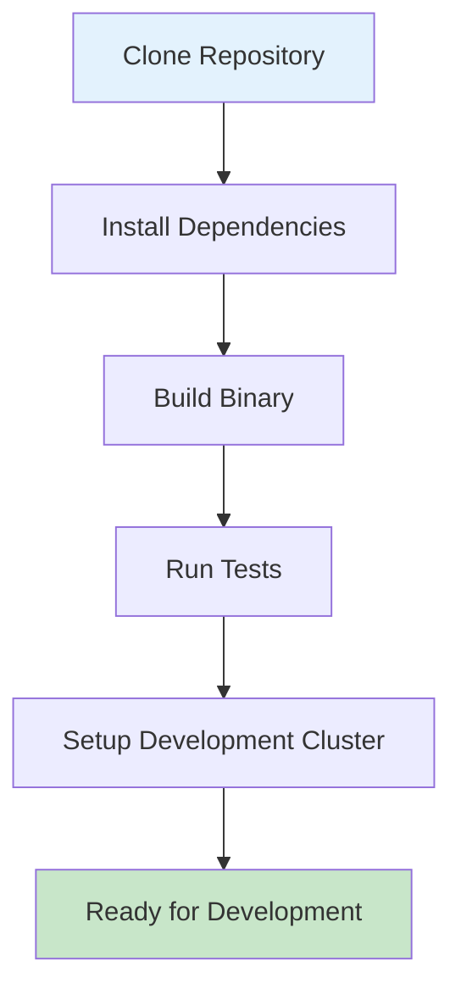

# Developer Getting Started Guide

Welcome to the OpenFrame CLI development environment! This guide will help you set up your development environment, understand the codebase structure, and start contributing to the project.

## Prerequisites for Development

| Tool | Version | Purpose | Installation |
|------|---------|---------|--------------|
| **Go** | 1.19+ | Primary language | [Install Go](https://golang.org/doc/install) |
| **Docker** | 20.10+ | Container runtime | [Install Docker](https://docs.docker.com/get-docker/) |
| **kubectl** | 1.24+ | Kubernetes CLI | [Install kubectl](https://kubernetes.io/docs/tasks/tools/) |
| **K3d** | 5.4+ | Kubernetes in Docker | [Install K3d](https://k3d.io/v5.4.6/#installation) |
| **Helm** | 3.8+ | Package manager | [Install Helm](https://helm.sh/docs/intro/install/) |
| **Git** | 2.30+ | Version control | Usually pre-installed |
| **Make** | Any | Build automation | `apt-get install make` / `brew install make` |

## Repository Setup

### 1. Clone and Setup

```bash
# Clone the repository
git clone https://github.com/flamingo-stack/openframe-cli.git
cd openframe-cli

# Install dependencies
go mod tidy

# Verify setup
go build -o openframe main.go
./openframe --help
```

### 2. Development Environment Setup



```bash
# Build development binary
make build

# Run all tests
make test

# Run linting
make lint

# Create development cluster for testing
./openframe bootstrap dev-cluster --deployment-mode=oss-tenant
```

## Repository Structure

```
openframe-cli/
├── cmd/                          # CLI commands (entry points)
│   ├── bootstrap/               # Bootstrap orchestration command
│   ├── chart/                   # Chart management commands
│   ├── cluster/                 # Cluster lifecycle commands
│   └── dev/                     # Development workflow commands
├── internal/                    # Private application code
│   ├── bootstrap/               # Bootstrap service layer
│   ├── chart/                   # Chart installation logic
│   ├── cluster/                 # Cluster management services
│   ├── dev/                     # Development tools integration
│   └── shared/                  # Common utilities and components
├── docs/                        # Documentation
│   ├── dev/                     # Developer documentation
│   └── tutorials/               # User and developer tutorials
├── scripts/                     # Build and deployment scripts
├── tests/                       # Test files
├── go.mod                       # Go module definition
├── go.sum                       # Go module checksums
├── Makefile                     # Build automation
└── main.go                      # Application entry point
```

### Key Architecture Patterns

| Pattern | Location | Purpose |
|---------|----------|---------|
| **Command Pattern** | `cmd/*/` | Cobra command definitions with minimal logic |
| **Service Layer** | `internal/*/services/` | Business logic and external tool integration |
| **UI Layer** | `internal/*/ui/` | Interactive prompts and user experience |
| **Models/Types** | `internal/*/models/`, `internal/*/types/` | Data structures and validation |
| **Shared Components** | `internal/shared/` | Common utilities across modules |

## Build and Test Commands

### Development Workflow

```bash
# Development build (fast compilation)
go build -o openframe main.go

# Production build with optimizations
make build

# Run unit tests
go test ./...

# Run specific test package
go test ./internal/cluster/...

# Run tests with coverage
make test-coverage

# Run integration tests (requires Docker)
make test-integration

# Lint code
make lint

# Format code
make fmt

# Clean build artifacts
make clean
```

### Makefile Targets

| Target | Purpose | Dependencies |
|--------|---------|--------------|
| `make build` | Production build with optimizations | Go toolchain |
| `make test` | Run all tests with coverage | Docker (for integration tests) |
| `make lint` | Code linting with golangci-lint | golangci-lint |
| `make fmt` | Format code using gofmt | None |
| `make clean` | Remove build artifacts | None |
| `make install` | Install binary to GOPATH/bin | None |

## Code Style and Conventions

### Go Conventions

```go
// Package naming: lowercase, no underscores
package bootstrap

// Interface naming: noun + "er" or descriptive name
type ClusterManager interface {
    CreateCluster(config ClusterConfig) error
    DeleteCluster(name string) error
}

// Struct naming: PascalCase
type ClusterConfig struct {
    Name        string `yaml:"name" validate:"required"`
    NodeCount   int    `yaml:"nodeCount" validate:"min=1,max=10"`
    ClusterType string `yaml:"type" validate:"oneof=k3d kind"`
}

// Method naming: PascalCase, descriptive
func (c *ClusterService) CreateClusterWithDefaults(name string) error {
    // Implementation
}

// Error handling: wrap with context
if err := c.validateConfig(config); err != nil {
    return fmt.Errorf("failed to validate cluster config: %w", err)
}
```

### Project-Specific Conventions

| Convention | Example | Reason |
|------------|---------|--------|
| **Service constructors** | `NewClusterService()` | Consistent initialization |
| **UI handlers** | `NewConfigurationHandler()` | Clear separation of concerns |
| **Flag validation** | `ValidateCreateFlags()` | Input validation |
| **Command wrapping** | `WrapCommandWithCommonSetup()` | Consistent command behavior |

### Error Handling Patterns

```go
// Service layer - return wrapped errors
func (s *ClusterService) CreateCluster(config ClusterConfig) error {
    if err := s.validatePrerequisites(); err != nil {
        return fmt.Errorf("prerequisites check failed: %w", err)
    }
    
    if err := s.k3dService.CreateCluster(config.Name); err != nil {
        return fmt.Errorf("failed to create k3d cluster %s: %w", config.Name, err)
    }
    
    return nil
}

// Command layer - user-friendly error messages
func runCreateCluster(cmd *cobra.Command, args []string) error {
    service := utils.GetCommandService()
    if err := service.CreateCluster(config); err != nil {
        return fmt.Errorf("❌ Failed to create cluster: %v", err)
    }
    return nil
}
```

## Contributing Guidelines

### Development Workflow

1. **Create feature branch**
   ```bash
   git checkout -b feature/cluster-templates
   ```

2. **Make changes** following code conventions

3. **Write tests** for new functionality
   ```bash
   # Add unit tests
   touch internal/cluster/services/cluster_service_test.go
   
   # Add integration tests if needed
   touch tests/integration/cluster_test.go
   ```

4. **Run quality checks**
   ```bash
   make lint    # Check code style
   make test    # Run all tests
   make build   # Ensure it builds
   ```

5. **Test manually**
   ```bash
   # Test your changes
   ./openframe cluster create test-feature --skip-wizard
   ./openframe cluster delete test-feature --force
   ```

6. **Submit PR** with clear description and tests

### Testing Strategy

| Test Type | Location | Purpose | Tools |
|-----------|----------|---------|-------|
| **Unit Tests** | `*_test.go` files | Test individual functions | Go testing, testify |
| **Integration Tests** | `tests/integration/` | Test component interaction | Docker, K3d |
| **End-to-End Tests** | `tests/e2e/` | Test full workflows | Real clusters |
| **Manual Testing** | - | Verify user experience | Local testing |

### Debug Tips

```bash
# Enable verbose logging
export OPENFRAME_DEBUG=true
./openframe bootstrap -v

# Run with Go debugger
go run main.go cluster create --skip-wizard

# Debug specific package
go test -v ./internal/cluster/services/

# Use print debugging (remove before commit)
fmt.Printf("DEBUG: config = %+v\n", config)

# Check external tool versions
k3d version
helm version
kubectl version
```

### Common Development Issues

| Problem | Solution |
|---------|----------|
| **Import cycle errors** | Refactor shared code to `internal/shared/` |
| **Tests fail locally** | Ensure Docker is running and accessible |
| **Build fails** | Run `go mod tidy` and check Go version |
| **K3d cluster creation fails** | Check Docker resources (4GB+ RAM) |
| **Permission denied** | Check Docker daemon permissions |

### Adding New Commands

1. **Create command file** in appropriate `cmd/` subdirectory
   ```bash
   touch cmd/cluster/backup.go
   ```

2. **Implement command structure**
   ```go
   package cluster
   
   import "github.com/spf13/cobra"
   
   func getBackupCmd() *cobra.Command {
       return &cobra.Command{
           Use:   "backup [NAME]",
           Short: "Backup cluster configuration",
           RunE:  utils.WrapCommandWithCommonSetup(runBackupCluster),
       }
   }
   
   func runBackupCluster(cmd *cobra.Command, args []string) error {
       // Implementation
   }
   ```

3. **Add to parent command** in cluster.go
   ```go
   clusterCmd.AddCommand(getBackupCmd())
   ```

4. **Add service implementation** in `internal/cluster/services/`

5. **Write tests** and documentation

## IDE Setup Recommendations

### VS Code Extensions
- **Go** (official Google extension)
- **GoLint** for real-time linting
- **YAML** for configuration files
- **Kubernetes** for kubectl integration
- **Docker** for container management

### Useful VS Code Settings
```json
{
    "go.useLanguageServer": true,
    "go.formatTool": "goimports",
    "go.lintTool": "golangci-lint",
    "go.testFlags": ["-v"],
    "editor.formatOnSave": true
}
```

## Next Steps

1. **Explore the codebase**: Start with `cmd/bootstrap/bootstrap.go` to understand the main flow
2. **Read the architecture guide**: Check out [Architecture Overview](architecture-overview-dev.md)
3. **Pick an issue**: Look for "good first issue" labels in the GitHub repository
4. **Join discussions**: Participate in design discussions and code reviews

---

**Ready to contribute?** Check out our [Architecture Overview](architecture-overview-dev.md) to understand the system design in depth.