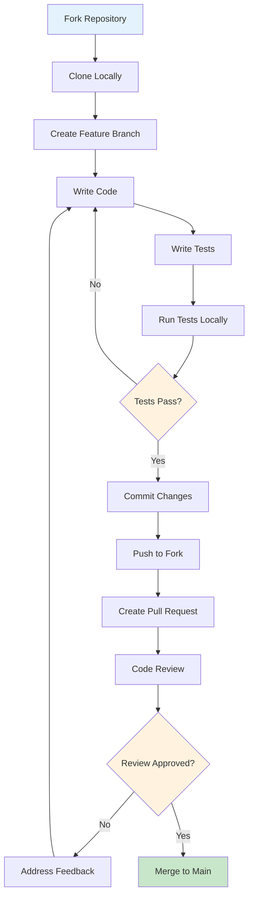
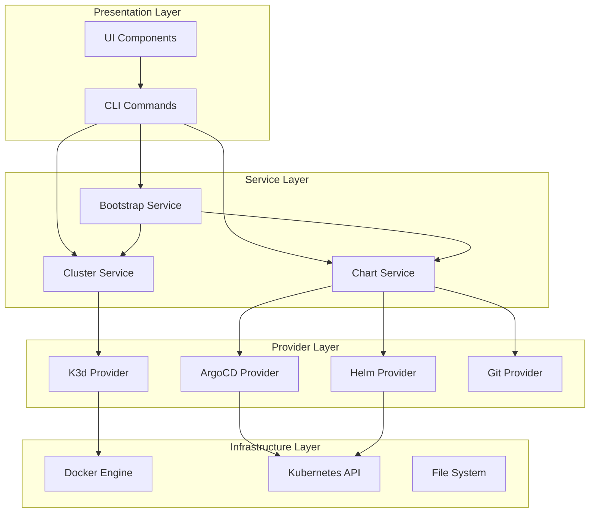

# Developer Getting Started Guide

Welcome to OpenFrame CLI development! This guide will get you set up for contributing to the OpenFrame CLI project, understanding the codebase, and implementing new features.

## Development Environment Setup

### Prerequisites

| Tool | Version | Purpose | Installation |
|------|---------|---------|--------------|
| **Go** | 1.23+ | Primary language | `brew install go` or [golang.org](https://golang.org/dl/) |
| **Docker** | 20.0+ | Container runtime | [docker.com](https://www.docker.com/get-started) |
| **Git** | 2.30+ | Version control | `brew install git` |
| **Make** | 4.0+ | Build automation | Usually pre-installed |
| **kubectl** | 1.25+ | Kubernetes CLI | `brew install kubectl` |

### Quick Setup

```bash
# 1. Clone the repository
git clone https://github.com/flamingo-stack/openframe-cli.git
cd openframe-cli

# 2. Install dependencies
go mod download

# 3. Build the project
go build -o openframe main.go

# 4. Run tests
go test ./...

# 5. Verify build
./openframe --version
```

## Repository Structure

```
openframe-cli/
├── cmd/                          # CLI commands (Cobra-based)
│   ├── bootstrap/                # Bootstrap command implementation
│   │   ├── bootstrap.go          # Main bootstrap command logic
│   │   └── bootstrap_test.go     # Unit tests
│   ├── chart/                    # Chart management commands
│   │   ├── chart.go              # Root chart command
│   │   ├── install.go            # Chart installation logic
│   │   └── install_test.go       # Installation tests
│   ├── cluster/                  # Cluster management commands
│   │   ├── cluster.go            # Root cluster command
│   │   ├── create.go             # Cluster creation
│   │   ├── delete.go             # Cluster deletion
│   │   ├── list.go               # Cluster listing
│   │   └── status.go             # Cluster status
│   ├── dev/                      # Development tools
│   │   ├── intercept.go          # Telepresence integration
│   │   └── scaffold.go           # Project scaffolding
│   └── root.go                   # Root command setup
├── internal/                     # Internal packages
│   ├── bootstrap/                # Bootstrap service layer
│   │   └── service.go            # Core bootstrap orchestration
│   ├── chart/                    # Chart management internals
│   │   ├── models/               # Data models
│   │   ├── prerequisites/        # System requirement checks
│   │   ├── providers/            # ArgoCD, Helm, Git providers
│   │   └── services/             # Business logic services
│   ├── cluster/                  # Cluster management internals
│   └── shared/                   # Shared utilities
│       ├── config/               # Configuration management
│       ├── errors/               # Error handling
│       └── ui/                   # Terminal UI components
├── docs/                         # Documentation
│   ├── codewiki/                 # Generated documentation
│   └── tutorials/                # Tutorial documents
├── main.go                       # Application entry point
├── go.mod                        # Go module definition
└── go.sum                        # Dependency checksums
```

## Development Workflow



### Setting Up Development Environment

**Step 1: Fork and Clone**
```bash
# Fork the repository on GitHub, then:
git clone https://github.com/YOUR_USERNAME/openframe-cli.git
cd openframe-cli

# Add upstream remote
git remote add upstream https://github.com/flamingo-stack/openframe-cli.git
```

**Step 2: Install Development Tools**
```bash
# Install Go tools
go install golang.org/x/tools/cmd/goimports@latest
go install honnef.co/go/tools/cmd/staticcheck@latest

# Install pre-commit hooks (optional but recommended)
pip install pre-commit
pre-commit install
```

**Step 3: Set up IDE**

**For VS Code**, create `.vscode/settings.json`:
```json
{
    "go.toolsEnvVars": {
        "GO111MODULE": "on"
    },
    "go.useCodeSnippetsOnFunctionSuggest": true,
    "go.gocodeAutoBuild": true,
    "go.formatTool": "goimports"
}
```

**For GoLand/IntelliJ**: Enable Go modules support and set GOROOT to Go 1.23+

## Build and Test Commands

### Local Development

```bash
# Build for current platform
go build -o openframe main.go

# Build with version info
go build -ldflags "-X main.Version=dev -X main.Commit=$(git rev-parse --short HEAD) -X main.Date=$(date -u +%Y-%m-%dT%H:%M:%SZ)" -o openframe main.go

# Run without building
go run main.go bootstrap --help

# Install locally
go install .
```

### Testing

```bash
# Run all tests
go test ./...

# Run tests with coverage
go test -cover ./...

# Run tests with verbose output
go test -v ./...

# Run specific package tests
go test ./internal/bootstrap/...

# Run specific test
go test -run TestBootstrapService ./internal/bootstrap/

# Generate coverage report
go test -coverprofile=coverage.out ./...
go tool cover -html=coverage.out
```

### Code Quality

```bash
# Format code
gofmt -w .
goimports -w .

# Run static analysis
staticcheck ./...

# Lint code (if golangci-lint is installed)
golangci-lint run

# Verify modules
go mod tidy
go mod verify
```

## Code Style and Conventions

### Go Code Standards

**Package Naming**:
```go
// ✅ Good: lowercase, descriptive
package prerequisites
package cluster

// ❌ Avoid: mixed case, abbreviations
package PreReqs
package clstr
```

**Function Naming**:
```go
// ✅ Good: clear, verb-based
func CreateCluster(name string) error
func CheckPrerequisites() (bool, error)

// ❌ Avoid: unclear purpose
func DoStuff() error
func Handle() error
```

**Error Handling**:
```go
// ✅ Good: wrap errors with context
if err != nil {
    return fmt.Errorf("failed to create cluster %s: %w", name, err)
}

// ✅ Good: use custom error types where appropriate
type ValidationError struct {
    Field string
    Value string
}

func (e ValidationError) Error() string {
    return fmt.Sprintf("invalid value '%s' for field '%s'", e.Value, e.Field)
}
```

### Command Structure

All commands follow the Cobra CLI pattern:

```go
func GetCommandCmd() *cobra.Command {
    cmd := &cobra.Command{
        Use:   "command [args]",
        Short: "Brief description",
        Long:  "Detailed description with examples",
        Args:  cobra.MaximumNArgs(1),
        RunE: func(cmd *cobra.Command, args []string) error {
            // Command logic here
            return nil
        },
    }
    
    // Add flags
    cmd.Flags().StringP("flag", "f", "", "Flag description")
    cmd.Flags().BoolP("verbose", "v", false, "Enable verbose output")
    
    return cmd
}
```

### Testing Patterns

**Unit Test Structure**:
```go
func TestServiceMethod(t *testing.T) {
    tests := []struct {
        name    string
        input   string
        want    string
        wantErr bool
    }{
        {
            name:    "valid input",
            input:   "test",
            want:    "test-result",
            wantErr: false,
        },
        {
            name:    "invalid input",
            input:   "",
            want:    "",
            wantErr: true,
        },
    }

    for _, tt := range tests {
        t.Run(tt.name, func(t *testing.T) {
            service := NewService()
            got, err := service.Method(tt.input)
            
            if (err != nil) != tt.wantErr {
                t.Errorf("Method() error = %v, wantErr %v", err, tt.wantErr)
                return
            }
            
            if got != tt.want {
                t.Errorf("Method() = %v, want %v", got, tt.want)
            }
        })
    }
}
```

## Architecture Overview

### Layer Structure



### Key Design Patterns

| Pattern | Usage | Example |
|---------|-------|---------|
| **Command Pattern** | CLI structure | Each command is self-contained |
| **Factory Pattern** | Provider creation | `NewChartService()` functions |
| **Strategy Pattern** | Deployment modes | Different strategies for oss-tenant, saas-* |
| **Observer Pattern** | UI updates | Progress reporting during operations |
| **Builder Pattern** | Configuration | Building complex configurations step by step |

## Common Development Tasks

### Adding a New Command

**Step 1: Create command file**
```bash
# Create new command file
touch cmd/newfeature/newfeature.go
touch cmd/newfeature/newfeature_test.go
```

**Step 2: Implement command**
```go
// cmd/newfeature/newfeature.go
package newfeature

import (
    "github.com/spf13/cobra"
)

func GetNewFeatureCmd() *cobra.Command {
    return &cobra.Command{
        Use:   "newfeature",
        Short: "Description of new feature",
        RunE: func(cmd *cobra.Command, args []string) error {
            // Implementation here
            return nil
        },
    }
}
```

**Step 3: Register command**
```go
// cmd/root.go
func buildRootCommand(versionInfo VersionInfo) *cobra.Command {
    // ... existing code ...
    
    // Add new command
    rootCmd.AddCommand(getNewFeatureCmd())
    
    return rootCmd
}

func getNewFeatureCmd() *cobra.Command {
    return newfeature.GetNewFeatureCmd()
}
```

### Adding a New Service

**Step 1: Create service package**
```bash
mkdir -p internal/newservice
touch internal/newservice/service.go
touch internal/newservice/service_test.go
```

**Step 2: Implement service interface**
```go
// internal/newservice/service.go
package newservice

type Service struct {
    // dependencies
}

func NewService() *Service {
    return &Service{}
}

func (s *Service) DoSomething() error {
    // Implementation
    return nil
}
```

### Adding Prerequisites Check

**Step 1: Create checker**
```go
// internal/chart/prerequisites/newtool/newtool.go
package newtool

type NewToolChecker struct{}

func NewNewToolChecker() *NewToolChecker {
    return &NewToolChecker{}
}

func (c *NewToolChecker) IsInstalled() bool {
    // Check if tool is installed
    return true
}

func (c *NewToolChecker) GetInstallInstructions() string {
    return "Install instructions for new tool"
}
```

**Step 2: Register in prerequisites**
```go
// internal/chart/prerequisites/checker.go
func NewPrerequisiteChecker() *PrerequisiteChecker {
    return &PrerequisiteChecker{
        requirements: []Requirement{
            // ... existing requirements ...
            {
                Name:        "NewTool",
                Command:     "newtool",
                IsInstalled: func() bool { return newtool.NewNewToolChecker().IsInstalled() },
                InstallHelp: func() string { return newtool.NewNewToolChecker().GetInstallInstructions() },
            },
        },
    }
}
```

## Debugging and Troubleshooting

### Common Development Issues

**Import Cycle Errors**:
```bash
# Symptom: package import cycle
# Solution: Reorganize dependencies, use interfaces

# Check dependencies
go mod graph | grep your-package
```

**Module Issues**:
```bash
# Clean module cache
go clean -modcache

# Refresh dependencies
go mod tidy
go mod download
```

**Build Issues**:
```bash
# Verbose build
go build -x -v .

# Check for race conditions
go test -race ./...
```

### Debugging Techniques

**Enable Debug Logging**:
```go
// Add debug logging
import "log"

func main() {
    log.SetFlags(log.LstdFlags | log.Lshortfile)
    // ... rest of main
}

// In functions
log.Printf("Debug: processing %s", value)
```

**Using Delve Debugger**:
```bash
# Install delve
go install github.com/go-delve/delve/cmd/dlv@latest

# Debug tests
dlv test ./internal/bootstrap

# Debug binary
dlv exec ./openframe bootstrap
```

## Contributing Guidelines

### Pull Request Process

1. **Create Feature Branch**:
   ```bash
   git checkout -b feature/my-new-feature
   ```

2. **Make Changes**: Follow coding standards and add tests

3. **Test Thoroughly**:
   ```bash
   go test ./...
   go build .
   ./openframe bootstrap --help  # Manual testing
   ```

4. **Commit with Good Messages**:
   ```bash
   git commit -m "feat: add new cluster creation mode
   
   - Implement support for custom node configurations
   - Add validation for node count and memory requirements
   - Update tests to cover new functionality
   
   Closes #123"
   ```

5. **Push and Create PR**:
   ```bash
   git push origin feature/my-new-feature
   # Create PR through GitHub UI
   ```

### Code Review Checklist

**Before Submitting**:
- [ ] Code follows Go conventions
- [ ] Tests are added/updated
- [ ] Documentation is updated
- [ ] No breaking changes (or properly documented)
- [ ] Performance impact considered

**Review Criteria**:
- [ ] Code is readable and maintainable
- [ ] Error handling is appropriate
- [ ] Tests cover edge cases
- [ ] No security vulnerabilities
- [ ] Consistent with existing architecture

## Useful Development Commands

```bash
# Quick development cycle
alias dev-build='go build -o openframe main.go'
alias dev-test='go test -v ./...'
alias dev-lint='golangci-lint run'

# Testing specific functionality
./openframe bootstrap test-cluster --verbose --deployment-mode=oss-tenant

# Check code coverage
go test -coverprofile=coverage.out ./... && go tool cover -func=coverage.out

# Generate documentation
go doc -all ./internal/bootstrap > bootstrap-docs.txt
```

## Next Steps

🚀 **You're ready to contribute!** Here are some good first issues to tackle:

- **Add new deployment modes**: Extend the bootstrap functionality
- **Improve error messages**: Make CLI more user-friendly  
- **Add new prerequisites**: Support for additional tools
- **Enhance testing**: Increase test coverage

> **📖 Learn More**: Check out the [Architecture Overview](architecture-overview-dev.md) for deep technical details about the system design.

## Getting Help

- **Code Questions**: Create GitHub discussions
- **Bug Reports**: Use GitHub issues with reproduction steps
- **Feature Requests**: Propose via GitHub issues with use cases
- **Chat**: Join our developer community [link]

---

**Happy coding!** 🎉 Your contributions help make OpenFrame CLI better for everyone.