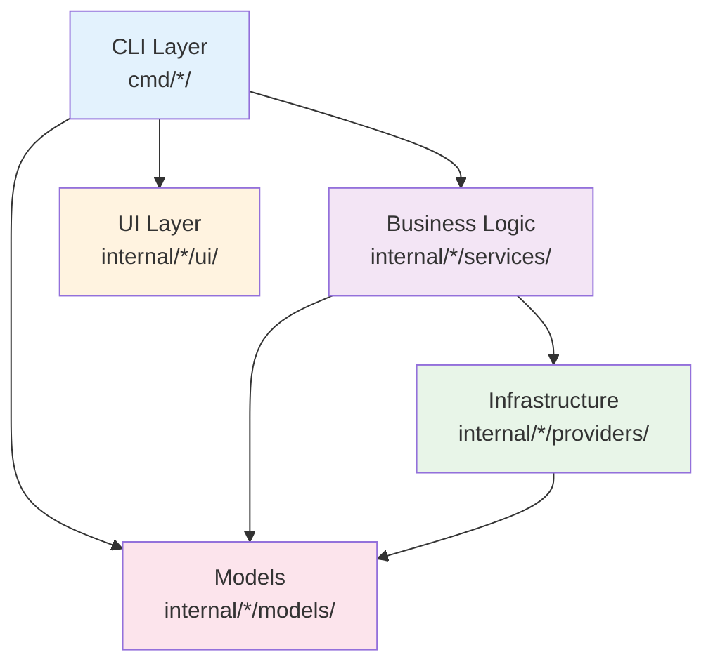
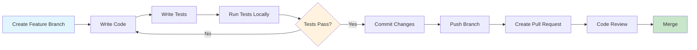

# OpenFrame CLI - Developer Getting Started

Welcome to OpenFrame CLI development! This guide will get you set up to contribute to the project, understand the codebase structure, and start developing new features.

## Development Environment Setup

### Prerequisites for Development

| Tool | Version | Purpose | Installation |
|------|---------|---------|-------------|
| **Go** | 1.19+ | Primary language | [Install Go](https://golang.org/doc/install) |
| **Docker** | 20.10+ | Container runtime & testing | [Install Docker](https://docs.docker.com/get-docker/) |
| **kubectl** | 1.20+ | Kubernetes CLI | [Install kubectl](https://kubernetes.io/docs/tasks/tools/) |
| **k3d** | 5.0+ | Local Kubernetes testing | [Install k3d](https://k3d.io/v5.4.6/#installation) |
| **Helm** | 3.7+ | Package manager | [Install Helm](https://helm.sh/docs/intro/install/) |
| **Make** | Latest | Build automation | Usually pre-installed |
| **Git** | 2.30+ | Version control | [Install Git](https://git-scm.com/book/en/v2/Getting-Started-Installing-Git) |

### Clone and Setup

```bash
# Clone the repository
git clone https://github.com/flamingo-stack/openframe-cli.git
cd openframe-cli

# Install dependencies
go mod download

# Verify setup
go version
make --version
docker --version
```

## Repository Structure

```
openframe-cli/
├── cmd/                          # CLI command implementations
│   ├── bootstrap/               # Bootstrap command
│   │   └── bootstrap.go        # Main bootstrap command handler
│   ├── chart/                  # Chart management commands
│   │   ├── chart.go           # Chart command group
│   │   └── install.go         # Chart installation logic
│   ├── cluster/               # Cluster management commands
│   │   ├── cluster.go         # Cluster command group
│   │   ├── create.go          # Cluster creation
│   │   ├── delete.go          # Cluster deletion
│   │   ├── list.go            # List clusters
│   │   ├── status.go          # Cluster status
│   │   └── cleanup.go         # Resource cleanup
│   └── dev/                   # Development tools
│       └── dev.go             # Dev command group
├── internal/                   # Internal packages (not exported)
│   ├── bootstrap/             # Bootstrap service logic
│   ├── cluster/               # Cluster management services
│   ├── chart/                 # Chart management services
│   ├── dev/                   # Development workflow services
│   └── shared/                # Shared utilities and models
├── docs/                      # Documentation
│   ├── dev/                   # Developer documentation
│   └── tutorials/             # User and developer tutorials
├── go.mod                     # Go module definition
├── go.sum                     # Dependency checksums
├── Makefile                   # Build automation
└── README.md                  # Project overview
```

### Code Organization Patterns

The project follows a clean architecture pattern:



## Build and Test Commands

### Essential Development Commands

```bash
# Build the CLI binary
make build

# Run tests
make test

# Run linter
make lint

# Install locally for testing
make install

# Clean build artifacts
make clean

# View all available commands
make help
```

### Manual Build Commands

```bash
# Build for current platform
go build -o openframe ./cmd

# Build for multiple platforms
GOOS=linux GOARCH=amd64 go build -o openframe-linux ./cmd
GOOS=darwin GOARCH=amd64 go build -o openframe-darwin ./cmd
GOOS=windows GOARCH=amd64 go build -o openframe-windows.exe ./cmd

# Run tests with coverage
go test -cover ./...

# Run specific tests
go test ./internal/cluster/services/... -v

# Run tests with race detection
go test -race ./...
```

## Development Workflow



### Step-by-Step Development Process

1. **Create a feature branch**:
   ```bash
   git checkout -b feature/add-new-command
   ```

2. **Implement your changes**:
   ```bash
   # Create new command (example)
   mkdir -p cmd/newcommand
   touch cmd/newcommand/newcommand.go
   
   # Create service logic
   mkdir -p internal/newcommand/services
   touch internal/newcommand/services/service.go
   ```

3. **Write tests**:
   ```bash
   # Unit tests
   touch internal/newcommand/services/service_test.go
   
   # Integration tests
   mkdir -p tests/integration
   touch tests/integration/newcommand_test.go
   ```

4. **Test your changes**:
   ```bash
   # Build and test
   make build
   make test
   
   # Manual testing
   ./openframe newcommand --help
   ./openframe newcommand test-arg
   ```

5. **Commit and push**:
   ```bash
   git add .
   git commit -m "feat: add new command for X functionality"
   git push origin feature/add-new-command
   ```

## Code Style and Conventions

### Go Code Standards

```go
// Follow standard Go naming conventions
type ClusterService interface {
    CreateCluster(config ClusterConfig) error
    DeleteCluster(name string) error
}

// Use proper error handling
func (s *ClusterService) CreateCluster(config ClusterConfig) error {
    if err := s.validateConfig(config); err != nil {
        return fmt.Errorf("invalid cluster config: %w", err)
    }
    
    // Implementation...
    return nil
}

// Document public functions
// CreateCluster creates a new Kubernetes cluster with the specified configuration.
// It validates the configuration, checks prerequisites, and delegates to the 
// appropriate cluster provider (k3d, kind, etc.).
func (s *ClusterService) CreateCluster(config ClusterConfig) error {
    // Implementation...
}
```

### Project-Specific Conventions

| Convention | Example | Rationale |
|------------|---------|-----------|
| **Command Structure** | `cmd/{group}/{command}.go` | Clear separation of concerns |
| **Service Layer** | `internal/{group}/services/` | Business logic isolation |
| **Models** | `internal/{group}/models/` | Type definitions and validation |
| **UI Components** | `internal/{group}/ui/` | User interaction separation |
| **Error Handling** | `fmt.Errorf("context: %w", err)` | Consistent error wrapping |

### Import Organization

```go
package cluster

import (
    // Standard library first
    "context"
    "fmt"
    "strings"
    
    // External dependencies
    "github.com/spf13/cobra"
    "k8s.io/client-go/kubernetes"
    
    // Internal packages last
    "github.com/flamingo-stack/openframe-cli/internal/cluster/models"
    "github.com/flamingo-stack/openframe-cli/internal/cluster/services"
    "github.com/flamingo-stack/openframe-cli/internal/shared/ui"
)
```

## Contributing Guidelines Summary

### Code Quality Standards

- ✅ **Write tests** for new functionality (minimum 80% coverage)
- ✅ **Follow Go best practices** (use `golangci-lint`)
- ✅ **Document public APIs** with comments
- ✅ **Handle errors properly** with context
- ✅ **Use meaningful commit messages** (conventional commits preferred)

### Pull Request Process

1. **Fork the repository** and create a feature branch
2. **Write comprehensive tests** for your changes
3. **Ensure all tests pass** locally
4. **Update documentation** if needed
5. **Submit a pull request** with clear description
6. **Respond to code review** feedback promptly

### Commit Message Format

```bash
# Format: type(scope): description
feat(cluster): add support for custom k8s versions
fix(chart): resolve ArgoCD installation timeout
docs(api): update cluster creation examples
test(dev): add integration tests for intercept command
refactor(ui): improve error message formatting
```

## Debug Tips and Common Issues

### Debugging During Development

```bash
# Enable verbose output
go build -o openframe-debug ./cmd
./openframe-debug cluster create test --verbose

# Use Go's built-in profiler
go build -race -o openframe-debug ./cmd
./openframe-debug cluster create test

# Debug with delve
go install github.com/go-delve/delve/cmd/dlv@latest
dlv debug ./cmd -- cluster create test
```

### Common Development Errors

| Error | Cause | Solution |
|-------|-------|----------|
| **`import cycle not allowed`** | Circular dependencies | Refactor shared code to common package |
| **`undefined: SomeFunction`** | Missing import or unexported function | Check imports and capitalization |
| **`go.mod out of sync`** | Dependency mismatch | Run `go mod tidy` |
| **`tests failing on CI`** | Environment differences | Use build constraints for platform-specific code |
| **`race condition detected`** | Concurrent access to shared data | Add proper synchronization (mutexes, channels) |

### Testing Best Practices

```bash
# Run tests in isolation
go test -count=1 ./...

# Test with different Go versions (if using Docker)
docker run --rm -v "$PWD":/workspace -w /workspace golang:1.19 go test ./...
docker run --rm -v "$PWD":/workspace -w /workspace golang:1.20 go test ./...

# Integration tests (requires Docker)
make test-integration

# Load testing
go test -bench=. ./internal/cluster/services/
```

## IDE Setup Recommendations

### VS Code Configuration

Create `.vscode/settings.json`:
```json
{
    "go.lintTool": "golangci-lint",
    "go.lintFlags": ["--fast"],
    "go.testFlags": ["-v"],
    "go.testTimeout": "30s",
    "go.coverOnSave": true,
    "go.formatTool": "goimports",
    "editor.formatOnSave": true
}
```

### GoLand/IntelliJ Configuration

- Enable `goimports` for auto-imports
- Configure `golangci-lint` as external tool
- Set up run configurations for common commands
- Enable code coverage visualization

## Debugging Production Issues

### Local Reproduction

```bash
# Create debug cluster with verbose logging
export OPENFRAME_DEBUG=true
export OPENFRAME_LOG_LEVEL=debug

./openframe bootstrap debug-cluster --verbose

# Examine cluster state
kubectl get all --all-namespaces
docker logs k3d-debug-cluster-server-0
```

### Log Analysis

```bash
# Collect diagnostic information
./openframe cluster status debug-cluster --output json > cluster-state.json

# Docker system information
docker system df > docker-usage.txt
docker system events > docker-events.txt

# Kubernetes events
kubectl get events --all-namespaces --sort-by='.lastTimestamp' > k8s-events.txt
```

## Next Steps for New Developers

1. **📚 Read the [Architecture Overview](architecture-overview-dev.md)** - Understand system design
2. **🔧 Pick a "good first issue"** - Start with small contributions
3. **💬 Join developer discussions** - Connect with the team
4. **📖 Study existing commands** - Learn from working implementations
5. **🧪 Write tests first** - Practice TDD approach

## Getting Help

### Development Resources

- **📖 Internal docs**: `docs/dev/` directory
- **💬 Developer chat**: #dev channel in Discord
- **🎯 GitHub Discussions**: Technical discussions and Q&A
- **📋 GitHub Issues**: Bug reports and feature requests

### Contact Information

- **Team Lead**: @flamingo-stack on GitHub
- **Code Reviews**: @openframe-maintainers team
- **Architecture Questions**: #architecture channel
- **CI/CD Issues**: #devops channel

---

**Ready to contribute?** Start by picking an issue labeled `good-first-issue` and follow the workflow above. Welcome to the OpenFrame CLI development team! 🚀