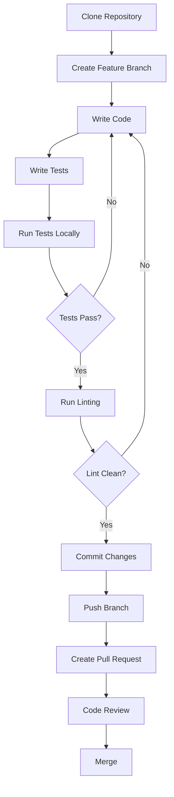

# Developer Getting Started Guide

Welcome to OpenFrame CLI development! This guide will help you set up your development environment, understand the codebase structure, and start contributing to the project.

## Development Environment Setup

### Prerequisites for Development

| Tool | Version | Purpose | Installation |
|------|---------|---------|-------------|
| **Go** | 1.19+ | Primary language | [Install Go](https://golang.org/doc/install) |
| **Docker** | Latest | Container runtime for testing | [Install Docker](https://docs.docker.com/get-docker/) |
| **kubectl** | v1.20+ | Kubernetes CLI testing | [Install kubectl](https://kubernetes.io/docs/tasks/tools/install-kubectl/) |
| **Git** | Latest | Version control | [Install Git](https://git-scm.com/downloads) |
| **Make** | Latest | Build automation | Usually pre-installed on Linux/macOS |
| **golangci-lint** | Latest | Code linting | `go install github.com/golangci/golangci-lint/cmd/golangci-lint@latest` |

### Repository Setup

```bash
# 1. Clone the repository
git clone https://github.com/flamingo-stack/openframe-cli.git
cd openframe-cli

# 2. Install dependencies
go mod download
go mod tidy

# 3. Verify setup by building
go build -o openframe main.go

# 4. Run tests to ensure everything works
go test ./...

# 5. Set up pre-commit hooks (optional but recommended)
cp scripts/pre-commit .git/hooks/
chmod +x .git/hooks/pre-commit
```

### Development Workflow



## Repository Structure

The OpenFrame CLI follows a clean architecture pattern with clear separation of concerns:

```
openframe-cli/
├── main.go                    # Application entry point
├── cmd/                       # CLI command definitions
│   ├── root.go               # Root command and CLI setup
│   ├── bootstrap/            # Bootstrap command
│   ├── cluster/              # Cluster management commands
│   │   ├── create.go
│   │   ├── delete.go
│   │   ├── list.go
│   │   └── status.go
│   ├── chart/                # Chart installation commands
│   └── dev/                  # Development workflow commands
│       ├── intercept.go
│       └── scaffold.go
├── internal/                  # Private application code
│   ├── bootstrap/            # Bootstrap service logic
│   ├── cluster/              # Cluster management
│   │   ├── service.go        # Business logic
│   │   ├── models/           # Data structures
│   │   ├── providers/        # External tool integrations
│   │   │   └── k3d/          # K3d provider implementation
│   │   └── prerequisites/    # Tool validation
│   ├── chart/                # Chart management
│   │   ├── services/         # Chart installation logic
│   │   ├── providers/        # ArgoCD, Helm, Git providers
│   │   └── models/           # Chart data structures
│   ├── dev/                  # Developer tools
│   │   ├── services/
│   │   │   ├── intercept/    # Telepresence integration
│   │   │   └── scaffold/     # Skaffold integration
│   │   └── providers/
│   └── shared/               # Shared utilities
│       ├── ui/               # User interface components
│       ├── executor/         # Command execution abstraction
│       ├── config/           # Configuration management
│       └── errors/           # Error handling
├── docs/                     # Documentation
├── scripts/                  # Build and development scripts
├── tests/                    # Integration tests
└── go.mod                    # Go module definition
```

### Architecture Layers

| Layer | Package | Responsibility |
|-------|---------|---------------|
| **CLI Layer** | `cmd/` | Command parsing, flag handling, user interaction |
| **Service Layer** | `internal/*/service.go` | Business logic, workflow orchestration |
| **Provider Layer** | `internal/*/providers/` | External tool integrations (K3d, Helm, etc.) |
| **Model Layer** | `internal/*/models/` | Data structures and types |
| **Shared Layer** | `internal/shared/` | Cross-cutting concerns |

## Build and Test Commands

### Building the Application

```bash
# Build for current platform
go build -o openframe main.go

# Build for specific platforms
GOOS=linux GOARCH=amd64 go build -o openframe-linux-amd64 main.go
GOOS=darwin GOARCH=amd64 go build -o openframe-darwin-amd64 main.go
GOOS=windows GOARCH=amd64 go build -o openframe-windows-amd64.exe main.go

# Build with version information
go build -ldflags "-X github.com/flamingo-stack/openframe-cli/cmd.Version=1.0.0" -o openframe main.go
```

### Running Tests

```bash
# Run all tests
go test ./...

# Run tests with coverage
go test -cover ./...

# Run tests with verbose output
go test -v ./...

# Run specific test package
go test ./internal/cluster/...

# Run specific test function
go test -run TestClusterService ./internal/cluster/

# Generate coverage report
go test -coverprofile=coverage.out ./...
go tool cover -html=coverage.out
```

### Code Quality

```bash
# Run linting
golangci-lint run

# Format code
go fmt ./...

# Vet code for issues
go vet ./...

# Run all quality checks
make check  # or equivalent script
```

## Code Style and Conventions

### Go Style Guidelines

We follow standard Go conventions plus some project-specific rules:

#### File Organization
```go
// Package comment
package cluster

// Imports grouped by: standard library, external, internal
import (
    "fmt"
    "strings"
    
    "github.com/spf13/cobra"
    
    "github.com/flamingo-stack/openframe-cli/internal/shared/ui"
)
```

#### Function Structure
```go
// Service methods should be descriptive and follow this pattern
func (s *ClusterService) CreateCluster(config models.ClusterConfig) error {
    // 1. Validate input
    if err := s.validateConfig(config); err != nil {
        return fmt.Errorf("invalid config: %w", err)
    }
    
    // 2. Check prerequisites  
    if err := s.checkPrerequisites(); err != nil {
        return fmt.Errorf("prerequisites not met: %w", err)
    }
    
    // 3. Execute operation
    if err := s.provider.CreateCluster(config); err != nil {
        return fmt.Errorf("failed to create cluster: %w", err)
    }
    
    return nil
}
```

#### Error Handling
```go
// Wrap errors with context
if err := doSomething(); err != nil {
    return fmt.Errorf("failed to do something: %w", err)
}

// Use custom error types when appropriate
type ClusterNotFoundError struct {
    Name string
}

func (e *ClusterNotFoundError) Error() string {
    return fmt.Sprintf("cluster %s not found", e.Name)
}
```

#### Testing Patterns
```go
func TestClusterService_CreateCluster(t *testing.T) {
    tests := []struct {
        name    string
        config  models.ClusterConfig
        want    error
        wantErr bool
    }{
        {
            name: "valid config",
            config: models.ClusterConfig{
                Name: "test-cluster",
                Type: models.ClusterTypeK3d,
            },
            want:    nil,
            wantErr: false,
        },
        {
            name: "invalid config",
            config: models.ClusterConfig{
                Name: "", // empty name should fail
            },
            wantErr: true,
        },
    }
    
    for _, tt := range tests {
        t.Run(tt.name, func(t *testing.T) {
            s := NewClusterService()
            err := s.CreateCluster(tt.config)
            
            if tt.wantErr {
                assert.Error(t, err)
            } else {
                assert.NoError(t, err)
            }
        })
    }
}
```

### Package Structure Conventions

- **Commands (`cmd/`)**: Keep thin, focus on CLI concerns
- **Services (`internal/*/service.go`)**: Business logic, no CLI dependencies
- **Providers (`internal/*/providers/`)**: External tool integrations
- **Models (`internal/*/models/`)**: Pure data structures
- **UI (`internal/shared/ui/`)**: Reusable UI components

## Contributing Guidelines

### Development Process

1. **Create an Issue First**: Discuss major changes in GitHub issues
2. **Fork and Branch**: Create feature branches from `main`
3. **Write Tests**: All new code should have tests
4. **Documentation**: Update relevant documentation
5. **Code Review**: All changes require review

### Branch Naming

- `feature/cluster-management` - New features
- `fix/memory-leak` - Bug fixes
- `docs/api-reference` - Documentation updates  
- `refactor/error-handling` - Code improvements

### Commit Messages

Follow [Conventional Commits](https://www.conventionalcommits.org/):

```
feat(cluster): add support for custom K8s versions

- Allow users to specify Kubernetes version during cluster creation
- Add validation for supported version ranges
- Update cluster creation UI with version selection

Closes #123
```

### Pull Request Template

```markdown
## Description
Brief description of changes

## Type of Change
- [ ] Bug fix
- [ ] New feature  
- [ ] Breaking change
- [ ] Documentation update

## Testing
- [ ] Unit tests pass
- [ ] Integration tests pass
- [ ] Manual testing completed

## Checklist
- [ ] Code follows style guidelines
- [ ] Self-review completed
- [ ] Documentation updated
- [ ] Tests added/updated
```

## Debugging and Development Tips

### Local Development Setup

```bash
# Build and test locally
go build -o openframe-dev main.go

# Test against local cluster
./openframe-dev cluster create test-cluster --verbose

# Use different cluster name to avoid conflicts
./openframe-dev bootstrap dev-test-$(date +%s) --deployment-mode=oss-tenant
```

### Debugging Techniques

#### Enable Debug Logging

```go
// In your code, use structured logging
import "github.com/sirupsen/logrus"

func (s *ClusterService) CreateCluster(config models.ClusterConfig) error {
    logrus.WithFields(logrus.Fields{
        "cluster_name": config.Name,
        "node_count":   config.NodeCount,
    }).Debug("Creating cluster with config")
    
    // ... implementation
}
```

#### Mock External Dependencies

```go
// Create interfaces for testability
type K3dProvider interface {
    CreateCluster(config models.ClusterConfig) error
    DeleteCluster(name string) error
}

// Use dependency injection
type ClusterService struct {
    provider K3dProvider
}

func NewClusterService(provider K3dProvider) *ClusterService {
    return &ClusterService{provider: provider}
}
```

#### Integration Testing

```go
func TestIntegration_BootstrapWorkflow(t *testing.T) {
    if testing.Short() {
        t.Skip("skipping integration test")
    }
    
    // Test with real K3d cluster
    clusterName := fmt.Sprintf("test-%d", time.Now().Unix())
    defer func() {
        // Cleanup
        exec.Command("k3d", "cluster", "delete", clusterName).Run()
    }()
    
    // Test bootstrap command end-to-end
    cmd := exec.Command("./openframe", "bootstrap", clusterName, 
        "--deployment-mode=oss-tenant", "--non-interactive")
    output, err := cmd.CombinedOutput()
    
    assert.NoError(t, err, "Bootstrap should succeed: %s", output)
}
```

### Common Development Errors

| Error | Cause | Solution |
|-------|-------|----------|
| `cannot find package` | Missing dependency | `go mod download && go mod tidy` |
| `tests hanging` | Missing cleanup | Add `defer` cleanup in tests |
| `cluster exists` | Previous test cleanup failed | `k3d cluster delete <name>` |
| `permission denied` | Binary not executable | `chmod +x openframe` |
| `port already in use` | Existing cluster running | `openframe cluster list && delete` |

### IDE Setup Recommendations

#### VS Code Extensions
- **Go** (official Go extension)
- **golangci-lint** (linting integration)
- **Test Explorer** (test running)
- **GitLens** (Git integration)

#### GoLand/IntelliJ Setup
- Enable Go modules support
- Configure file watchers for linting
- Set up run configurations for tests

#### Debugging Configuration
```json
// .vscode/launch.json
{
    "version": "0.2.0",
    "configurations": [
        {
            "name": "Debug OpenFrame CLI",
            "type": "go",
            "request": "launch",
            "mode": "debug",
            "program": "${workspaceFolder}/main.go",
            "args": ["bootstrap", "debug-cluster", "--verbose"],
            "env": {}
        }
    ]
}
```

## Getting Help

### Resources

- **GitHub Issues**: Bug reports and feature requests
- **GitHub Discussions**: Questions and community discussions  
- **Code Comments**: Inline documentation in complex areas
- **This Documentation**: Architecture and development guides

### Code Review Process

1. **Self Review**: Check your own code first
2. **Automated Checks**: Ensure CI passes
3. **Peer Review**: At least one approving review required
4. **Maintainer Review**: Core maintainer final approval
5. **Merge**: Squash and merge after approval

### Getting Your First Contribution Merged

1. Start with a small bug fix or documentation improvement
2. Read existing code to understand patterns
3. Ask questions in issues or discussions
4. Be patient with the review process
5. Address feedback promptly

---

## Quick Reference

### Essential Commands

| Task | Command | Notes |
|------|---------|-------|
| **Build** | `go build -o openframe main.go` | Local development build |
| **Test** | `go test ./...` | Run all tests |
| **Lint** | `golangci-lint run` | Code quality check |
| **Format** | `go fmt ./...` | Format all code |
| **Coverage** | `go test -cover ./...` | Test coverage report |
| **Clean** | `go clean` | Clean build cache |

### Useful Development Flags

- `--verbose`: Enable detailed logging
- `--non-interactive`: Skip interactive prompts
- `--dry-run`: Show what would happen without executing

Ready to contribute? Start by exploring the [Architecture Overview](architecture-overview-dev.md) to understand the system design, then pick an issue labeled "good first issue" to get started!