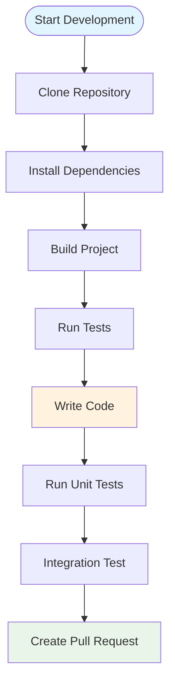

# Developer Getting Started Guide

Welcome to OpenFrame CLI development! This guide will help you set up a development environment, understand the codebase structure, and contribute effectively to the project.

## Prerequisites

Before you begin development, ensure you have:

| Tool | Version | Purpose |
|------|---------|---------|
| **Go** | 1.19+ | Primary programming language |
| **Docker** | 20.10+ | For running K3d clusters |
| **kubectl** | 1.24+ | Kubernetes CLI for testing |
| **Git** | 2.30+ | Version control |
| **Make** | 3.81+ | Build automation |

Optional but recommended:
- **GoLand/VSCode** with Go extension
- **Docker Desktop** for easier container management
- **k9s** for better Kubernetes cluster inspection

## Development Environment Setup

### 1. Clone and Setup

```bash
# Clone the repository
git clone https://github.com/flamingo-stack/openframe-cli.git
cd openframe-cli

# Install dependencies
go mod download

# Build the project
make build

# Run tests
make test
```

### 2. Development Workflow



### 3. Local Development Commands

```bash
# Build development binary
go build -o ./bin/openframe .

# Run with development binary
./bin/openframe --help

# Install locally for system-wide testing
go install .

# Run specific tests
go test ./internal/cluster/...
go test -v ./internal/bootstrap/...

# Run with race detection
go test -race ./...
```

## Repository Structure

```
openframe-cli/
├── cmd/                          # CLI command definitions
│   ├── bootstrap/               # Bootstrap command implementation
│   ├── cluster/                 # Cluster management commands
│   ├── chart/                   # Helm chart commands
│   └── dev/                     # Development workflow commands
├── internal/                     # Private application logic
│   ├── bootstrap/               # Bootstrap service implementation
│   ├── cluster/                 # Cluster management business logic
│   │   ├── models/              # Data structures and validation
│   │   ├── services/            # Core cluster operations
│   │   ├── ui/                  # Cluster-specific UI components
│   │   └── utils/               # Cluster utilities
│   ├── chart/                   # Helm/ArgoCD management
│   ├── dev/                     # Development tools integration
│   └── shared/                  # Shared utilities and components
│       ├── ui/                  # Common UI components
│       └── errors/              # Error handling utilities
├── docs/                        # Documentation
├── scripts/                     # Build and development scripts
├── go.mod                       # Go module dependencies
└── Makefile                     # Build automation
```

### Key Package Responsibilities

| Package | Purpose | Key Files |
|---------|---------|-----------|
| `cmd/*` | CLI command entry points, flag parsing | `*.go` command definitions |
| `internal/*/services` | Business logic implementation | Core service interfaces |
| `internal/*/models` | Data structures, validation | Config structs, constants |
| `internal/*/ui` | User interface components | Interactive prompts, displays |
| `internal/shared` | Cross-cutting concerns | Error handling, common utilities |

## Code Architecture Overview

### Command Layer Pattern

```go
// cmd/cluster/create.go
func getCreateCmd() *cobra.Command {
    return &cobra.Command{
        Use:   "create [NAME]",
        Short: "Create a new Kubernetes cluster", 
        RunE:  utils.WrapCommandWithCommonSetup(runCreateCluster),
    }
}

func runCreateCluster(cmd *cobra.Command, args []string) error {
    service := utils.GetCommandService()
    return service.CreateCluster(config)
}
```

### Service Layer Pattern

```go
// internal/cluster/services/cluster_service.go
type ClusterService interface {
    CreateCluster(config models.ClusterConfig) error
    DeleteCluster(name string) error
    ListClusters() ([]models.Cluster, error)
}

type clusterService struct {
    provider providers.ClusterProvider
    ui       ui.OperationsUI
}
```

### UI Layer Pattern

```go
// internal/cluster/ui/operations.go
type OperationsUI interface {
    ShowCreateProgress(config models.ClusterConfig) error
    ShowClusterStatus(cluster models.Cluster) error
}
```

## Development Guidelines

### 1. Code Style and Conventions

```go
// Package naming: lowercase, no underscores
package cluster

// Interface naming: descriptive, often ending with interface type
type ClusterProvider interface {
    CreateCluster(config ClusterConfig) error
}

// Struct naming: PascalCase
type ClusterConfig struct {
    Name       string      `yaml:"name" validate:"required"`
    Type       ClusterType `yaml:"type"`
    NodeCount  int         `yaml:"nodes" validate:"min=1"`
    K8sVersion string      `yaml:"k8s_version"`
}

// Function naming: PascalCase for public, camelCase for private
func (s *clusterService) CreateCluster(config ClusterConfig) error {
    return s.createWithProvider(config)
}

func (s *clusterService) createWithProvider(config ClusterConfig) error {
    // Implementation
}
```

### 2. Error Handling Patterns

```go
// Use typed errors for better error handling
var (
    ErrClusterNotFound    = errors.New("cluster not found")
    ErrClusterExists      = errors.New("cluster already exists")
    ErrInvalidConfig      = errors.New("invalid cluster configuration")
)

// Wrap errors with context
func (s *clusterService) CreateCluster(config ClusterConfig) error {
    if err := s.validateConfig(config); err != nil {
        return fmt.Errorf("config validation failed: %w", err)
    }
    
    if err := s.provider.CreateCluster(config); err != nil {
        return fmt.Errorf("failed to create cluster %s: %w", config.Name, err)
    }
    
    return nil
}
```

### 3. Testing Patterns

```go
// Unit test example
func TestClusterService_CreateCluster(t *testing.T) {
    tests := []struct {
        name    string
        config  models.ClusterConfig
        wantErr bool
    }{
        {
            name: "valid config",
            config: models.ClusterConfig{
                Name:      "test-cluster",
                Type:      models.ClusterTypeK3d,
                NodeCount: 3,
            },
            wantErr: false,
        },
        {
            name: "invalid config - empty name",
            config: models.ClusterConfig{
                Name:      "",
                Type:      models.ClusterTypeK3d,
                NodeCount: 3,
            },
            wantErr: true,
        },
    }
    
    for _, tt := range tests {
        t.Run(tt.name, func(t *testing.T) {
            s := NewClusterService(mockProvider, mockUI)
            err := s.CreateCluster(tt.config)
            if (err != nil) != tt.wantErr {
                t.Errorf("CreateCluster() error = %v, wantErr %v", err, tt.wantErr)
            }
        })
    }
}
```

## Build and Test Commands

### Available Make Targets

```bash
# Build binaries
make build              # Build for current platform
make build-all         # Build for all platforms
make build-linux       # Build for Linux
make build-darwin      # Build for macOS
make build-windows     # Build for Windows

# Testing
make test              # Run all tests
make test-unit         # Run unit tests only
make test-integration  # Run integration tests
make test-coverage     # Generate coverage report

# Development
make fmt               # Format code
make lint              # Run linter
make vet               # Run go vet
make mod-tidy          # Clean up dependencies

# Release
make release           # Create release build
make docker-build      # Build Docker image
```

### Custom Build Commands

```bash
# Build with version info
go build -ldflags "-X main.version=dev-$(git rev-parse --short HEAD)" -o openframe .

# Build with debug info
go build -gcflags="all=-N -l" -o openframe-debug .

# Cross-platform build
GOOS=linux GOARCH=amd64 go build -o openframe-linux .
GOOS=darwin GOARCH=amd64 go build -o openframe-darwin .
GOOS=windows GOARCH=amd64 go build -o openframe-windows.exe .
```

## Contributing Guidelines

### 1. Development Process

1. **Create Feature Branch**
   ```bash
   git checkout -b feature/your-feature-name
   ```

2. **Make Changes**
   - Follow existing code patterns
   - Add tests for new functionality
   - Update documentation if needed

3. **Test Your Changes**
   ```bash
   make test
   make lint
   ./bin/openframe cluster create test-cluster  # Manual testing
   ```

4. **Submit Pull Request**
   - Clear description of changes
   - Reference any related issues
   - Include test results

### 2. Code Review Checklist

- [ ] Code follows established patterns
- [ ] Tests cover new functionality
- [ ] Error handling is appropriate
- [ ] Documentation is updated
- [ ] No breaking changes without discussion
- [ ] Performance considerations addressed

### 3. Debug Tips and Common Issues

**Building Issues:**
```bash
# Clear module cache
go clean -modcache
go mod download

# Dependency conflicts
go mod tidy
go mod verify
```

**Runtime Debugging:**
```bash
# Verbose logging
./bin/openframe bootstrap --verbose

# Debug with delve
dlv exec ./bin/openframe -- cluster create debug-cluster

# Profile memory/CPU
go tool pprof ./bin/openframe mem.prof
```

**Testing Issues:**
```bash
# Run specific test
go test -v -run TestClusterService_CreateCluster ./internal/cluster/services/

# Run tests with race detection
go test -race ./...

# Generate test coverage
go test -coverprofile=coverage.out ./...
go tool cover -html=coverage.out
```

## Integration Testing

### Local Integration Tests

```bash
# Test full workflow
./bin/openframe bootstrap integration-test --non-interactive
kubectl get pods --all-namespaces
./bin/openframe cluster delete integration-test

# Test specific commands
./bin/openframe cluster create test-1
./bin/openframe cluster list
./bin/openframe cluster status
./bin/openframe cluster delete test-1
```

### CI/CD Testing

```bash
# Run in CI environment
export CI=true
make test
make build
./bin/openframe bootstrap ci-test --non-interactive --deployment-mode=oss-tenant
```

## Performance Considerations

### Memory Usage
- Monitor memory usage during cluster operations
- Use streaming for large outputs
- Clean up resources properly

### Startup Time
- Minimize import dependencies in main packages
- Lazy load heavy dependencies
- Cache expensive operations

### Network Operations
- Implement retries for network calls
- Use timeouts appropriately
- Batch operations where possible

## Next Steps

1. **Read the [Architecture Overview](architecture-overview-dev.md)** for detailed system design
2. **Explore existing commands** in `cmd/` directory
3. **Review test patterns** in `*_test.go` files
4. **Join development discussions** on our GitHub issues
5. **Start with good first issues** labeled in the repository

## Common Development Errors and Solutions

| Error | Cause | Solution |
|-------|-------|----------|
| `import cycle not allowed` | Circular dependencies | Refactor shared code to `internal/shared` |
| `undefined: SomeType` | Missing import | Add import or move to shared package |
| `cannot find module` | Missing dependency | Run `go mod download` |
| `permission denied` | Docker socket access | Add user to docker group |
| `port already in use` | Previous cluster running | Run `openframe cluster cleanup` |

---

> **Pro Tip**: Use `make test-watch` during development to automatically run tests when files change. This provides immediate feedback on your changes.