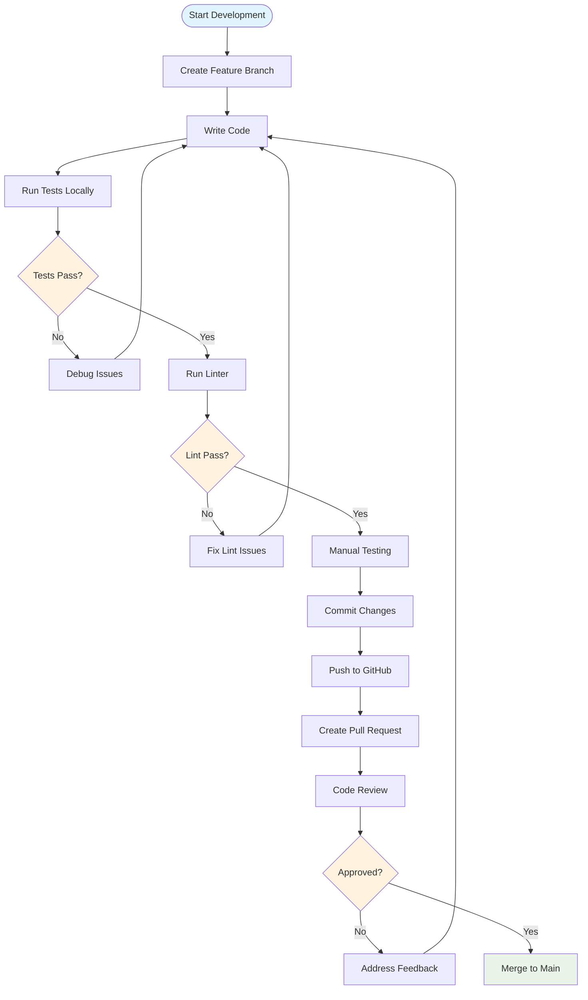

# Developer Getting Started Guide

Welcome to OpenFrame CLI development! This guide will help you set up your development environment, understand the codebase structure, and start contributing to the project.

## Table of Contents

1. [Development Environment Setup](#development-environment-setup)
2. [Repository Structure](#repository-structure)
3. [Build and Test](#build-and-test)
4. [Development Workflow](#development-workflow)
5. [Code Style and Conventions](#code-style-and-conventions)
6. [Common Development Tasks](#common-development-tasks)
7. [Debugging and Troubleshooting](#debugging-and-troubleshooting)

## Development Environment Setup

### Prerequisites

| Tool | Version | Purpose |
|------|---------|---------|
| **Go** | 1.21+ | Primary language |
| **Docker** | 20.10+ | Container runtime for testing |
| **kubectl** | 1.20+ | Kubernetes CLI for testing |
| **K3d** | 5.0+ | Local Kubernetes for testing |
| **Make** | 3.81+ | Build automation |
| **Git** | 2.30+ | Version control |

### Clone and Setup

```bash
# Clone the repository
git clone https://github.com/flamingo-stack/openframe-cli.git
cd openframe-cli

# Install Go dependencies
go mod download

# Install development tools
go install golang.org/x/tools/cmd/goimports@latest
go install github.com/golangci/golangci-lint/cmd/golangci-lint@latest

# Verify setup
go version
make --version
docker --version
```

### Environment Configuration

Create your development configuration:

```bash
# Copy example environment file
cp .env.example .env

# Edit configuration as needed
vim .env
```

Example `.env` file:
```bash
# Development settings
LOG_LEVEL=debug
DEV_MODE=true
SKIP_PREREQUISITES=false

# Testing settings
TEST_CLUSTER_PREFIX=test-
CLEANUP_ON_EXIT=true
```

### IDE Setup

#### VS Code Configuration

Create `.vscode/settings.json`:

```json
{
  "go.testFlags": ["-v"],
  "go.testTimeout": "30s",
  "go.lintTool": "golangci-lint",
  "go.lintFlags": ["--fast"],
  "go.formatTool": "goimports",
  "[go]": {
    "editor.formatOnSave": true,
    "editor.codeActionsOnSave": {
      "source.organizeImports": true
    }
  }
}
```

#### GoLand Configuration

1. Enable Go modules support
2. Set up Go formatter to use `goimports`
3. Configure golangci-lint as external tool
4. Set test timeout to 30s

## Repository Structure

Here's the complete project structure with explanations:

```
openframe-cli/
├── cmd/                                    # CLI command definitions
│   ├── bootstrap/                          # Bootstrap command package
│   │   ├── bootstrap.go                    # Main bootstrap command
│   │   └── .bootstrap.md                   # Command documentation
│   ├── chart/                              # Chart management commands
│   │   ├── chart.go                        # Chart command group
│   │   ├── install.go                      # Chart installation logic
│   │   ├── .chart.md                       # Chart documentation
│   │   └── .install.md                     # Install command docs
│   ├── cluster/                            # Cluster management commands
│   │   ├── cluster.go                      # Main cluster command group
│   │   ├── create.go                       # Cluster creation command
│   │   ├── delete.go                       # Cluster deletion command
│   │   ├── list.go                         # Cluster listing command
│   │   ├── status.go                       # Cluster status command
│   │   ├── cleanup.go                      # Resource cleanup command
│   │   ├── .cluster.md                     # Cluster docs
│   │   ├── .create.md                      # Create command docs
│   │   ├── .delete.md                      # Delete command docs
│   │   ├── .list.md                        # List command docs
│   │   ├── .status.md                      # Status command docs
│   │   └── .cleanup.md                     # Cleanup command docs
│   └── dev/                                # Development workflow commands
│       ├── dev.go                          # Dev command group
│       └── .dev.md                         # Development docs
├── internal/                               # Internal packages (not imported externally)
│   ├── bootstrap/                          # Bootstrap service implementation
│   ├── cluster/                            # Cluster service implementation
│   │   ├── models/                         # Data models and validation
│   │   ├── services/                       # Business logic services
│   │   ├── ui/                             # User interface components
│   │   ├── utils/                          # Utility functions
│   │   └── prerequisites/                  # Dependency validation
│   ├── chart/                              # Chart service implementation
│   │   ├── models/                         # Chart data models
│   │   ├── services/                       # Helm and ArgoCD services
│   │   └── prerequisites/                  # Chart prerequisites
│   ├── dev/                                # Development tools implementation
│   │   ├── services/                       # Telepresence/Skaffold services
│   │   └── prerequisites/                  # Development prerequisites
│   └── shared/                             # Shared utilities and components
│       ├── ui/                             # Common UI components
│       ├── errors/                         # Error handling utilities
│       └── config/                         # Configuration management
├── docs/                                   # Documentation
│   ├── dev/                                # Developer documentation
│   │   └── overview.md                     # Architecture overview
│   └── tutorials/                          # Tutorial documentation
│       ├── user/                           # End-user tutorials
│       └── dev/                            # Developer tutorials
├── scripts/                                # Build and development scripts
│   ├── build.sh                            # Build automation
│   ├── test.sh                             # Test automation
│   └── release.sh                          # Release automation
├── .github/                                # GitHub workflows
│   └── workflows/                          # CI/CD definitions
├── main.go                                 # Application entry point
├── go.mod                                  # Go module definition
├── go.sum                                  # Go dependency checksums
├── Makefile                                # Build automation
├── Dockerfile                              # Container image definition
└── README.md                               # Project overview
```

### Package Responsibilities

| Package | Purpose | Key Components |
|---------|---------|----------------|
| `cmd/` | **Command Layer** | Cobra command definitions, flag parsing, help text |
| `internal/*/services/` | **Business Logic** | Core functionality, external integrations |
| `internal/*/models/` | **Data Models** | Structs, validation, configuration |
| `internal/*/ui/` | **User Interface** | Interactive prompts, formatting, display |
| `internal/*/utils/` | **Utilities** | Helper functions, common operations |
| `internal/shared/` | **Shared Code** | Cross-package utilities and components |

## Build and Test

### Build Commands

```bash
# Build for current platform
make build

# Build for all platforms
make build-all

# Build with debug information
make build-debug

# Install to $GOPATH/bin
make install

# Clean build artifacts
make clean
```

### Testing

```bash
# Run all tests
make test

# Run tests with coverage
make test-coverage

# Run specific test package
go test ./cmd/cluster/...

# Run specific test function
go test ./cmd/cluster/ -run TestClusterCreate

# Run tests with verbose output
go test -v ./...

# Run integration tests (requires Docker)
make test-integration

# Run tests in CI mode
make test-ci
```

### Linting and Formatting

```bash
# Run linter
make lint

# Format code
make fmt

# Check code formatting
make fmt-check

# Run all checks (lint + fmt + test)
make check
```

### Development Workflow

Here's the typical development process:



### Git Workflow

```bash
# Start new feature
git checkout main
git pull origin main
git checkout -b feature/new-feature

# Make changes and commit
git add .
git commit -m "feat: add new cluster validation"

# Push and create PR
git push origin feature/new-feature

# Keep feature branch updated
git checkout main
git pull origin main
git checkout feature/new-feature
git rebase main
```

## Code Style and Conventions

### Go Style Guidelines

We follow standard Go conventions with some additional rules:

#### Naming Conventions

```go
// ✅ Good - descriptive function names
func CreateClusterWithValidation(config ClusterConfig) error

// ❌ Bad - abbreviated names
func CreateClstr(cfg CConfig) error

// ✅ Good - interface naming
type ClusterService interface {
    CreateCluster(config ClusterConfig) error
}

// ✅ Good - constants
const (
    DefaultClusterName = "openframe-dev"
    MaxRetries        = 3
)
```

#### Error Handling

```go
// ✅ Good - wrap errors with context
func CreateCluster(name string) error {
    if err := validateClusterName(name); err != nil {
        return fmt.Errorf("invalid cluster name %q: %w", name, err)
    }
    
    if err := k3dClient.Create(name); err != nil {
        return fmt.Errorf("failed to create cluster %q: %w", name, err)
    }
    
    return nil
}

// ✅ Good - sentinel errors for expected conditions
var (
    ErrClusterNotFound = errors.New("cluster not found")
    ErrClusterExists   = errors.New("cluster already exists")
)
```

#### Package Structure

```go
// ✅ Good - package organization
package cluster

import (
    // Standard library first
    "context"
    "fmt"
    "strings"
    
    // Third party libraries
    "github.com/spf13/cobra"
    "k8s.io/client-go/kubernetes"
    
    // Internal packages last
    "github.com/flamingo-stack/openframe-cli/internal/cluster/models"
    "github.com/flamingo-stack/openframe-cli/internal/shared/errors"
)
```

### Documentation Standards

#### Code Comments

```go
// ClusterService provides cluster lifecycle management operations.
// It handles K3d cluster creation, deletion, and status monitoring.
type ClusterService interface {
    // CreateCluster creates a new K3d cluster with the given configuration.
    // It validates the configuration, checks prerequisites, and sets up
    // the cluster with appropriate networking and storage settings.
    //
    // Returns an error if the cluster already exists, prerequisites are
    // not met, or the cluster creation fails.
    CreateCluster(ctx context.Context, config ClusterConfig) error
}
```

#### Command Help Text

```go
var createCmd = &cobra.Command{
    Use:   "create [NAME]",
    Short: "Create a new Kubernetes cluster",
    Long: `Create a new Kubernetes cluster with quick defaults or interactive configuration.

By default, shows a selection menu where you can choose:
1. Quick start with defaults (press Enter) - creates cluster with default settings
2. Interactive configuration wizard - step-by-step cluster customization

Examples:
  openframe cluster create                    # Show creation mode selection
  openframe cluster create my-cluster        # Show selection with custom name
  openframe cluster create --skip-wizard     # Direct creation with defaults`,
    Args: cobra.MaximumNArgs(1),
    RunE: runCreateCluster,
}
```

## Common Development Tasks

### Adding a New Command

1. **Create command file**:
```go
// cmd/cluster/new_command.go
package cluster

import (
    "github.com/spf13/cobra"
)

func getNewCommandCmd() *cobra.Command {
    cmd := &cobra.Command{
        Use:   "new-command",
        Short: "Brief description",
        Long:  `Detailed description with examples`,
        RunE:  runNewCommand,
    }
    
    // Add flags
    cmd.Flags().String("option", "", "Option description")
    
    return cmd
}

func runNewCommand(cmd *cobra.Command, args []string) error {
    // Implementation
    return nil
}
```

2. **Register command**:
```go
// cmd/cluster/cluster.go
func GetClusterCmd() *cobra.Command {
    // ... existing code ...
    
    clusterCmd.AddCommand(
        getCreateCmd(),
        getDeleteCmd(),
        getListCmd(),
        getNewCommandCmd(), // Add here
    )
    
    return clusterCmd
}
```

3. **Add documentation**:
```markdown
<!-- cmd/cluster/.new_command.md -->
Provides new command functionality for cluster operations.

## Key Components
- **getNewCommandCmd()** - Command factory function
- **runNewCommand()** - Command implementation

## Usage Example
\`\`\`bash
openframe cluster new-command --option=value
\`\`\`
```

### Adding a New Service

1. **Create service interface**:
```go
// internal/cluster/services/new_service.go
package services

type NewService interface {
    DoSomething(ctx context.Context, input string) error
}

type newService struct {
    config Config
    logger Logger
}

func NewNewService(config Config, logger Logger) NewService {
    return &newService{
        config: config,
        logger: logger,
    }
}

func (s *newService) DoSomething(ctx context.Context, input string) error {
    s.logger.Info("Doing something", "input", input)
    // Implementation
    return nil
}
```

2. **Add to service container**:
```go
// internal/cluster/services/container.go
type Container struct {
    ClusterService ClusterService
    NewService     NewService  // Add here
}

func NewContainer(config Config) *Container {
    return &Container{
        ClusterService: NewClusterService(config),
        NewService:     NewNewService(config), // Add here
    }
}
```

### Testing New Code

```go
// internal/cluster/services/new_service_test.go
package services

import (
    "context"
    "testing"
    
    "github.com/stretchr/testify/assert"
    "github.com/stretchr/testify/require"
)

func TestNewService_DoSomething(t *testing.T) {
    tests := []struct {
        name    string
        input   string
        wantErr bool
    }{
        {
            name:    "valid input",
            input:   "test-input",
            wantErr: false,
        },
        {
            name:    "empty input",
            input:   "",
            wantErr: true,
        },
    }
    
    for _, tt := range tests {
        t.Run(tt.name, func(t *testing.T) {
            service := NewNewService(testConfig, testLogger)
            err := service.DoSomething(context.Background(), tt.input)
            
            if tt.wantErr {
                assert.Error(t, err)
            } else {
                assert.NoError(t, err)
            }
        })
    }
}
```

## Debugging and Troubleshooting

### Debug Build

```bash
# Build with debug symbols
go build -gcflags="all=-N -l" -o openframe-debug .

# Run with delve debugger
dlv exec openframe-debug -- cluster create test-debug
```

### Logging and Tracing

```go
// Add debug logging
func (s *clusterService) CreateCluster(config ClusterConfig) error {
    s.logger.Debug("Creating cluster", 
        "name", config.Name,
        "type", config.Type,
        "nodes", config.NodeCount)
    
    // ... implementation
    
    s.logger.Info("Cluster created successfully", "name", config.Name)
    return nil
}
```

### Common Development Errors

| Error | Cause | Solution |
|-------|-------|----------|
| `package not found` | Import path incorrect | Check module name in `go.mod` |
| `undefined: SomeType` | Missing import | Add import: `go mod tidy` |
| `tests timeout` | Long-running operations | Increase timeout or add `ctx.Context` |
| `lint errors` | Code style issues | Run `make fmt lint` |

### Debugging with VS Code

1. **Create debug configuration** (`.vscode/launch.json`):

```json
{
    "version": "0.2.0",
    "configurations": [
        {
            "name": "Debug openframe",
            "type": "go",
            "request": "launch",
            "mode": "debug",
            "program": "${workspaceFolder}/main.go",
            "args": ["cluster", "create", "debug-test", "--verbose"],
            "env": {
                "LOG_LEVEL": "debug"
            }
        }
    ]
}
```

2. **Set breakpoints** in VS Code
3. **Run debugger** with F5

### Testing with Real Clusters

```bash
# Create test cluster for development
openframe bootstrap dev-test --verbose

# Test your changes
go run main.go cluster status dev-test

# Cleanup after testing
openframe cluster delete dev-test
openframe cluster cleanup
```

## Contributing Guidelines

### Before Submitting

- [ ] Tests pass: `make test`
- [ ] Linter passes: `make lint`  
- [ ] Code is formatted: `make fmt`
- [ ] Documentation updated
- [ ] Manual testing completed

### Pull Request Process

1. **Create descriptive PR title**:
   - `feat: add cluster backup command`
   - `fix: resolve cluster creation timeout`
   - `docs: update installation guide`

2. **Include comprehensive description**:
   - What changes were made
   - Why they were necessary
   - How to test the changes

3. **Link related issues**: `Fixes #123`

4. **Request appropriate reviewers**

### Code Review Checklist

- [ ] Code follows Go conventions
- [ ] Error handling is comprehensive
- [ ] Tests cover new functionality
- [ ] Documentation is updated
- [ ] No breaking changes (or properly documented)
- [ ] Performance impact considered

## Getting Help

### Internal Resources
- **Architecture docs**: `docs/dev/overview.md`
- **Inline docs**: Hidden `.*.md` files in each package
- **Code examples**: Look at existing command implementations

### External Resources
- **Go Style Guide**: https://golang.org/doc/effective_go.html
- **Cobra Documentation**: https://github.com/spf13/cobra
- **Kubernetes Client-Go**: https://github.com/kubernetes/client-go

### Community
- **GitHub Issues**: Report bugs and request features
- **GitHub Discussions**: Ask questions and share ideas
- **Code Reviews**: Learn from feedback on PRs

## Next Steps

Now that you have your development environment set up:

1. **Explore the codebase**: Read through existing commands
2. **Run the tests**: Understand the test patterns
3. **Make a small change**: Start with documentation or minor fixes
4. **Read the architecture guide**: [Architecture Overview](architecture-overview-dev.md)

Welcome to the OpenFrame CLI development team! 🚀