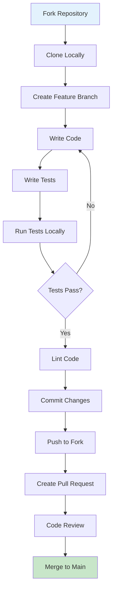

# Developer Getting Started Guide - OpenFrame CLI

Welcome to the OpenFrame CLI development guide. This document will help you set up your development environment, understand the codebase, and start contributing to the project.

## Development Environment Setup

### Prerequisites

| Tool | Version | Purpose |
|------|---------|---------|
| **Go** | 1.23+ | Primary programming language |
| **Docker** | Latest | For running K3d clusters during development |
| **kubectl** | Latest | Kubernetes client for testing |
| **make** | Latest | Build automation |
| **git** | Latest | Version control |

### Installation Commands

```bash
# Install Go (if not already installed)
# macOS
brew install go

# Ubuntu/Debian
sudo apt install golang-go

# Verify Go installation
go version  # Should show 1.23+

# Install development dependencies
go install github.com/golangci/golangci-lint/cmd/golangci-lint@latest
```

## Repository Setup

### 1. Clone and Setup

```bash
# Clone the repository
git clone https://github.com/flamingo-stack/openframe-cli.git
cd openframe-cli

# Install dependencies
go mod download

# Verify setup
make build
./openframe --version
```

### 2. Repository Structure

```
openframe-cli/
├── cmd/                    # CLI command definitions (Cobra)
│   ├── bootstrap/         # Bootstrap command
│   ├── chart/            # Chart installation commands
│   ├── cluster/          # Cluster management commands
│   ├── dev/              # Development tools commands
│   └── root.go           # Root command setup
├── internal/             # Internal packages (not importable)
│   ├── bootstrap/        # Bootstrap service logic
│   ├── chart/           # Chart installation services
│   ├── cluster/         # Cluster management services
│   ├── dev/             # Development tools services
│   └── shared/          # Shared utilities and infrastructure
│       ├── config/      # Configuration management
│       ├── executor/    # Command execution abstraction
│       ├── models/      # Data models and types
│       └── ui/          # User interface components
├── tests/               # Test files
│   └── integration/     # Integration tests
├── docs/                # Documentation
│   ├── codewiki/       # Generated architecture documentation
│   └── tutorials/      # User and developer guides
├── go.mod              # Go module definition
├── go.sum              # Go module checksums
├── Makefile           # Build and test automation
└── main.go           # Application entry point
```

## Development Workflow



### 3. Build and Test

```bash
# Build the binary
make build
# Creates: openframe (macOS), openframe-linux-amd64, openframe-windows-amd64.exe

# Run unit tests
make test-unit

# Run integration tests (requires Docker)
make test-integration

# Run all tests
make test-all

# Clean build artifacts
make clean
```

### 4. Code Style and Conventions

#### Go Code Standards

```go
// Package documentation example
// Package cmd provides the command-line interface for OpenFrame CLI.
// It follows the Cobra pattern for command structure and includes
// global flags for verbose and silent modes.
package cmd

// Function naming: Use descriptive names
func GetBootstrapCmd() *cobra.Command {
    return buildBootstrapCommand()
}

// Error handling: Always handle errors explicitly
func executeCommand(cmd string) error {
    output, err := exec.Command("sh", "-c", cmd).CombinedOutput()
    if err != nil {
        return fmt.Errorf("command failed: %w\nOutput: %s", err, output)
    }
    return nil
}

// Interface naming: Use -er suffix
type CommandExecutor interface {
    Execute(cmd string) error
}
```

#### Testing Patterns

```go
// Test function naming
func TestClusterService_Create_Success(t *testing.T) {
    // Arrange
    service := NewClusterService()
    config := &ClusterConfig{Name: "test-cluster"}
    
    // Act
    err := service.Create(config)
    
    // Assert
    assert.NoError(t, err)
    assert.Contains(t, service.GetClusters(), "test-cluster")
}

// Use testify for assertions
func TestBootstrapService_Integration(t *testing.T) {
    if testing.Short() {
        t.Skip("Skipping integration test in short mode")
    }
    
    // Test implementation
}
```

#### Error Handling Patterns

```go
// Define custom error types
type ClusterNotFoundError struct {
    Name string
}

func (e ClusterNotFoundError) Error() string {
    return fmt.Sprintf("cluster '%s' not found", e.Name)
}

// Wrap errors with context
func (s *ClusterService) Delete(name string) error {
    if !s.exists(name) {
        return ClusterNotFoundError{Name: name}
    }
    
    if err := s.k3dProvider.Delete(name); err != nil {
        return fmt.Errorf("failed to delete cluster %s: %w", name, err)
    }
    
    return nil
}
```

## Key Architecture Patterns

### 1. Command Pattern (Cobra)

```go
// cmd/cluster/create.go
func GetCreateCmd() *cobra.Command {
    cmd := &cobra.Command{
        Use:   "create [cluster-name]",
        Short: "Create a new K3d cluster",
        RunE:  runCreate,
    }
    
    cmd.Flags().IntP("nodes", "n", 1, "Number of worker nodes")
    cmd.Flags().StringSlice("port", []string{}, "Port mappings")
    
    return cmd
}

func runCreate(cmd *cobra.Command, args []string) error {
    // Extract flags
    nodes, _ := cmd.Flags().GetInt("nodes")
    ports, _ := cmd.Flags().GetStringSlice("port")
    
    // Build configuration
    config := &cluster.CreateConfig{
        Name:  args[0],
        Nodes: nodes,
        Ports: ports,
    }
    
    // Delegate to service layer
    service := cluster.NewService()
    return service.Create(config)
}
```

### 2. Service Layer Pattern

```go
// internal/cluster/service.go
type Service struct {
    provider Provider
    ui       ui.Interface
    executor executor.Interface
}

func NewService() *Service {
    return &Service{
        provider: k3d.NewProvider(),
        ui:       ui.New(),
        executor: executor.New(),
    }
}

func (s *Service) Create(config *CreateConfig) error {
    // Validation
    if err := s.validateConfig(config); err != nil {
        return err
    }
    
    // UI feedback
    s.ui.ShowProgress("Creating cluster...")
    
    // Delegate to provider
    if err := s.provider.Create(config); err != nil {
        return fmt.Errorf("cluster creation failed: %w", err)
    }
    
    s.ui.ShowSuccess("Cluster created successfully")
    return nil
}
```

### 3. Provider Pattern

```go
// internal/cluster/provider.go
type Provider interface {
    Create(config *CreateConfig) error
    Delete(name string) error
    List() ([]Cluster, error)
    Status(name string) (*Status, error)
}

// internal/cluster/providers/k3d/provider.go
type K3dProvider struct {
    executor executor.Interface
}

func (p *K3dProvider) Create(config *CreateConfig) error {
    cmd := p.buildCreateCommand(config)
    return p.executor.Execute(cmd)
}

func (p *K3dProvider) buildCreateCommand(config *CreateConfig) string {
    parts := []string{"k3d", "cluster", "create", config.Name}
    
    if config.Nodes > 1 {
        parts = append(parts, fmt.Sprintf("--agents=%d", config.Nodes-1))
    }
    
    for _, port := range config.Ports {
        parts = append(parts, "--port", port)
    }
    
    return strings.Join(parts, " ")
}
```

## Common Development Tasks

### Adding a New Command

1. **Create command file**:
   ```bash
   # For a new subcommand under cluster
   touch cmd/cluster/backup.go
   ```

2. **Implement command**:
   ```go
   // cmd/cluster/backup.go
   func GetBackupCmd() *cobra.Command {
       cmd := &cobra.Command{
           Use:   "backup [cluster-name]",
           Short: "Backup cluster configuration",
           RunE:  runBackup,
       }
       
       cmd.Flags().String("output", "", "Output file path")
       return cmd
   }
   
   func runBackup(cmd *cobra.Command, args []string) error {
       // Implementation
       return nil
   }
   ```

3. **Add to parent command**:
   ```go
   // cmd/cluster/cluster.go
   func GetClusterCmd() *cobra.Command {
       cmd := &cobra.Command{...}
       
       cmd.AddCommand(GetCreateCmd())
       cmd.AddCommand(GetDeleteCmd())
       cmd.AddCommand(GetBackupCmd())  // Add new command
       
       return cmd
   }
   ```

4. **Write tests**:
   ```go
   // cmd/cluster/backup_test.go
   func TestGetBackupCmd(t *testing.T) {
       cmd := GetBackupCmd()
       assert.Equal(t, "backup", cmd.Use)
       assert.True(t, cmd.HasFlags())
   }
   ```

### Adding a New Service

1. **Define interface**:
   ```go
   // internal/backup/interface.go
   type Service interface {
       Backup(clusterName string, options *BackupOptions) error
       Restore(clusterName string, backupPath string) error
   }
   ```

2. **Implement service**:
   ```go
   // internal/backup/service.go
   type BackupService struct {
       executor executor.Interface
       ui       ui.Interface
   }
   
   func NewService() Service {
       return &BackupService{
           executor: executor.New(),
           ui:       ui.New(),
       }
   }
   ```

3. **Write comprehensive tests**:
   ```go
   // internal/backup/service_test.go
   func TestBackupService_Backup_Success(t *testing.T) {
       // Test implementation
   }
   ```

### Debugging Tips

#### Enable Verbose Logging

```bash
# During development
./openframe --verbose bootstrap test-cluster

# In tests
go test -v ./cmd/... ./internal/...
```

#### Use Debug Builds

```go
// Add debug information during development
//go:build debug

package main

import "log"

func init() {
    log.SetFlags(log.LstdFlags | log.Lshortfile)
}
```

#### Common Development Errors

<details>
<summary><strong>Import Cycle Errors</strong></summary>

**Problem**: Package import cycles

**Solution**: 
- Move shared types to `internal/shared/models`
- Use interfaces to break dependencies
- Review package architecture

```bash
go mod graph | grep cycle  # Check for cycles
```
</details>

<details>
<summary><strong>Test Failures in CI</strong></summary>

**Problem**: Tests pass locally but fail in CI

**Solution**:
- Use `testing.Short()` for integration tests
- Mock external dependencies
- Ensure deterministic test data

```go
func TestIntegration(t *testing.T) {
    if testing.Short() {
        t.Skip("Skipping integration test")
    }
    // Test implementation
}
```
</details>

<details>
<summary><strong>Binary Size Issues</strong></summary>

**Problem**: Large binary size

**Solution**:
```bash
# Build with optimizations
go build -ldflags "-s -w" -o openframe

# Check binary size
ls -lh openframe
```
</details>

## Contributing Guidelines

### 1. Pull Request Process

```bash
# 1. Create feature branch
git checkout -b feature/backup-command

# 2. Make changes and commit
git add .
git commit -m "Add cluster backup command

- Implements backup subcommand for cluster configuration
- Adds unit tests and integration tests
- Updates documentation

Fixes #123"

# 3. Push and create PR
git push origin feature/backup-command
```

### 2. Commit Message Format

```
<type>(<scope>): <description>

[optional body]

[optional footer]
```

Examples:
- `feat(cluster): add backup command`
- `fix(bootstrap): handle timeout errors properly`
- `docs(readme): update installation instructions`
- `test(cluster): add integration tests for create command`

### 3. Code Review Checklist

- [ ] Code follows Go conventions
- [ ] Tests are comprehensive and pass
- [ ] Documentation is updated
- [ ] No breaking changes (or properly documented)
- [ ] Error handling is robust
- [ ] UI/UX is consistent with existing patterns

## Testing Strategy

### Unit Tests

```bash
# Run specific package tests
go test ./internal/cluster/...

# Run with coverage
go test -cover ./internal/cluster/...

# Generate coverage report
go test -coverprofile=coverage.out ./...
go tool cover -html=coverage.out
```

### Integration Tests

```bash
# Run integration tests (requires Docker)
go test ./tests/integration/...

# Run specific integration test
go test -run TestBootstrapWorkflow ./tests/integration/
```

### Manual Testing

```bash
# Test local build
make build
./openframe bootstrap test-cluster

# Test different scenarios
./openframe cluster create multi-node --nodes=3
./openframe dev intercept test-service --port 8080
```

## Release Process

### Version Management

```bash
# Tag new version
git tag -a v1.2.0 -m "Release v1.2.0"
git push origin v1.2.0

# Build release binaries
make build

# Verify release
./openframe --version
```

### Documentation Updates

1. Update version in relevant documentation
2. Update changelog with new features
3. Verify all examples work with new version

## Getting Help

### Internal Resources
- **Architecture Documentation**: `docs/codewiki/overview.md`
- **Inline Documentation**: Look for `.*.md` files in source directories
- **Test Examples**: Check `*_test.go` files for usage patterns

### External Resources
- **Go Documentation**: https://golang.org/doc/
- **Cobra Framework**: https://cobra.dev/
- **Kubernetes Client**: https://pkg.go.dev/k8s.io/client-go

### Debugging Commands

```bash
# Verbose output for all operations
./openframe --verbose <command>

# Check Go environment
go env

# Verify dependencies
go mod verify

# Lint code
golangci-lint run
```

## Next Steps

1. **Explore the Codebase**: Start with `main.go` and follow the execution flow
2. **Run the Tests**: Understand how the code works by reading tests
3. **Make Your First Contribution**: Fix a small bug or improve documentation
4. **Join the Community**: Participate in discussions and code reviews

> **💡 Developer Tip**: Use `make test-unit` frequently during development to catch issues early, and always run the full test suite before submitting a PR.